# Contributing to DataLoom

Thank you for helping build DataLoom. Contributions should improve one
well-defined behavior while preserving public API, durable-state, platform,
and documentation contracts.

> [!IMPORTANT]
> DataLoom is pre-V1. A merged foundation is not permission to describe an
> incomplete capability as production-ready. Keep current behavior and the V1
> target explicit in code, tests, documentation, and pull requests.

## Contribution flow

```mermaid
flowchart LR
    issue[Approved issue]
    branch[Focused branch]
    change[Code and documentation]
    local[Local validation]
    review[Human review]
    checks[Required checks]
    merge[Maintainer merge]

    issue --> branch
    branch --> change
    change --> local
    local --> review
    review --> checks
    checks --> merge

    style local fill:#C2E5FF,stroke:#3DADFF
    style review fill:#FFECBD,stroke:#FFC943
    style merge fill:#CDF4D3,stroke:#66D575
```

## Before starting

- Work from one approved issue per pull request.
- Confirm the issue's acceptance criteria and affected public contracts.
- Read the relevant [ADR](./docs/adr/README.md), architecture page, and
  [V1 readiness gate](./docs/audits/DL-AUDIT-004-v1-production-readiness.md).
- Use a focused branch such as `feature/DL-123-short-description` or
  `fix/DL-123-short-description`.
- Inspect the working tree and preserve unrelated changes.

Architecture approval is required before changing public API shape, dependency
direction, durable schema, strategy semantics, platform scope, plugin
permissions, or enterprise isolation boundaries.

## Make the change

Production changes must include tests at the lowest useful layer. Update
documentation in the same pull request when behavior, API, modules, build
commands, platform support, or validation evidence changes.

Preserve these product decisions:

- offline-first, remote-first, cache-first, network-only, hybrid, and adaptive
  are all built-in V1 strategies;
- strategy, direction, transfer mode, and trigger are independent;
- native Android, KMP Android, and KMP iOS are mandatory V1 consumer paths;
- shared code stays platform-independent;
- payloads stay opaque to the shared engine; and
- cancellation, retry history, conflict state, and durable transitions must be
  explicit and testable.

## Validate locally first

Use the Gradle Wrapper and the narrowest tasks that cover the change. See
[local development](./docs/development/building.md) for commands and host
requirements.

Do not use GitHub Actions as an interactive debugger. Before asking CI to run:

1. reproduce the relevant check locally where the host permits;
2. fix the first meaningful error, not every downstream symptom;
3. run the affected tests, static checks, and API/ABI checks;
4. inspect the diff and generated evidence; and
5. push one locally verified correction.

Do not rerun an unchanged failed workflow. macOS and Android jobs should run
only when their platform evidence is genuinely needed.

## Pull request requirements

Every pull request must:

- link exactly one primary approved issue;
- explain the root cause or capability being added;
- describe current behavior before and after the change;
- list local validation commands and their results;
- include tests for success, failure, cancellation, and persistence paths that
  the change affects;
- update public API baselines intentionally when required;
- update Room schemas/migrations intentionally when required;
- update documentation and diagrams;
- contain no credentials, tokens, personal data, customer payloads, or secret
  values; and
- remain open for human review before merge.

Publishing packages, creating tags/releases, merging protected changes, or
weakening required checks always requires explicit human approval.

## Documentation expectations

Follow the [documentation style guide](./docs/documentation-style.md).
GitHub-native Mermaid diagrams should use real source names and must distinguish
current implementation from the V1 target. A diagram is part of the contract:
review it when its code path changes.

## Commit and review hygiene

- Keep commits focused and explain intent.
- Do not reformat unrelated code.
- Do not hide behavior changes inside generated files.
- Respond to review with evidence or a bounded correction.
- Preserve historical audits; add a new checkpoint rather than rewriting old
  evidence into present tense.

## Security

Follow [SECURITY.md](./SECURITY.md). Never place credentials or private data in
source, commits, issues, pull requests, examples, prompts, logs, screenshots,
or fixtures.
