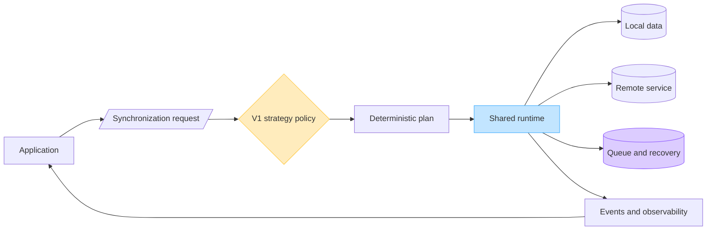
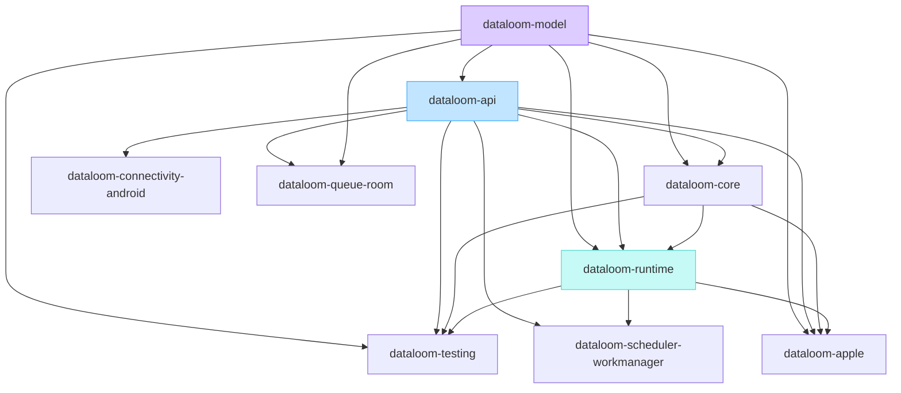

# DataLoom

**Synchronize once. Scale everywhere.**

DataLoom is an Android-first, Jetpack-style synchronization SDK for native
Android and Kotlin Multiplatform applications targeting Android and iOS. Its
main purpose is to provide one deterministic engine with six built-in
synchronization strategies:

| Strategy | Intent |
|---|---|
| Offline-first | Commit local intent durably, then synchronize |
| Remote-first | Prefer the remote authority with explicit safe fallback |
| Cache-first | Serve a valid cache and refresh by policy |
| Network-only | Use the remote source with no storage or queue side effects |
| Hybrid | Compose explicit local, remote, cache, and reconciliation rules |
| Adaptive | Select an allowed concrete strategy from recorded evidence |

All six are mandatory V1 capabilities. Strategy is independent from transfer
direction (`PUSH`, `PULL`, `BIDIRECTIONAL`), transfer mode (`FULL`, `DELTA`),
and trigger.

> [!WARNING]
> DataLoom is in active pre-V1 development and is not production-ready.
> Current foundations are substantial, but the six-strategy engine and several
> mandatory V1 systems are incomplete. No release should be represented as V1
> until the documented release gates have evidence.

## Product at a glance



The diagram is the approved V1 product model. The current repository implements
the shared runtime foundation, provider contracts, push/pull/bidirectional
pipelines, durable queue processing, Android adapters, Apple compilation paths,
and the versioned six-strategy contract plus deterministic built-in planner.
Plan-aware provider resolution and direct network-only/remote-first operation
execution are implemented. Durable decision persistence, the remaining strategy
runtimes, and complete platform qualification remain required before the
strategy engine is complete.

## Current capability

| Area | Current repository | V1 requirement |
|---|---|---|
| Shared contracts and runtime | Implemented foundation | Stable, published, qualified API |
| Push, pull, bidirectional flows | Implemented foundation | Strategy-aware deterministic plans |
| Six synchronization strategies | Versioned planner plus direct network-only and remote-first slices implemented | All six built in and fully qualified |
| Durable queue | Implemented foundation | Correct deferral, recovery, migration, and restart semantics |
| Retry and circuit breaking | Fail-closed classification, deterministic backoff/jitter, durable budgets, bounded hints, independent timeout contracts, and a deterministic circuit state machine with atomic persistence SPI; broader engine partial | Production durable circuit stores, retry-path integration, operations, observability, and full qualification |
| Conflict handling | Custom contracts/orchestration are partial | Built-in generic policies, persistence, recovery, and audit |
| Events and observability | In-process dispatch is partial | Durable events, metrics, traces, health, and operational views |
| Asset transfer | Missing | Upload/download, chunking, streaming, integrity, and resume |
| Plugin platform | Provider interfaces only | Permission-bounded plugin lifecycle and governance |
| Enterprise governance | Missing | Tenant isolation, administration, policy, audit, and controls |

See the
[V1 production-readiness audit](./docs/audits/DL-AUDIT-004-v1-production-readiness.md)
for the requirement matrix and no-go gates.

## Supported V1 consumer paths

| Consumer | V1 status |
|---|---|
| Native Android application | Mandatory |
| KMP application targeting Android | Mandatory |
| KMP application targeting iOS | Mandatory |
| Native Swift application through an XCFramework | Optional distribution path |

A native Android application remains Android-only. iOS becomes part of the
same product codebase when the application itself is Kotlin Multiplatform and
declares an iOS target. See
[platform strategy](./docs/architecture/platform-strategy.md).

## Repository modules



| Module | Responsibility |
|---|---|
| `dataloom-model` | Dependency-root models; currently owns clock primitives |
| `dataloom-api` | Public contracts, requests, results, and provider interfaces |
| `dataloom-core` | Provider lifecycle, registry, resolution, and shared runtime dependencies |
| `dataloom-runtime` | Facade, pipelines, queue, retry, conflict, and event orchestration |
| `dataloom-testing` | Deterministic clocks, in-memory providers, scripts, and recorders |
| `dataloom-connectivity-android` | Android `ConnectivityProvider` |
| `dataloom-queue-room` | Room-backed durable `QueueProvider` |
| `dataloom-scheduler-workmanager` | WorkManager scheduler and worker bridge |
| `dataloom-apple` | macOS-only Apple/XCFramework umbrella |

The exact dependency and publication rules are in
[module architecture](./docs/architecture/modules.md) and
[ADR-0002](./docs/adr/ADR-0002-v1-artifact-and-foundation-architecture.md).

## Toolchain

| Tool | Version |
|---|---|
| JDK | 17 or newer |
| Gradle Wrapper | 9.5.0 |
| Kotlin | 2.4.10 |
| JVM bytecode target | 17 |
| Shared targets | JVM, `iosArm64`, `iosSimulatorArm64`, `iosX64` |

An explicit KMP Android target and complete KMP consumer qualification remain
V1 gates.

## Build the current shared foundation

Use the checked-in Gradle Wrapper:

```bash
./gradlew build
```

On Windows:

```powershell
.\gradlew.bat build
```

Android modules are included only when `DATALOOM_ANDROID_BUILD=true` and require
an Android SDK plus access to Google Maven:

```bash
DATALOOM_ANDROID_BUILD=true ./gradlew \
  :dataloom-connectivity-android:build \
  :dataloom-queue-room:build \
  :dataloom-scheduler-workmanager:build
```

Apple compilation, simulator tests, and XCFramework assembly require macOS and
Xcode:

```bash
./gradlew :dataloom-apple:assembleDataLoomReleaseXCFramework
```

Output:
`dataloom-apple/build/XCFrameworks/release/DataLoom.xcframework`

For host requirements, offline-cache limitations, and the lowest-cost local
validation order, read [building DataLoom](./docs/development/building.md).

## Documentation

Start with the [documentation hub](./docs/README.md).

- [System overview](./docs/architecture/system-overview.md)
- [Six-strategy guide](./docs/strategies/README.md)
- [API reference](./docs/api/README.md)
- [Architecture](./docs/architecture/README.md)
- [Android integration](./docs/android/README.md)
- [KMP iOS and Apple integration](./docs/apple/README.md)
- [Testing](./docs/testing/testing-toolkit.md)
- [Development](./docs/development/building.md)
- [ADRs](./docs/adr/README.md)
- [Audits](./docs/audits/README.md)

## Product boundary

DataLoom owns synchronization policy, deterministic orchestration, transfer
coordination, durable recovery, and operational signals. Applications retain
their domain repositories, UI state, server contracts, authentication
credentials, and domain-specific business truth.

Payloads remain opaque to the shared engine. Generic conflict utilities can be
built in, but DataLoom must not silently invent business merge rules.

## Contributing and security

Before changing code, read [CONTRIBUTING.md](./CONTRIBUTING.md). Public API,
durable schema, module-boundary, platform, and strategy changes require
corresponding documentation and validation evidence.

Report vulnerabilities privately as described in
[SECURITY.md](./SECURITY.md). Never place credentials, tokens, personal data,
or customer payloads in commits, examples, issues, logs, or test fixtures.

## License

License status: **to be finalized before V1 publication**.
