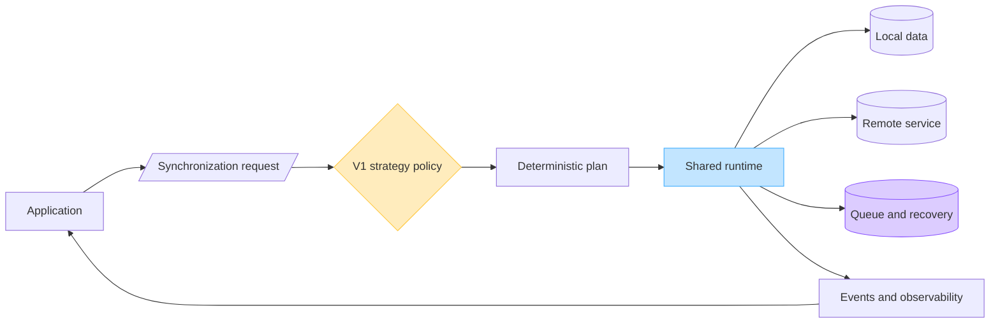
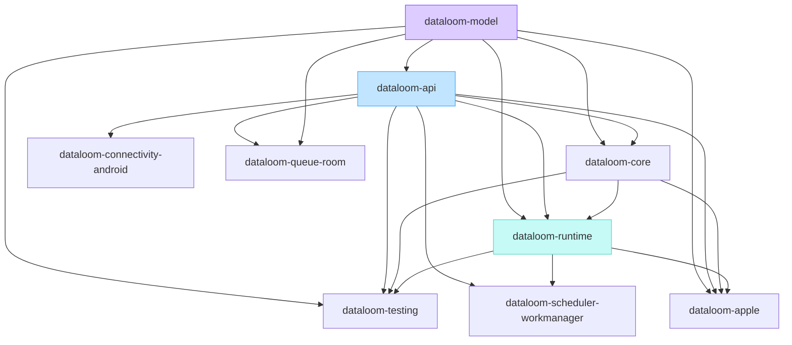

# DataLoom

**Synchronize once. Scale everywhere.**

DataLoom is an Android-first, Jetpack-style synchronization SDK for native
Android and Kotlin Multiplatform applications targeting Android and iOS. Its
main purpose is to provide one deterministic engine with six built-in
synchronization strategies:

| Strategy | Intent |
|---|---|
| Offline-first | Commit local intent durably, then synchronize |
| Remote-first | Prefer the remote authority with explicit safe fallback |
| Cache-first | Serve a valid cache and refresh by policy |
| Network-only | Use the remote source with no storage or queue side effects |
| Hybrid | Compose explicit local, remote, cache, and reconciliation rules |
| Adaptive | Select an allowed concrete strategy from recorded evidence |

All six are mandatory V1 capabilities. Strategy is independent from transfer
direction (`PUSH`, `PULL`, `BIDIRECTIONAL`), transfer mode (`FULL`, `DELTA`),
and trigger.

> [!WARNING]
> DataLoom is in active pre-V1 development and is not production-ready.
> Current foundations are substantial, but the six-strategy engine and several
> mandatory V1 systems are incomplete. No release should be represented as V1
> until the documented release gates have evidence.

## Product at a glance



The diagram is the approved V1 product model. The current repository implements
the shared runtime foundation, provider contracts, push/pull/bidirectional
pipelines, durable queue processing, Android adapters, Apple compilation paths,
and the versioned six-strategy contract plus deterministic built-in planner.
Plan-aware provider resolution and direct network-only/remote-first operation
execution are implemented. Bounded strategy decisions and complete immutable
accepted plans survive the in-memory, Android Room, and Apple queues. Direct,
provider-protected, and queued replay execute the frozen continuation without
current-policy evaluation. Deferred offline-first admission now invokes the
application-owned atomic local-intent/outbox boundary before reporting durable
acceptance. Online execution ownership, platform implementations,
crash/relaunch proof, complete cache/hybrid/conflict behavior, durable strategy
events, and platform reference qualification remain before the strategy engine
is complete.

## Market-readiness dashboard

- **Last reconciled:** 2026-08-05
- **Recorded V1 target:** 2026-08-27
- **Current verdict:** **NO-GO — not production-ready or market-ready**
- **V1 engineering/release acceptance completion:** **10%** (`1 of 10` gates accepted; `#93` complete, `#94`–`#102` open)

The percentage is acceptance-based: accepted engineering/release gates divided
by ten. It is not a percentage of code written or an estimate of effort
remaining. A gate is `COMPLETE` only when its issue criteria have executable
evidence on the same reviewed commit. `IN PROGRESS` therefore includes
substantial implementations that still have unqualified release behavior.

| Next priority | V1 gate | Status | Finished on `main` | Still pending before the gate is complete |
|---:|---|---|---|---|
| — | [DL-039 foundations, artifacts, compatibility](https://github.com/dataloom-sdk/dataloom/issues/93) | COMPLETE | Public API/provider/runtime boundaries, module rules, JVM and Kotlin/Native ABI baselines, external-consumer compilation, durable state primitives, deterministic clocks/randomness, configuration and policy foundations, canonical envelope/redaction contracts, and a deterministic bounded V1 wire codec/upcast registry | — |
| 1 | [DL-039B six strategy engine](https://github.com/dataloom-sdk/dataloom/issues/102) | IN PROGRESS | Versioned contracts and deterministic planner for all six strategies; direct network-only and remote-first slices; fail-closed queue admission; Room v8/Apple v4 accepted-plan persistence; exact encoder/resolver correspondence; direct, protected, and queued replay without current-policy evaluation; typed fallback and reconciliation hooks; atomic offline-first provider contract, fail-closed capability resolution, and deferred admission invocation | Complete online offline-first execution ownership and platform implementations with crash/relaunch proof; add cache value/freshness access and refresh ownership; complete hybrid coherence/conflict application, durable strategy events/diagnostics, and the full native Android/KMP Android/KMP iOS failure/restart matrix |
| 2 | [DL-039A Android/KMP/iOS parity](https://github.com/dataloom-sdk/dataloom/issues/101) | IN PROGRESS | Native Android adapters, Kotlin/Native Apple targets, XCFramework assembly, Swift smoke compilation, and initial Apple file-backed persistence | Add explicit KMP Android variants, production `dataloom-android`/`dataloom-ios` aggregation, iOS lifecycle/connectivity/background/security adapters, staged external consumers, and the complete parity matrix |
| 3 | [DL-040 retry and circuit breaker](https://github.com/dataloom-sdk/dataloom/issues/94) | QUALIFICATION BLOCKED | FR-RETRY-001–012 implementation mapping; built-in backoff/jitter, limits, hints, six timeout boundaries, durable Room/Apple circuit state, half-open leases, authorized administration, bounded telemetry, and common/platform-store recovery flows | Prove real Android and Apple process termination/relaunch, genuine cross-process probe contention where supported, and the complete AC-FUNC-004 provider flow through native Android, KMP Android, and KMP iOS |
| 4 | [DL-041 conflict engine](https://github.com/dataloom-sdk/dataloom/issues/95) | IN PROGRESS | Custom detector/resolver contracts and orchestration foundations | Ship deterministic built-in strategies, decision application, durable unresolved/manual state, audit, loop prevention/quarantine, precedence, restart/concurrency proof, and AC-FUNC-002 |
| 5 | [DL-042 events, observability, health, dashboard](https://github.com/dataloom-sdk/dataloom/issues/96) | IN PROGRESS | Canonical envelope/redaction contracts, deterministic V1 wire codec/upcast registry, in-process event dispatch, bounded retry/circuit metrics, logs, traces, exporter isolation, and redacted health snapshot | Add the durable outbox, ordering, acknowledgement/replay, retention, filtering, SDK-wide envelope adoption/instrumentation, health/read model, and deployable operations dashboard/adaptor |
| 6 | [DL-043 asset synchronization](https://github.com/dataloom-sdk/dataloom/issues/97) | NOT STARTED | No production asset subsystem accepted | Implement manifest, bounded streaming, upload/download chunking, durable resume, integrity, encryption metadata, quota, cancellation, secure temporary files, cleanup, content policy, and AC-FUNC-005 |
| 7 | [DL-044 plugin platform](https://github.com/dataloom-sdk/dataloom/issues/98) | NOT STARTED | Provider SPI exists; no V1 plugin lifecycle is accepted | Implement manifests, compatibility, deny-by-default permissions, lifecycle, resource bounds, deterministic ordering, isolation, hot disable, audit, certification kit, and a reference non-provider plugin |
| 8 | [DL-045 enterprise governance](https://github.com/dataloom-sdk/dataloom/issues/99) | NOT STARTED | Tenant identifiers and limited retry/circuit administration foundations exist | Enforce tenant isolation, RBAC, signed policy packs, tamper-evident/offline audit, residency, support/fleet diagnostics, configuration locks, LTS/catalog governance, and AC-FUNC-010 |
| 9 | [DL-046 immutable V1 release](https://github.com/dataloom-sdk/dataloom/issues/100) | BLOCKED / NO-GO | Continuous JVM, Android, Apple, ABI, XCFramework, header, Swift-smoke, schema, and migration validation foundations exist | Close #93–#99 and #101–#102; qualify one immutable candidate; verify staged consumers, compatibility, performance, security, SBOM/provenance/signatures/licenses, documentation, legal approval, publication, rollback, and post-publish smoke tests |

### Market evidence gates

Engineering completion alone does not make DataLoom market-ready. The following
product evidence is required in addition to the V1 release gates.

| Market gate | Required target | Evidence accepted in repository | Remaining |
|---|---:|---:|---|
| Fully qualified built-in strategies | 6 | 0 of 6 | All six must pass their complete runtime, restart, failure, and platform matrices; planner-only or partial vertical slices do not count |
| Reference applications | 3 | 0 of 3 | Native Android, KMP Android, and KMP iOS reference consumers using staged/published-style artifacts |
| No-loss/no-duplication fault proof | Required | Partial | Complete crash, restart, duplicate, concurrency, cancellation, scheduler-failure, migration, and network-partition evidence across mandatory paths |
| Performance/resource benchmarks | Required | None accepted | Publish reproducible latency, throughput, memory, storage, battery/background, large-queue, and large-asset results with limits |
| Customer/problem interviews | 20 | 0 evidenced | Conduct and record twenty qualified interviews with findings and decision changes |
| Design partners | 5 | 0 evidenced | Secure five partners actively validating integration and product fit |
| Production pilots | 3 | 0 evidenced | Complete three monitored pilots with acceptance, reliability, and support evidence |
| Paid pilot | 1 | 0 evidenced | Convert at least one pilot to a paid engagement |
| Legal/publication approval | Required | Not accepted | Finalize license, namespace, signing/key custody, compliance evidence, support terms, and publication authority |

### Immediate execution order

Closed foundation gate #93 remains the single shared configuration, policy,
state, security, compatibility, and event boundary for every remaining engine.

1. Deliver one end-to-end strategy/platform vertical slice across native
   Android, KMP Android, and KMP iOS, then complete all six strategies through
   the same architecture (#102 + #101).
2. Add the host-controlled process lifecycle and cross-process harness needed
   to close the remaining retry/circuit acceptance criteria in #94.
3. Complete conflict, durable events/operations, assets, plugins, and enterprise
   governance in dependency order (#95–#99).
4. Build the three staged-artifact reference apps and publish the benchmark and
   fault-injection evidence.
5. Run customer validation alongside engineering: interviews, design partners,
   pilots, then one paid pilot.
6. Build and qualify one immutable V1 candidate and promote that exact artifact
   only after every engineering, security, legal, and market gate passes (#100).

Detailed evidence lives in the
[current DL-040 acceptance reconciliation](./docs/audits/DL-040-current-acceptance-reconciliation.md)
and the
[V1 production-readiness audit](./docs/audits/DL-AUDIT-004-v1-production-readiness.md).

## Supported V1 consumer paths

| Consumer | V1 status |
|---|---|
| Native Android application | Mandatory |
| KMP application targeting Android | Mandatory |
| KMP application targeting iOS | Mandatory |
| Native Swift application through an XCFramework | Optional distribution path |

A native Android application remains Android-only. iOS becomes part of the
same product codebase when the application itself is Kotlin Multiplatform and
declares an iOS target. See
[platform strategy](./docs/architecture/platform-strategy.md).

## Repository modules



| Module | Responsibility |
|---|---|
| `dataloom-model` | Dependency-root models; currently owns clock primitives |
| `dataloom-api` | Public contracts, requests, results, and provider interfaces |
| `dataloom-core` | Provider lifecycle, registry, resolution, and shared runtime dependencies |
| `dataloom-runtime` | Facade, pipelines, queue, retry, conflict, and event orchestration |
| `dataloom-testing` | Deterministic clocks, in-memory providers, scripts, and recorders |
| `dataloom-connectivity-android` | Android `ConnectivityProvider` |
| `dataloom-queue-room` | Room-backed durable `QueueProvider` |
| `dataloom-scheduler-workmanager` | WorkManager scheduler and worker bridge |
| `dataloom-apple` | macOS-only Apple/XCFramework umbrella |

The exact dependency and publication rules are in
[module architecture](./docs/architecture/modules.md) and
[ADR-0002](./docs/adr/ADR-0002-v1-artifact-and-foundation-architecture.md).

## Toolchain

| Tool | Version |
|---|---|
| JDK | 17 or newer |
| Gradle Wrapper | 9.5.0 |
| Kotlin | 2.4.10 |
| JVM bytecode target | 17 |
| Shared targets | JVM, `iosArm64`, `iosSimulatorArm64`, `iosX64` |

An explicit KMP Android target and complete KMP consumer qualification remain
V1 gates.

## Build the current shared foundation

Use the checked-in Gradle Wrapper:

```bash
./gradlew build
```

On Windows:

```powershell
.\gradlew.bat build
```

Android modules are included only when `DATALOOM_ANDROID_BUILD=true` and require
an Android SDK plus access to Google Maven:

```bash
DATALOOM_ANDROID_BUILD=true ./gradlew \
  :dataloom-connectivity-android:build \
  :dataloom-queue-room:build \
  :dataloom-scheduler-workmanager:build
```

Apple compilation, simulator tests, and XCFramework assembly require macOS and
Xcode:

```bash
./gradlew :dataloom-apple:assembleDataLoomReleaseXCFramework
```

Output:
`dataloom-apple/build/XCFrameworks/release/DataLoom.xcframework`

For host requirements, offline-cache limitations, and the lowest-cost local
validation order, read [building DataLoom](./docs/development/building.md).

## Documentation

Start with the [documentation hub](./docs/README.md).

- [System overview](./docs/architecture/system-overview.md)
- [Six-strategy guide](./docs/strategies/README.md)
- [API reference](./docs/api/README.md)
- [Architecture](./docs/architecture/README.md)
- [Android integration](./docs/android/README.md)
- [KMP iOS and Apple integration](./docs/apple/README.md)
- [Testing](./docs/testing/testing-toolkit.md)
- [Development](./docs/development/building.md)
- [ADRs](./docs/adr/README.md)
- [Audits](./docs/audits/README.md)

## Product boundary

DataLoom owns synchronization policy, deterministic orchestration, transfer
coordination, durable recovery, and operational signals. Applications retain
their domain repositories, UI state, server contracts, authentication
credentials, and domain-specific business truth.

Payloads remain opaque to the shared engine. Generic conflict utilities can be
built in, but DataLoom must not silently invent business merge rules.

## Contributing and security

Before changing code, read [CONTRIBUTING.md](./CONTRIBUTING.md). Public API,
durable schema, module-boundary, platform, and strategy changes require
corresponding documentation and validation evidence.

Report vulnerabilities privately as described in
[SECURITY.md](./SECURITY.md). Never place credentials, tokens, personal data,
or customer payloads in commits, examples, issues, logs, or test fixtures.

## License

License status: **to be finalized before V1 publication**.
