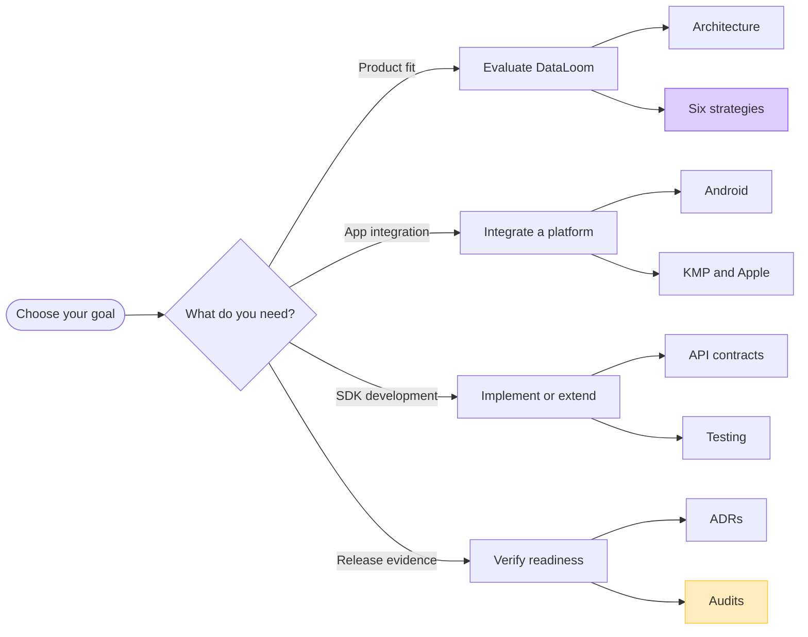

# DataLoom documentation

DataLoom is an Android-first synchronization SDK with a Kotlin Multiplatform
core. Its defining V1 capability is one policy-driven engine that supports six
built-in synchronization strategies across native Android, KMP Android, and
KMP iOS:

- offline-first;
- remote-first;
- cache-first;
- network-only;
- hybrid; and
- adaptive.

> [!IMPORTANT]
> DataLoom is in active pre-V1 development. The documentation distinguishes
> **current repository behavior** from **required V1 behavior**. A V1
> requirement is not an implementation claim.

## Start here

| Goal | Recommended entry point |
|---|---|
| Get a first sync running from the current source checkout | [Getting started quickstart](./getting-started.md) |
| Understand the product and its boundaries | [System overview](./architecture/system-overview.md) |
| Choose a synchronization strategy | [Strategy guide](./strategies/README.md) |
| Integrate an Android application | [Android guide](./android/README.md) |
| Integrate KMP or Apple targets | [Apple and KMP iOS guide](./apple/README.md) |
| Explore current public contracts | [API reference](./api/README.md) |
| Understand modules and dependencies | [Module architecture](./architecture/modules.md) |
| Build and verify a change locally | [Development guide](./development/building.md) |
| Use the testing toolkit | [Testing guide](./testing/testing-toolkit.md) |
| Review V1 gaps and release gates | [Audit index and evidence hierarchy](./audits/README.md) |
| Understand accepted decisions | [Architecture decision records](./adr/README.md) |

## Documentation map

## Product and strategy

- [System overview](./architecture/system-overview.md)
- [Synchronization strategy guide](./strategies/README.md)
  - [Offline-first](./strategies/offline-first.md)
  - [Remote-first](./strategies/remote-first.md)
  - [Cache-first](./strategies/cache-first.md)
  - [Network-only](./strategies/network-only.md)
  - [Hybrid](./strategies/hybrid.md)
  - [Adaptive](./strategies/adaptive.md)
- [Platform strategy](./architecture/platform-strategy.md)

## API reference

The [API reference hub](./api/README.md) groups the current contracts by
developer task. Major areas include:

- request, execution, progress, result, and event contracts;
- storage, transport, queue, scheduler, and connectivity providers;
- outbound, inbound, and bidirectional pipelines;
- retry, conflict, queue, lifecycle, and observation orchestration; and
- facade, provider registry, provider resolution, and runtime assembly.

## Architecture

The [architecture hub](./architecture/README.md) connects the system views:

- module and dependency boundaries;
- provider lifecycle, registry, bindings, and resolution;
- push, pull, and bidirectional execution flows;
- durable queue, retry, conflict, and event flows;
- platform adapters and background execution; and
- the approved V1 target architecture.

## Platforms

| Consumer path | V1 disposition | Documentation |
|---|---|---|
| Native Android | Mandatory | [Android](./android/README.md) |
| KMP Android | Mandatory | [Android](./android/README.md) |
| KMP iOS | Mandatory | [Apple and KMP iOS](./apple/README.md) |
| Native Swift through XCFramework | Optional distribution path | [XCFramework integration](./apple/xcframework-integration.md) |

## Build, test, and contribute

- [Local development and validation](./development/building.md)
- [Testing toolkit](./testing/testing-toolkit.md)
- [Contributing](../CONTRIBUTING.md)
- [Security policy](../SECURITY.md)
- [Code of conduct](../CODE_OF_CONDUCT.md)

## Decisions, specifications, and evidence

- [Architecture decision records](./adr/README.md)
- [Specifications](./specifications/README.md)
- [Audit index](./audits/README.md)

ADRs define accepted direction. Specifications define behavior to implement.
Audits are point-in-time evidence and must not be read as current product
marketing.

## Documentation standard

All active documentation follows the
[documentation style guide](./documentation-style.md): status-aware language,
real repository names, GitHub-native diagrams, accessible text equivalents,
working relative links, and explicit current-versus-target boundaries.
