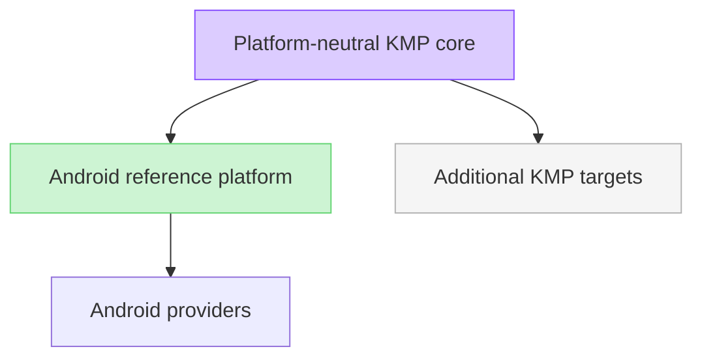
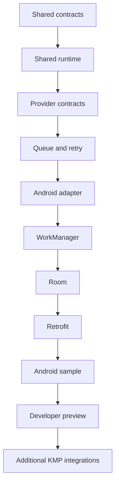

# ADR-0001: Android-first and Kotlin Multiplatform-ready core architecture

## Title

Android-first, Jetpack-style product strategy with a Kotlin Multiplatform-ready shared core

## Status

Superseded in part by ADR-0002

The Android-first principle, platform-neutral shared logic, and provider-based
boundaries remain accepted. ADR-0002 supersedes this record's four-module
allocation, Apple/KMP deferral, V1 platform scope, and implementation
sequence. V1 now requires native Android plus KMP Android and KMP iOS consumer
paths; native Swift distribution is a separate optional packaging decision.

## Date

2026-07-21

## Context

DataLoom needs a clear platform strategy that preserves the Android-first
product direction while keeping shared contracts and orchestration reusable
across supported Kotlin Multiplatform targets. The repository currently has
shared modules (`dataloom-api`, `dataloom-core`, `dataloom-runtime`,
`dataloom-testing`) and must not introduce Android modules or platform
integrations in this issue.

## Decision

DataLoom is an Android-first, Jetpack-style offline synchronization SDK with a
Kotlin Multiplatform-ready shared core. Android is the primary reference and
adoption platform. Shared contracts and runtime foundations remain
platform-independent where technically appropriate.

ADR-0002 later made KMP Android and KMP iOS mandatory V1 paths and replaced the
historical module allocation below.

## Decision Drivers

- Preserve Android-first adoption and developer experience.
- Keep shared contracts and orchestration portable.
- Enforce strict module boundaries and provider-based abstractions.
- Avoid coupling shared modules to Android APIs.
- Deliver a usable Android vertical slice before additional platform targets.

## Historical architecture allocation (superseded for V1)

- Shared modules:
  - `dataloom-api`
  - `dataloom-core`
  - `dataloom-runtime`
  - `dataloom-testing`
- Planned Android modules:
  - `dataloom-android`
  - `dataloom-workmanager`
  - `dataloom-room`
  - `dataloom-retrofit`
  - `sample-android`
- Future Kotlin Multiplatform modules:
  - `dataloom-ktor`
  - `dataloom-sqldelight`
  - `dataloom-apple`
  - `sample-kmp`

## Shared Modules

- `dataloom-api`: stable public models, public configuration contracts,
  runtime-facing contracts, provider and plugin interfaces, and
  platform-independent error contracts.
- `dataloom-core`: internal shared foundations, validation, shared policy and
  retry calculations, shared state/lifecycle foundations, and
  platform-independent utilities.
- `dataloom-runtime`: synchronization orchestration, workflow/queue/retry
  coordination, policy evaluation, conflict workflow coordination, and provider
  coordination; platform-specific execution is delegated through interfaces.
- `dataloom-testing`: shared fakes, controlled clocks and schedulers, fixtures,
  failure injection, and deterministic testing support; production modules must
  not depend on this module.

## Historical Android module plan (superseded for V1)

- `dataloom-android`: Android initialization, lifecycle integration,
  connectivity integration, Android runtime configuration, diagnostics, and
  Android DI integration hooks; must not embed Room/Retrofit/WorkManager
  implementations.
- `dataloom-workmanager`: optional WorkManager scheduling and durable execution
  integration, constraints mapping, worker/runtime integration, and process
  restart recovery coordination.
- `dataloom-room`: optional Room-backed storage provider and migration guidance;
  Room must not be mandatory for DataLoom core.
- `dataloom-retrofit`: optional Retrofit transport integration plus adaptation
  and DataLoom error mapping; Retrofit must not be mandatory for DataLoom core.
- `sample-android`: Android reference integration sample for offline-first
  behavior, scheduling, providers, state observation, and failure/retry flows.

## Historical future KMP modules (superseded for V1)

- `dataloom-ktor`: future multiplatform transport provider.
- `dataloom-sqldelight`: future multiplatform storage provider.
- `dataloom-apple`: future Apple lifecycle, connectivity, and scheduling
  integration.
- `sample-kmp`: future shared Android and iOS reference sample.

This deferral no longer applies. ADR-0002 makes `dataloom-ios` and the Android
and iOS KMP consumer paths mandatory V1 work. `dataloom-apple` is limited to
optional native Swift/XCFramework distribution assembly.

## Provider Strategy

Provider interfaces are the primary abstraction for storage, transport,
scheduling, connectivity, authentication, serialization, encryption,
compression, logging, and monitoring.

Use dedicated platform modules when integration requires direct lifecycle or
operating-system API usage. Prefer provider interfaces over `expect`/`actual`
for infrastructure integrations when interfaces provide clearer extension and
testing boundaries.

## Consequences

The architecture keeps shared logic portable while preserving an Android-first
delivery path.

## Positive Consequences

- Aligns product positioning with Android-first adoption goals.
- Protects shared modules from Android coupling.
- Enables optional platform integrations through module boundaries.
- Improves testability and extensibility through provider interfaces.

## Trade-offs

- Additional module boundaries increase planning and integration overhead.
- Some platform features require adapter layers rather than direct use in
  shared code.
- The original sequence deferred additional platform targets until Android
  slice readiness. ADR-0002 retains Android as the reference sequence but
  blocks V1 production release until KMP Android and KMP iOS are complete.

## Rejected Alternatives

- Android-only architecture: rejected because it limits future multiplatform
  reuse and testing portability.
- KMP-first delivery that delays Android completeness: rejected because it
  conflicts with primary adoption strategy.
- Heavy `expect`/`actual` infrastructure abstractions: rejected when provider
  interfaces provide clearer extensibility and test seams.

## Compatibility

- Package namespace remains `io.dataloom`.
- DataLoom is not an official AndroidX/Jetpack library and must not use the
  `androidx.*` namespace.
- No public API semantics, module dependencies, platform targets, Gradle
  versions, or dependency versions are changed by this ADR.

## Historical implementation sequence (superseded for V1)

The active sequence is defined in ADR-0002 and the V1 readiness audit.

## Review Triggers

Review this ADR when:

- New platform targets are proposed.
- Shared modules need platform-specific APIs.
- Provider-interface boundaries are revised.
- Android-first delivery sequencing is changed.
- Planned platform integration modules or responsibilities change.

## References

- DL-006 issue: Define Android-first and Kotlin Multiplatform product architecture
- `README.md`
- `docs/architecture/modules.md`
- `docs/architecture/platform-strategy.md`
- `docs/api/foundational-contracts.md`
