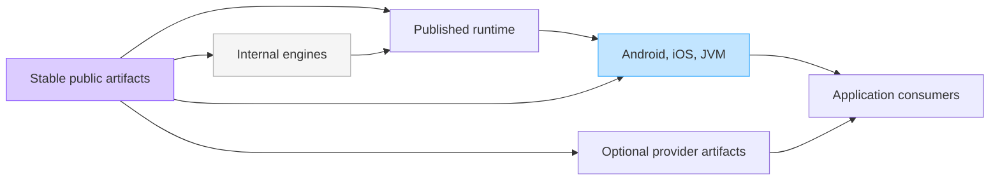
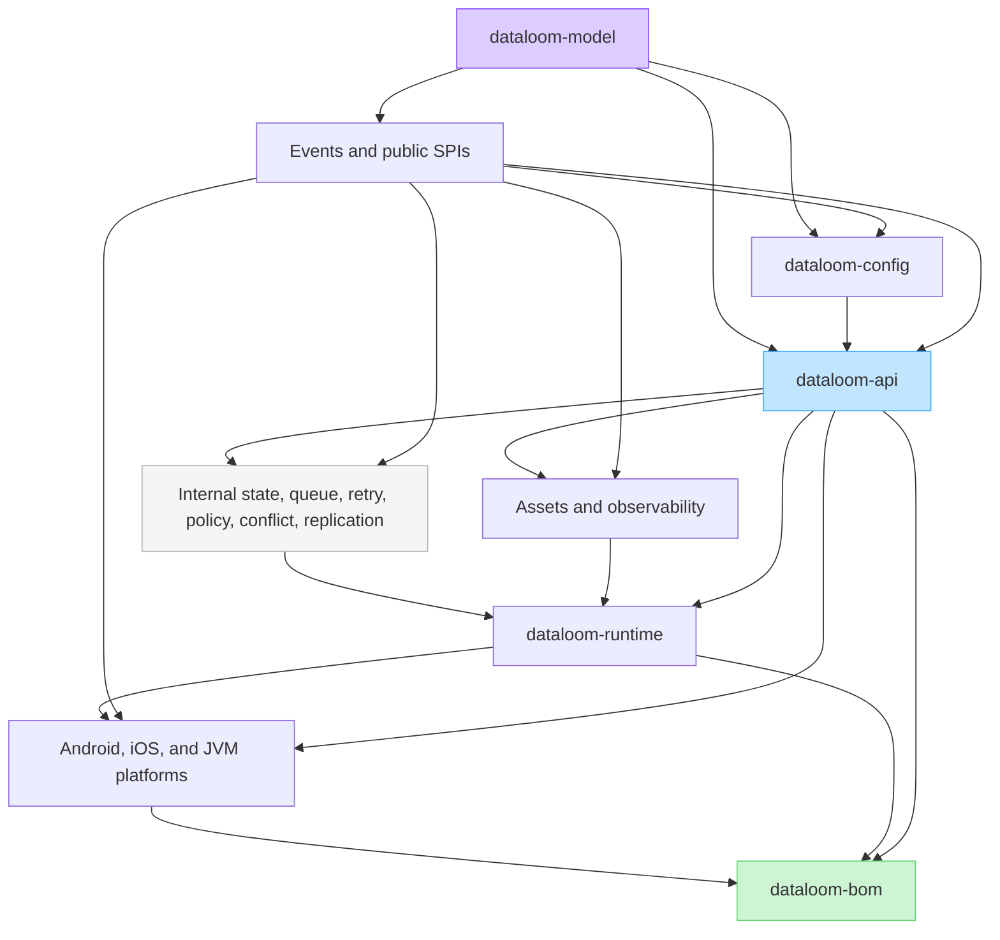
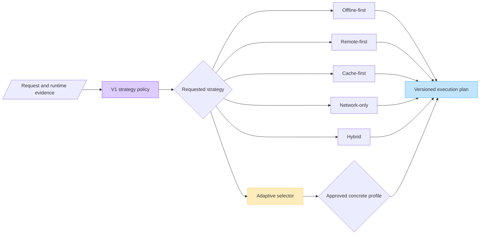

# ADR-0002: V1 artifact and foundation architecture

## Status

Accepted

## Date

2026-07-27

## Context

The implementation through DL-036 established a working synchronization
foundation in a small module graph:

- `dataloom-api`
- `dataloom-core`
- `dataloom-runtime`
- `dataloom-testing`
- three Android integration modules
- one Apple XCFramework umbrella

That graph was appropriate for incremental foundation work, but it is not the
V1 product and publication graph defined by DataLoom Books 3–5. In particular:

- `dataloom-api` combines canonical models, provider SPIs, queue/storage/
  transport SPIs, and application-facing API.
- `dataloom-core` is described as internal but its public types appear in
  `dataloom-runtime` public signatures.
- configuration, plugin, asset, events/observability, policy, retry,
  conflict, state, storage, and transport ownership is not represented by
  explicit source boundaries.
- no published artifact graph, BOM, or external-consumer boundary exists.
- existing architecture documents still label already-created modules as
  future work and mandatory V1 capabilities as deferred.

Issue #92 makes retry, conflict handling, events/observability, asset
synchronization, the complete plugin platform, and enterprise governance
mandatory V1 capabilities. The audit in #91 and
`DL-AUDIT-004-v1-production-readiness.md` shows that all six need common
configuration, policy, durable-state, security, event, compatibility, and
publication foundations.

DataLoom's primary product purpose is to provide offline-first, remote-first,
cache-first, network-only, hybrid, and adaptive synchronization through one
deterministic, policy-driven engine. All six are first-class built-in V1
strategies. None may be deferred to V2, reduced to an application-only policy,
or satisfied merely by allowing a custom pipeline. Applications may extend
selection policy without replacing durable queue, retry, conflict, event, or
platform orchestration.

ADR-0001 remains authoritative for the Android-first and
Kotlin-Multiplatform-ready platform strategy. “Android-first” defines the
reference implementation and delivery order; it does not make iOS optional.
V1 must support native Android applications plus Android and iOS targets in a
Kotlin Multiplatform application. This ADR supersedes ADR-0001's four-module
allocation, future-module list, and incremental implementation sequence for
V1.

## Decision

DataLoom V1 will use two related graphs:

1. a **published artifact graph** that is stable and intentionally small for
   consumers; and
2. a **source/engine graph** with cohesive internal modules that can be built,
   tested, evolved, and qualified independently without becoming accidental
   consumer API.

Cross-module communication uses canonical versioned contracts. Internal engine
types never appear in published public signatures. Durable state changes and
their outbox/audit evidence share an atomic transaction boundary.

Synchronization behavior is selected through a versioned strategy policy, not
by overloading synchronization direction or full/delta mode and not by asking
applications to replace the complete runtime pipeline.

## Published artifact graph

The V1 consumer coordinates are:

| Coordinate | Classification | Contents |
|---|---|---|
| `io.dataloom:dataloom-bom` | Stable BOM | Version constraints only; no runtime code |
| `io.dataloom:dataloom-kmp-core` | Stable KMP library | Canonical models, identifiers, errors, clocks, compatibility primitives, and platform-neutral boundaries |
| `io.dataloom:dataloom-api` | Stable application API | Client/facade, workflow handles, commands, results, observation and diagnostics interfaces |
| `io.dataloom:dataloom-config` | Stable configuration API | Builders/DSL, schemas, sources, immutable snapshots, validation, dynamic updates, feature controls |
| `io.dataloom:dataloom-provider-api` | Stable SPI | Provider identity, lifecycle, health, dependencies, capabilities, contexts, and leases |
| `io.dataloom:dataloom-plugin-api` | Stable SPI | Plugin manifest, hooks, permissions, lifecycle, compatibility, and bounded-execution contracts |
| `io.dataloom:dataloom-runtime` | Stable runtime behavior | Default orchestration implementation; internal engines are implementation dependencies |
| `io.dataloom:dataloom-assets` | Stable feature library | Asset manifests, streaming/chunk contracts, resumability, integrity, and transfer API |
| `io.dataloom:dataloom-testing` | Stable testing API | Fakes, virtual time/randomness, fault injection, probes, and provider/plugin contract kits |
| `io.dataloom:dataloom-android` | Stable platform library | Android lifecycle, connectivity, WorkManager, files, secure platform integration, and approved adapter aggregation |
| `io.dataloom:dataloom-ios` | Stable KMP platform library | iOS lifecycle, connectivity, background execution, files, secure platform integration, and approved adapter aggregation |
| `io.dataloom:dataloom-jvm` | Stable platform library | JVM/server lifecycle, scheduling, filesystem, storage, networking, and approved adapter aggregation |

The shared KMP artifacts and `dataloom-ios` must publish compatible
`iosArm64`, `iosSimulatorArm64`, and `iosX64` variants for KMP consumers. The
shared artifacts consumed from `commonMain` must also publish an explicit
Android target variant; a standalone JVM publication is not, by itself,
evidence of KMP Android compatibility. The
Apple XCFramework remains an additional distribution boundary assembled from
the same approved public KMP/runtime/iOS artifacts for native Swift
integration. It must never export an internal engine module. Native Swift
integration may be distributed separately, but KMP iOS support is a mandatory
V1 release gate.

Additional provider implementations may be published as optional artifacts
only when their names, dependency metadata, compatibility range, contract-kit
evidence, and support status are documented. They are not silently folded
into the common runtime.

The `io.dataloom` group is the design coordinate. Publication is blocked until
namespace ownership and release authority are verified in DL-046.

## Source and engine graph

Published artifacts may be assembled from the following source modules:

| Source module | Primary ownership | Publication treatment |
|---|---|---|
| `dataloom-model` | Canonical immutable models, value types, errors, clocks, IDs, compatibility and schema primitives | Published as `dataloom-kmp-core` |
| `dataloom-api` | Application-facing client and workflow capabilities | Published |
| `dataloom-config` | Typed configuration, sources, resolution, validation, snapshots, flags, update and rollback | Published |
| `dataloom-provider-api` | Provider SPI | Published |
| `dataloom-plugin-api` | Plugin SPI | Published |
| `dataloom-events` | Canonical envelopes, subscription contracts, ordering, buffering, outbox ports | Packaged through public API/observability artifacts unless later approved separately |
| `dataloom-state` | State machines, transition validation, snapshots, projections and fencing | Internal |
| `dataloom-queue` | Durable queue engine, partitions, leases, priority, retention and dead-letter behavior | Internal plus narrow SPI |
| `dataloom-retry` | Failure classification, delay strategies, budgets, retry state and circuit breaker | Internal engine with public configuration/models in stable artifacts |
| `dataloom-policy` | Policy registry, deterministic precedence, decisions and evidence | Internal engine plus stable extension contracts |
| `dataloom-conflict` | Detection, built-in strategies, custom dispatch, convergence and loop protection | Internal engine plus stable extension contracts |
| `dataloom-replication` | Session protocol, handshake, cursors and transfer coordination | Internal |
| `dataloom-assets` | Manifest, chunks, streaming, transforms, resume and integrity | Published |
| `dataloom-storage-spi` | Transactions, state, queue, conflict, session, outbox, audit and migration ports | Stable SPI; publication requires explicit approval |
| `dataloom-storage-default` | Reference transactional storage | Optional implementation artifact |
| `dataloom-transport-spi` | Unary/streaming transfer, endpoint, authentication and connectivity ports | Stable SPI; publication requires explicit approval |
| `dataloom-transport-http` | Reference HTTP/streaming transport | Optional implementation artifact |
| `dataloom-observability` | Logs, metrics, traces, health, exporters, support snapshots and operations read model | Published through approved stable/optional artifacts |
| `dataloom-runtime` | Lifecycle, orchestration, engine wiring and execution scopes | Published implementation |
| `dataloom-platform-android` | Android-specific implementations and aggregation | Published as `dataloom-android` |
| `dataloom-platform-ios` | iOS-specific implementations and aggregation | Published as `dataloom-ios` |
| `dataloom-platform-jvm` | JVM-specific implementations and aggregation | Published as `dataloom-jvm` |
| `dataloom-apple` | XCFramework/Swift distribution assembly only | Distribution boundary, no engine ownership |
| `dataloom-testing` | Public fakes, deterministic harnesses and contract suites | Published testing artifact |
| `dataloom-benchmarks` | Micro, macro, soak and resource qualification | Internal quality module |
| `build-logic` | Convention, dependency, API/ABI, publication and quality plugins | Internal build logic |

Source-module names may be refined only by an approved ADR. Responsibility and
dependency direction may not be collapsed merely to reduce the number of
Gradle projects.

## Dependency direction

The intended source dependency direction is:

Where a row contains several inputs, dependencies must still be the narrowest
set required by the module. The diagram is an upper bound, not permission for
every engine to depend on every other engine.

## Mandatory boundary rules

1. `dataloom-model` has no DataLoom project dependency.
2. `dataloom-api`, configuration, and SPIs never depend on runtime or an
   internal engine.
3. Runtime public signatures contain only types from published stable
   artifacts.
4. Internal packages use `io.dataloom.internal.*` and are not exported by the
   Apple umbrella, Gradle metadata, or consumer documentation.
5. Production modules never depend on `dataloom-testing` or benchmarks.
6. Provider implementations and platform adapters depend on SPIs, not internal
   registries or runtime implementation classes.
7. Plugin callbacks receive only capability-scoped public contexts; they do
   not receive internal stores, credentials, or engine objects.
8. No callback into application, provider, plugin, observer, or exporter code
   occurs while an internal mutex or storage transaction is held.
9. Durable state, checkpoint, outbox, and audit effects commit before success
   or progress is published.
10. Every queue, stream, retry budget, worker pool, telemetry buffer, and
    diagnostic payload has an explicit bound and overload behavior.
11. Time, identifiers, randomness, dispatch/execution, providers, secrets,
    storage, transport, and telemetry are injected; no mutable global service
    locator is permitted.
12. Sensitive values are opaque and excluded from `toString`, logs, metrics,
    traces, events, support bundles, and exported configuration by default.

## V1 consumer and distribution matrix

| Consumer | Shared dependency | Platform dependency | Packaging result |
|---|---|---|---|
| Native Android application | KMP/JVM-compatible public API and runtime | `dataloom-android` | Android AAR/JAR variants only; no iOS binary is packaged |
| KMP application — Android target | Public KMP API/runtime from `commonMain` | `dataloom-android` from `androidMain` | Android target binary |
| KMP application — iOS target | Public KMP API/runtime from `commonMain` | `dataloom-ios` from `iosMain` | Kotlin/Native iOS framework/library |
| Native Swift application (optional distribution) | Shared implementation through the Apple distribution boundary | `DataLoom` XCFramework/Swift package | If enabled, device/simulator slices plus full Swift compatibility and runtime qualification |

One product version and BOM align these artifacts, but platform binaries remain
separate. An Android APK/AAB never contains Apple framework slices. A KMP
application shares DataLoom contracts and behavior in `commonMain`, then
selects Android and iOS integrations in the corresponding platform source
sets.

V1 parity applies to externally observable synchronization semantics: retry,
conflict, asset integrity/resume, events, persistence/recovery, security,
plugin policy, tenant isolation, and diagnostics must behave equivalently
unless a documented platform capability produces an explicit unsupported or
degraded result. Platform limitations must never be silently ignored.

## Core synchronization strategy engine

DataLoom V1 will ship six complete built-in strategies:

| Profile | Required behavior |
|---|---|
| Offline-first | Accept and durably protect eligible local work first; reconcile when connectivity and policy permit; never classify constraint deferral as a retry. |
| Remote-first | Attempt the remote path first; apply configured local fallback, persistence, or explicit failure only after a typed remote outcome. |
| Cache-first | Use local data only under explicit freshness/staleness rules and expose background refresh as observable durable work. |
| Network-only | Require transport but not storage/queue capabilities; make zero local-store or queue calls and return a typed result when remote execution is unavailable. |
| Hybrid | Compose an explicit primary source, fallback, returned data origin, persistence, and cache-coherence rule. |
| Adaptive | Deterministically select only from an approved set of concrete strategies using operation, freshness, connectivity, provider health, tenant/workflow configuration, and durable state. |

These strategies are the core product behavior, not optional feature modules.
Their public contract remains composable and extensible rather than becoming a
closed enum of every possible application policy. It includes:

- source preference and operation ordering;
- freshness and consistency requirements;
- connectivity admission and typed fallback behavior;
- local durability, queueing, and non-retry deferral behavior;
- reconciliation, retry, and conflict-policy references;
- a stable built-in strategy identifier plus an optional registered custom
  selector.

The strategies govern synchronization admission, transfer, persistence,
fallback, and reconciliation. They do not turn DataLoom into a generic domain
repository, ORM, application query API, or UI state container; those remain
application-owned.

`SynchronizationDirection` continues to describe push, pull, or bidirectional
flow. `SynchronizationMode` continues to describe full or delta scope.
`BidirectionalExecutionOrder` remains a lower-level ordering primitive. None of
those contracts alone claims offline-first, remote-first, cache-first,
network-only, hybrid, or adaptive support.

Policy evaluation is bounded, side-effect-free, and explainable. Admission
persists the chosen strategy, configuration version, and non-sensitive decision
evidence with durable work. Reacquisition and restart use that recorded
decision unless an explicit, authorized re-evaluation transition is recorded.
Fallback must never be inferred from an exception type, missing provider, or
platform name.

The runtime owns the strategy orchestrator and composes the existing inbound,
outbound, bidirectional, connectivity, queue, retry, conflict, state, and event
engines. Applications can add selectors or policy rules through stable
contracts, but a custom pipeline is not required for ordinary strategy use.

Qualification covers offline, online, intermittent, stale-cache, provider
degradation, process-death, conflict, retry exhaustion, and cancellation
scenarios for each built-in strategy across native Android, KMP Android, and KMP
iOS. Observable decisions and recovery guarantees must match across platforms;
different OS scheduling mechanics are allowed only when surfaced through
equivalent typed outcomes.

## Shared foundation contracts

The following foundations are implemented once and reused:

### Configuration

- typed schemas and source adapters;
- fixed deterministic source/scope precedence;
- complete validation findings before work admission;
- deeply immutable versioned snapshots with integrity checksum;
- secret references rather than secret values;
- atomic update with expected-version/fencing checks;
- explicit existing-work/new-work/restart-required impact;
- feature ownership/default/expiry/scope/audit metadata;
- authorized redacted export;
- unknown-key strictness;
- last-known-good rollback with monotonically increasing history.

### Policy

- immutable input captures execution context, state, provider health,
  configuration snapshot, tenant and trace;
- built-in offline-first, remote-first, cache-first, network-only, hybrid, and
  adaptive strategy selection is expressed through composable policy rather
  than hard-coded pipelines;
- deterministic ordered policy sets;
- deny dominates allow; required user action dominates delay unless an
  approved configuration says otherwise;
- evaluation is time-bounded, side-effect-free and explainable;
- the resulting decision/evidence is committed with the state transition.

### Durable state

- versioned records and migrations;
- transaction and compare-and-set/fencing primitives;
- retry/circuit, unresolved conflict, event outbox, asset session, audit and
  administrative command stores;
- idempotency keys, leases, recovery points, retention and compaction;
- platform implementations must pass one shared contract kit.

### Events, audit and redaction

- one versioned operational/audit envelope with event ID, type, source,
  occurred time, tenant, workflow, correlation, causation, trace and safe
  metadata;
- durable outbox for required at-least-once delivery;
- schema evolution, filtering, ordering scope, acknowledgement and replay;
- centralized classification, minimization and redaction;
- bounded delivery and failure-isolated consumers/exporters.

### Deterministic execution

- UTC wall clock for timestamps;
- monotonic time for elapsed budgets;
- injectable deterministic/secure randomness;
- stable identifier factories;
- explicit cancellation and timeout behavior at every suspend boundary.

## Migration from the current graph

Migration must remain buildable and reviewable at every step:

1. Add architecture/API fitness checks and capture the current public API
   baseline before moving symbols.
2. Introduce `dataloom-model`; move canonical value types without changing
   semantics. Provide time-limited source/binary compatibility shims only when
   they can be tested and removed before `1.0.0`.
3. Introduce `dataloom-events`, `dataloom-provider-api`,
   `dataloom-plugin-api`, and `dataloom-config`; move public contracts out of
   the combined `dataloom-api`.
4. Move the application-facing facade and lifecycle/result contracts into
   `dataloom-api`; keep its implementation in `dataloom-runtime`.
5. Split `dataloom-core` responsibilities into model/state/policy and other
   owning modules. Eliminate every internal type from public signatures, then
   remove the old catch-all module.
6. Introduce storage/transport SPIs and internal engine modules behind stable
   contracts.
7. Aggregate existing Android implementations behind
   `dataloom-platform-android`/`dataloom-android`; add the iOS and JVM platform
   artifacts; keep `dataloom-apple` as a thin XCFramework/Swift distribution
   boundary over the approved public artifacts.
8. Add publication metadata, BOM constraints, API/ABI checks, staged external
   consumers, signatures and release evidence only after boundaries are
   proven.

Moving files and introducing compatibility shims must not be confused with
implementing the missing V1 behavior. Each engine issue remains open until its
runtime, persistence, security, observability and qualification criteria pass.

The first migration checkpoint records JVM ABI dumps for the four existing
shared modules and adds an architectural ABI fitness check. It identifies 13
exact `dataloom-runtime` signatures that expose `dataloom-core` types. Those
legacy lines are temporarily allowlisted so the baseline can be established;
removal is permitted and any new leak fails verification. All 13 allowances
must be eliminated before the `1.0.0` API freeze.

The first extraction then introduces `dataloom-model` and moves only
`DataLoomInstant` and `DataLoomClock` into it without changing their FQCNs or
semantics. The JVM ABI therefore has five shared-module references: the two
declarations move from `dataloom-api` ownership to `dataloom-model`, while
consumer signatures retain the same type names.

Because Apple targets are intentionally absent on Linux, the corresponding
Kotlin/Native `.klib.api` references can only be generated and reviewed on
macOS. A DL-039 foundation change that touches this ABI gate must not be pushed
until JVM `.api` references for `dataloom-model`, `dataloom-api`,
`dataloom-core`, `dataloom-runtime`, and `dataloom-testing`, plus Apple
`.klib.api` references for those five modules and `dataloom-apple`, pass
`checkKotlinAbi`. KLib
validation does not replace generated Objective-C/Swift header compatibility
or XCFramework layout checks.

## Validation strategy

Each migration slice must pass locally before it is pushed:

- the smallest affected module tests;
- full shared `allTests` before a public-contract merge;
- architecture dependency checks;
- public API/ABI dump comparison;
- macOS-generated Kotlin/Native KLib ABI comparison for every Apple-targeted
  KMP module;
- generated Objective-C/Swift header/API compatibility checks for the optional
  native Apple distribution;
- external consumer compilation;
- serialization/schema compatibility where durable or wire models change;
- native Android consumer compilation and Android integration tests;
- KMP sample compilation and end-to-end tests for both Android and iOS;
- offline-first, remote-first, cache-first, network-only, hybrid, and adaptive
  behavior matrices, including persisted selection, typed fallback, forbidden
  provider calls, restart, and explicit degradation;
- `iosArm64`, `iosSimulatorArm64`, and `iosX64` compilation, simulator tests,
  XCFramework assembly, and Swift smoke validation when an exported KMP
  contract changes.

CI is not used as an interactive debugger. A workflow is rerun only when its
first meaningful error proves a transient runner/service failure. Required
checks and target coverage are not weakened to conserve credits.

## Consequences

### Positive

- The six mandatory V1 subsystems share one deterministic foundation.
- Consumer dependencies and optional features are explicit.
- Internal refactoring remains possible without accidental API/ABI changes.
- Provider/plugin/platform failures can be isolated at narrow boundaries.
- Durable recovery, audit and observability use compatible identity and state
  semantics.
- Release artifacts can be built once and qualified as an immutable set.

### Costs and risks

- The current catch-all modules require a controlled migration.
- More source modules increase build-graph and ownership discipline.
- Moving already-public symbols before `1.0.0` requires compatibility evidence.
- Configuration, storage, event and security foundations are on the critical
  path for all subsequent V1 work.

These costs are accepted because implementing each mandatory subsystem inside
the current catch-all graph would duplicate state, policy, configuration and
event logic and create a substantially higher release risk.

## Rejected alternatives

- **Keep four shared modules and add all behavior there.** Rejected because
  public, SPI, internal engine and platform ownership remain mixed.
- **Create only empty artifact wrappers.** Rejected because an artifact name
  without owned behavior and compatibility evidence does not satisfy V1.
- **Build each subsystem with private configuration/state/events.** Rejected
  because precedence, recovery, redaction, audit and schema evolution would
  diverge.
- **Publish `dataloom-core` as-is.** Rejected because it contains implementation
  responsibilities and currently leaks through runtime signatures.
- **Use CI to discover migration errors one commit at a time.** Rejected because
  it wastes constrained Actions credits and produces noisy evidence.

## Release no-go conditions

V1 remains NO-GO while any of the following is true:

- a public signature exposes an internal engine type;
- a required published artifact or BOM constraint is absent;
- native Android, KMP Android, or KMP iOS consumer support is incomplete;
- any built-in offline-first, remote-first, cache-first, network-only, hybrid,
  or adaptive strategy is missing, incomplete, implemented only by application
  replacement code, or can silently change behavior after queueing/restart;
- an iOS target compiles but lacks required platform adapters or end-to-end
  qualification;
- configuration/policy/state/event foundations are duplicated or incomplete;
- a mandatory subsystem is contract-only, application-only, or unqualified;
- external consumers require project substitution/composite builds;
- API/ABI, schema migration, platform, security, supply-chain, legal, signing,
  or immutable-candidate evidence is unresolved.

## References

- GitHub issue #91 — full implementation and release-readiness audit
- GitHub issue #92 — full V1 scope decision
- GitHub issue #93 — DL-039 implementation gate
- GitHub issue #102 — core synchronization strategy implementation gate
- `docs/audits/DL-AUDIT-004-v1-production-readiness.md`
- DataLoom Book 3 — Software Architecture, Chapters 9–17 and Appendix B
- DataLoom Book 4 — SDK Design Specification, Chapters 9–21 and Appendix A
- DataLoom Book 5 — SDK Implementation Guide, Appendix A
