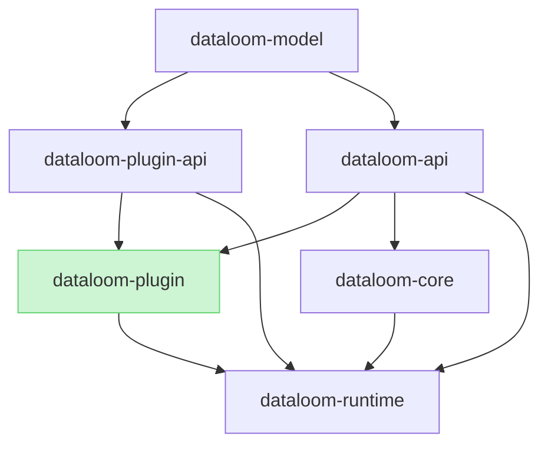

# ADR-0003: Plugin engine module (`dataloom-plugin`)

## Status

Accepted. Amends [ADR-0002](./ADR-0002-v1-artifact-and-foundation-architecture.md)
by adding one source module and one published coordinate.

## Date

2026-09-19

## Context

`#98` (DL-044 plugin platform) built its runtime engine inside `dataloom-core`
(`io.dataloom.core.plugin`): `PluginRegistry`, `PluginLifecycleTransitions`,
`PluginLifecycleStateTracker` and its request/decision/result types,
`PluginExecutionBoundsEnforcer`, and the lifecycle audit bridge.
`dataloom-plugin-api` holds only the behavior-free SPI contracts.

That placement blocked wiring the engine into `DataLoomBuilder`, as recorded in
[`plugin-platform-databuilder-wiring-investigation.md`](../api/plugin-platform-databuilder-wiring-investigation.md):

- ADR-0002 boundary rule 3 says runtime public signatures contain only types
  from published stable artifacts, and `dataloom-core` is an internal engine.
  `dataloom-runtime`'s `checkPublicAbiBoundaries` task enforces this by failing
  the build on any `io.dataloom.core.` type in its ABI dumps.
- Every result, request, and decision type the engine returns
  (`PluginLifecycleTransitionResult`, `PluginExecutionBoundsResult`,
  `PluginLifecycleTransitionRequest`,
  `PluginLifecycleAdministrationAuthorizationDecision`) lived in that namespace,
  so no public method could return the engine's observable behavior.
- The provider engine avoided this by placing its result types in
  `dataloom-api`; the plugin engine had not.

ADR-0002 names `dataloom-plugin-api` (Stable SPI: manifest, hooks, permissions,
lifecycle, compatibility, bounded-execution contracts) and no plugin engine
module.

Decision drivers:

- Nothing is published and there are no external consumers, so a
  breaking-shaped ABI change to `dataloom-core` costs nothing now and would be
  expensive after the first release.
- A permanent duplicate result/request type layer inside `dataloom-runtime`,
  with a hand-written mapping and drift risk as `#98` evolves, is permanent
  debt with no compensating benefit.
- ADR-0002 says responsibility and dependency direction may not be collapsed to
  reduce the number of Gradle projects.

## Decision

Relocate the whole plugin engine out of `dataloom-core` into a new module,
`dataloom-plugin`, published as `io.dataloom:dataloom-plugin` (Stable feature
library, the same classification ADR-0002 gives `dataloom-assets`).

- Package: `io.dataloom.plugin` (was `io.dataloom.core.plugin`). Types moved
  unchanged apart from package, including every test.
- `dataloom-core` retains no plugin code and no dependency on
  `dataloom-plugin-api` or `kotlinx-coroutines`, both of which it declared only
  for this engine.
- `dataloom-runtime` exposes the engine through an opt-in
  `DataLoomBuilder.pluginConfiguration(DataLoomPluginSpec)` and a nullable
  `DataLoom.pluginEngine`, returning the engine's own types with no translation
  layer.
- The Apple umbrella exports `dataloom-plugin-api` and `dataloom-plugin`,
  because `DataLoom.pluginEngine`'s signatures use their types.

`dataloom-plugin-api` is unchanged and stays behavior-free: plugin authors
depend on the SPI alone, and only hosts depend on the engine.

Dependency rules for `dataloom-plugin`:

- May depend on `dataloom-model`, `dataloom-plugin-api`, `dataloom-api`, and
  `kotlinx-coroutines`.
- Must not depend on `dataloom-core`, `dataloom-runtime`, or `dataloom-testing`.
- `dataloom-plugin-api` and `dataloom-api` must not depend on `dataloom-plugin`.
- Every public type in `dataloom-plugin` is a published, stable type and must
  not reference an internal engine namespace.

## Migration

Completed in the pull request that introduces this ADR:

1. Create `dataloom-plugin` with explicit-API mode and move the seven engine
   source files and seven test files from `dataloom-core`.
2. Remove the plugin-only dependencies from `dataloom-core`'s build file.
3. Regenerate the ABI baselines: `dataloom-core` loses exactly its plugin
   declarations (226 lines JVM, 248 lines Kotlin/Native, zero additions);
   `dataloom-plugin` gains the same declarations under the new package as its
   first baseline; `dataloom-runtime` gains only the additive
   `pluginConfiguration`, `pluginEngine`, `DataLoomPluginSpec`, and
   `DataLoomPluginEngine` declarations.
4. Add the runtime wiring, tests, an external-consumer probe, and the Apple
   export.

No compatibility shim is provided; the pre-V1 posture allows the breaking move.

## Consequences

- `DataLoomBuilder` wiring is unblocked and follows the existing opt-in
  `*Configuration`/`*Spec` pattern. Omitting it leaves `DataLoom` unchanged and
  `pluginEngine` null.
- The published artifact set grows by one coordinate. `dataloom-bom` and
  publication metadata must include it when publication wiring lands (no module
  has publication wiring yet; see
  [`artifact-graph-bom-gap-analysis.md`](../architecture/artifact-graph-bom-gap-analysis.md)).
- The engine's remaining work (compatibility validation, tracker/enforcer
  integration, audit-trail bridging, isolation, certification kit, hook
  dispatch) lands in a module whose public API is already the consumer-facing
  surface, so those changes are diffed against a real baseline.
- `dataloom-runtime` gains a compile-time `api` dependency on the engine module.
- The Apple XCFramework export list changes; the XCFramework link was not
  verified on the authoring host (Windows) and is covered by macOS CI.
- The wired lifecycle authorizer path checks structural legality and the host
  authorizer only. The capability-aware overload (permission enforcement on
  entry to `ACTIVE`) is not exposed through the facade in this change.

## Rejected alternatives

- **Duplicate translation layer in `dataloom-runtime`.** Maintains two copies
  of every result and request type with a mapping function that can drift, for
  an engine still changing.
- **Move only the result/request types to `dataloom-api`, as the provider
  engine does.** Leaves the engine split across two modules, still requires
  moving the authorizer interface (a host-implemented type with the same
  exposure problem), and grows `dataloom-api` with engine-specific types.
- **Move the engine into `dataloom-plugin-api`.** Breaks the SPI's
  behavior-free contract, adds a coroutines dependency to a module plugin
  authors depend on, and conflicts with ADR-0002 rule 2 (SPIs never depend on
  an engine).

## Validation and release gates

- `checkKotlinAbi` at module and whole-build scope with
  `-Pdataloom.appleKlibCrossCompile=true` must pass with the regenerated
  baselines.
- `dataloom-runtime:checkPublicAbiBoundaries` must pass; no `io.dataloom.core.`
  type may appear in either runtime ABI dump.
- The moved test suite (88 tests) must pass unchanged in `dataloom-plugin`.
- Kotlin/Native main and test sources must compile for all three iOS targets in
  every touched module.
- Publication of `io.dataloom:dataloom-plugin` remains blocked on the same
  DL-046 namespace and release-authority gates as every other coordinate.

## Superseded decisions

None. This ADR adds to ADR-0002's source-module table and published artifact
table; it changes no other decision in it.

## References

- GitHub issue #98 — DL-044 plugin platform implementation gate
- [ADR-0002](./ADR-0002-v1-artifact-and-foundation-architecture.md) — boundary
  rules 2 and 3, source and engine graph
- [Plugin registry and lifecycle state tracking](../api/plugin-registry.md)
- [`DataLoomBuilder` wiring investigation](../api/plugin-platform-databuilder-wiring-investigation.md)
- [Module architecture](../architecture/modules.md)
