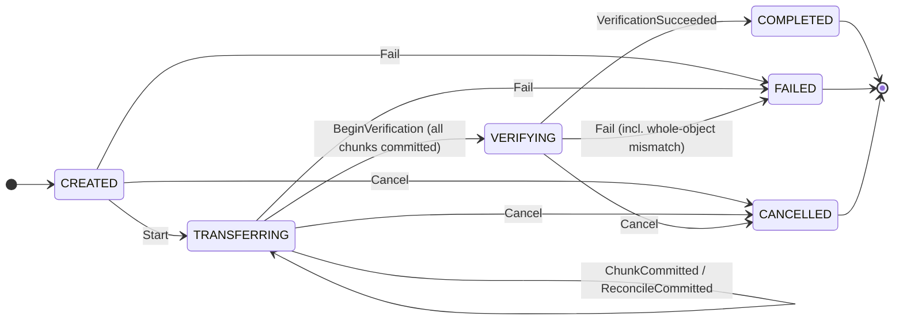

# ADR-0006: Asset transfer protocol, session state machine, and streaming digest

- **Status:** Accepted (decisions D5 and D6, taken by the project lead on
  2026-09-19); slice 1 implemented, later slices pending
- **Date:** 2026-09-19
- **Gate:** [`#97` / DL-043 asset synchronization](https://github.com/dataloom-sdk/dataloom/issues/97)
- **Amends:** the "one-shot only" design choice recorded on
  `DataLoomDigestCalculator` and in
  [`integrity-and-key-references.md`](../api/integrity-and-key-references.md)
- **Unblocks:** the two investigations
  [`asset-provider-contract-investigation.md`](../api/asset-provider-contract-investigation.md)
  and
  [`asset-synchronization-caller-investigation.md`](../api/asset-synchronization-caller-investigation.md)

> This ADR records decisions and the contracts slice 1 shipped. It does not
> claim the V1 asset requirements are met: see
> [What slice 1 does not do](#what-slice-1-does-not-do).

## Context

Gate `#97` sat at 5% because two investigations found the same blocker:
`FR-ASSET-002` (chunked transfer) and `FR-ASSET-003` (durable resumable
sessions) had no settled design, so no `AssetProvider` contract, no real caller
for `AssetManifest`/`DurableAssetManifestHistory`, and no streaming source/sink
could be written without guessing. The second investigation also found that
whole-object verification (`FR-ASSET-004`) is impossible in bounded memory with
today's one-shot `DataLoomDigestCalculator`, because
`AssetManifest.checksum` is defined as a digest of the asset's *raw bytes*,
not a digest of the chunk digests.

The project lead decided both questions so the gate could move.

## Decisions

### D5: add an incremental digest alongside the one-shot digest

`DataLoomDigestCalculator.digest(algorithm, bytes)` is unchanged. A new
extending contract adds create-update-finalize hashing:

```kotlin
interface DataLoomIncrementalDigestCalculator : DataLoomDigestCalculator {
    fun newAccumulator(algorithm: DigestAlgorithm): DataLoomDigestAccumulator
}
interface DataLoomDigestAccumulator : AutoCloseable {
    val algorithm: DigestAlgorithm
    fun update(input: ByteArray, offset: Int = 0, length: Int = input.size - offset)
    fun finish(): DataLoomDigest   // closes the accumulator
    override fun close()           // idempotent; no-op after finish
}
```

- **Semantics.** `finish()` equals the one-shot digest of the concatenation of
  every range passed to `update`, however it was split. Single-owner, not
  thread-safe. `update`/`finish` after `finish`/`close` throw
  `IllegalStateException`; an invalid range throws `IllegalArgumentException`
  and leaves the accumulator usable. Zero-length updates are no-ops.
- **Why an extending interface, not a new method on the existing one.**
  Existing one-shot implementations (several test fakes in `dataloom-api` and
  `dataloom-config`) stay valid. Pre-V1 posture would have allowed the break;
  it was unnecessary.
- **JVM (and native Android, which consumes the JVM target).**
  `java.security.MessageDigest.update/digest`, one instance per accumulator.
- **Apple.** Apple *can* stream with the current cinterop, so no buffered
  fallback was needed. `platform.CoreCrypto` already exposes
  `CC_SHA256_Init/Update/Final` and `CC_SHA512_Init/Update/Final` and their
  `CC_SHA256_CTX`/`CC_SHA512_CTX` structs. This reverses the earlier
  deliberate choice to use only the one-shot `CC_SHA256`/`CC_SHA512`, which was
  made to avoid holding a native context across Kotlin calls. The lifecycle
  cost is contained in one private class: each accumulator owns exactly one
  `nativeHeap` context, freed deterministically by `finish`/`close`, plus a
  `kotlin.native.ref.Cleaner` (registered on the context holder, not on the
  accumulator) that frees it if an abandoned accumulator is garbage collected.
  Release is idempotent, so the cleaner is harmless after an explicit release.
  The one-shot `digest` path is unchanged and still uses `CC_SHA256`/`CC_SHA512`.
- **No snapshot/restore.** Neither `MessageDigest` nor a CommonCrypto context
  offers a portable serialisable state. Consequence: a whole-object digest
  cannot resume across a restart. Callers re-hash already-processed bytes from
  durable storage (see [Resume semantics](#resume-semantics)).
- **Superseded guidance.** `DataLoomDigestCalculator`'s KDoc and
  `integrity-and-key-references.md` said whole-object integrity could be had by
  hashing the concatenated chunk digests. That contradicts
  `AssetManifest.checksum`'s definition (digest of the raw bytes) and is
  withdrawn. A hash-of-hashes is a different value and is not what the manifest
  records.
- **Not included:** an incremental HMAC. No consumer needs one.

### D6: chunked, resumable transfer with a durable-shaped session

An asset is split into fixed-size chunks, each with a digest, plus a
whole-object digest, both recorded in the existing `AssetManifest`. A transfer
*session* records which chunks are committed so a restart resumes instead of
restarting.

**Module.** `dataloom-assets` (the coordinate ADR-0002 already names,
"Manifest, chunks, streaming, transforms, resume and integrity"), package
`io.dataloom.assets`. Targets are those of every sibling pure-Kotlin module
(`jvm` plus the three iOS targets when Apple cross-compilation or an Apple host
is in effect); Android consumes the JVM target. It depends on `dataloom-api`
(the manifest types stay in `io.dataloom.api.asset`; they were not moved) and
on `kotlinx.coroutines`. It is registered in `settings.gradle.kts` next to
`dataloom-storage-file`, is not an XCFramework export, and is not wired into
`dataloom-runtime` or `DataLoomBuilder`.

**Chunk plan.** `AssetChunkPlan(totalSizeBytes, chunkSizeBytes)` is a pure
function: offset and length of every chunk (the last holds the remainder), and
`toLayout(checksums)` to build the recorded `AssetChunkLayout`. Chunk size is
configurable; default 1 MiB (`AssetChunkSizeBounds.DEFAULT_CHUNK_SIZE_BYTES`).
Providers advertise `AssetChunkSizeBounds(min, max)` and the engine clamps the
requested size into them (`FR-ASSET-002`'s negotiated part sizing). Chunk size
is also the per-chunk memory bound. Empty assets are refused
(`AssetErrorKind.EMPTY_ASSET`) because `AssetManifest` cannot describe zero
chunks. The manifest itself still permits variable-length chunks; the plan is
just the producer this slice uses.

**Bounded-memory streaming.** `AssetSource` (random-access read plus size) and
`AssetSink` (random-access write, read-back, `reserve`, `discard`).
Position-based rather than forward-only so a resumed transfer seeks to the first
missing chunk and verification can re-read staged bytes. Callers ask for at
most one chunk (or one verification buffer) per call. A sink must be readable
because whole-object verification and resume re-derive the digest from stored
bytes.

**Session state machine.** `AssetTransferSession` is an immutable value; all
behaviour is the pure function `reduce(event): AssetTransferTransition`, where a
transition is `Applied`, `Unchanged` (an idempotent duplicate) or `Rejected`
(with a reason).



Text form (`A` = applied, `U` = unchanged duplicate, `R` = rejected):

| Event | CREATED | TRANSFERRING | VERIFYING | COMPLETED | FAILED | CANCELLED |
|---|---|---|---|---|---|---|
| `Start` | A to TRANSFERRING | U | U | U | R terminal | R terminal |
| `ReconcileCommitted(set)` | R invalid phase | A (or U if equal); R if out of range | R invalid phase | R terminal | R terminal | R terminal |
| `ChunkCommitted(i)` | R invalid phase | A, or U if already committed | U | U | R terminal | R terminal |
| `BeginVerification` | R invalid phase | A to VERIFYING, or R if chunks missing | U | U | R terminal | R terminal |
| `VerificationSucceeded` | R invalid phase | R invalid phase | A to COMPLETED | U | R terminal | R terminal |
| `Fail(kind)` | A to FAILED | A to FAILED | A to FAILED | R terminal | U if same kind, else R | R terminal |
| `Cancel` | A to CANCELLED | A to CANCELLED | A to CANCELLED | R terminal | R terminal | U |

`ChunkCommitted` with an index outside the layout is `R chunk out of range` in
every phase. Properties: chunks commit in any order and any number of times;
terminal phases are absorbing; a completed session can never be failed or
cancelled and a failed or cancelled session can never complete (no false
completion, no false cancellation); `COMPLETED`/`VERIFYING` require every chunk
committed and `FAILED` carries a failure kind (checked in the constructor, so a
persisted session cannot be rehydrated into an impossible state). The whole
(phase x event) table is asserted exhaustively in
`AssetTransferSessionTest`, plus a randomised invariant test.

**Persistence seam, not persistence.** `AssetTransferSessionStore` is a
compare-and-set on `AssetTransferSession.revision` (`load`, and `save(updated,
expectedRevision)`); `applyEvent` is the retry loop. Slice 1 ships only the
in-memory store. A later slice adopts `DurableStateStore` for it using the
existing domain-adoption pattern, with `revision` as the CAS version; the
engine and state machine do not change.

**Provider SPI.** `AssetProvider` (upload: `openUpload`, `uploadChunk`,
`completeUpload`, `abortUpload`; download: `readManifest`, `readChunk`; plus
`chunkSizeBounds`). Every operation is idempotent: reopening a session with an
equal manifest returns the provider's committed chunks (this *is* resume) and
does not re-reserve quota; a different manifest is `SESSION_CONFLICT`; a
duplicate chunk, a second `completeUpload` and a second `abortUpload` succeed
without effect. The provider verifies each chunk against the manifest before
committing it and the assembled object (streamed through a
`DataLoomDigestAccumulator`) before exposing the asset, so nothing corrupted is
ever readable and a committed `(assetId, version)` is immutable
(`ASSET_VERSION_CONFLICT`). The session id is caller-chosen and reused as the
provider session id, so a restarted client addresses the same provider session.
`AssetProvider` deliberately does **not** extend `DataLoomProvider` yet
(`ProviderType` has no asset category and asset providers have no
lifecycle/binding slot until the builder-wiring slice).

**Errors.** `AssetErrorKind` is a closed set (quota exceeded, chunk/object digest
mismatch, chunk length/range, session not found/conflict, asset not found or
version conflict, incomplete upload, provider unavailable/rejected, source
changed/failed, sink failed, empty asset), each with a fixed
`ErrorCategory` and `Recoverability`; `AssetTransferError` implements
`DataLoomError` with sanitised, fixed messages. The engine treats
`RECOVERABLE` and `UNKNOWN` errors as "interrupted, session intact and
resumable" and `NON_RECOVERABLE` errors as "session failed, clean up".
Retry/backoff/circuit policy is not the engine's job; it belongs to `#94`
wiring later.

**Quota.** Quota is an *input the provider enforces*: `AssetQuota(maxAssetSizeBytes,
maxTotalBytes)`. `openUpload` is the preflight check and reserves the declared
size; the reservation is released by abort, by a failed verification, and
becomes committed usage on completion, so later chunks cannot overshoot.
Downloads enforce the local quota through the sink (`AssetSink.reserve`
preflight, `AssetSinkFullException` on write).

**Verification.** `AssetIntegrityVerifier`: per-chunk uses the one-shot digest
(one chunk is bounded); whole-object streams through an accumulator in a fixed
buffer, so memory is independent of asset size. `prepareManifest` builds an
`AssetManifest` from a source in one bounded pass (each chunk hashed one-shot
and fed to one whole-object accumulator).

**Engine.** `AssetTransferEngine.upload/download/cancel`: sequential,
idempotent by session id.

#### Resume semantics

- *Upload:* the stored manifest is reused (no re-scan); every chunk read from the
  source is re-verified against it before being sent, so a source that changed
  since the session began fails with `SOURCE_CONTENT_CHANGED` instead of
  uploading mismatched bytes. The provider's committed set is authoritative:
  the local record is reconciled to it (`ReconcileCommitted` can also *remove*
  chunks a restarted provider lost). A session left in `VERIFYING` (completion
  failed transiently) re-calls `completeUpload` and resends nothing.
- *Download:* only missing chunks are fetched. After a restart the staged bytes
  might be gone, so the whole object is always re-read from the sink for
  verification; a lost or corrupted chunk yields `OBJECT_DIGEST_MISMATCH`,
  fails the session and discards the sink. It can never falsely complete.
- *Stale sessions:* if the provider no longer knows the session and cannot
  complete it, the session fails terminally (`SESSION_NOT_FOUND`,
  `INCOMPLETE_UPLOAD`) and the caller starts a new session id.

#### Cancellation semantics

- Cancelling the calling coroutine is *cooperative* and leaves the session
  resumable in `TRANSFERRING` (committed chunks kept); it is not a terminal
  decision.
- `AssetTransferEngine.cancel(sessionId)` is the explicit, permanent decision:
  `CANCELLED`, provider-side abort (releasing the quota reservation) or sink
  discard. A running transfer notices a concurrent `cancel` between chunks. A
  completed session is not falsely cancelled.

**Compression and encryption SPIs.** `AssetCompressor` (per-chunk
compress/decompress with a decompression-bomb guard) and `AssetChunkCipher`
(AEAD-style `seal`/`open` addressed by `KeyReference`, chunk index and
associated data, nonce chosen by the implementation) with
`IdentityAssetCompressor` and `IdentityAssetCipher`. The identity cipher provides
no confidentiality and is documented as unusable to satisfy an encryption
requirement. Choosing concrete algorithms (for example deflate, AES-256-GCM) is
a later slice made against these contracts. They are not yet wired into the
engine.

**Provider test kit.** `AssetProviderContractKit` is framework-neutral
(returns an `AssetProviderContractReport`; a provider's own test calls
`assertAllPassed()`), so any provider on any platform can run it. It covers both
directions: round trip, resume after partial commit, out-of-order and duplicate
chunks, chunk digest mismatch, whole-object digest mismatch, length and range
checks, incomplete completion, session conflicts, abort semantics, per-asset and
total quota with reservation release, version conflicts, and read visibility.
`InMemoryAssetProvider` (a non-bounded-memory reference for tests and samples)
passes it, and the kit's own tests confirm it fails a provider that swallows
corrupted chunks, never completes, or ignores quota.

## Open decisions deliberately left for later slices

1. **Digest domain when transforms are enabled.** Chunk and whole-object digests
   are over the asset's *logical* bytes (the manifest documents `sizeBytes` as
   decompressed and unencrypted). When compression/encryption are wired in, a
   provider that stores sealed bytes cannot verify a logical digest. The
   working recommendation is: end-to-end integrity is verified by the client
   over logical bytes; a provider verifies what it can see (wire-form chunk
   length and, when the manifest carries them, wire-form digests). This needs an
   explicit decision when the first real algorithm lands.
2. **`ProviderType` for asset providers** and the `DataLoomProvider` lifecycle
   for `AssetProvider`, deferred to the builder-wiring slice.
3. **Provider-side expiry of abandoned upload sessions** (the reservation-leak
   backstop when a client never calls abort).

## What slice 1 does not do

Ordered next slices (slice 2, [ADR-0008](./ADR-0008-durable-asset-transfer-sessions.md),
delivered item 1 and the opt-in builder-configuration part of item 6):

1. Durable session persistence: `AssetTransferSessionStore` over
   `DurableStateStore` (the established domain-adoption pattern, as
   `DurableUnresolvedConflictLog` and `DurableAssetManifestHistory` did), with a
   codec and restart tests against Room.
2. Concrete compression and encryption algorithms and wiring both into the
   engine (resolving open decision 1).
3. Secure temp-file creation, atomic promotion of a verified sink, and
   crash/abandoned-session cleanup (`FR-ASSET-009`), with real file-backed
   `AssetSource`/`AssetSink` for Android and iOS.
4. Parallel chunk transfer with global/tenant/workflow/asset concurrency limits
   and fairness (`FR-ASSET-006`).
5. Content allow/deny/scan/quarantine hooks before commit or exposure
   (`FR-ASSET-012`).
6. Wiring into `DataLoomBuilder` (asset provider binding, `ProviderType`,
   `#94` retry/circuit and `#96` events/metrics), plus a real transport-backed
   provider (for example over `dataloom-transport-ktor`).
7. `AC-FUNC-005` on Android and iOS end to end, and the public docs/samples for
   the full asset lifecycle.

## Consequences

- `#97` has a real, tested transfer contract and reference behaviour; further
  slices no longer need to invent vocabulary.
- One new module and one new pair of public interfaces in `dataloom-model`
  (additive; ABI baselines regenerated). `SystemDataLoomDigestCalculator` and
  `AppleDataLoomDigestCalculator` now implement the extending interface.
- **Apple native memory.** The accumulator introduces the first long-lived
  native allocation in the digest path. Mitigation: deterministic release, an
  idempotent cleaner backstop, and a shared behavioural contract run against
  both platforms. The Apple implementation compiles for all three iOS targets
  locally but its tests can only run on a macOS host (CI).
- The engine is sequential: throughput is bounded until the parallelism slice.

## Rejected alternatives

- **Keep one-shot only and buffer the whole object for verification.** Violates
  "never require a whole asset in memory".
- **Change `AssetManifest.checksum` to a hash of chunk digests.** Would let
  one-shot hashing suffice, but a hash-of-hashes cannot be checked against an
  independent digest of the raw file (for example one a server already holds);
  the manifest definition stays.
- **Add `newAccumulator` to `DataLoomDigestCalculator` directly.** Needlessly
  breaks every implementer for no benefit.
- **Persist digest accumulator state for resume.** Not portable across the two
  platform primitives.
- **A forward-only stream source/sink.** Cannot seek to the first missing chunk
  and cannot re-read staged bytes for verification.
- **Provider-issued session ids.** A client that crashes between "open" and
  recording the id could never rejoin its own session; caller-chosen ids make
  open idempotent.
- **Make `AssetProvider` a `DataLoomProvider` now.** Requires a
  `ProviderType` decision and lifecycle semantics that have no answer until
  wiring.

## Validation

Verified locally on the JVM: unit tests for the chunk plan, the exhaustive
session transition table plus randomised invariants, verification, streams,
stores (including an optimistic-concurrency race), errors, transforms, the
provider contract kit (against the reference provider and three deliberately
broken providers) and the engine (upload/download round trips, resume after
partial commit, a lost local record, a provider that lost chunks, coroutine
cancellation, explicit and concurrent cancel, chunk and whole-object digest
mismatch on both directions, quota exceeded and reservation release, a full
sink, error mapping, two concurrent callers, and bounded buffer sizes on a
6 MiB asset). Incremental-digest behaviour is asserted by one shared contract
(`IncrementalDigestCalculatorContract`) that runs against `MessageDigest` on
the JVM and is compiled against CommonCrypto for `iosArm64`,
`iosSimulatorArm64` and `iosX64`.

**Not verified locally:** execution of any Apple-target test, including the
CommonCrypto accumulator; that runs only in the macOS CI job.

## References

- [`asset-manifest.md`](../api/asset-manifest.md),
  [`durable-asset-manifest-history.md`](../api/durable-asset-manifest-history.md)
- [`asset-provider-contract-investigation.md`](../api/asset-provider-contract-investigation.md),
  [`asset-synchronization-caller-investigation.md`](../api/asset-synchronization-caller-investigation.md)
- [`integrity-and-key-references.md`](../api/integrity-and-key-references.md)
- [ADR-0002](./ADR-0002-v1-artifact-and-foundation-architecture.md) (the
  `dataloom-assets` artifact)
- `FR-ASSET-001` to `FR-ASSET-012` in
  [DL-AUDIT-005](../audits/DL-AUDIT-005-current-v1-conformance.md)
