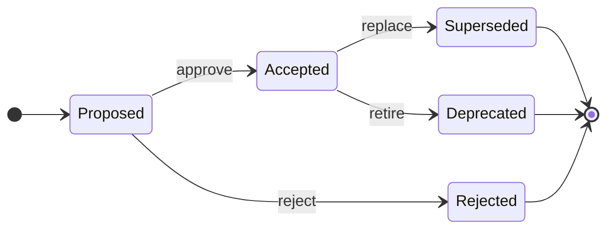

# Architecture decision records

Architecture decision records capture durable technical decisions, their
drivers, consequences, and supersession history. They define accepted
direction; they do not prove that every part of the decision is implemented.

## Decision index

| ADR | Status | Decision |
|---|---|---|
| [ADR-0001](./ADR-0001-android-first-kmp-core.md) | Accepted; parts superseded by ADR-0002 | Android-first product with a platform-independent Kotlin Multiplatform core |
| [ADR-0002](./ADR-0002-v1-artifact-and-foundation-architecture.md) | Accepted V1 target | Artifact graph, dependency roots, six-strategy engine, platform paths, and migration rules |

## Decision lifecycle

An accepted ADR can describe a target architecture. Implementation status and
release evidence belong in source, tests, and the
[audit record](../audits/README.md).

## When an ADR is required

Create or amend an ADR before making a change that materially affects:

- published artifact boundaries or dependency direction;
- public API ownership;
- strategy semantics or deterministic execution planning;
- durable schemas, compatibility, or migrations;
- platform targets or distribution;
- retry, circuit, conflict, asset, plugin, event, or governance architecture;
- security or tenant-isolation boundaries; or
- a previously accepted decision.

## ADR structure

A new ADR should include:

1. title, status, and date;
2. context and decision drivers;
3. the decision and diagrams needed to understand it;
4. current-to-target migration;
5. consequences, costs, and risks;
6. rejected alternatives;
7. validation and release gates;
8. superseded decisions; and
9. references.

Use the [documentation style guide](../documentation-style.md), especially the
current-versus-target language rules.
