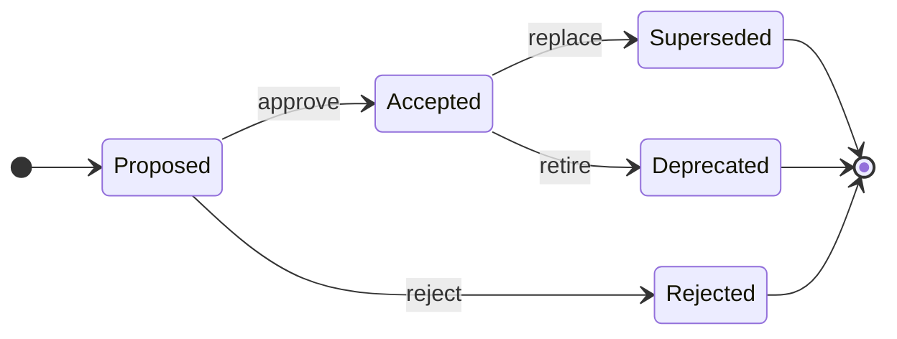

# Architecture decision records

Architecture decision records capture durable technical decisions, their
drivers, consequences, and supersession history. They define accepted
direction; they do not prove that every part of the decision is implemented.

## Decision index

| ADR | Status | Decision |
|---|---|---|
| [ADR-0001](./ADR-0001-android-first-kmp-core.md) | Accepted; parts superseded by ADR-0002 | Android-first product with a platform-independent Kotlin Multiplatform core |
| [ADR-0002](./ADR-0002-v1-artifact-and-foundation-architecture.md) | Accepted V1 target | Artifact graph, dependency roots, six-strategy engine, platform paths, and migration rules |
| [ADR-0003](./ADR-0003-plugin-engine-module.md) | Accepted; amends ADR-0002 | Plugin engine relocated from `dataloom-core` to the published `dataloom-plugin` module |
| [ADR-0004](./ADR-0004-runtime-version-and-plugin-compatibility.md) | Accepted | Strict semantic-version `RuntimeVersion`, running-SDK version source, plugin compatibility gate, and lifecycle-gated execution |
| [ADR-0005](./ADR-0005-enterprise-governance-foundation.md) | Accepted | Enterprise governance foundation: closed RBAC model, tenant isolation, hash-chained tamper-evident audit, HMAC-signed policy packs (signed packs implemented in slice 2, ADR-0010) |
| [ADR-0006](./ADR-0006-asset-transfer-and-streaming-digest.md) | Accepted; slice 1 implemented | Chunked resumable asset transfer, transfer-session state machine, and incremental (streaming) digest alongside the one-shot digest |
| [ADR-0007](./ADR-0007-app-lifecycle-provider.md) | Accepted | Platform-neutral `AppLifecycleProvider` contract (cold `Flow` of foreground/background/terminating states plus a synchronous `current`) with Android and iOS implementations |
| [ADR-0008](./ADR-0008-durable-asset-transfer-sessions.md) | Accepted; implemented | Durable asset transfer sessions on `DurableStateStore`, typed store-failure outcome, and opt-in `assetTransferConfiguration` builder wiring |
| [ADR-0009](./ADR-0009-plugin-version-and-dependency-gated-activation.md) | Accepted | Canonical semantic-version `PluginVersion`/`PluginVersionRange` and dependency-gated plugin activation with non-throwing, closed-reason refusals |
| [ADR-0010](./ADR-0010-governance-signed-policy-packs-and-runtime-wiring.md) | Accepted; implemented; completes ADR-0005 D10 | Signed policy packs (checks named, never code; versioned domain-tagged wire format; non-throwing verifier) and opt-in `governanceConfiguration` builder wiring; durable audit and rollback protection deferred |
| [ADR-0011](./ADR-0011-conflict-metrics-and-retry-integration.md) | Accepted | Conflict metrics on the existing retry/circuit telemetry mechanism; retry integration for applying resolved decisions is already covered by existing machinery |
| [ADR-0012](./ADR-0012-quarantine-credit-back-for-infrastructure-failures.md) | Accepted | Quarantine occurrences are credited back when a batch fails with a retry-eligible infrastructure error, so infrastructure noise cannot quarantine a healthy entity |
| [ADR-0013](./ADR-0013-lifecycle-triggered-queue-drain.md) | Accepted | Opt-in lifecycle-triggered queue drain: a bounded, non-overlapping drain through the existing queue worker on configured lifecycle transitions |
| [ADR-0015](./ADR-0015-remote-first-push-unavailable-planning-and-cache-first-refresh-failure-contract.md) | Accepted; implemented | Remote-first `PUSH` under unavailable connectivity is deferred or rejected, never planned as a local read; cache-first serves cached data as success even when its synchronous refresh fails, surfacing the failure as a typed diagnostic |

## Decision lifecycle

```mermaid
stateDiagram-v2
    direction LR
    [*] --> Proposed
    Proposed --> Accepted: approve
    Proposed --> Rejected: reject
    Accepted --> Superseded: replace
    Accepted --> Deprecated: retire
    Superseded --> [*]
    Deprecated --> [*]
    Rejected --> [*]
```

An accepted ADR can describe a target architecture. Implementation status and
release evidence belong in source, tests, and the
[audit record](../audits/README.md).

## When an ADR is required

Create or amend an ADR before making a change that materially affects:

- published artifact boundaries or dependency direction;
- public API ownership;
- strategy semantics or deterministic execution planning;
- durable schemas, compatibility, or migrations;
- platform targets or distribution;
- retry, circuit, conflict, asset, plugin, event, or governance architecture;
- security or tenant-isolation boundaries; or
- a previously accepted decision.

## ADR structure

A new ADR should include:

1. title, status, and date;
2. context and decision drivers;
3. the decision and diagrams needed to understand it;
4. current-to-target migration;
5. consequences, costs, and risks;
6. rejected alternatives;
7. validation and release gates;
8. superseded decisions; and
9. references.

Use the [documentation style guide](../documentation-style.md), especially the
current-versus-target language rules.
