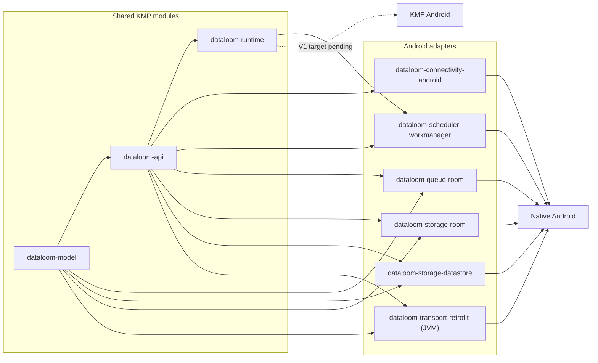

# Android integration

> **Audience:** Android application developers and DataLoom contributors
> **Purpose:** Explain the current Android adapter modules, their boundaries,
> and the work still required for V1
> **Status:** Implemented source-build foundations; not yet published or
> qualified as the complete V1 Android product

[Project overview](../../README.md) ·
[Platform strategy](../architecture/platform-strategy.md) ·
[Local build guide](../development/building.md)

DataLoom currently has five independently consumable Android libraries. They
adapt shared contracts to `ConnectivityManager`, WorkManager, Room, and
Preferences DataStore without placing Android types in common code.

The V1 product target is broader than these adapters. Native Android, KMP
Android, and KMP iOS are all mandatory consumer paths. Optional native Swift
distribution is a separate decision. The six V1 synchronization profiles are
offline-first, remote-first, cache-first, network-only, hybrid, and adaptive;
the current Android modules do not by themselves implement or qualify any
complete profile. See
[ADR-0002](../adr/ADR-0002-v1-artifact-and-foundation-architecture.md).

## Guide map

| Guide | Use it for |
|---|---|
| [Connectivity provider](connectivity-provider.md) | One-shot Android network-state snapshots |
| [WorkManager scheduler](workmanager-scheduler.md) | Mapping schedule intents to unique WorkManager work |
| [Worker integration](worker-integration.md) | Injecting and running one bounded queue-worker cycle |
| [Room queue and circuit persistence](room-queue-provider.md) | Durable queue entries and circuit-breaker state |
| [Room storage provider](room-storage-provider.md) | Generic outbound/inbound change-set and checkpoint persistence |
| [DataStore storage provider](datastore-storage-provider.md) | Small key-value synchronization data (settings, flags, preferences) |
| [Retrofit transport provider (reference)](retrofit-transport-provider.md) | JVM/Android Retrofit-backed `TransportProvider` reference |
| [Security and R8](security-and-r8.md) | Consumer rules, permissions, and data-at-rest limitations |

## Current platform topology



The dependency direction is one-way: shared production modules do not depend
on Android adapters. No current Android adapter depends directly on
`dataloom-core`.

## Modules

| Module | Current responsibility | Does not own |
|---|---|---|
| `dataloom-connectivity-android` | Bounded `ConnectivityProvider` query using `ConnectivityManager` | Polling, endpoint reachability, or strategy selection |
| `dataloom-scheduler-workmanager` | `SchedulerProvider`, `CoroutineWorker`, and explicit `WorkerFactory` bridge | Retry policy, queue persistence, or runtime initialization |
| `dataloom-queue-room` | Transactional Room-backed queue, circuit state, retry administration, and circuit administration | Application domain storage, scheduling, retry policy, or synchronization execution |
| `dataloom-storage-room` | Generic Room-backed `StorageProvider` for opaque outbound/inbound change sets and checkpoints | Domain queries, business merges, encryption policy, or synchronization execution |
| `dataloom-storage-datastore` | Preferences DataStore-backed `StorageProvider` for small key-value synchronization data | Large-scale or relational synchronization data; use `dataloom-queue-room` for those |
| `dataloom-transport-retrofit` | JVM/Android-only reference `TransportProvider` using Retrofit suspend APIs | Kotlin/Native binaries, app-specific endpoint/DTO contracts, or authentication policy ownership |

The modules are optional and do not depend on one another. An application can
use only the adapter it needs.

## Use from this source checkout

Published V1 coordinates do not exist yet. Inside this repository or a
composite source build, depend only on the modules required by the host:

```kotlin
implementation(project(":dataloom-connectivity-android"))
implementation(project(":dataloom-scheduler-workmanager"))
implementation(project(":dataloom-queue-room"))
implementation(project(":dataloom-storage-room"))
implementation(project(":dataloom-storage-datastore"))
implementation(project(":dataloom-transport-retrofit"))
```

Do not present these project dependencies as consumer-ready Maven coordinates.
Publication metadata and external native Android/KMP Android fixtures remain
V1 release gates.

## Include Android projects in Gradle

`settings.gradle.kts` includes the Android projects only when
`DATALOOM_ANDROID_BUILD` is exactly `true`. This keeps the default shared build
from resolving the Android Gradle Plugin and Google Maven artifacts when
Android is not being validated.

`dataloom-transport-retrofit` is JVM-only (Retrofit/OkHttp) and is included
independently of `DATALOOM_ANDROID_BUILD`.

From the repository root:

```bash
DATALOOM_ANDROID_BUILD=true ./gradlew projects --no-configuration-cache

DATALOOM_ANDROID_BUILD=true ./gradlew \
    :dataloom-connectivity-android:build \
    :dataloom-scheduler-workmanager:build \
    :dataloom-queue-room:build \
    :dataloom-storage-room:build \
    :dataloom-storage-datastore:build
```

The current Android modules use JDK 17, compile SDK 35, and minimum SDK 21. See
the
[local build guide](../development/building.md#android-validation) for the
workflow-aligned assemble, unit-test, lint, schema, and managed-device tasks.

## V1 release gates

| Area | Current state | Required before V1 |
|---|---|---|
| Native Android | Connectivity, WorkManager, and Room queue/circuit foundations exist | Published-style consumer and end-to-end qualification |
| KMP Android | Shared code has JVM and Apple targets, but no explicit Android KMP target | Published KMP Android variant and external consumer fixture |
| KMP iOS | Producer compilation baseline exists | Apple adapters, executable consumer, and platform parity |
| Native Swift | XCFramework compile smoke exists | Optional; qualify separately if distributed |
| Six strategy profiles | Contracts and orchestration building blocks exist | Built-in policy behavior and parity suites for every profile |
