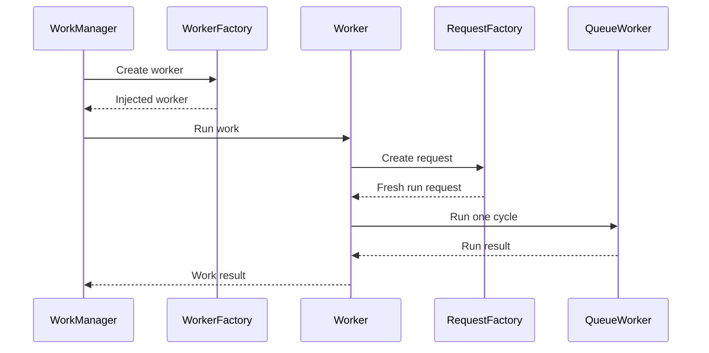

# WorkManager worker integration

> **Audience:** Android developers integrating DataLoom queue processing with
> WorkManager
> **Purpose:** Configure explicit worker injection and one bounded queue-worker
> invocation
> **Status:** Current bridge foundation; application lifecycle and end-to-end
> V1 qualification remain open

[← Android overview](README.md) ·
[WorkManager scheduler](workmanager-scheduler.md) ·
[Room queue provider](room-queue-provider.md)

The `dataloom-scheduler-workmanager` module supplies
`DataLoomCoroutineWorker`, `DataLoomWorkerFactory`, and
`QueueWorkerRunRequestFactory`. No global DataLoom singleton or reflection
lookup is used.

## Worker lifecycle



Every invocation performs one bounded queue-worker cycle. The bridge does not
drain the queue in a loop, initialize providers, select a synchronization
strategy, or introduce a second retry state machine.

## Disable only WorkManager's initializer

A custom `WorkerFactory` requires custom WorkManager configuration. Remove
WorkManager's AndroidX Startup initializer, not the whole
`InitializationProvider`:

```xml
<manifest
    xmlns:android="http://schemas.android.com/apk/res/android"
    xmlns:tools="http://schemas.android.com/tools">

    <application>
        <provider
            android:name="androidx.startup.InitializationProvider"
            android:authorities="${applicationId}.androidx-startup"
            android:exported="false"
            tools:node="merge">
            <meta-data
                android:name="androidx.work.WorkManagerInitializer"
                android:value="androidx.startup"
                tools:node="remove" />
        </provider>
    </application>
</manifest>
```

## Supply the worker factory

Implement `Configuration.Provider` on the application. WorkManager discovers
the configuration through `WorkManager.getInstance(context)`; do not also call
`WorkManager.initialize()` manually.

```kotlin
class MyApplication : Application(), Configuration.Provider {

    private val dataLoom: DataLoom by lazy { buildDataLoom() }

    private val requestFactory = QueueWorkerRunRequestFactory {
        val nowMillis = System.currentTimeMillis()
        QueueWorkerRunRequest(
            processingRequest = QueueProcessingRequest(
                acquireRequest = QueueAcquireRequest(
                    consumerId = QueueConsumerId("my-app"),
                    leaseId = QueueLeaseId(UUID.randomUUID().toString()),
                    acquiredAt = DataLoomInstant(nowMillis),
                    leaseExpiresAt = DataLoomInstant(nowMillis + 60_000L),
                    maxEntries = 10,
                ),
            ),
            recoveryRequest = ExpiredLeaseRecoveryRequest(
                currentTime = DataLoomInstant(nowMillis),
            ),
        )
    }

    override val workManagerConfiguration: Configuration
        get() = Configuration.Builder()
            .setWorkerFactory(
                DataLoomWorkerFactory(
                    queueWorker = requireNotNull(dataLoom.queueWorker) {
                        "Configure queue-worker support before WorkManager starts."
                    },
                    requestFactory = requestFactory,
                ),
            )
            .build()
}
```

`buildDataLoom()` is an application-supplied placeholder. The request factory
runs at worker execution time and must create a fresh lease ID and timestamps
for every call. Set `recoveryRequest` to `null` when the configured
queue-worker disables expired-lease recovery.

If the application already has another custom worker factory, compose the
factories rather than silently replacing the existing one.
`DataLoomWorkerFactory` returns `null` for worker class names it does not own.

## Lifecycle responsibility

The bridge never calls `DataLoom.initialize()` or `shutdown()`. The host must
prove that required providers are initialized before WorkManager can run this
worker and that process recreation restores the same configuration safely.
The snippet demonstrates wiring, not a complete production lifecycle
solution; that lifecycle remains a V1 reference-application and qualification
gate.

## Result mapping

| `QueueWorkerRunResult` | WorkManager result |
|---|---|
| `ProcessingCompleted` | `Result.success()` |
| `RecoveryFailed` | `Result.failure()` |
| `ProcessingFailed` | `Result.failure()` |

The bridge never returns `Result.retry()`. DataLoom's queue and retry
orchestration own rescheduling. When another bounded cycle is needed, the
queue-worker coordinator requests a follow-up schedule through
`SchedulerProvider`.

## Current limits

- WorkManager input data does not carry or reconstruct a complete
  `SynchronizationRequest`.
- One invocation executes one queue-worker cycle only.
- WorkManager acceptance does not mean synchronization has run or succeeded.
- No current integration test proves process-death restoration, background
  constraints, or all six V1 synchronization profiles.

## Related documentation

- [WorkManager scheduler](workmanager-scheduler.md)
- [Queue worker boundaries](../architecture/background-execution-boundaries.md)
- [Room queue provider](room-queue-provider.md)
