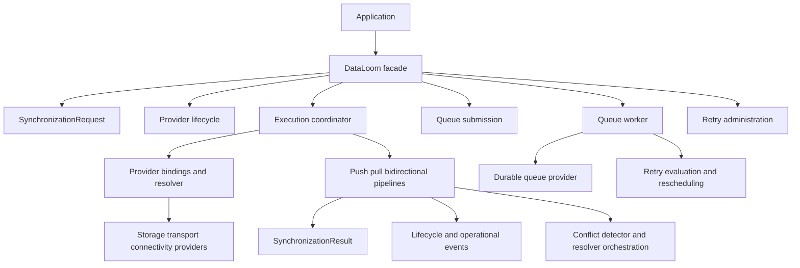

# DataLoom API Reference

This directory is the GitHub-readable reference for DataLoom's public
contracts and the runtime slices that currently consume them.

DataLoom is still in pre-V1 development. A page marked **available** documents
code present in the repository; it is not a claim that the surrounding V1
product capability is complete, published, or production-qualified.

## Status legend

| Status | Meaning |
|---|---|
| Available contract | The public model or SPI exists and has focused tests. |
| Available foundation | Runtime orchestration or a provider implementation exists for the documented boundary, but wider V1 qualification remains. |
| Partial V1 subsystem | Useful contracts and runtime behavior exist, but mandatory policy, persistence, operations, or qualification is missing. |
| V1 target not implemented | The approved capability does not yet have a complete production implementation. |

The authoritative readiness decision is
[DL-AUDIT-005](../audits/DL-AUDIT-005-current-v1-conformance.md).

## Current reference map

This diagram shows current component relationships. It does not show a
complete V1 strategy, asset, plugin, governance, or observability engine.

## Start here

| Goal | Reference |
|---|---|
| Assemble and call the SDK | [DataLoom facade](./dataloom-facade.md) |
| Describe synchronization intent | [Synchronization request](./synchronization-request.md) |
| Understand admission, resolution, and pipeline selection | [Synchronization execution](./synchronization-execution.md) |
| Register and resolve providers | [Provider registry](./provider-registry.md), [provider lifecycle](./provider-lifecycle.md), and [provider bindings](./provider-bindings.md) |
| Submit and process durable work | [Queue submission](./queue-submission.md), [circuit-aware queue submission](./circuit-queue-submission.md), [circuit-aware queue processing](./circuit-queue-processing.md), [circuit-aware queue worker](./circuit-queue-worker.md), [circuit-protected worker scheduling](./circuit-queue-worker-scheduler.md), [queue provider](./queue-provider.md), [Apple durable queue](../apple/queue-state-store.md), [queue-provider timeouts](./queue-provider-timeouts.md), [queue circuit adapter](./queue-circuit-operation-adapter.md), and [queue worker](./queue-worker-coordinator.md) |
| Evaluate and administer retries | [Retry policy](./retry-policy.md), [retry orchestration](./retry-orchestration.md), [retry timeouts](./retry-timeouts.md), [circuit breaker](./circuit-breaker.md), [circuit execution gate](./circuit-execution-gate.md), [retry administration](./retry-administration.md), and [circuit administration](./circuit-administration.md) |
| Detect and resolve conflicts | [Conflict contracts](./conflict-contracts.md) and [conflict orchestration](./conflict-orchestration.md) |
| Observe execution | [Synchronization events](./synchronization-events.md), [event dispatcher](./synchronization-event-dispatcher.md), and [runtime operational events](./runtime-operational-events.md) |

## Core request, data, and result contracts

| Document | Current status | Scope |
|---|---|---|
| [Foundational contracts](./foundational-contracts.md) | Available contract | Common identifiers, workflow state, direction, mode, and priority foundations. |
| [Error model](./error-model.md) | Available contract | Canonical error shape, categories, severity, and recoverability. |
| [Execution context](./execution-context.md) | Available contract | Correlation, identity, version, locale, and metadata context. |
| [Synchronization request](./synchronization-request.md) | Available contract | Direction, mode, priority, and execution intent. Strategy evaluation is currently a separate contract. |
| [Synchronization strategy](./synchronization-strategy.md) | Partial implementation | Versioned six-profile contract, bounded evidence, typed decisions, immutable plans, durable identity, and deterministic planner; complete runtime integration remains. |
| [Payload contracts](./payload-contracts.md) | Available contract | Opaque payload and media-type boundaries. |
| [Change model](./change-model.md) | Available contract | Change events, sets, operations, versions, and entity references. |
| [Acknowledgement contracts](./acknowledgement-contracts.md) | Available contract | Per-event remote acknowledgement results. |
| [Checkpoint contracts](./checkpoint-contracts.md) | Available contract | Checkpoint keys, values, reads, and writes. |
| [Synchronization result](./synchronization-result.md) | Available contract | Succeeded, partial, failed, cancelled, and skipped outcomes. |
| [Synchronization progress](./synchronization-progress.md) | Available contract | Phases, units, snapshots, and summaries. |
| [Clock](./clock.md) | Available contract | Injected wall-clock abstraction. Monotonic duration support remains a V1 gap. |
| [Identifier generation](./identifier-generation.md) | Available contract | Injected identifier-generator contract and deterministic test use. |

## Provider contracts and assembly

| Document | Current status | Scope |
|---|---|---|
| [Provider SPI](./provider-spi.md) | Available contract | Base provider identity, lifecycle operations, health, and operation results. |
| [Provider lifecycle](./provider-lifecycle.md) | Available foundation | Provider-level states plus deterministic aggregate initialize, rollback, and shutdown orchestration. |
| [Provider registry](./provider-registry.md) | Available foundation | Immutable registration and deterministic lookup. |
| [Provider bindings](./provider-bindings.md) | Available foundation | Explicit role-to-provider selection and structural resolution. |
| [Storage provider](./storage-provider.md) | Available contract | Application-owned change storage adapter. |
| [Transport provider](./transport-provider.md) | Available contract | Remote push and pull adapter. |
| [Scheduler provider](./scheduler-provider.md) | Available contract | Platform scheduling adapter. |
| [Connectivity provider](./connectivity-provider.md) | Available contract | Platform connectivity snapshot adapter. |

The current provider SPI is not the mandatory V1 plugin platform. Plugin
manifests, permission enforcement, bounded execution, ordering, isolation,
compatibility validation, audit, hot disable, and certification remain
unimplemented.

## Runtime and pipelines

| Document | Current status | Scope |
|---|---|---|
| [DataLoom facade](./dataloom-facade.md) | Available foundation | Builder, lifecycle, direct execution, and optional queue capabilities. |
| [Synchronization execution](./synchronization-execution.md) | Available foundation | Lifecycle admission, provider resolution, connectivity preflight, pipeline lookup, and execution. |
| [Outbound push pipeline](./outbound-push-pipeline.md) | Available foundation | Batched read, push, acknowledgement, and progress integration. |
| [Inbound pull pipeline](./inbound-pull-pipeline.md) | Available foundation | Pull, apply, checkpoint, and progress integration. |
| [Bidirectional pipeline](./bidirectional-pipeline.md) | Available foundation | Ordered composition of outbound and inbound pipelines. |
| [Connectivity-aware execution](./connectivity-aware-execution.md) | Available foundation | Direct rejection and queued offline-deferral behavior. |

The push, pull, and bidirectional pipelines are execution primitives. They do
not implement the approved six-strategy product architecture by themselves.

## Durable queue

| Document | Current status | Scope |
|---|---|---|
| [Queue models](./queue-model.md) | Available contract | Entries, leases, states, acquisition, transitions, and recovery requests. |
| [Queue provider](./queue-provider.md) | Available foundation | Durable queue persistence SPI and Room implementation boundary. |
| [Apple durable queue](../apple/queue-state-store.md) | Available foundation | Crash-durable file-backed Apple queue with atomic acquisition, guarded transitions, retry budgets, workflow deadlines, and lease recovery. |
| [Queue-provider timeouts](./queue-provider-timeouts.md) | Partial V1 subsystem | Cooperative lifecycle, submission, acquisition, recovery, and transition timeout protection plus builder/runtime assembly. |
| [Queue circuit operation adapter](./queue-circuit-operation-adapter.md) | Partial V1 subsystem | Explicit queue-operation circuit permission, queue-aware timeout classification, and uncollapsed provider/record evidence. |
| [Circuit-aware queue submission](./circuit-queue-submission.md) | Partial V1 subsystem | Preflight-before-permission ordering and enriched enqueue/circuit evidence. |
| [Circuit-aware queue processing](./circuit-queue-processing.md) | Partial V1 subsystem | Explicit acquisition/transition circuits, truthful partial counters, and uncollapsed record evidence. |
| [Circuit-aware queue worker](./circuit-queue-worker.md) | Partial V1 subsystem | Circuit-protected recovery, bounded processing, and scheduler isolation with explicit terminal evidence. |
| [Builder circuit-aware queue worker](./builder-circuit-queue-worker.md) | Partial V1 subsystem | Explicit facade assembly, durable state-store injection, scope validation, and mutually exclusive worker selection. |
| [Circuit-protected worker scheduling](./circuit-queue-worker-scheduler.md) | Partial V1 subsystem | Separate scheduler timeout/circuit policy with exact accepted-schedule and recording evidence. |
| [Queue submission](./queue-submission.md) | Available foundation | Application-owned work encoding and durable enqueue with optional timeout and additive circuit-aware execution. |
| [Durable queue processor](./durable-queue-processor.md) | Available foundation | Bounded acquire, execute, and single-transition processing. |
| [Queued synchronization execution](./queued-synchronization-execution.md) | Available foundation | Queue-entry resolution, synchronization execution, and retry evaluation. |
| [Provider-protected queued execution](./provider-protected-queued-execution.md) | Partial V1 subsystem | Exact explicit bindings, queue outcomes, and ordered provider/circuit evidence for one acquired entry. |
| [Queue worker coordinator](./queue-worker-coordinator.md) | Available foundation | Recovery, bounded processing, scheduler-backed wake-up planning, and optional scheduler timeout. |

Queue processing is an at-least-once foundation. Connectivity deferral and
expired-lease recovery preserve retry attempt history; Android Room and the
Apple file provider persist queue entries, retry budgets, and workflow deadlines,
while Android Room and the Apple circuit store persist circuit state. Queue-provider timeouts preserve durable
ambiguity and never replay a mutation automatically. Explicit queue circuit
operation adaptation, submission, bounded acquisition/transitions, and
circuit-aware recovery/worker coordination, explicit builder/facade adoption,
and separately configured scheduler-circuit policy now exist. KMP iOS
queue and circuit persistence now exist; executable relaunch, background
adapters, executable relaunch evidence, and end-to-end qualification remain open.

## Retry and conflict

| Document | Current status | Scope |
|---|---|---|
| [Retry policy](./retry-policy.md) | Partial V1 subsystem | Fail-closed classification, deterministic backoff/jitter, seeded randomness, attempt/time/delay limits, and bounded provider/server hints. |
| [Retry orchestration](./retry-orchestration.md) | Partial V1 subsystem | Protected-failure handling, bounded hint minimums, final-delay aggregation, budgets, and optional scheduler-provider timeout. |
| [Retry timeout boundaries](./retry-timeouts.md) | Partial V1 subsystem | Independent timeout contracts, workflow-deadline precedence, coroutine executor, and selected provider/runtime assembly. |
| [Durable workflow timeout evidence](./durable-workflow-timeouts.md) | Partial V1 subsystem | Immutable absolute workflow deadlines preserved through queue persistence, retry, deferral, recovery, and restart. |
| [Storage and transport provider timeouts](./storage-transport-provider-timeouts.md) | Partial V1 subsystem | Cooperative lifecycle and synchronization-operation timeout protection with fail-closed mutation ambiguity. |
| [Circuit breaker](./circuit-breaker.md) | Partial V1 subsystem | Explicit scopes, durable state contracts, atomic compare-and-set persistence, deterministic transitions, and one controlled half-open probe. |
| [Circuit execution gate](./circuit-execution-gate.md) | Partial V1 subsystem | Pre-execution permission, once-only invocation, classified provider failures, post-execution evidence, retry scheduling, and queue-operation adaptation. |
| [Storage and transport circuit adapters](./storage-transport-circuit-adapters.md) | Partial V1 subsystem | Exact provider-operation scopes, timeout-aware circuit classification, and uncollapsed execution/recording evidence. |
| [Provider circuit protection runtime](./provider-circuit-protection-runtime.md) | Partial V1 subsystem | Immutable scope-bound storage/transport assembly with timeout-before-circuit composition. |
| [Provider-protected pipeline execution](./provider-protected-pipeline.md) | Partial V1 subsystem | Existing pipelines use execution-local timeout/circuit bridges with ordered bounded provider evidence. |
| [DataLoomBuilder provider protection](./builder-provider-protection.md) | Partial V1 subsystem | Explicit facade assembly for protected direct synchronization with durable stores and exact operation scopes. |
| [Provider-protected strategy execution](./provider-protected-strategy-execution.md) | Partial V1 subsystem | Plan-aware network-only and remote-first timeout/circuit protection with independent local-fallback policy and bounded ordered evidence. |
| [Queue circuit operation adapter](./queue-circuit-operation-adapter.md) | Partial V1 subsystem | Exact queue operation scopes and provider/circuit result preservation without transparent mutation replay risk. |
| [Retry administration](./retry-administration.md) | Partial V1 subsystem | Stable facade assembly, authorized/idempotent commands, durable audit state, and atomic Android/Apple administrative requeue execution. |
| [Circuit administration](./circuit-administration.md) | Partial V1 subsystem | Authorized/idempotent open, close, and reset coordination with production Android Room and Apple file persistence/atomic execution; operations assembly remains. |
| [Conflict contracts](./conflict-contracts.md) | Partial V1 subsystem | Custom detector, resolver, request, conflict, and decision contracts. |
| [Conflict orchestration](./conflict-orchestration.md) | Partial V1 subsystem | Exact detector/resolver lookup and one-cycle decision orchestration. |

V1 retry work still requires complete offline-first, cache-first, hybrid, and adaptive strategy execution,
remaining protocol integrations, circuit-administration assembly, complete
observability, executable restart evidence, and platform qualification.
Conflict work still requires built-in policies, precedence, atomic decision
application, unresolved-conflict persistence, audit, convergence, loop
protection, quarantine, and metrics.

## Events and observation

| Document | Current status | Scope |
|---|---|---|
| [Synchronization events](./synchronization-events.md) | Available contract; partial V1 subsystem | Lifecycle, progress, retry, conflict, and completion event variants. |
| [Synchronization event dispatcher](./synchronization-event-dispatcher.md) | Available foundation | In-process sequential observer dispatch and ordinary-failure isolation. |
| [Runtime lifecycle events](./runtime-lifecycle-events.md) | Available foundation | Started, phase, and completed runtime integration. |
| [Runtime operational events](./runtime-operational-events.md) | Available foundation | Selected progress, scheduler-backed retry, and conflict event integration. |

The current event path is synchronous and in-process. V1 still requires a
canonical versioned envelope, durable delivery/outbox, replay, filtering,
bounded back-pressure, consumer isolation, schema evolution, event
persistence, metrics, structured logging, distributed tracing, exporters,
health aggregation, and an operational read model/reference dashboard.

## Mandatory V1 target and open gaps

The following are product commitments, not descriptions of completed APIs:

| Mandatory V1 capability | Current repository status |
|---|---|
| Offline-first strategy | Complete built-in strategy and qualification not implemented |
| Remote-first strategy | Direct provider-backed runtime and typed pull fallback implemented; durable replay, retry/circuit, conflict persistence, strategy events, and full qualification remain |
| Cache-first strategy | Complete built-in strategy and qualification not implemented |
| Network-only strategy | Direct transport-only runtime implemented; full event/result and platform qualification remain |
| Hybrid strategy | Complete built-in strategy and qualification not implemented |
| Adaptive strategy | Complete built-in strategy and qualification not implemented |
| Standard retry and durable circuit breaker | Fail-closed protection, standard backoff/jitter, durable budgets, bounded hints, timeout contracts, selected runtime assembly, circuit state, authorized cross-platform manual retry, and Android/Apple circuit administration are implemented; operations assembly, complete observability, and qualification remain |
| Built-in conflict policies and persistence | Partial custom contracts/orchestration only |
| Lifecycle and operational observability | Partial in-process event foundation only |
| Asset upload/download, chunking, streaming, and resume | Not implemented |
| Permission-bounded plugin platform beyond provider SPI | Not implemented |
| Enterprise administration and governance | Not implemented |

The six synchronization strategies must be represented by a versioned,
validated strategy and effective-plan contract. `SynchronizationDirection`
and `SynchronizationMode` are not substitutes for that architecture.

## Platform and publication boundary

Native Android, KMP Android, and KMP iOS are mandatory V1 consumer paths.
Current common modules target JVM and host-gated Kotlin/Native iOS variants,
while the explicit KMP Android consumer path, complete iOS adapters, published
artifacts, and end-to-end platform qualification remain open. Optional native
Swift packaging is a separate distribution path.

No page in this directory should be interpreted as Maven publication,
compatibility, signing, supply-chain, or production-release evidence.
