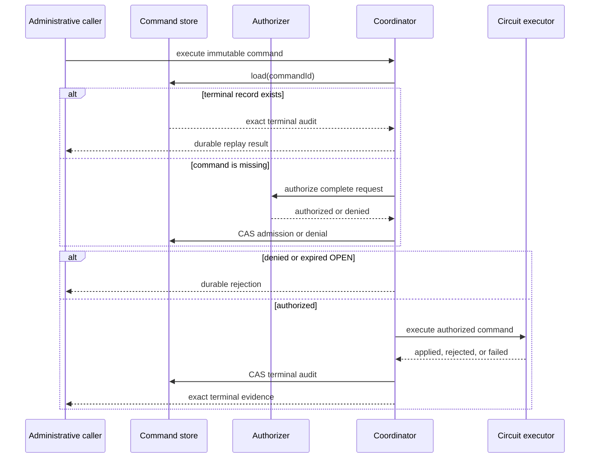

# Circuit administration

[API reference index](./README.md)

> **Status:** Available common contract and coordination foundation. Production
> Android/Apple command persistence and atomic circuit-state executors remain
> required before this becomes an operational V1 capability.

Circuit administration is an explicit privileged path for manually opening,
closing, or resetting one exact `CircuitBreakerScope`. It does not bypass,
silently alter, or reuse the automatic failure-recording path.

## Public contracts

- `CircuitAdministrationRequest` is the immutable command envelope.
- `CircuitAdministrationCommandId` is its durable idempotency key.
- `CircuitAdministrationAuthorizer` applies the host identity and role policy
  to the complete command.
- `CircuitAdministrationStateStore` persists versioned authorization, command,
  result, and redacted failure evidence with compare-and-set semantics.
- `CircuitAdministrationExecutor` owns the idempotent platform circuit mutation
  and durable command receipt.
- `CircuitAdministrationCoordinator` orders replay, authorization, durable
  admission, deadline policy, execution, and terminal audit recording.

## Actions

| Action | Required input | Resulting intent |
|---|---|---|
| `OPEN` | `openUntil` strictly later than `requestedAt` | Open the exact scope only until the bounded deadline. |
| `CLOSE` | No `openUntil` | Close the exact scope and preserve its monotonic probe generation. |
| `RESET` | No `openUntil` | Reset the exact scope to a fresh closed state through an explicitly authorized operation. |

An `OPEN` command whose deadline has elapsed before execution is durably policy
rejected. `CLOSE` and `RESET` cannot carry a hidden open deadline.

## Coordination order

Every command-state mutation has a positive bounded compare-and-set attempt
limit. Immutable reuse of a command ID with different scope, principal, action,
reason, time, or deadline returns a command conflict.

## Executor requirements

The executor must validate the exact immutable request and authorization before
mutation. It must be idempotent by command identifier. Where the platform
persistence boundary permits, the resulting circuit state and command receipt
must be committed atomically.

If the executor succeeds but the coordinator cannot confirm its terminal audit
write, the caller receives `ExecutionRecordingUnconfirmed`. Redelivery uses the
same command ID; the executor must replay its durable receipt without another
state mutation.

The applied result includes the exact resulting `CircuitBreakerStateRecord`,
including its durable version. The coordinator rejects an executor contract
violation that returns a different scope.

## Security and data minimization

Durable command state contains only bounded identities, exact scope, action,
timestamps, bounded reason/reason codes, authorization identity, resulting
circuit state and version, and canonical error code/category/severity/recoverability. It
does not contain payloads, credentials, headers, exception messages, stack
traces, provider instances, or arbitrary metadata.

Authorization denial is durable and replayable. Cancellation and unexpected
exceptions propagate unchanged. Clock regression after durable authorization
fails closed before executor redelivery.

## Current boundary

This slice provides common contracts, validation, deterministic coordination,
tests, and external JVM/Apple consumer compilation. Remaining work includes:

- production Android and Apple command-state stores;
- platform executors that atomically commit circuit mutation plus command
  receipt;
- facade/operations assembly;
- circuit-administration events, metrics, logs, tracing, health, and dashboard
  integration; and
- restart, multi-process, contention, fault-injection, and full AC-FUNC-004
  qualification.
