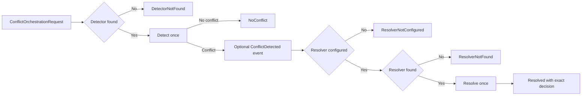

# Conflict Orchestration (DL-025)

[API reference index](./README.md)

> **Status:** Partial V1 subsystem. Exact custom detector/resolver orchestration
> exists, plus a bounded first slice of durable unresolved-conflict persistence,
> now with a real caller
> ([Durable conflict detection coordinator](#durable-conflict-detection-coordinator));
> the complete built-in and durable conflict engine does not.

**Package:** `io.dataloom.runtime.conflict`  
**Module:** `dataloom-runtime`

---

## Overview

DL-025 provides deterministic conflict detection and resolution orchestration
for DataLoom. It coordinates application-supplied detectors and resolvers
through immutable registries and an explicit ID-based binding model.



The orchestrator does **not**:

- Apply resolution decisions to application storage.
- Mutate local or remote payloads.
- Execute inbound or outbound synchronization pipelines.
- Read or write checkpoints.
- Acknowledge outbound changes.
- Evaluate or schedule retry policy.
- Process queue entries.
- Persist, replay, or independently route synchronization events.
- Initialize or shut down providers.
- Discover or create detector or resolver implementations.

An optional runtime event emitter reports actual conflict detection before
resolver lookup. The current orchestrator still does not apply the resulting
decision or provide the mandatory V1 built-in policy, persistence, audit,
precedence, convergence, loop-protection, or quarantine engine.

---

## Components

### ConflictDetectorRegistry

Immutable registry of
[`ConflictDetector`](./conflict-contracts.md#conflict-detector) instances,
keyed by [`ConflictDetectorId`](./conflict-contracts.md#conflict-identifiers).

**Package:** `io.dataloom.runtime.conflict`

```kotlin
class ConflictDetectorRegistry(
    detectors: Collection<ConflictDetector>,
)
```

#### Behaviour

- Accepts application-supplied `ConflictDetector` instances.
- Defensively copies the provided collection at construction time. Mutations
  to the original collection after construction have no effect.
- Preserves registration order.
- Rejects duplicate `ConflictDetectorId` values with
  `IllegalArgumentException`.
- Supports exact lookup by `ConflictDetectorId`.
- Returns `null` when a requested ID is absent.
- Performs no detection or resolution during construction.
- Uses no global registry, reflection, or ServiceLoader.
- KMP-compatible (commonMain).

#### Selection key

The explicit `ConflictDetectorId` returned by `ConflictDetector.id` is the
selection key. Detectors are never selected by class name, collection hash
order, `toString()`, `ConflictType`, entity type, or platform service
discovery.

#### API

| Member | Description |
|---|---|
| `lookup(id: ConflictDetectorId): ConflictDetector?` | Returns the registered detector, or `null`. |
| `detectors: List<ConflictDetector>` | Read-only snapshot of all detectors in registration order. |

---

### ConflictResolverRegistry

Immutable registry of
[`ConflictResolver`](./conflict-contracts.md#conflict-resolver) instances,
keyed by [`ConflictResolverId`](./conflict-contracts.md#conflict-identifiers).

**Package:** `io.dataloom.runtime.conflict`

```kotlin
class ConflictResolverRegistry(
    resolvers: Collection<ConflictResolver>,
)
```

#### Behaviour

- Accepts application-supplied `ConflictResolver` instances.
- Defensively copies the provided collection at construction time.
- Preserves registration order.
- Rejects duplicate `ConflictResolverId` values with `IllegalArgumentException`.
- Supports exact lookup by `ConflictResolverId`.
- Returns `null` when a requested ID is absent.
- Performs no detection or resolution during construction.
- Uses no global registry, reflection, or ServiceLoader.
- KMP-compatible (commonMain).

#### Selection key

The explicit `ConflictResolverId` returned by `ConflictResolver.id` is the
selection key. Resolvers are **never** automatically selected by conflict type,
class name, registration order, or ID sorting. Resolution policy is
application-controlled through explicit `ConflictOrchestrationBindings`.

#### API

| Member | Description |
|---|---|
| `lookup(id: ConflictResolverId): ConflictResolver?` | Returns the registered resolver, or `null`. |
| `resolvers: List<ConflictResolver>` | Read-only snapshot of all resolvers in registration order. |

---

### ConflictOrchestrationBindings

Immutable binding model that pairs a required
[`ConflictDetectorId`](./conflict-contracts.md#conflict-identifiers) with an
optional [`ConflictResolverId`](./conflict-contracts.md#conflict-identifiers).

**Package:** `io.dataloom.runtime.conflict`

```kotlin
data class ConflictOrchestrationBindings(
    val detectorId: ConflictDetectorId,
    val resolverId: ConflictResolverId?,
)
```

#### Behaviour

- `detectorId` is required. The orchestrator performs exactly one detector
  lookup using this value.
- `resolverId` is optional. When `null`:
  - Detection is still performed.
  - A detected conflict is represented as
    `ConflictOrchestrationResult.ResolverNotConfigured`.
  - DataLoom does **not** silently choose a resolver as a fallback.
- Construction performs no registry lookup, no detection, and no resolution.
- Value-based equality.
- KMP-compatible (commonMain).

---

### ConflictOrchestrationRequest

Immutable request supplied to
[`SynchronizationConflictOrchestrator`](#synchronizationconflictorchestrator)
for a single detection and optional resolution cycle.

**Package:** `io.dataloom.runtime.conflict`

```kotlin
data class ConflictOrchestrationRequest(
    val detectionRequest: ConflictDetectionRequest,
    val bindings: ConflictOrchestrationBindings,
)
```

#### Behaviour

- Preserves the exact `ConflictDetectionRequest` and
  `ConflictOrchestrationBindings` supplied at construction.
- Performs no registry lookup, no detector or resolver invocation, and does
  not inspect or mutate payload content.
- Callers are responsible for supplying a complete `ConflictDetectionRequest`
  per the DL-014 contract. The orchestrator does not read local application
  storage or generate payload content.
- Value-based equality.
- KMP-compatible (commonMain).

#### Diagnostic safety

`toString()` exposes only the detector ID, resolver ID, and entity reference.
It does **not** expose local or remote payload content, credentials,
authorization values, encryption keys, personal data, checkpoint tokens, or
stack traces.

---

### ConflictOrchestrationStatus

Canonical status values for orchestration outcomes.

**Package:** `io.dataloom.runtime.conflict`

```kotlin
enum class ConflictOrchestrationStatus {
    DETECTOR_NOT_FOUND,
    NO_CONFLICT,
    RESOLVER_NOT_CONFIGURED,
    RESOLVER_NOT_FOUND,
    RESOLVED,
}
```

| Status | Meaning |
|---|---|
| `DETECTOR_NOT_FOUND` | The configured detector ID was absent from the registry. No detector ran. |
| `NO_CONFLICT` | The detector completed and reported no conflict. No resolver ran. |
| `RESOLVER_NOT_CONFIGURED` | A conflict was detected but `resolverId` is `null`. No resolver ran. |
| `RESOLVER_NOT_FOUND` | A conflict was detected and a resolver ID was supplied, but no matching resolver exists. No resolver ran. |
| `RESOLVED` | A conflict was detected, the resolver was found, and the resolver returned a decision. |

Do not persist or serialize enum ordinals. Use variant names for any durable
representation.

---

### ConflictOrchestrationResult

Sealed result produced by
[`SynchronizationConflictOrchestrator.detectAndResolve`](#synchronizationconflictorchestrator).

**Package:** `io.dataloom.runtime.conflict`

```kotlin
sealed interface ConflictOrchestrationResult {
    data class DetectorNotFound(val detectorId: ConflictDetectorId) : ConflictOrchestrationResult
    data class NoConflict(val detectorId: ConflictDetectorId) : ConflictOrchestrationResult
    class ResolverNotConfigured(val conflict: SynchronizationConflict, val detectorId: ConflictDetectorId) : ConflictOrchestrationResult
    class ResolverNotFound(val conflict: SynchronizationConflict, val resolverId: ConflictResolverId) : ConflictOrchestrationResult
    class Resolved(val conflict: SynchronizationConflict, val decision: ConflictResolutionDecision, val detectorId: ConflictDetectorId, val resolverId: ConflictResolverId) : ConflictOrchestrationResult
}
```

#### Variants

**`DetectorNotFound`**
- The configured `ConflictDetectorId` was not found in the registry.
- Preserves the requested `detectorId`.
- No detector, resolver lookup, or resolver invocation occurred.

**`NoConflict`**
- The detector completed and reported no conflict.
- Preserves the `detectorId` of the detector that ran.
- No resolver lookup or invocation occurred.

**`ResolverNotConfigured`**
- A conflict was detected but `ConflictOrchestrationBindings.resolverId` is `null`.
- Preserves the exact `SynchronizationConflict` and the `detectorId`.
- No resolver lookup or invocation occurred.

**`ResolverNotFound`**
- A conflict was detected and a `resolverId` was supplied but no matching
  resolver exists.
- Preserves the exact `SynchronizationConflict` and the requested `resolverId`.
- No resolver was invoked.

**`Resolved`**
- A conflict was detected, the resolver was found, and the resolver returned
  a decision.
- Preserves the exact `SynchronizationConflict`, `ConflictResolutionDecision`,
  `detectorId`, and `resolverId`.
- The decision is **not** applied to storage, queues, or any pipeline.

#### Security

`toString()` on variants that carry `SynchronizationConflict` or
`ConflictResolutionDecision` exposes only structural IDs (conflict ID, conflict
type, detector ID, resolver ID) and the variant name. It does not expose
payload content, credentials, stack traces, or implementation `toString()`
output.

---

### SynchronizationConflictOrchestrator

Platform-independent orchestrator that coordinates conflict detection and
optional resolution for a single cycle.

**Package:** `io.dataloom.runtime.conflict`

```kotlin
class SynchronizationConflictOrchestrator(
    private val detectorRegistry: ConflictDetectorRegistry,
    private val resolverRegistry: ConflictResolverRegistry,
    private val eventEmitter: SynchronizationRuntimeEventEmitter? = null,
) {
    suspend fun detectAndResolve(request: ConflictOrchestrationRequest): ConflictOrchestrationResult
}
```

#### Required flow

```
detectAndResolve(request)
    → look up detector by detectorId
    → if absent: return DetectorNotFound
    → invoke detector.detect(detectionRequest) exactly once
    → if NoConflict: return NoConflict
    → if ConflictDetected:
        → optionally emit ConflictDetected
        → if resolverId is null: return ResolverNotConfigured
        → look up resolver by resolverId
        → if absent: return ResolverNotFound
        → build ConflictResolutionRequest
        → invoke resolver.resolve(request) exactly once
        → return Resolved with exact decision
```

#### Deterministic guarantees

- Detector lookup occurs before detector execution.
- Resolver lookup occurs only after conflict detection.
- The resolver is never called when no conflict exists.
- The resolver is never called when `resolverId` is `null`.
- The resolver is never called when its ID is absent.
- Each selected component is invoked at most once per call.
- No fallback detector or resolver is selected.
- No sorting of detectors or resolvers occurs.

#### Exception and cancellation boundary

Unexpected exceptions from `ConflictDetector` or `ConflictResolver` propagate
normally. They are never converted into a `ConflictOrchestrationResult` variant.

Detector and resolver contracts are synchronous, but `detectAndResolve` is
suspending because optional event delivery is suspending. A
`CancellationException` from event delivery propagates normally; resolver
lookup and invocation do not continue.

#### Boundaries

The orchestrator must not call:

- `StorageProvider`
- `TransportProvider`
- `SchedulerProvider`
- `ConnectivityProvider`
- `QueueProvider`
- `RetryPolicy`
- `SynchronizationPipeline`
- `SynchronizationExecutionCoordinator`
- Any lifecycle coordinator
- Any event dispatcher or observer directly; optional event delivery is
  delegated through `SynchronizationRuntimeEventEmitter`

---

## No automatic resolution

DataLoom coordinates conflict orchestration, but does not apply resolution
decisions automatically. The caller currently consumes the
`ConflictResolutionDecision`. V1 requires an atomic runtime application and
durable unresolved-conflict path rather than leaving the product engine at
this boundary.

---

## Durable unresolved-conflict log

**Package:** `io.dataloom.api.conflict` · **Module:** `dataloom-api` · see also
[durable state contracts](./durable-state-contracts.md)

```kotlin
public class DurableUnresolvedConflictLog(
    store: DurableStateStore<ConflictId, UnresolvedConflictRecord>,
    schemaVersion: Int = 1,
    maximumStateUpdateAttempts: Int = 8,
) {
    public suspend fun current(conflictId: ConflictId): ProviderOperationResult<UnresolvedConflictRecord?>
    public suspend fun record(
        conflictId: ConflictId,
        record: UnresolvedConflictRecord,
    ): DurableUnresolvedConflictRecordOutcome
}
```

A bounded first slice of the "durable unresolved-conflict path" this page's
own "No automatic resolution" section names as still missing. `record` is
insert-if-absent, commit-once — a conflict's unresolved facts (type, entity,
which changes disagreed, why no resolver ran) do not legitimately change
over time, so a later `record` call for the same `ConflictId` is judged only
by whether it agrees with what's already there:
`DurableUnresolvedConflictRecordOutcome.AlreadyRecorded` (idempotent retry)
vs. `.Conflict` (the same conflict identifier reused for different
underlying facts — a genuine caller bug, not ordinary contention).

**Deliberately in scope: only the two unresolved outcomes.**
[`ConflictOrchestrationResult.ResolverNotConfigured`](#conflictorchestrationresult)
and [`.ResolverNotFound`](#conflictorchestrationresult) — a conflict the
orchestrator detected but could not automatically resolve, which today is
simply lost once the caller's in-memory result goes out of scope. A fully
*resolved* `ConflictResolutionDecision`'s durability — including
`ConflictResolutionDecision.Merge`'s application-supplied `ChangeEvent`
payload — is a separate, larger design question this slice does not
attempt: this codebase's durable/audit codecs consistently exclude payload
content (see `UnresolvedConflictChangeSummary`'s own documentation), and
losslessly persisting a merge payload would be the first exception to that
convention rather than a mechanical extension of it.

**Payload-free by construction, not just by codec discipline.**
`UnresolvedConflictRecord` structurally excludes
[`ChangeEvent.payload`][] — it carries `UnresolvedConflictChangeSummary`
(change event ID, operation, metadata) per side, not the original
`ChangeEvent`. A caller that needs the actual changed content for manual
resolution retrieves it separately (for example from a durable event
outbox) by change event ID.

`DurableUnresolvedConflictLog` itself does not call
`SynchronizationConflictOrchestrator`, is not called by it, and does not
change the orchestrator's own documented boundary ("does not apply
resolution decisions to storage" — see [Boundaries](#boundaries)). See
[Durable conflict detection coordinator](#durable-conflict-detection-coordinator)
below for the real caller that wires the two together from the outside.

[`ChangeEvent.payload`]: ./conflict-contracts.md

---

## Durable conflict detection coordinator

**Package:** `io.dataloom.runtime.conflict` · **Module:** `dataloom-runtime`

```kotlin
public class DurableConflictDetectionCoordinator(
    orchestrator: SynchronizationConflictOrchestrator,
    unresolvedConflictLog: DurableUnresolvedConflictLog,
    clock: DataLoomClock,
) {
    public suspend fun detectAndResolve(
        request: ConflictOrchestrationRequest,
    ): DurableConflictDetectionResult
}

public data class DurableConflictDetectionResult(
    public val orchestration: ConflictOrchestrationResult,
    public val unresolvedRecordOutcome: DurableUnresolvedConflictRecordOutcome?,
)
```

The first real caller of `DurableUnresolvedConflictLog.record` — until this
shipped, the log was an available primitive with no adopter, the same
situation `DurableConfigurationHistory` and `DurablePolicyDecisionLog` are
still in (see [durable state contracts](./durable-state-contracts.md)).

- Calls `SynchronizationConflictOrchestrator.detectAndResolve(request)`
  first, unchanged.
- When the result is `ConflictOrchestrationResult.ResolverNotConfigured` or
  `.ResolverNotFound`, builds an `UnresolvedConflictRecord` from the
  conflict and calls `unresolvedConflictLog.record`. Every other outcome
  (`DetectorNotFound`, `NoConflict`, `Resolved`) is returned with a `null`
  `unresolvedRecordOutcome` — no record attempt is made.
- **A durable-recording failure never hides the real orchestration
  result.** `DurableConflictDetectionResult.orchestration` is always the
  exact value `SynchronizationConflictOrchestrator` returned; a
  `PersistenceFailure` or `ContentionLimitReached` on the durable side is
  surfaced separately via `unresolvedRecordOutcome`, mirroring the
  orchestrator's own posture for its optional event emitter ("ordinary
  observer failures do not stop resolver selection or resolution").
- Does not reach inside the orchestrator or change its documented boundary
  — it composes `detectAndResolve` from the outside, the same way any
  caller would combine a side-effect-free component with a durable store.

Not yet wired into any `SynchronizationPipeline` — `BidirectionalSynchronizationPipeline`
never called `SynchronizationConflictOrchestrator` at all before this
coordinator existed (its `SynchronizationSummary.conflictsDetected` counter
is populated by summing child-pipeline summaries, not by running conflict
detection). This coordinator is the missing integration layer, callable
directly by an application or a future pipeline; becoming the standard way
a synchronization pipeline detects and durably records conflicts is
separate, unstarted follow-up work.

---

## Performance notes

- Registry lookup is constant-time (hash-map backed).
- At most one detector and one resolver are invoked per `detectAndResolve` call.
- No payload-sized buffers are allocated.
- No serialization or deserialization is performed.
- No reflection or service discovery is used.

---

## Security notes

- No variant exposes raw `Throwable` or stack traces.
- No diagnostic output exposes payload bytes, credentials, authorization
  headers, checkpoint tokens, encryption keys, or personal data.
- Safe diagnostics include only structural IDs (conflict ID, conflict type,
  detector ID, resolver ID) and result variant names.
- Local and remote payloads (`DataLoomPayload`) remain **opaque** to the
  orchestrator. The orchestrator does not inspect, copy, deserialize, or log
  payload content at any step.

---

## KMP compatibility

All types in `io.dataloom.runtime.conflict` use Kotlin standard-library and
DataLoom API types only. They are safe for use in Kotlin Multiplatform common
code (`commonMain`).

No Android APIs, JVM-only APIs, reflection, ServiceLoader, or DI framework
dependency is introduced.

---

## Usage example

```kotlin
// Register detectors and resolvers
val detectorRegistry = ConflictDetectorRegistry(listOf(myVersionDetector))
val resolverRegistry = ConflictResolverRegistry(listOf(myServerWinsResolver))

val orchestrator = SynchronizationConflictOrchestrator(
    detectorRegistry = detectorRegistry,
    resolverRegistry = resolverRegistry,
)

// Build a request
val request = ConflictOrchestrationRequest(
    detectionRequest = ConflictDetectionRequest(
        synchronizationRequest = syncRequest,
        localChange = localEvent,
        remoteChange = remoteEvent,
    ),
    bindings = ConflictOrchestrationBindings(
        detectorId = ConflictDetectorId("entity-version-detector"),
        resolverId = ConflictResolverId("server-preferred-resolver"),
    ),
)

// Run orchestration
when (val result = orchestrator.detectAndResolve(request)) {
    is ConflictOrchestrationResult.DetectorNotFound ->
        // Handle missing detector configuration
    is ConflictOrchestrationResult.NoConflict ->
        // Continue normal synchronization
    is ConflictOrchestrationResult.ResolverNotConfigured ->
        // Conflict detected but no resolver configured; surface to application
    is ConflictOrchestrationResult.ResolverNotFound ->
        // Handle missing resolver configuration
    is ConflictOrchestrationResult.Resolved ->
        // Apply result.decision — DataLoom does not apply it automatically
}
```

---

## Related documentation

- [Conflict Contracts (DL-014)](./conflict-contracts.md)
- [Conflict Detection and Resolution Flow](../architecture/conflict-detection-resolution-flow.md)
- [Conflict Boundaries (DL-014)](../architecture/conflict-boundaries.md)
