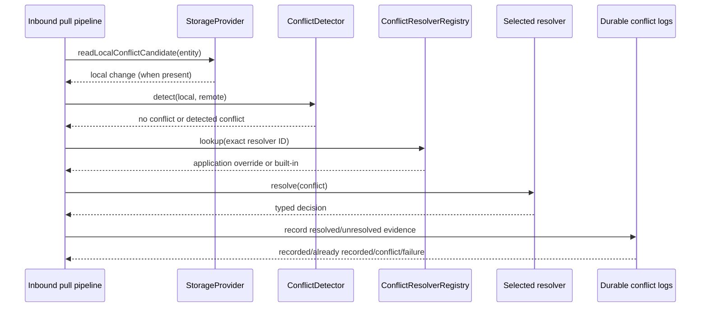

# Conflict resolution strategies

## Status

**Implemented foundation; full V1 conflict engine remains open.** DataLoom now
ships a deterministic built-in policy catalog reachable through the existing
`ConflictResolverRegistry` and `ConflictOrchestrationBindings`, plus durable
recording of resolved and unresolved decisions. This is a meaningful expansion
of DL-041, but it is not the completion claim for issue
[#95](https://github.com/dataloom-sdk/dataloom/issues/95).

Still required for the full gate are decision application and convergence,
standard detector utilities, entity/workflow/tenant/global precedence,
loop/non-convergence quarantine, authorized manual-resolution operations,
complete audit/metrics/retry integration, AC-FUNC-002, and mandatory-platform
qualification.

## Built-in policy catalog

Every policy is selected by one exact `ConflictResolverId`. No conflict type,
registration order, class name, exception, or platform name selects a policy
implicitly.

| Resolver ID | Deterministic decision | Intended use |
|---|---|---|
| `dataloom.builtin.client-wins` | `UseLocal` | The local/client change is explicitly authoritative. |
| `dataloom.builtin.server-wins` | `UseRemote` | The remote/server change is explicitly authoritative. |
| `dataloom.builtin.last-write-wins` | `UseRemote` placeholder | Preserves the previously shipped deterministic remote-wins tiebreak; it is not evidence-based recency. |
| `dataloom.builtin.timestamp` | Newest explicit timestamp wins; equal timestamps choose remote | The application can supply trustworthy epoch-millisecond evidence. Missing or malformed evidence defers. |
| `dataloom.builtin.reject` | `Fail` with `DL-CONFLICT-REJECTED-BY-POLICY` | Conflicting work must stop under the selected policy. |
| `dataloom.builtin.manual` | `Defer` | The conflict must remain durable for a later authorized/manual workflow. |

The registry first checks application-supplied resolvers and then the built-in
catalog. Therefore, an application can intentionally register a custom resolver
under a built-in ID and replace the reference implementation without a second
selection system. The public `resolvers` property continues to expose only the
application-supplied snapshot, preserving its historical size and ordering.

```kotlin
val registry = ConflictResolverRegistry(
    resolvers = listOf(myDomainSpecificResolver),
)

val bindings = ConflictOrchestrationBindings(
    detectorId = myDetector.id,
    resolverId = ConflictResolverId("dataloom.builtin.server-wins"),
)
```

## Timestamp-evidence policy

The timestamp policy reads these exact metadata keys:

```text
dataloom.conflict.local.updated-at-epoch-millis
dataloom.conflict.remote.updated-at-epoch-millis
```

Evidence is read from `ConflictResolutionRequest.metadata` first and
`SynchronizationConflict.metadata` second. A key present in request metadata is
a higher-precedence value even when malformed; malformed higher-precedence
evidence fails closed to `Defer` rather than falling back to a contradictory
lower-precedence value.

Both values must parse as Kotlin `Long` epoch milliseconds:

- local greater than remote → `UseLocal`;
- remote greater than local → `UseRemote`;
- equal values → `UseRemote`, the documented deterministic convergence
  tiebreak;
- either value missing or malformed → `Defer`.

The policy never interprets opaque `EntityVersion`, reads a clock, calls a
provider, or guesses recency from event IDs.

```kotlin
val metadata = DataLoomMetadata.of(
    mapOf(
        "dataloom.conflict.local.updated-at-epoch-millis" to localUpdatedAt.toString(),
        "dataloom.conflict.remote.updated-at-epoch-millis" to remoteUpdatedAt.toString(),
    ),
)
```

Applications are responsible for supplying trustworthy, consistently sourced
evidence. A timestamp policy cannot make untrusted client time authoritative by
itself.

## Last-write-wins naming caveat

`LastWriteWinsConflictResolver` remains available under
`dataloom.builtin.last-write-wins`, but it does not perform true wall-clock
ordering. `ChangeEvent` carries no reliable write timestamp and `EntityVersion`
is deliberately opaque, so this resolver always returns `UseRemote` as a
stable placeholder. It remains for compatibility and explicit use; applications
that require real ordering should use the timestamp policy with trustworthy
evidence or provide a domain resolver.

## Field-level merge boundary

DataLoom payloads are opaque to the shared engine. A generic built-in cannot
safely know whether fields represent money, counters, addresses, permissions,
medical observations, or another business invariant. Pretending to merge such
content would risk data corruption.

Field-level merging therefore uses the existing public `ConflictResolver`
contract. The application decodes its own payload, applies schema-aware rules,
and returns `ConflictResolutionDecision.Merge` with a resolved `ChangeEvent`.
DataLoom still owns detector/resolver lookup, orchestration, durable decision
recording, redaction boundaries, and the later application/convergence work as
those engine slices are completed.

A merge resolver must remain synchronous, deterministic, side-effect-free, and
must not query storage or remote services while resolving.

## Durable resolved-decision persistence

`DurableResolvedConflictDecisionLog` records one commit-once,
payload-minimized `ResolvedConflictDecisionRecord` per `ConflictId` through the
shared `DurableStateStore` contract.

It records the decision kind (`USE_LOCAL`, `USE_REMOTE`, `MERGE`, `DEFER`, or
`FAIL`) and structural evidence only. A merge records the resolved change's
structural identity rather than payload content. A failure records the bounded
error code rather than its message. Repeating the same facts reports
`AlreadyRecorded`; different facts for the same conflict report `Conflict` and
never overwrite the original record.

`DurableConflictDetectionCoordinator` optionally records resolved decisions and
continues to record unresolved outcomes. A persistence failure does not hide the
real orchestration result; the returned structure contains both the real result
and the durable-record outcome.

`DataLoomConflictDetectionSpec` exposes the optional resolved-decision store,
schema version, and bounded compare-and-set attempt count. Omitting that store
preserves the earlier behavior and performs no resolved-decision persistence.

## Orchestration flow



Current inbound conflict detection is observational: it detects and records but
does not yet atomically apply every decision, update checkpoints, and prove
convergence. That transactional application boundary remains a release-blocking
part of #95.

## Safety and determinism rules

- Built-ins perform no I/O, clock reads, randomness, provider calls, queue
  mutations, or application-state mutation.
- Cancellation and retry are outside the resolver contract.
- IDs and error codes are stable; payloads and secrets are excluded from
  built-in diagnostics and durable records.
- A missing resolver ID produces the existing typed `ResolverNotFound` result;
  it never silently selects another policy.
- Application registration under a built-in ID is explicit override behavior,
  not registration-order precedence.

## Remaining V1 work

The following are not claimed by this page:

- version/vector/ETag and other standard detector utilities;
- atomic application of `UseLocal`, `UseRemote`, and `Merge` decisions with
  checkpoint/outbox/audit effects;
- entity > workflow > tenant > global policy precedence;
- fingerprints, bounded attempts, loop detection, convergence limits, and
  quarantine;
- query/authorize/resolve operations for manual conflicts;
- complete immutable audit, metrics, events, redaction certification, and retry
  integration;
- restart, duplicate, concurrent-resolution, and migration qualification;
- AC-FUNC-002 and equivalent native Android, KMP Android, and KMP iOS evidence.

The status of those requirements is tracked by issue #95 and the
[market-readiness dashboard](../status/market-readiness.md).
