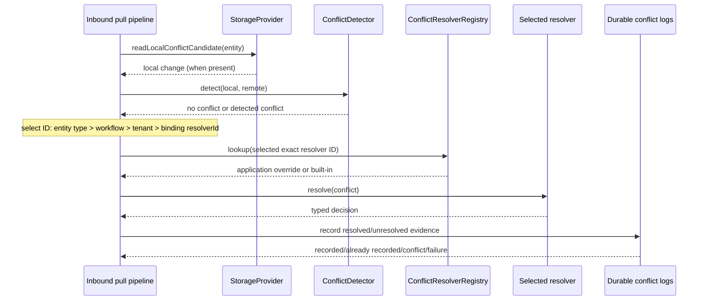

# Conflict resolution strategies

## Status

**Implemented foundation; full V1 conflict engine remains open.** DataLoom now
ships a deterministic built-in policy catalog reachable through the existing
`ConflictResolverRegistry` and `ConflictOrchestrationBindings`, plus durable
recording of resolved and unresolved decisions. This is a meaningful expansion
of DL-041, but it is not the completion claim for issue
[#95](https://github.com/dataloom-sdk/dataloom/issues/95).

Still required for the full gate are decision application and convergence,
standard detector utilities, complete metrics/retry integration
(entity/workflow/tenant/global resolver-selection precedence and
loop/non-convergence quarantine now ship as bounded first slices — see
"Resolver selection policy" and "Loop/non-convergence quarantine" below),
AC-FUNC-002, and mandatory-platform qualification. Authorized manual
conflict-resolution operations now ship as a bounded first slice — see
"Authorized manual conflict-resolution operations" below — and administration
commands are now also bridged into the durable operational-event outbox
(see "Operational-event bridging" below), closing the audit/event half of the
"complete audit/metrics/retry integration" gap for this one command surface;
metrics and retry integration remain open.

## Built-in policy catalog

Every policy is identified by one exact `ConflictResolverId`. No conflict type,
registration order, class name, exception, or platform name selects a policy
implicitly; the ID applied to a conflict comes only from explicit application
configuration: the binding's single `resolverId`, optionally refined by an
explicit selection policy (see "Resolver selection policy" below).

| Resolver ID | Deterministic decision | Intended use |
|---|---|---|
| `dataloom.builtin.client-wins` | `UseLocal` | The local/client change is explicitly authoritative. |
| `dataloom.builtin.server-wins` | `UseRemote` | The remote/server change is explicitly authoritative. |
| `dataloom.builtin.last-write-wins` | `UseRemote` placeholder | Preserves the previously shipped deterministic remote-wins tiebreak; it is not evidence-based recency. |
| `dataloom.builtin.timestamp` | Newest explicit timestamp wins; equal timestamps choose remote | The application can supply trustworthy epoch-millisecond evidence. Missing or malformed evidence defers. |
| `dataloom.builtin.reject` | `Fail` with `DL-CONFLICT-REJECTED-BY-POLICY` | Conflicting work must stop under the selected policy. |
| `dataloom.builtin.manual` | `Defer` | The conflict must remain durable for a later authorized/manual workflow. |

The registry first checks application-supplied resolvers and then the built-in
catalog. Therefore, an application can intentionally register a custom resolver
under a built-in ID and replace the reference implementation without a second
selection system. The public `resolvers` property continues to expose only the
application-supplied snapshot, preserving its historical size and ordering.

```kotlin
val registry = ConflictResolverRegistry(
    resolvers = listOf(myDomainSpecificResolver),
)

val bindings = ConflictOrchestrationBindings(
    detectorId = myDetector.id,
    resolverId = ConflictResolverId("dataloom.builtin.server-wins"),
)
```

## Resolver selection policy: entity type > workflow > tenant > global

**Design decision D11 (2026-09-19) reverses the earlier exact-ID-only
invariant.** Until this decision, resolver selection used only the single
`ConflictResolverId` on `ConflictOrchestrationBindings`, and entity type,
workflow ID, and tenant ID never reached the selection step (see the
[superseded investigation](./conflict-resolver-policy-precedence-investigation.md)).
`ConflictResolverRegistry` still selects only by exact ID; what changed is that
*which ID to look up* can now vary per conflict.

`ConflictOrchestrationBindings` gains an optional third parameter,
`resolverSelectionPolicy: ConflictResolverSelectionPolicy? = null`. A policy is
an immutable set of tier-scoped rules:

```kotlin
val bindings = ConflictOrchestrationBindings(
    detectorId = myDetector.id,
    // Global default: used when no rule below matches.
    resolverId = ConflictResolverId("dataloom.builtin.manual"),
    resolverSelectionPolicy = ConflictResolverSelectionPolicy(
        listOf(
            ForEntityType(EntityType("invoice"), ConflictResolverId("dataloom.builtin.server-wins")),
            ForEntityType(EntityType("draft"), ConflictResolverId("dataloom.builtin.client-wins")),
            ForWorkflow(WorkflowId("nightly-import"), ConflictResolverId("dataloom.builtin.reject")),
            ForTenant(TenantId("acme"), ConflictResolverId("dataloom.builtin.timestamp")),
        ),
    ),
)
```

The policy is supplied through `DataLoomConflictDetectionSpec.bindings`, so it
applies to every inbound-pull pipeline the builder assembles exactly as the
single resolver ID always has. No other spec or builder API changed.

### Precedence

For each detected conflict `SynchronizationConflictOrchestrator` builds a
`ConflictResolverSelectionContext` and calls
`ConflictOrchestrationBindings.selectResolverId`. The most specific tier with a
matching rule wins; lower tiers are not consulted once a higher one matched, and
rule order never matters:

| Tier | Rule | Context value | Availability |
|---|---|---|---|
| 1 | `ForEntityType` | `SynchronizationConflict.entity.type` | Always present. |
| 2 | `ForWorkflow` | `SynchronizationRequest.workflowId` | Always present (required field). |
| 3 | `ForTenant` | `SynchronizationRequest.context.tenantId` | Only when the host populates it; a tenant rule never matches an absent tenant. |
| 4 | Global default | `ConflictOrchestrationBindings.resolverId` | The same single ID as before; may be `null`. |

The policy deliberately has no separate "global default" field: the binding's
`resolverId` already is that value, so a policy adds tiers above it instead of
introducing a second, competing default.

### Where the tiers sit relative to application overrides

Precedence tiers only choose an ID. The chosen ID then goes through the
unchanged `ConflictResolverRegistry.lookup`: an application registration under
that ID is checked first, then the built-in catalog. An application that
registers its own resolver under `dataloom.builtin.server-wins` therefore
overrides the built-in *even when the policy is what selected that ID*. An ID
with no resolver anywhere is the existing
`ConflictOrchestrationResult.ResolverNotFound` outcome (recorded as
`RESOLVER_NOT_FOUND`), never an exception and never a silent fall-through to a
lower tier. If no rule matches and `resolverId` is `null`, the result is
`ResolverNotConfigured`, exactly as with no policy at all.

### Construction-time validation

Within one tier a key may appear in at most one rule. A second rule for the same
entity type, workflow, or tenant is rejected with `IllegalArgumentException` when
the policy is constructed, even if both rules name the same resolver, so there
is no runtime tie-break to depend on. The same string used as an entity type and
as a workflow is two different keys and is not a tie. A policy is not checked
against the resolver registry at construction, matching how `resolverId` has
always been handled.

### Compatibility and limits

With `resolverSelectionPolicy = null` (the default) or an empty policy,
behavior is identical to exact-ID-only selection; the pre-existing orchestrator,
registry, coordinator, and pipeline tests pass unchanged. The
`ConflictOrchestrationBindings` constructor, `copy`, and `componentN` gain the
new parameter, a pre-V1 ABI change with no shim (baselines regenerated).

Not implemented: compound rules (entity type *and* workflow), wildcard/pattern
matching, per-detector selection, and build-time validation of policy IDs
against the registry.

## Loop/non-convergence quarantine

**Design decision D18 (2026-09-20).** With fail-closed application (`Defer`,
`Fail`, and unresolved outcomes block the batch and leave the checkpoint
unadvanced), the same remote batch is delivered again and re-conflicts on the
same entity indefinitely. Nothing bounded that. Quarantine is an opt-in,
durable, per-entity counter that stops the loop: when the same entity has
conflicted a configurable number of times, further conflicts on it are not
re-resolved until an authorized operator releases it.

### Configuration

```kotlin
val quarantine = DataLoomConflictQuarantineSpec(
    store = quarantineStore, // DurableStateStore<ConflictQuarantineScope, ConflictQuarantineRecord>
    policy = ConflictQuarantinePolicy(occurrenceThreshold = 5, windowMillis = null), // the defaults
)

DataLoomConflictDetectionSpec(/* ... */ resolvedConflictDecisionStore = resolvedStore, quarantine = quarantine)
DataLoomConflictAdministrationSpec(/* ... */ quarantine = quarantine) // enables release
```

Both specs must be given the same store. Omitting `quarantine` from both leaves
every code path byte-for-byte as before. `DataLoomConflictDetectionSpec`
requires `resolvedConflictDecisionStore` when `quarantine` is set, because
quarantine's effect is blocking application, which only exists when resolved
decisions are applied (`IllegalArgumentException` at construction otherwise).
Hosts backing the store with a string-payload store use
`ConflictQuarantineRecordCodec` and `ConflictQuarantineScope.KeyEncoder`.

### Counting and the threshold

`SynchronizationConflictOrchestrator` counts every detected conflict against
its entity (entity type plus ID; the version is not part of the key) after
resolver-ID selection and before resolver lookup, whatever the outcome would
have been, including `ResolverNotConfigured` and `ResolverNotFound`. The
**threshold-th** occurrence is not resolved: with the default of 5, occurrences
1-4 resolve as normal and the 5th returns
`ConflictOrchestrationResult.Quarantined`. `newlyQuarantined` is `true` for
exactly that occurrence and `false` afterwards. Once quarantined the check is
read-only (no writes).

The optional `windowMillis` bounds accumulation: an occurrence more than that
long after the first occurrence of the current window starts a new window at
count 1. With no window (the default) occurrences accumulate until quarantine
or release. Counting is deliberately simple: a conflict that is correctly
resolved and applied still counts, and a replayed delivery of the same
`ConflictId` counts too (that replay *is* the loop). Hosts whose entities
legitimately conflict often should set a window or a higher threshold. A crash
between counting and finishing the batch replays the occurrence, so counts
are conservative, never lower than the true number.

### Fail-closed behaviour

`InboundConflictDecisionPreparer` treats `Quarantined` exactly like the
existing `Defer`/`Fail` outcomes: nothing in the batch reaches storage and the
checkpoint does not advance; the pull fails with `DL-CONFLICT-QUARANTINED`
(`CONFLICT`, non-recoverable). If the counter itself cannot be updated the
orchestrator returns `QuarantineUnavailable` and application fails closed with
the store's error, or `DL-CONFLICT-QUARANTINE-CONTENTION` (`STATE`,
recoverable) when the bounded compare-and-set attempts are exhausted; no
resolver is invoked in either case.

### Durability and concurrency

`DurableConflictQuarantineLog` follows the `DurableUnresolvedConflictLog`
pattern: a `DurableStateStore` keyed by `ConflictQuarantineScope`, payload-free
`ConflictQuarantineRecord` (status, occurrence count, first/last seen, last
`ConflictId`, last selected resolver ID, quarantine time, release evidence),
and a bounded load-evaluate-compare-and-set loop. Concurrent occurrences on
one entity each land exactly once: a loser reloads the winner's count and
increments from it, so no increment is lost and none is counted twice. The
record survives restart because it lives in the store.

### Release

Release goes through `ConflictAdministrationCoordinator.releaseQuarantine`
(exposed as `DataLoomConflictAdministration.releaseQuarantine`) rather than a
new privilege model:

- Authorization uses the same host `ConflictAdministrationAuthorizer`, via a new
  `authorizeQuarantineRelease` method that **defaults to `Denied`**. An
  authorizer written before quarantine existed cannot release anything; a host
  opts in by overriding it. The command is authorized *before* any state is
  read.
- Release restarts the count from zero and writes the release evidence (command
  ID, principal, authorization ID, reason, time) into the quarantine record in
  the same compare-and-set as the state change, so the entity is never released
  without its audit evidence. It is idempotent by command ID
  (`AlreadyReleased` on replay), and releasing an entity that is not quarantined
  is `NotQuarantined`.
- It applies no decision and advances no checkpoint; the next pull that
  conflicts on the entity is counted and resolved as normal and quarantines
  again if the loop persists.

Differences from manual resolution, stated plainly: a denied release is
returned but not persisted, and there is no `ConflictAdministrationStateStore`
entry, because that store's state type is bound to decision-carrying requests.
Operational-event outbox bridging of quarantine and release events is not
implemented in this slice.

### Interaction with the resolved-decision log

The resolved-decision log is commit-once per `ConflictId`. If a loop repeats
the *same* `ConflictId` with a different decision after release, that log's
existing non-convergence guard (`DL-CONFLICT-DECISION-NON-CONVERGENT`)
applies, exactly as it did before quarantine. Detectors that mint a fresh ID
per detection are unaffected.

## Timestamp-evidence policy

The timestamp policy reads these exact metadata keys:

```text
dataloom.conflict.local.updated-at-epoch-millis
dataloom.conflict.remote.updated-at-epoch-millis
```

Evidence is read from `ConflictResolutionRequest.metadata` first and
`SynchronizationConflict.metadata` second. A key present in request metadata is
a higher-precedence value even when malformed; malformed higher-precedence
evidence fails closed to `Defer` rather than falling back to a contradictory
lower-precedence value.

Both values must parse as Kotlin `Long` epoch milliseconds:

- local greater than remote → `UseLocal`;
- remote greater than local → `UseRemote`;
- equal values → `UseRemote`, the documented deterministic convergence
  tiebreak;
- either value missing or malformed → `Defer`.

The policy never interprets opaque `EntityVersion`, reads a clock, calls a
provider, or guesses recency from event IDs.

```kotlin
val metadata = DataLoomMetadata.of(
    mapOf(
        "dataloom.conflict.local.updated-at-epoch-millis" to localUpdatedAt.toString(),
        "dataloom.conflict.remote.updated-at-epoch-millis" to remoteUpdatedAt.toString(),
    ),
)
```

Applications are responsible for supplying trustworthy, consistently sourced
evidence. A timestamp policy cannot make untrusted client time authoritative by
itself.

## Last-write-wins naming caveat

`LastWriteWinsConflictResolver` remains available under
`dataloom.builtin.last-write-wins`, but it does not perform true wall-clock
ordering. `ChangeEvent` carries no reliable write timestamp and `EntityVersion`
is deliberately opaque, so this resolver always returns `UseRemote` as a
stable placeholder. It remains for compatibility and explicit use; applications
that require real ordering should use the timestamp policy with trustworthy
evidence or provide a domain resolver.

## Field-level merge boundary

DataLoom payloads are opaque to the shared engine. A generic built-in cannot
safely know whether fields represent money, counters, addresses, permissions,
medical observations, or another business invariant. Pretending to merge such
content would risk data corruption.

Field-level merging therefore uses the existing public `ConflictResolver`
contract. The application decodes its own payload, applies schema-aware rules,
and returns `ConflictResolutionDecision.Merge` with a resolved `ChangeEvent`.
DataLoom still owns detector/resolver lookup, orchestration, durable decision
recording, redaction boundaries, and the later application/convergence work as
those engine slices are completed.

A merge resolver must remain synchronous, deterministic, side-effect-free, and
must not query storage or remote services while resolving.

## Durable resolved-decision persistence

`DurableResolvedConflictDecisionLog` records one commit-once,
payload-minimized `ResolvedConflictDecisionRecord` per `ConflictId` through the
shared `DurableStateStore` contract.

It records the decision kind (`USE_LOCAL`, `USE_REMOTE`, `MERGE`, `DEFER`, or
`FAIL`) and structural evidence only. A merge records the resolved change's
structural identity rather than payload content. A failure records the bounded
error code rather than its message. Repeating the same facts reports
`AlreadyRecorded`; different facts for the same conflict report `Conflict` and
never overwrite the original record.

`DurableConflictDetectionCoordinator` optionally records resolved decisions and
continues to record unresolved outcomes. A persistence failure does not hide the
real orchestration result; the returned structure contains both the real result
and the durable-record outcome.

`DataLoomConflictDetectionSpec` exposes the optional resolved-decision store,
schema version, and bounded compare-and-set attempt count. Omitting that store
preserves the earlier behavior and performs no resolved-decision persistence.

## Orchestration flow



Current inbound conflict detection is observational: it detects and records but
does not yet atomically apply every decision, update checkpoints, and prove
convergence. That transactional application boundary remains a release-blocking
part of #95.

## Authorized manual conflict-resolution operations

`ConflictAdministrationCoordinator` (`io.dataloom.runtime.conflict`) is a
bounded first slice of "authorized manual operations" for a conflict already
durably recorded as unresolved (`UnresolvedConflictRecord`, reason
`RESOLVER_NOT_CONFIGURED` or `RESOLVER_NOT_FOUND`). It is a deliberately
separate application path from the internal `InboundConflictDecisionPreparer`
described above: that preparer only ever applies a decision to the exact live
`ChangeSet` batch that produced it, inside one inbound pull. By the time an
operator gets around to deciding an already-durably-recorded unresolved
conflict, that batch is no longer live — the pull that detected it already
returned `SynchronizationResult.Failed` without advancing its checkpoint, and
this coordinator never touches that pipeline, a `ChangeSet`, or a
`StorageProvider` directly.

**Independent of resolver-selection precedence.** `ConflictAdministrationRequest`
already carries an explicit `decision: ConflictResolutionDecision` supplied
by the caller before the coordinator runs — there is no resolver-selection
step in this path at all, so [entity > workflow > tenant > global
precedence](#resolver-selection-policy-entity-type--workflow--tenant--global)
(which governs the live pipeline's *automatic* selection of which
`ConflictResolver` to run) does not apply to it. Confirmed by reading:
`ConflictAdministrationCoordinator` never references `ConflictResolverRegistry`
or `ConflictResolver`. See the
[investigation](./conflict-resolver-policy-precedence-investigation.md)'s
2026-08-26 postscript for the full check.

### Authorization

Mirrors the `RetryAdministrationAuthorizer`/`CircuitAdministrationAuthorizer`
pattern already established for administrative retry and circuit commands: a
host-supplied `ConflictAdministrationAuthorizer` collaborator, deny-by-default,
with no DataLoom-invented identity or permission system. A denied command is
durably recorded as `AUTHORIZATION_DENIED` and never reaches eligibility
checking or the executor.

### Eligibility

A command is eligible only when `DurableUnresolvedConflictLog` currently holds
an `UnresolvedConflictRecord` for the target `ConflictId` and
`DurableResolvedConflictDecisionLog` does not already hold a decision for it.
Both a nonexistent conflict ID and an already-resolved one are well-defined,
durably recorded `POLICY_REJECTED` outcomes (`CONFLICT_NOT_UNRESOLVED` and
`CONFLICT_ALREADY_RESOLVED` respectively) rather than a thrown exception or a
silent no-op. A `Merge` decision whose `expectedEntity` does not match the
recorded conflict's entity is rejected the same way
(`MERGE_ENTITY_MISMATCH`), mirroring `InboundConflictDecisionPreparer`'s own
merge-contract check.

### Application: a host-owned executor, not a DataLoom-owned one

Neither `DurableUnresolvedConflictLog` nor `DurableResolvedConflictDecisionLog`
durably retains `ChangeEvent` payload content — by design. Applying a decision
therefore requires payload content this coordinator does not have. Exactly
like `RetryAdministrationExecutor` already does for administrative retry, a
host-supplied `ConflictAdministrationExecutor` owns retrieving whatever real
payload the decision requires (a local cache, a fresh re-fetch from the
remote provider, or the host's own storage) and owns deciding whether the
target entity is still eligible given anything that may have changed since
the conflict was originally detected. DataLoom does not perform
freshness/staleness checking on the executor's behalf — that check was
identified as needing more design than a single bounded slice should invent
unilaterally, so it is delegated to the same host-owned boundary the retry
precedent already establishes, rather than designed here.

### Durable recording

A successful `ConflictAdministrationExecutor.execute` is recorded into
`DurableResolvedConflictDecisionLog` by reusing the existing
`ResolvedConflictDecisionRecord` — with the requesting principal encoded as a
sentinel `ConflictResolverId` (`"manual:<principalId>"`) rather than a real
`ConflictResolver.id` — instead of inventing a new durable-record type for
manual decisions. A durable-recording race between two different commands
resolving the same conflict surfaces as `EXECUTION_FAILED` rather than a false
success.

### Wiring

`DataLoomBuilder.conflictAdministrationConfiguration(DataLoomConflictAdministrationSpec)`
assembles `DataLoom.conflictAdministration`. `DataLoomConflictAdministrationSpec`
requires an authorizer, a command state store, an executor, and both durable
conflict stores (`unresolvedConflictStore`/`resolvedConflictDecisionStore`) —
supply the same stores passed to `DataLoomConflictDetectionSpec` when live
conflict detection is also enabled, so administration and live detection agree
on the same durable facts. Omitting `conflictAdministrationConfiguration`
leaves `DataLoom.conflictAdministration` `null`; every other capability's
behavior is unchanged.

### Operational-event bridging

Every terminal `ConflictAdministrationResult` an executed command produces is
also bridged into the durable operational-event outbox when
`DataLoomBuilder.conflictResolutionOperationalEventOutboxConfiguration` is
separately configured — the same existing DL-042 opt-in point conflict
detection's own `UnresolvedConflictRecord`/`ResolvedConflictDecisionRecord`
outcomes already use, since both describe the same conflict-engine subsystem.
`ConflictResolutionOperationalEventBridge.toEnvelope(ConflictAdministrationRequest,
ConflictAdministrationResult)` maps a command following
`RetryCircuitAdministrationOperationalEventBridge`'s administration-command
shape exactly (`OperationalEventCategory.AUDIT`, identity and correlation
derived from `ConflictAdministrationRequest.commandId`, an
`administration.`-prefixed `OperationalEventId` distinct from the
`unresolved.`/`resolved.` detection-outcome prefixes the bridge already used).
Previously `DefaultDataLoomConflictAdministration` had no operational-event
bridge at all — its own class doc named this explicitly as a "genuinely
separate, later-scoped follow-up" left out of the original `#367` slice; this
closes it. Configuring the outbox spec alone still does not enable either
producer — `conflictDetectionConfiguration` and/or
`conflictAdministrationConfiguration` must still be configured separately for
an outcome to exist to bridge.

## Safety and determinism rules

- Built-ins perform no I/O, clock reads, randomness, provider calls, queue
  mutations, or application-state mutation.
- Cancellation and retry are outside the resolver contract.
- IDs and error codes are stable; payloads and secrets are excluded from
  built-in diagnostics and durable records.
- A missing resolver ID produces the existing typed `ResolverNotFound` result;
  it never silently selects another policy.
- Application registration under a built-in ID is explicit override behavior,
  not registration-order precedence.

## Remaining V1 work

The following are not claimed by this page:

- version/vector/ETag and other standard detector utilities;
- atomic application of `UseLocal`, `UseRemote`, and `Merge` decisions with
  checkpoint/outbox/audit effects;
- conflict fingerprints and convergence limits beyond the per-entity
  occurrence counter (which ships — see "Loop/non-convergence quarantine");
  quarantine/release events in the operational-event outbox;
- complete metrics and retry integration (immutable audit/event bridging is
  now shipped for both automatic conflict-detection outcomes and authorized
  manual conflict-administration commands — see "Operational-event bridging"
  above);
- restart, duplicate, concurrent-resolution, and migration qualification;
- AC-FUNC-002 and equivalent native Android, KMP Android, and KMP iOS evidence.

The status of those requirements is tracked by issue #95 and the
[market-readiness dashboard](../status/market-readiness.md).
