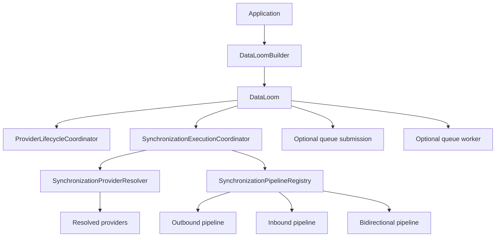

# DataLoom Facade (DL-033)

[API reference index](./README.md)

> **Status:** Available pre-V1 facade and assembly foundation. It does not yet
> expose or implement the complete mandatory V1 product surface.

## Overview

`DataLoom` is the public platform-independent SDK facade that assembles and
exposes the currently implemented synchronization runtime behind a small
pre-V1 API.

`DataLoom` is constructed through `DataLoomBuilder`, which validates all
mandatory configuration, assembles the internal runtime graph, and returns
an immutable facade. No provider operation, clock read, or I/O is performed
during build.



The facade currently provides lifecycle control, direct direction-based
execution, and optional durable-queue entry points. It does not yet provide a
versioned strategy/effective-plan API for offline-first, remote-first,
cache-first, network-only, hybrid, or adaptive behavior. It also does not make
the partial retry, conflict, event, asset, plugin, or governance subsystems
complete merely by assembling their available components.

---

## Package

`io.dataloom.runtime.facade`

---

## Public contracts

- `DataLoom` — facade interface
- `DataLoomBuilder` — fluent builder that assembles and validates the runtime
- `DataLoomQueueWorker` — optional narrow queue-worker capability
- `DataLoomBuildException` — thrown when `DataLoomBuilder.build()` fails
  validation
- `DataLoomQueueSubmission` _(DL-034)_ — optional narrow queue-submission
  capability

---

## DataLoom

```kotlin
public interface DataLoom {
    public val providerLifecycleState: ProviderLifecycleCoordinatorState
    public val queueWorker: DataLoomQueueWorker?
    public val queueSubmission: DataLoomQueueSubmission?
    public suspend fun initialize(): ProviderLifecycleResult
    public suspend fun synchronize(request: SynchronizationRequest): SynchronizationExecutionResult
    public suspend fun synchronize(
        request: SynchronizationRequest,
        bindings: SynchronizationProviderBindings,
    ): SynchronizationExecutionResult
    public suspend fun shutdown(): ProviderLifecycleResult
}
```

### providerLifecycleState

Returns the current `ProviderLifecycleCoordinatorState`. Reflects the lifecycle
status of all registered providers. Callers may inspect this property at any
time without side effects.

### queueWorker

`null` when no `DataLoomQueueWorkerSpec` was supplied to the builder. Non-null
when queue-worker dependencies are fully configured. Queue workers do not start
automatically.

### queueSubmission

`null` when `DataLoomBuilder.queueSubmissionEncoder` was not supplied or when
a valid `QueueProvider` binding was absent. Non-null when a
`QueuedSynchronizationWorkEncoder` and a valid queue provider binding are both
configured. Queue submission and queue worker are independently configurable.

`QueueProvider` is not exposed through this property.

### initialize

Delegates to `ProviderLifecycleCoordinator.initialize()` exactly once per call.
Follows the provider lifecycle order defined in DL-018. Returns the exact
`ProviderLifecycleResult` produced by the coordinator. Does not retry failed
initialization automatically.

Callers should serialize `initialize` and `shutdown`. Concurrent calls to
`initialize` follow `ProviderLifecycleCoordinator` invariants.

`CancellationException` propagates to the caller unchanged.

### shutdown

Delegates to `ProviderLifecycleCoordinator.shutdown()` exactly once per call.
Follows the reverse lifecycle order defined in DL-018. Returns the exact
`ProviderLifecycleResult`. Does not restart providers after shutdown.

### synchronize(request)

Executes synchronization using the default `SynchronizationProviderBindings`
supplied to the builder. Delegates to `SynchronizationExecutionCoordinator`.
Returns the exact `SynchronizationExecutionResult` without wrapping or
reinterpreting it.

Synchronization before `initialize()` follows the existing structured-execution
rejection behavior in `SynchronizationExecutionCoordinator`. The facade does
not initialize lazily.

`CancellationException` propagates to the caller unchanged.

### synchronize(request, bindings)

Executes synchronization using the exact `SynchronizationProviderBindings`
supplied by the caller for this call only. The per-call bindings are resolved
by `SynchronizationProviderResolver` according to DL-019 rules. Default
bindings are not consulted.

---

## DataLoomQueueWorker

```kotlin
public interface DataLoomQueueWorker {
    public suspend fun run(request: QueueWorkerRunRequest): QueueWorkerRunResult
}
```

Delegates to `QueueWorkerCoordinator.run()`. Preserves the exact
`QueueWorkerRunRequest` and returns the exact `QueueWorkerRunResult`.

No queue operation occurs automatically. No background worker is started.
Callers invoke `run()` explicitly and receive the result synchronously in the
coroutine.

---

## DataLoomBuilder

`DataLoomBuilder` is a single-use, single-threaded builder. Callers must not
share it across threads or call `build()` more than once.

### Mandatory configuration

| Method | Required | Description |
|---|---|---|
| `runtimeDependencies(deps)` | Yes | Supplies `RuntimeDependencies` (clock, identifier generators). |
| `providers(...)` / `provider(p)` | Yes (≥ 1) | Registers `DataLoomProvider` instances. |
| `defaultProviderBindings(b)` | Yes | Configures default `SynchronizationProviderBindings`. |

### Optional configuration

| Method | Description |
|---|---|
| `outboundConfiguration(c)` | Configures outbound push pipeline. Uses built-in defaults when absent. |
| `inboundConfiguration(c)` | Configures inbound pull pipeline. Uses built-in defaults when absent. |
| `bidirectionalConfiguration(c)` | Configures bidirectional composition. Uses built-in defaults when absent. |
| `connectivityConfiguration(c)` | Configures connectivity preflight. No preflight when absent. |
| `observers(...)` / `observer(o)` | Registers `SynchronizationObserver` instances. No event infrastructure is assembled when absent. |
| `pipeline(p)` | Registers a custom `SynchronizationPipeline` for its direction. Replaces the default for that direction only. |
| `queueWorkerConfiguration(spec)` | Configures the optional queue-worker capability. |

### Build-time validation

`build()` validates:

- `RuntimeDependencies` is set
- at least one provider is registered
- default `SynchronizationProviderBindings` is set
- the storage provider ID in the default bindings exists in the registry
- the transport provider ID in the default bindings exists in the registry
- every bound provider ID refers to a provider of the expected type
- every bound provider implements the expected provider interface
- no duplicate provider IDs exist
- no duplicate observer IDs exist
- no duplicate pipeline directions exist

Build failures throw `DataLoomBuildException`. Diagnostics include field names,
`ProviderId`, `ProviderType`, and `SynchronizationDirection` values only. No
provider implementation state, payloads, or credentials are included.

`build()` performs no provider operation, clock read, I/O, or coroutine launch.

---

## Provider ownership and lifecycle

A `DataLoom` instance owns lifecycle coordination for the provider instances
supplied to its builder. Provider instances should not normally be reused across
multiple independently built `DataLoom` instances.

- `build()` performs no provider initialization.
- `initialize()` initializes providers in lifecycle order exactly once per call.
- `shutdown()` shuts providers down in reverse lifecycle order exactly once per
  call.
- No automatic initialization occurs during `synchronize()`.
- No automatic shutdown occurs after failure.
- No provider restart occurs after shutdown.

---

## Default provider bindings

`DataLoomBuilder` requires default `SynchronizationProviderBindings`. These
bindings are structurally validated during `build()`:

- Each referenced provider ID must exist in the registered provider collection.
- Each referenced provider must match the expected `ProviderType`.
- Each referenced provider must implement the expected provider interface.

The default bindings are used by `synchronize(request)`. Per-call explicit
bindings supplied to `synchronize(request, bindings)` bypass the defaults
entirely and are resolved independently.

---

## Default pipeline assembly

When no custom pipeline is supplied for a direction, the builder assembles the
corresponding built-in pipeline:

- **Outbound (PUSH)** — `OutboundPushSynchronizationPipeline` with
  `OutboundPushPipelineConfiguration` (or supplied custom configuration).
- **Inbound (PULL)** — `InboundPullSynchronizationPipeline` with
  `InboundPullPipelineConfiguration` (or supplied custom configuration).
- **Bidirectional** — `BidirectionalSynchronizationPipeline` composed from
  the final outbound and inbound pipelines (custom or default).

A custom `SynchronizationPipeline` registered via `pipeline(p)` replaces only
the built-in pipeline for its `SynchronizationDirection`. The other directions
remain at their defaults.

No pipeline logic executes during `build()`.

---

## Observer integration

Observers are optional. When no observers are registered:

- no `SynchronizationObserverRegistry` is created
- no `SynchronizationEventDispatcher` is created
- no event emitter is created
- no event objects are constructed
- no event IDs are generated
- no clock is read for event timestamps

When observers are registered:

- `SynchronizationObserverRegistry` is assembled in registration order
- `SynchronizationEventDispatcher` is assembled using the observer registry
- the runtime event emitter is assembled using the dispatcher and
  `RuntimeDependencies` (clock and identifier generator)
- observer failures during event delivery remain isolated per DL-028 behavior
- no observer callback is invoked during `build()`

---

## Connectivity integration

When no `SynchronizationConnectivityConfiguration` is supplied, connectivity
preflight is not applied and execution proceeds unconditionally.

When connectivity configuration is supplied:

- `SynchronizationConnectivityPreflight` is assembled using the configured
  requirement
- the connectivity provider is selected from the provider registry using the
  connectivity provider ID in the active bindings
- direct-rejection and queued-deferral behavior follows DL-031 semantics
- no connectivity polling or observation is introduced

---

## Optional queue-worker capability

`DataLoomQueueWorker` is exposed through `DataLoom.queueWorker` only when a
`DataLoomQueueWorkerSpec` is supplied to the builder.

`DataLoomQueueWorkerSpec` requires:

- `workResolver: QueuedSynchronizationWorkResolver`
- `retryPolicy: RetryPolicy`
- `configuration: QueueWorkerConfiguration`
- `queueProviderTimeout: SchedulingDelay?` (optional; null preserves the direct provider path)

A valid `QueueProvider` binding must exist in the default
`SynchronizationProviderBindings`. `SchedulerProvider` is optional; when absent,
the queue worker follows DL-032 scheduler-absent behavior.

When `queueProviderTimeout` is configured, the builder automatically uses one
timeout-protected queue-provider instance for expired-lease recovery, atomic
acquisition, and every durable transition. A zero timeout rejects before the
delegate operation. Timed-out mutations are never replayed automatically.

Build fails deterministically when queue-worker configuration is requested but
no valid `QueueProvider` binding is found.

No queue operation is performed during `build()`.

---

## Queue-submission boundary

`DataLoomQueueSubmission` is exposed through `DataLoom.queueSubmission` when
`DataLoomBuilder.queueSubmissionEncoder` is supplied with a valid
`QueueProvider` binding.

Queue submission and queue worker are independently configurable. Either, both,
or neither capability may be present.

Build fails deterministically when a `QueuedSynchronizationWorkEncoder` is
supplied but no valid `QueueProvider` binding is found.

No encoding or enqueue operation is performed during `build()`.

See [Queue Submission (DL-034)](./queue-submission.md) for the complete
submission API reference.

---

## Concurrency and cancellation

- `initialize()` and `shutdown()` should be serialized by the caller.
- Concurrent `synchronize()` calls follow `SynchronizationExecutionCoordinator`
  limitations.
- Queue-worker concurrency follows `QueueProvider` and `SchedulerProvider`
  guarantees.
- `DataLoom` introduces no single-flight, global lock, or background scope.
- `CancellationException` from any operation propagates to the caller unchanged.
- Unexpected exceptions from provider operations are not swallowed by the
  facade.

---

## Security

`DataLoomBuildException` diagnostic messages include only:

- missing configuration field names
- `ProviderId` values
- `ProviderType` values
- `SynchronizationDirection` values
- structural binding failure reasons

No provider implementation state, payloads, credentials, tokens, or stack
traces are included in diagnostic messages.

---

## Quick start

```kotlin
val dataLoom = DataLoomBuilder()
    .runtimeDependencies(runtimeDependencies)
    .providers(storageProvider, transportProvider)
    .defaultProviderBindings(bindings)
    .build()

dataLoom.initialize()
val result = dataLoom.synchronize(request)
dataLoom.shutdown()
```

Full example with optional capabilities:

```kotlin
val dataLoom = DataLoomBuilder()
    .runtimeDependencies(runtimeDependencies)
    .providers(
        storageProvider,
        transportProvider,
        connectivityProvider,
        queueProvider,
        schedulerProvider,
    )
    .defaultProviderBindings(bindings)
    .outboundConfiguration(outboundConfiguration)
    .inboundConfiguration(inboundConfiguration)
    .connectivityConfiguration(connectivityConfiguration)
    .observers(observers)
    .queueWorkerConfiguration(queueWorkerSpec)
    .build()

dataLoom.initialize()
val result = dataLoom.synchronize(request)
dataLoom.queueWorker?.run(workerRequest)
dataLoom.shutdown()
```

---

## KMP compatibility

All `DataLoom`, `DataLoomBuilder`, and `DataLoomQueueWorker` contracts are
declared in `commonMain` and use no Android, JVM-only, or platform-specific
APIs.
