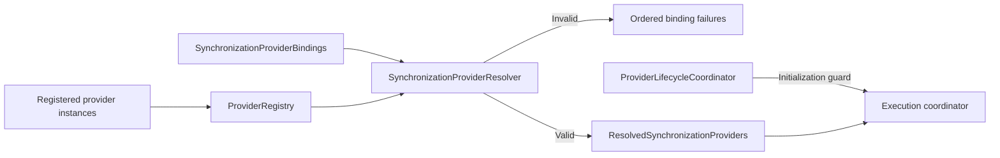

# Provider Bindings (DL-019)

[API reference index](./README.md)

> **Status:** Available provider-assembly foundation. Explicit provider
> resolution is implemented; this is not the full V1 plugin platform.

## Overview

`SynchronizationProviderBindings` declares which provider instances a
synchronization runtime must use for each runtime role. Every binding uses an
explicit `ProviderId` so the caller controls provider selection — the runtime
never selects a provider automatically.

`StrategyProviderBindings` is the plan-aware counterpart. Every role is
optional in that contract; the evaluated strategy plan determines which IDs
must resolve for one call.



Assembly is explicit and in-process. There is no service discovery, manifest
loading, permission enforcement, sandbox, or plugin lifecycle container in
this provider-binding path.

---

## Package

`io.dataloom.core.provider`

---

## Contracts

### `SynchronizationProviderBindings`

Immutable binding model that maps runtime roles to `ProviderId` values.

```kotlin
public data class SynchronizationProviderBindings(
    public val storageProviderId: ProviderId,
    public val transportProviderId: ProviderId,
    public val schedulerProviderId: ProviderId? = null,
    public val connectivityProviderId: ProviderId? = null,
    public val queueProviderId: ProviderId? = null,
)
```

#### Required roles

| Role | Field | Provider interface |
|---|---|---|
| Storage | `storageProviderId` | `StorageProvider` |
| Transport | `transportProviderId` | `TransportProvider` |

#### Optional roles

| Role | Field | Provider interface |
|---|---|---|
| Scheduler | `schedulerProviderId` | `SchedulerProvider` |
| Connectivity | `connectivityProviderId` | `ConnectivityProvider` |
| Queue | `queueProviderId` | `QueueProvider` |

Optional fields default to `null`. A `null` value means the corresponding
runtime capability is unavailable for this binding set.

#### Construction restrictions

- Construction performs no registry lookup.
- Construction performs no provider initialization.
- Construction invokes no provider operation.
- Construction performs no synchronization work.

#### Value semantics

`SynchronizationProviderBindings` is a `data class` and provides value-based
equality and `copy` semantics.

---

### `StrategyProviderBindings`

Immutable optional binding model used after strategy evaluation.

```kotlin
public data class StrategyProviderBindings(
    public val storageProviderId: ProviderId? = null,
    public val transportProviderId: ProviderId? = null,
    public val schedulerProviderId: ProviderId? = null,
    public val connectivityProviderId: ProviderId? = null,
    public val queueProviderId: ProviderId? = null,
)
```

An optional ID is neither resolved nor validated merely because it is present.
`StrategyProviderResolver` receives the plan's required capability set and
looks up only matching roles. This guarantees, for example, that a
network-only plan can require transport while ignoring unused storage and
queue IDs.

Missing required roles are returned as typed
`StrategyProviderCapability` values. Configured required roles use the same
existence, descriptor-type, and provider-interface checks as legacy
resolution.

---

### `ProviderBindingFailureReason`

Closed set of reasons why a provider binding could not be resolved.

```kotlin
public enum class ProviderBindingFailureReason {
    PROVIDER_NOT_FOUND,
    PROVIDER_TYPE_MISMATCH,
    PROVIDER_CONTRACT_MISMATCH,
}
```

| Value | Meaning |
|---|---|
| `PROVIDER_NOT_FOUND` | The `ProviderId` does not exist in the registry. |
| `PROVIDER_TYPE_MISMATCH` | The provider exists but its descriptor type does not match the expected runtime role. |
| `PROVIDER_CONTRACT_MISMATCH` | The descriptor declares the expected `ProviderType` but the provider does not implement the required interface. |

Enum ordinals are not a compatibility contract and must not be persisted.

---

### `ProviderBindingFailure`

Immutable record of a single provider binding failure.

```kotlin
public data class ProviderBindingFailure(
    public val requestedId: ProviderId,
    public val expectedType: ProviderType,
    public val actualType: ProviderType?,
    public val reason: ProviderBindingFailureReason,
)
```

| Property | Description |
|---|---|
| `requestedId` | The `ProviderId` explicitly configured for this role. |
| `expectedType` | The `ProviderType` required for the runtime role. |
| `actualType` | The `ProviderType` from the provider's descriptor, or `null` when not found. |
| `reason` | The `ProviderBindingFailureReason` classifying the failure. |

#### Security restrictions

`ProviderBindingFailure` must not expose:
- Provider object references or internal state
- Credentials, tokens, or authorization headers
- Payload bytes or checkpoint tokens
- `Throwable` instances or stack traces
- Personal data

Provider IDs and types are structural identifiers and may appear in diagnostic
output.

---

### `ResolvedSynchronizationProviders`

Immutable container of fully resolved provider instances for all configured
synchronization runtime roles.

```kotlin
public class ResolvedSynchronizationProviders(
    public val storageProvider: StorageProvider,
    public val transportProvider: TransportProvider,
    public val schedulerProvider: SchedulerProvider?,
    public val connectivityProvider: ConnectivityProvider?,
    public val queueProvider: QueueProvider?,
)
```

Every property contains the exact provider instance registered in
`ProviderRegistry` under the configured `ProviderId`. No new instances are
created.

Optional properties are `null` when the corresponding role was not configured
in `SynchronizationProviderBindings`.

#### Lifecycle boundary

`ResolvedSynchronizationProviders` does not guarantee that providers have
been initialized. `SynchronizationExecutionCoordinator` verifies that
`ProviderLifecycleCoordinator` is initialized before it resolves and uses the
instances. Callers using the resolver directly remain responsible for the same
lifecycle precondition.

#### Security restrictions

The diagnostic `toString` representation exposes only provider IDs and types.
It does not invoke any provider implementation's `toString()` and does not
expose provider internal state, credentials, authorization information,
payloads, checkpoint tokens, encryption keys, or personal data.

---

### `ProviderResolutionResult`

Sealed result of a provider resolution attempt.

```kotlin
public sealed interface ProviderResolutionResult {
    public data class Success(
        public val providers: ResolvedSynchronizationProviders,
    ) : ProviderResolutionResult

    public data class Failure(
        failures: List<ProviderBindingFailure>,
    ) : ProviderResolutionResult {
        public val bindingFailures: List<ProviderBindingFailure>
    }
}
```

`Success` contains the fully resolved provider set.

`Failure` contains a non-empty ordered list of `ProviderBindingFailure`
records:
- Construction throws `IllegalArgumentException` when the failure list is empty.
- The supplied collection is defensively copied.
- Failures are ordered by role-validation sequence: Storage, Transport,
  Scheduler, Connectivity, Queue.
- No partially resolved provider instances are exposed.

---

### `SynchronizationProviderResolver`

Resolves explicit provider bindings against a `ProviderRegistry`.

```kotlin
public class SynchronizationProviderResolver(
    registry: ProviderRegistry,
) {
    public fun resolve(
        bindings: SynchronizationProviderBindings,
    ): ProviderResolutionResult
}
```

`ProviderRegistry` is supplied at construction time. There is no global
registry, no service locator, and no reflection.

---

## Explicit provider selection

Provider selection is always based on `ProviderId`. No provider is selected
by `ProviderType` alone, by registration order, or by any naming convention.

### Multiple providers of the same ProviderType

When a registry contains multiple providers sharing the same `ProviderType`,
the explicit `ProviderId` in `SynchronizationProviderBindings` determines
which instance is returned.

```kotlin
val registry = ProviderRegistry(
    listOf(
        storagePrimary,    // ProviderId("storage-primary"), type = STORAGE
        storageSecondary,  // ProviderId("storage-secondary"), type = STORAGE
        transportProd,     // ProviderId("transport-prod"), type = TRANSPORT
        transportTest,     // ProviderId("transport-test"), type = TRANSPORT
    )
)

val resolver = SynchronizationProviderResolver(registry)

// Explicitly select secondary storage and production transport
val bindings = SynchronizationProviderBindings(
    storageProviderId = ProviderId("storage-secondary"),
    transportProviderId = ProviderId("transport-prod"),
)

val result = resolver.resolve(bindings)
// result is ProviderResolutionResult.Success with storageSecondary and transportProd
```

The resolver returns exactly those instances. It does not select the first
registered provider, the last registered provider, or any provider by ordinal.

---

## Role validation

For each configured binding, `SynchronizationProviderResolver` validates:

1. **Existence**: the `ProviderId` exists in the registry.
2. **Descriptor type**: `ProviderDescriptor.type` matches the expected
   `ProviderType` for the role.
3. **Provider interface**: the provider implements the required specialized
   interface for the role.

Type mismatch is evaluated before interface mismatch.

### Expected mappings

| Role | Expected `ProviderType` | Required interface |
|---|---|---|
| Storage | `ProviderType.STORAGE` | `StorageProvider` |
| Transport | `ProviderType.TRANSPORT` | `TransportProvider` |
| Scheduler | `ProviderType.SCHEDULER` | `SchedulerProvider` |
| Connectivity | `ProviderType.CONNECTIVITY` | `ConnectivityProvider` |
| Queue | `ProviderType.QUEUE` | `QueueProvider` |

---

## Deterministic failure ordering

All configured roles are evaluated. Failures are collected and returned in
deterministic role order:

1. Storage
2. Transport
3. Scheduler
4. Connectivity
5. Queue

Optional roles that are not configured produce no failure.

---

## No automatic provider selection

`SynchronizationProviderResolver` does not:
- select the first provider of a type
- select a provider by registration order
- create default providers
- initialize providers
- invoke provider operations
- execute synchronization

---

## Lifecycle coordinator boundary

| Responsibility | Component |
|---|---|
| Stores provider references | `ProviderRegistry` |
| Initializes and shuts down providers | `ProviderLifecycleCoordinator` |
| Resolves explicit provider bindings | `SynchronizationProviderResolver` |
| Enforces lifecycle admission for synchronization | `SynchronizationExecutionCoordinator` |

---

## Thread-safety expectations

`SynchronizationProviderResolver` is stateless after construction and safe to
call from any thread or coroutine context. It selects no dispatcher and exposes
no `CoroutineScope`.

---

## KMP compatibility

All contracts in this module use Kotlin standard-library and DataLoom API types
only. No Android APIs, JVM-only types, Apple-specific types, or third-party
libraries are required.

---

## Security restrictions

Do not place credentials, tokens, encryption keys, or personal data in provider
identifiers or binding models.

Diagnostic representations (`toString`) must not expose provider internal
state, credentials, authorization headers, payload bytes, checkpoint tokens,
encryption keys, stack traces, or personal data.

---

## No service discovery or reflection

`SynchronizationProviderResolver` does not use:
- `Class.forName`
- `KClass` reflection
- `ServiceLoader`
- Implementation class-name matching
- Provider ID naming conventions as selection policy
- `ProviderType` enum ordinals as selection policy
