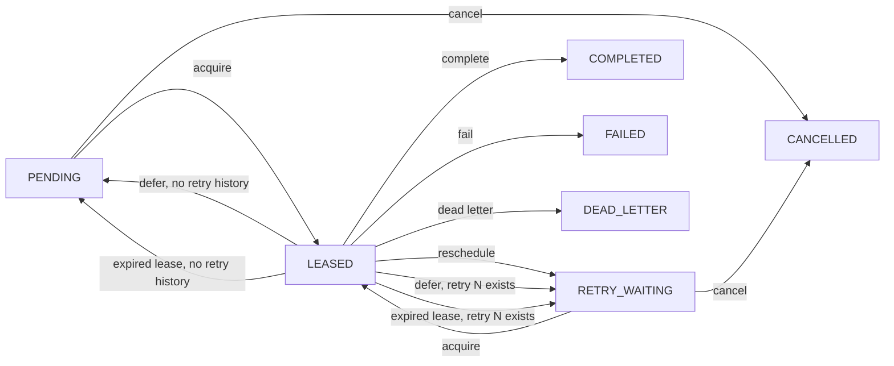

# DataLoom Queue Provider SPI (DL-015)

[API reference index](./README.md)

> **Status:** Available SPI with a Room implementation and in-memory test
> provider. Constraint deferral and expired-lease recovery preserve retry
> attempt history; complete retry/circuit state and V1 persistence
> qualification remain open.

This document describes the `QueueProvider` interface introduced in DL-015.

---

## Overview

`QueueProvider` is the platform-independent persistence SPI for the DataLoom
durable synchronization queue. It is the boundary between the DataLoom runtime
and a concrete durable storage implementation.



Room and the in-memory provider implement this same state machine.

---

## Purpose

`QueueProvider` persists DataLoom workflow execution records: queue entries,
leases, retry state, and recovery records. It is infrastructure storage owned
by the DataLoom runtime.

`QueueProvider` is distinct from `StorageProvider`, which adapts
application-controlled domain storage to synchronization operations:

```text
StorageProvider → reads and applies application synchronization changes
QueueProvider   → persists DataLoom workflow execution records
```

See [Application Storage Boundary](#application-storage-boundary) below.

---

## Interface Declaration

**Package:** `io.dataloom.api.queue`
**Type:** `QueueProvider` (interface)  
**Extends:** `DataLoomProvider`

```kotlin
public interface QueueProvider : DataLoomProvider {
    override val descriptor: ProviderDescriptor

    suspend fun enqueue(request: QueueEnqueueRequest): ProviderOperationResult<Unit>
    suspend fun acquire(request: QueueAcquireRequest): ProviderOperationResult<QueueAcquireResult>
    suspend fun complete(request: QueueCompletionRequest): ProviderOperationResult<Unit>
    suspend fun reschedule(request: QueueRescheduleRequest): ProviderOperationResult<Unit>
    suspend fun defer(request: QueueDeferralRequest): ProviderOperationResult<Unit>
    suspend fun fail(request: QueueFailureRequest): ProviderOperationResult<Unit>
    suspend fun cancel(request: QueueCancellationRequest): ProviderOperationResult<Unit>
    suspend fun recoverExpiredLeases(request: ExpiredLeaseRecoveryRequest): ProviderOperationResult<ExpiredLeaseRecoveryResult>
}
```

---

## Descriptor

The `descriptor` property must use `ProviderType.QUEUE`.

`ProviderType.QUEUE` — Infrastructure provider responsible for durable
DataLoom queue records, leases, recovery, and queue-state persistence.

This is a pre-release public API addition introduced in DL-015.

---

## Retry-history invariant

Retry rescheduling and constraint deferral are distinct transitions:

| Transition | Retry attempt before | Retry attempt after | Result state |
|---|---:|---:|---|
| `reschedule` after policy decision | `null` or `N` | supplied next attempt | `RETRY_WAITING` |
| `defer` before any retry | `null` | `null` | `PENDING` |
| `defer` after retry N | `N` | `N` | `RETRY_WAITING` |
| expired-lease recovery before any retry | `null` | `null` | `PENDING` |
| expired-lease recovery after retry N | `N` | `N` | `RETRY_WAITING` |

The provider must not fabricate, increment, or clear an attempt during
deferral or recovery. Therefore the first genuine failure after any number of
initial offline deferrals is evaluated as attempt 1, while failure after retry
N is evaluated as N+1.

---

## Operations

### `enqueue`

```kotlin
suspend fun enqueue(request: QueueEnqueueRequest): ProviderOperationResult<Unit>
```

Persists a new queue entry in durable storage.

- The supplied entry must be in `PENDING` state with no lease and no retry
  attempt (enforced by `QueueEnqueueRequest`).
- A provider must return a canonical error rather than silently replacing an
  existing entry unless future policy explicitly permits replacement.
- `ProviderOperationResult.Success` indicates the entry was persisted.
- `ProviderOperationResult.Failure` carries a canonical `DataLoomError`.

---

### `acquire`

```kotlin
suspend fun acquire(request: QueueAcquireRequest): ProviderOperationResult<QueueAcquireResult>
```

Atomically acquires eligible queue entries and assigns an exclusive lease.

**This is the most critical invariant in `QueueProvider`:**

> Acquiring eligible queue entries and assigning their lease must be one
> atomic provider operation.

A provider must **not**:
1. Read eligible entries.
2. Return them.
3. Assign the lease later in a separate operation.

That pattern could allow multiple consumers to process the same entry
concurrently.

Eligible entries are conceptually:
```text
PENDING where availableAt <= acquiredAt
```
or:
```text
RETRY_WAITING where availableAt <= acquiredAt
```

The result is either `QueueAcquireResult.NoEntries` (no eligible entries) or
`QueueAcquireResult.Entries` (at least one acquired entry with its lease).

Priority, fairness, and scheduling policy are owned by the DataLoom runtime,
not the provider.

---

### `complete`

```kotlin
suspend fun complete(request: QueueCompletionRequest): ProviderOperationResult<Unit>
```

Marks a leased entry as successfully completed.

- The provider must verify that `QueueCompletionRequest.leaseId` matches the
  currently active entry lease.
- Stale or mismatched lease identifiers must fail canonically.
- A successful operation transitions the entry to `COMPLETED` and clears the
  active lease.

---

### `reschedule`

```kotlin
suspend fun reschedule(request: QueueRescheduleRequest): ProviderOperationResult<Unit>
```

Reschedules a failed entry for a future retry attempt.

The retry flow:
```text
QueueProvider.acquire()
      ↓
Runtime performs synchronization
      ↓
Failure
      ↓
RetryPolicy.evaluate()
      ↓
RetryDecision.Retry
      ↓
QueueProvider.reschedule()
```

- The provider must verify the active lease.
- The provider must **not** evaluate retry policy.
- The DataLoom runtime supplies `retryAttempt` and `availableAt` after
  evaluating retry policy externally.
- A successful operation transitions the entry to `RETRY_WAITING`, clears the
  active lease, and stores the retry attempt, availability instant, and error.

---

### `defer`

```kotlin
suspend fun defer(request: QueueDeferralRequest): ProviderOperationResult<Unit>
```

Makes leased work eligible at a later instant without recording a failed
attempt.

- The provider must verify the active lease.
- The provider stores `availableAt`, clears the lease and last error, and
  preserves the existing retry attempt exactly.
- A null attempt returns to `PENDING`; attempt N returns to `RETRY_WAITING`.
- The provider must not evaluate retry policy or encode the deferral reason as
  a retry failure.

---

### `fail`

```kotlin
suspend fun fail(request: QueueFailureRequest): ProviderOperationResult<Unit>
```

Marks a leased entry as permanently failed or dead-lettered.

The failure flow:
```text
RetryDecision.Stop
      ↓
QueueProvider.fail()
```

- The provider must verify the active lease.
- The provider must **not** evaluate retry policy or recoverability.
- The runtime or host policy supplies the `QueueFailureDisposition`.
- A successful operation clears the lease and transitions the entry to
  `FAILED` or `DEAD_LETTER` based on the disposition.

---

### `cancel`

```kotlin
suspend fun cancel(request: QueueCancellationRequest): ProviderOperationResult<Unit>
```

Requests cancellation of a queue entry.

- Cancellation of an actively leased entry may fail or be deferred according
  to provider and runtime policy.
- Cancellation does not automatically cancel a running coroutine.
- A successful cancellation transitions the entry to `CANCELLED`.

---

### `recoverExpiredLeases`

```kotlin
suspend fun recoverExpiredLeases(request: ExpiredLeaseRecoveryRequest): ProviderOperationResult<ExpiredLeaseRecoveryResult>
```

Recovers queue entries whose exclusive leases have expired.

Process-death recovery flow:
```text
Entry is LEASED
      ↓
Process terminates
      ↓
Lease expires
      ↓
recoverExpiredLeases(...)
      ↓
Entry becomes recoverable
```

- Recovery must be based on persisted lease information.
- Recovery must not assume in-memory state survived.
- Expired leases must not remain permanently stuck.
- Recovery must not process an unexpired lease.
- Recovery must preserve the stored retry attempt exactly.
- An entry with no retry history returns to `PENDING`; an entry with attempt N
  returns to `RETRY_WAITING`.
- Returns an `ExpiredLeaseRecoveryResult` with the count of recovered entries.

---

## Lease-Protected Updates

Operations that modify a leased entry (`complete`, `defer`, `reschedule`,
`fail`) must
verify that the supplied `leaseId` matches the currently active entry lease.

A stale or mismatched lease must result in a canonical `DataLoomError` failure.

---

## Atomic Acquisition Requirement

See [`acquire`](#acquire) above. This invariant is critical for correctness.
A provider that performs non-atomic acquisition exposes the queue to
concurrent processing of the same entry.

---

## Application Storage Boundary

- Application UI must not query `QueueProvider` for business data.
- DataLoom queue records must not become application domain entities.
- A Room implementation may physically use the same database, but schemas and
  ownership boundaries must remain separate.
- Queue payloads and metadata may be sensitive and require secure storage
  according to application policy.

---

## What This Provider Must Not Do

Implementations must not:

- Expose Room, SQLite, SQLDelight, DataStore, file, cursor, transaction, or
  platform-specific types through the public API.
- Select threads or dispatchers.
- Expose coroutine scopes.
- Execute synchronization.
- Call transport or application storage providers.
- Evaluate retry policy.
- Resolve conflicts.
- Automatically log payloads or sensitive metadata.

---

## Thread Safety

Implementations are responsible for documenting and enforcing their own
thread-safety guarantees and transactional integrity.

---

## Cancellation

Implementations must preserve coroutine cancellation and must not convert
cancellation exceptions into normal failures.

---

## Platform Implementations

### Android

The current `dataloom-queue-room` module implements `QueueProvider` using Room
for Android persistence. The current `dataloom-scheduler-workmanager` module
provides the WorkManager scheduler and worker bridge that can:

1. Acquire leased work via `acquire`.
2. Execute through the shared runtime.
3. Complete, reschedule, or fail the entry via `complete`, `reschedule`, or `fail`.

These modules are current foundations; they are not yet a published aggregate
or proof of complete V1 consumer-path qualification.

### KMP and iOS

A cross-platform persistence technology, including whether SQLDelight is used,
has not been selected and qualified. Durable queue persistence and recovery
for the mandatory KMP iOS path remain V1 requirements. Platform
background-execution guarantees must be documented and tested per platform.

---

## Related Documentation

- [Queue Models](./queue-model.md) — All queue model contracts.
- [Queue Boundaries](../architecture/queue-boundaries.md) — Architectural boundaries.
- [Provider SPI](./provider-spi.md) — DataLoom provider framework.
- [Storage Provider](./storage-provider.md) — Application storage adapter.
- [Error Model](./error-model.md) — Canonical error types.
