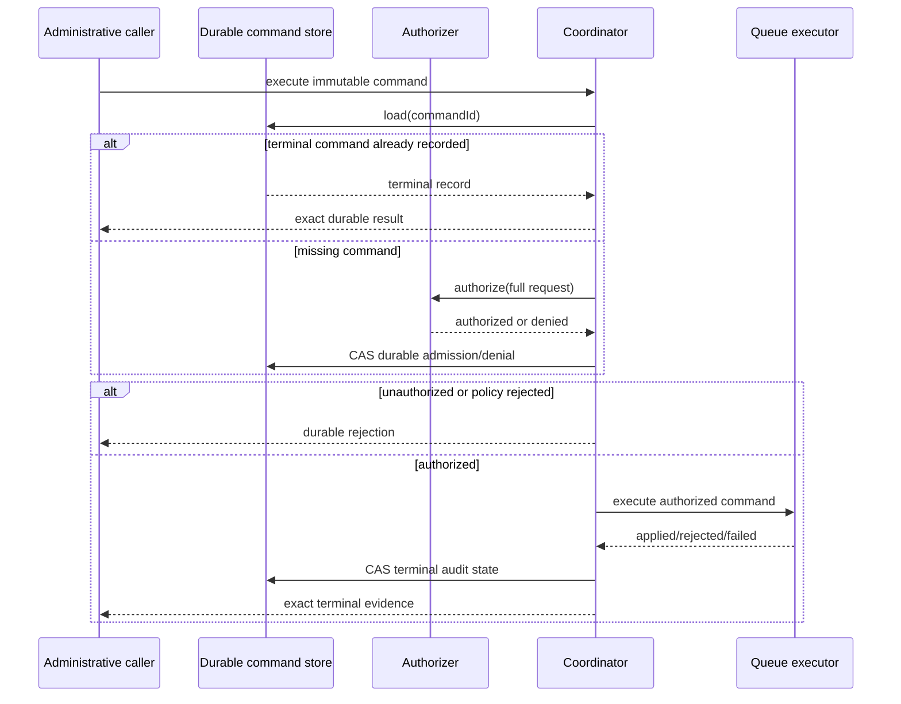

# Retry administration

**Status:** Available foundation; complete V1 operational integration remains partial.

DataLoom exposes an explicit administrative boundary for manual retry and
failure reclassification. It does not weaken the normal fail-closed retry
classifier. Applications must provide authorization, durable command state,
and an idempotent queue mutation adapter.

## Public contracts

- `RetryAdministrationRequest` is the immutable command envelope.
- `RetryAdministrationCommandId` is the durable idempotency key.
- `RetryAdministrationAuthorizer` decides whether the complete requested action
  is authorized for the named principal.
- `RetryAdministrationStateStore` persists versioned command history through an
  atomic compare-and-set contract.
- `RetryAdministrationExecutor` applies an authorized queue mutation
  idempotently by command id.
- `RetryAdministrationCoordinator` orders authorization, policy enforcement,
  durable admission, execution, and terminal recording.

The retained `RetryFailureSnapshot` contains only stable error code, category,
severity, and recoverability. It excludes exception text, payloads, credentials,
headers, provider instances, and arbitrary metadata.

## Actions

`REQUEUE` preserves the original classification. It is accepted only when the
failure is recoverable and is not in a protected category.

`RECLASSIFY_AND_REQUEUE` is a separate explicit action. Authorization applies
to that action, and the original failure snapshot remains immutable. The
executor receives `RECOVERABLE` only as the effective classification for the
new administrative attempt.

Protected categories are authentication, authorization, serialization,
validation, configuration, policy, conflict, and security. Unknown and
non-recoverable failures also require explicit reclassification.

## Execution ordering

## Executor requirements

Before queue mutation, the executor must verify that the target entry still
exists, is eligible for administrative retry, and retains canonical failure
evidence matching the command snapshot. A stale, forged, or mismatched command
must return `Rejected` without mutation.

Execution may finish before the final command-state write is confirmed. The
coordinator therefore returns `ExecutionRecordingUnconfirmed` with the exact
execution result and persistence failure. Redelivery uses the same command id;
the executor must not create a second queue entry or consume retry history
again.

## Apple durable state

`AppleFileRetryAdministrationStateStore` is the production KMP Apple
implementation of the state-store contract. It provides process-shared exact
compare-and-set behavior, immutable-request protection, bounded strict decoding,
and crash-durable replacement through file `fsync`, atomic rename, and
parent-directory `fsync`.

See the [Apple retry-administration state-store guide](../apple/retry-administration-state-store.md)
for construction, persistence boundaries, error behavior, and platform
responsibilities.

## Current boundary

DataLoom now includes common public contracts, deterministic coordination,
focused common tests, and production Apple command-state persistence. It does
not yet ship a production Android retry-administration store, a
queue-provider-specific idempotent executor, atomic queue command receipts,
facade/builder assembly, platform operations UI, or complete administration
metrics and tracing. Applications must not claim those capabilities from this
foundation.
