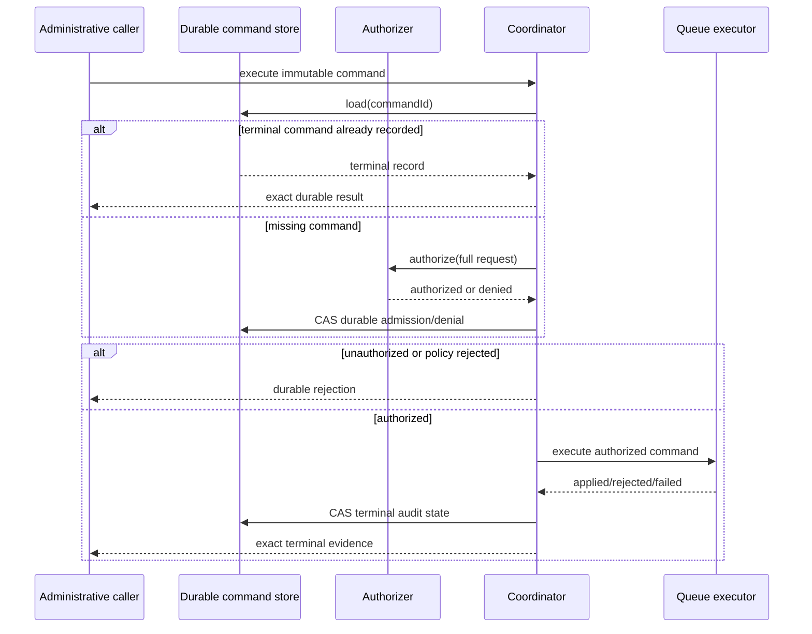

# Retry administration

**Status:** Authorized command coordination, stable facade/builder assembly,
and production Android/Apple persistence plus atomic queue execution are
available. Complete administration observability and end-to-end operational
qualification remain partial.

DataLoom exposes an explicit administrative boundary for manual retry and
failure reclassification. It does not weaken the normal fail-closed retry
classifier. Applications provide authorization and select the platform durable
state and execution implementations.

## Public contracts

- `RetryAdministrationRequest` is the immutable command envelope.
- `RetryAdministrationCommandId` is the durable idempotency key.
- `RetryAdministrationAuthorizer` decides whether the complete requested action
  is authorized for the named principal.
- `RetryAdministrationStateStore` persists versioned command history through an
  atomic compare-and-set contract.
- `RetryAdministrationExecutor` applies an authorized queue mutation
  idempotently by command id.
- `RetryAdministrationCoordinator` orders authorization, policy enforcement,
  durable admission, execution, and terminal recording.
- `DataLoomRetryAdministrationSpec` supplies the host authorizer, durable
  command store, platform executor, and bounded contention configuration.
- `DataLoomRetryAdministration` is the optional stable operations capability
  exposed by `DataLoom.retryAdministration`.

The retained `RetryFailureSnapshot` contains only stable error code, category,
severity, and recoverability. It excludes exception text, payloads, credentials,
headers, provider instances, and arbitrary metadata.

## Actions

`REQUEUE` preserves the original classification. It is accepted only when the
failure is recoverable and is not in a protected category.

`RECLASSIFY_AND_REQUEUE` is a separate explicit action. Authorization applies
to that action, and the original failure snapshot remains immutable. The
executor receives `RECOVERABLE` only as the effective classification for the
new administrative attempt.

Protected categories are authentication, authorization, serialization,
validation, configuration, policy, conflict, and security. Unknown and
non-recoverable failures also require explicit reclassification.

## Generic execution ordering



## Executor requirements

Before queue mutation, an executor verifies that the target entry still exists,
is eligible for administrative retry, and retains canonical failure evidence
matching the command snapshot. A stale, forged, or mismatched command returns
`Rejected` without mutation.

A generic executor may finish before the coordinator's final command-state write
is confirmed. The coordinator therefore exposes
`ExecutionRecordingUnconfirmed`. Redelivery uses the same command id and must
not create another queue entry or consume retry history again.

## Android Room atomic execution

`RoomRetryAdministrationStateStore` persists the complete command and audit
record in the same `DataLoomRoomDatabase` used by `RoomQueueProvider`.
`RoomRetryAdministrationExecutor` uses that shared database as a stronger
platform-specific atomicity boundary.

One Room transaction:

1. loads the durable command and validates every immutable request field;
2. validates `AUTHORIZED`, the authorization id, effective recoverability, and
   defensive retry/reclassification policy;
3. loads the target queue entry and validates `FAILED` or `DEAD_LETTER` plus the
   exact stored failure code, category, severity, and recoverability;
4. changes the queue state to `PENDING` or `RETRY_WAITING` according to existing
   retry history, clears the terminal error, and makes the work available at the
   executor's observed instant; and
5. advances the same command record to versioned `SUCCEEDED`.

If either update fails, SQLite rolls the transaction back. If both commit but
the caller loses the response, replay sees the durable `SUCCEEDED` receipt and
returns `Applied` without a second queue mutation. The coordinator's attempted
old-version terminal write conflicts, then its normal reload path returns the
already durable success record.

The executor preserves synchronization request/context identity, queue metadata,
retry attempt, retry-budget state, and immutable workflow start/deadline
evidence. It does not consume another attempt, reset budgets, or extend the
workflow deadline.

Stable semantic rejections cover missing/conflicting commands, unauthorized or
mismatched authorization evidence, required reclassification, missing or
non-terminal targets, missing failure evidence, and failure-snapshot mismatch.
Database, integrity, version-exhaustion, and clock-regression outcomes use
canonical sanitized errors.

## Apple durable state and atomic execution

`AppleFileRetryAdministrationStateStore` is the production KMP Apple
implementation of the state-store contract. It provides process-shared exact
compare-and-set behavior, immutable-request protection, bounded strict decoding,
and crash-durable replacement through file `fsync`, atomic rename, and
parent-directory `fsync`.

See the [Apple retry-administration state-store guide](../apple/retry-administration-state-store.md)
for construction, persistence boundaries, error behavior, and platform
responsibilities.

`AppleFileRetryAdministrationExecutor` validates the durable authorized command
and terminal queue failure, then commits the requeued entry and an immutable
command receipt in the same crash-durable queue snapshot replacement. The
version 2 snapshot retains strict read compatibility with entry-only version 1
files. Identical command replay returns the stored receipt without another
queue mutation; changed immutable input fails closed.

## Facade and builder assembly

Applications opt in explicitly:

```kotlin
val dataLoom = DataLoomBuilder()
    .runtimeDependencies(runtimeDependencies)
    .providers(storageProvider, transportProvider)
    .defaultProviderBindings(bindings)
    .retryAdministrationConfiguration(
        DataLoomRetryAdministrationSpec(
            authorizer = retryAdministrationAuthorizer,
            stateStore = retryAdministrationStateStore,
            executor = retryAdministrationExecutor,
        ),
    )
    .build()

val result = checkNotNull(dataLoom.retryAdministration).execute(command)
```

When configuration is absent, `DataLoom.retryAdministration` is `null`.
Construction and property access perform no authorization, state load/write,
queue mutation, clock read, identifier generation, or coroutine launch. The
facade exposes no collaborator and returns the coordinator's exact typed result.

`DataLoomRetryAdministrationSpec` requires a positive compare-and-set attempt
limit and defaults to eight. Its diagnostic string renders only that limit,
never collaborator implementation state.

## Current boundary

DataLoom now includes common public contracts, deterministic coordination,
explicit stable facade assembly, production Android and Apple command-state
persistence, and atomic Android Room and Apple administrative requeue
execution. Remaining work includes role and UI integration beyond the host
authorizer SPI, circuit administration, complete administration events/metrics/
logs/tracing/health, executable process-loss and higher-contention evidence,
and full cross-platform `AC-FUNC-004` qualification.
