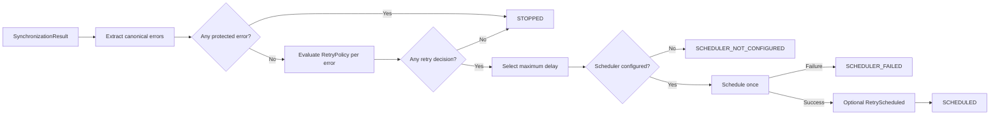

# Retry orchestration contracts

[API reference index](./README.md)

> **Status:** Partial V1 subsystem. Scheduler-backed orchestration and central
> protected-failure handling are implemented. Standard backoff, durable circuit
> state, time budgets, hints, manual retry, and full observability remain.

**Module:** `dataloom-runtime`  
**Package:** `io.dataloom.runtime.retry`  
**Platform:** Kotlin Multiplatform common code

## Overview

`SynchronizationRetryOrchestrator` evaluates a terminal
`SynchronizationResult` and submits at most one `ScheduleRequest` through a
`SchedulerProvider`.



The orchestrator does not execute synchronization, process queue entries, check
connectivity, initialize providers, own a coroutine scope, or select a
dispatcher.

## `SynchronizationRetryRequest`

```kotlin
val retryRequest = SynchronizationRetryRequest(
    synchronizationRequest = syncRequest,
    synchronizationResult = failedResult,
    retryOperation = RetryOperation("transport.push"),
    retryAttempt = RetryAttempt(1),
    scheduleId = ScheduleId("retry-001"),
)
```

The request preserves all supplied values. Construction performs no evaluation,
clock read, identifier generation, provider call, or scheduling.

The orchestrator passes `retryAttempt` unchanged. Attempt advancement belongs
to the caller that creates the request.

## `RetrySchedulingConfiguration`

```kotlin
val configuration = RetrySchedulingConfiguration(
    constraints = ScheduleConstraints(),
    existingSchedulePolicy = ExistingSchedulePolicy.REPLACE,
)
```

Both values are forwarded unchanged into the single `ScheduleRequest`.

## Statuses

| Status | Meaning |
|---|---|
| `NOT_REQUIRED` | Succeeded, skipped, or cancelled result |
| `STOPPED` | Protected failure exists or no policy decision requests retry |
| `SCHEDULED` | Scheduler accepted the request |
| `SCHEDULER_NOT_CONFIGURED` | Retry requested but no scheduler was supplied |
| `SCHEDULER_FAILED` | Scheduler returned a canonical provider failure |

`CancellationException` is never converted into a status.

## Flow

1. Return `NOT_REQUIRED` for `Succeeded`, `Skipped`, or `Cancelled`.
2. Extract the error from `Failed`, or the ordered error list from
   `PartiallySucceeded`.
3. Scan the complete error set for central protected failures.
4. When protected, return `STOPPED` without invoking custom policy or scheduler.
5. Otherwise evaluate the configured policy once per error in original order.
6. Return `STOPPED` when no decision requests retry.
7. Select the maximum `SchedulingDelay` across retry decisions.
8. Return `SCHEDULER_NOT_CONFIGURED` when the scheduler is absent.
9. Build one `ScheduleRequest` and call `schedule` exactly once.
10. Return `SCHEDULED` with the exact receipt or `SCHEDULER_FAILED` with the
    exact canonical error.
11. Emit `RetryScheduled` only after scheduler acceptance when an event emitter
    is configured.

## Protected failure behavior

The batch stops before custom policy evaluation when any error is:

- `NON_RECOVERABLE`;
- `UNKNOWN`; or
- in authentication, authorization, serialization, validation, configuration,
  policy, conflict, or security categories.

For a partially successful result, the first protected error in original order
is the blocking error. Every returned decision is a stop decision. A transient
sibling error cannot cause the protected batch to be scheduled.

## Eligible policy evaluation

When the complete error set is eligible, each `RetryEvaluationRequest` contains:

- the exact synchronization request;
- the exact retry operation;
- the exact error;
- the exact retry attempt;
- `previousDelay = null`; and
- `provider = null`.

Unexpected policy exceptions propagate. The orchestrator does not silently
change or suppress application programming errors.

## Maximum-delay selection

When one or more eligible decisions request retry, the maximum delay is used.
Scheduling earlier would violate another decision's minimum wait.

Ordinary policy stop decisions alongside retry decisions do not block
scheduling. Central protected stops are different: they are detected before
policy evaluation and block the complete batch.

## Schedule construction

The submitted request uses:

- `id = request.scheduleId`;
- `synchronizationRequest = request.synchronizationRequest`;
- `delay = selected maximum delay`;
- `constraints = configuration.constraints`; and
- `existingPolicy = configuration.existingSchedulePolicy`.

No new identifier is generated and the synchronization request is not mutated.

## Event boundary

`RetryScheduled` is emitted only after scheduler acceptance. Ordinary observer
failures do not change the `SCHEDULED` result. Cancellation during delivery
propagates, but the already accepted schedule is not automatically cancelled.

No retry event is emitted for `NOT_REQUIRED`, `STOPPED`, missing scheduler, or
scheduler failure.

## Queue and connectivity boundaries

This direct orchestrator does not call `QueueProvider` and makes no durability
claim beyond the supplied scheduler's guarantees.

It does not call `ConnectivityProvider`. Connectivity requirements are carried
through `ScheduleConstraints` and interpreted by the platform scheduler.

The separate queue-backed evaluator uses the same central protection and delay
aggregation semantics.

## Security

Diagnostics must remain bounded and redaction-safe. They may identify schedule,
operation, attempt, result variant, error code, and delay. They must not contain
payloads, checkpoint values, credentials, authorization headers, encryption
keys, personal data, stack traces, or provider internal state.

## KMP compatibility

The implementation uses Kotlin standard-library and DataLoom contracts only.
No Android API, JVM-only API, reflection, service loading, global scope, or DI
framework is used.

## Remaining V1 work

Standard backoff policies, deterministic jitter, attempt and elapsed budgets,
retry hints, timeout separation, durable circuit state, half-open probes,
manual retry/reclassification, complete observability, restart/concurrency
qualification, and Android/KMP iOS parity remain release blockers.
