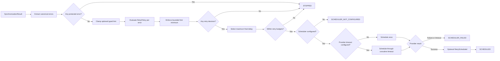

# Retry orchestration contracts

[API reference index](./README.md)

> **Status:** Partial V1 subsystem. Scheduler-backed orchestration, central
> protected-failure handling, deterministic backoff/jitter, attempt limits,
> elapsed/cumulative budgets, bounded provider/server hints, and opt-in
> scheduler-provider timeout enforcement are implemented. Complete transport,
> storage, queue, policy, workflow, circuit, observability, and platform
> qualification remain open.

**Module:** `dataloom-runtime`  
**Package:** `io.dataloom.runtime.retry`  
**Platform:** Kotlin Multiplatform common code

## Overview

`SynchronizationRetryOrchestrator` evaluates a terminal
`SynchronizationResult` and submits at most one `ScheduleRequest` through a
`SchedulerProvider`.



The orchestrator does not execute synchronization, process queue entries,
inspect connectivity, initialize providers, calculate standard backoff, apply a
second jitter layer, own a coroutine scope, or select a dispatcher.

## `SynchronizationRetryRequest`

```kotlin
val retryRequest = SynchronizationRetryRequest(
    synchronizationRequest = syncRequest,
    synchronizationResult = failedResult,
    retryOperation = RetryOperation("transport.push"),
    retryAttempt = RetryAttempt(1),
    scheduleId = ScheduleId("retry-001"),
)
```

Construction performs no evaluation, clock read, identifier generation,
provider call, or scheduling. The orchestrator passes `retryAttempt` unchanged;
advancement belongs to the caller that creates the next request.

## `RetrySchedulingConfiguration`

```kotlin
val configuration = RetrySchedulingConfiguration(
    constraints = ScheduleConstraints(),
    existingSchedulePolicy = ExistingSchedulePolicy.REPLACE,
)
```

Both values are forwarded unchanged into the single `ScheduleRequest`.

## Legacy direct scheduler path

All existing public constructors preserve the historical scheduler behavior:

```kotlin
val orchestrator = SynchronizationRetryOrchestrator(
    retryPolicy = retryPolicy,
    schedulerProvider = schedulerProvider,
    configuration = configuration,
)
```

This path performs no implicit timeout wrapping. Existing source and binary
constructor signatures remain available.

## Opt-in scheduler-provider timeout

Use the factory when the direct retry scheduler call must be bounded:

```kotlin
val orchestrator = SynchronizationRetryOrchestrator.withSchedulerProviderTimeout(
    retryPolicy = retryPolicy,
    schedulerProvider = schedulerProvider,
    configuration = configuration,
    clock = clock,
    schedulerProviderTimeout = SchedulingDelay(5_000L),
)
```

The factory structurally assembles:

```text
SynchronizationRetryOrchestrator
  -> TimeoutEnforcingSchedulerProvider
  -> RetryTimeoutCoordinator(PROVIDER)
  -> CoroutineRetryTimeoutExecutor
  -> application SchedulerProvider
```

Construction does not read the clock, invoke the scheduler, launch a coroutine,
or mutate a schedule request.

The timeout applies only after retry protection, policy evaluation, hint
minimum enforcement, final-delay selection, and optional budget evaluation. It
is not reused for connection, request, idle, retry-policy, queue-processing, or
complete-workflow execution.

### Timeout outcomes

When the timeout expires:

- the scheduler operation is cancelled cooperatively;
- the result is `SCHEDULER_FAILED`;
- `schedulerError.code` is `SCHEDULER_PROVIDER_TIMEOUT`;
- the selected retry delay and policy decisions remain visible;
- no schedule receipt is returned;
- accepted retry-budget state is not exposed or advanced;
- `RetryScheduled` is not emitted; and
- no second scheduler call occurs in the same orchestration cycle.

A zero timeout rejects before invoking the scheduler. A null scheduler still
returns `SCHEDULER_NOT_CONFIGURED` and does not read the timeout clock.

Coroutine cancellation is cooperative. A blocking or CPU-bound scheduler that
does not reach cancellation checkpoints cannot be hard-interrupted by the
common executor and requires a platform-specific adapter.

A timeout can occur after an underlying scheduler has partially processed a
request but before returning a receipt. Scheduler implementations must apply the
stable `ScheduleId` and `ExistingSchedulePolicy` contract consistently so a
later host retry does not create uncontrolled duplicate work.

## Optional budgets and hints with timeout enforcement

The factory accepts the same optional policy slices:

```kotlin
val orchestrator = SynchronizationRetryOrchestrator.withSchedulerProviderTimeout(
    retryPolicy = retryPolicy,
    schedulerProvider = schedulerProvider,
    configuration = configuration,
    clock = clock,
    schedulerProviderTimeout = SchedulingDelay(5_000L),
    budgetConfiguration = RetryBudgetConfiguration(
        maximumElapsedTime = SchedulingDelay(120_000L),
    ),
    hintConfiguration = RetryHintConfiguration(
        maximumHintDelay = SchedulingDelay(60_000L),
    ),
)
```

The supplied clock is shared by budget evaluation and timeout coordination when
both are enabled. Construction never reads it.

## Statuses

| Status | Meaning |
|---|---|
| `NOT_REQUIRED` | Succeeded, skipped, or cancelled result |
| `STOPPED` | Protected failure exists, policy stops, or a retry budget is exceeded |
| `SCHEDULED` | Scheduler accepted the request and returned a receipt |
| `SCHEDULER_NOT_CONFIGURED` | Retry requested but no scheduler was supplied |
| `SCHEDULER_FAILED` | Scheduler returned a canonical failure or the configured provider timeout expired |

Caller `CancellationException` is never converted into a status.

## Deterministic evaluation order

1. Return `NOT_REQUIRED` for `Succeeded`, `Skipped`, or `Cancelled`.
2. Extract the terminal error or ordered partial-error list.
3. Scan the complete set for centrally protected failures.
4. Stop before custom policy, hint, random-source, budget, or scheduler work when
   any protected failure exists.
5. Clamp each opt-in typed retry hint.
6. Evaluate the configured policy once per eligible error.
7. Preserve policy stops and enforce bounded hints as minimum retry delays.
8. Select the maximum final delay across retry decisions.
9. Evaluate elapsed and cumulative budgets against that final delay.
10. Return `SCHEDULER_NOT_CONFIGURED` when no scheduler exists.
11. Build one immutable `ScheduleRequest`.
12. Invoke the scheduler directly or through the configured provider-timeout
    boundary exactly once.
13. Return `SCHEDULED` only with an exact receipt; otherwise return
    `SCHEDULER_FAILED` with the exact canonical error.
14. Emit `RetryScheduled` only after scheduler acceptance.

## Protected failures

The complete batch stops before custom policy evaluation when any error is:

- `NON_RECOVERABLE`;
- `UNKNOWN`; or
- authentication, authorization, serialization, validation, configuration,
  policy, conflict, or security category.

A transient sibling error cannot cause a protected partial-success batch to be
scheduled.

## Bounded retry hints

`RetryHintConfiguration.maximumHintDelay` is the trust boundary. Only errors
implementing `RetryDelayHintCarrier` participate. The hint is clamped before
policy invocation and enforced as a minimum afterward. Policy stops remain
stops, and a longer policy delay remains unchanged.

The shared runtime never parses raw HTTP headers, absolute dates, exception
messages, or provider-specific retry formats.

## Budget state

`SynchronizationRetryRequest` may carry the exact `RetryBudgetState` from the
previous accepted cycle. Budget rejection returns `STOPPED` before scheduling.

Only a `SCHEDULED` result may expose the next budget state. Missing scheduler,
scheduler failure, and scheduler timeout never expose advanced state.

## Schedule construction

The submitted request uses:

- `id = request.scheduleId`;
- `synchronizationRequest = request.synchronizationRequest`;
- `delay = selected maximum final delay`;
- `constraints = configuration.constraints`; and
- `existingPolicy = configuration.existingSchedulePolicy`.

No identifier is generated and the synchronization request is not mutated.

## Event boundary

`RetryScheduled` is emitted only after scheduler acceptance. Observer failures
do not change a successful scheduling result. Cancellation during event delivery
propagates, but the already accepted schedule is not automatically cancelled.

No retry event is emitted for `NOT_REQUIRED`, `STOPPED`, missing scheduler,
scheduler failure, or scheduler timeout.

## Security

Diagnostics may include bounded identifiers, operation, attempt, result variant,
error code, and final delay. They must not include payloads, checkpoint values,
credentials, authorization headers, encryption keys, personal data,
deterministic seeds, raw retry headers, stack traces, or provider internals.

Timeout errors use stable static messages and carry no delegate exception text.

## KMP compatibility

The timeout-enabled path uses Kotlin Multiplatform coroutines and DataLoom
contracts only. It exposes no Android, JVM-only, WorkManager, Apple background
task, dispatcher, or coroutine-scope type.

## Remaining V1 work

- protocol-specific connection, request, and idle timeout enforcement;
- queue-provider acquisition and transition timeout/circuit integration;
- transport and storage provider timeout/circuit assembly;
- retry-policy timeout handling for the synchronous policy contract;
- durable workflow-start propagation across queueing, restart, and relaunch;
- KMP iOS retry/circuit persistence;
- complete circuit assembly, manual operations, observability, concurrency, and
  end-to-end platform qualification.
