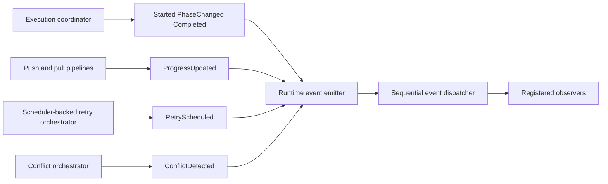

# DataLoom Runtime Operational Events (DL-030)

[API reference index](./README.md)

> **Status:** Available selected operational-event integration. This is not the
> complete V1 observability, telemetry, export, or dashboard subsystem.

This document defines the operational event emitter extension and its
integration with the DataLoom execution runtime, introduced in
`dataloom-runtime` by DL-030.

These components generate and dispatch `SynchronizationEvent.ProgressUpdated`,
`SynchronizationEvent.RetryScheduled`, and
`SynchronizationEvent.ConflictDetected` at durable operation boundaries during
synchronization execution.

---

## Overview

DL-030 extends the DL-029 lifecycle event infrastructure with operational event
capabilities without duplicating event-ID generation, timestamp generation, or
observer dispatch.



This is an in-process callback path. It does not provide the mandatory V1
versioned envelope, durable outbox/delivery, replay, filtering, bounded
back-pressure, schema evolution, consumer bulkheads, metrics, structured logs,
distributed traces, exporters, health aggregation, or operational read
model/reference dashboard.

DL-030 provides:

- `SynchronizationRuntimeEventEmitter` — public interface that extends
  `SynchronizationLifecycleEventEmitter` with three new suspend methods for
  operational events.
- Extended `DispatchingSynchronizationLifecycleEventEmitter` — now also
  implements `SynchronizationRuntimeEventEmitter`, providing `emitProgressUpdated`,
  `emitRetryScheduled`, and `emitConflictDetected` using the same injected
  dispatcher, clock, and ID generator as the lifecycle methods.
- `ProgressUpdated` integration in `OutboundPushSynchronizationPipeline` after
  each durable outbound batch is acknowledged and persisted.
- `ProgressUpdated` integration in `InboundPullSynchronizationPipeline` after
  each durable inbound batch is applied and any required checkpoint is written.
- `RetryScheduled` integration in `SynchronizationRetryOrchestrator` after
  `SchedulerProvider.schedule()` returns success.
- `ConflictDetected` integration in `SynchronizationConflictOrchestrator` after
  `ConflictDetector.detect()` returns an actual conflict and before resolver
  lookup and invocation.

---

## SynchronizationRuntimeEventEmitter

`SynchronizationRuntimeEventEmitter` is a public interface in
`io.dataloom.runtime.execution.lifecycle`.

It extends `SynchronizationLifecycleEventEmitter` and adds:

```kotlin
suspend fun emitProgressUpdated(
    request: SynchronizationRequest,
    progress: SynchronizationProgress,
): SynchronizationEventDispatchResult

suspend fun emitRetryScheduled(
    request: SynchronizationRequest,
    attempt: RetryAttempt,
    delay: SchedulingDelay,
    error: DataLoomError,
): SynchronizationEventDispatchResult

suspend fun emitConflictDetected(
    request: SynchronizationRequest,
    conflict: SynchronizationConflict,
): SynchronizationEventDispatchResult
```

Every method:

1. Calls `IdentifierGenerator.generate()` once to produce a fresh
   `SynchronizationEventId`.
2. Calls `DataLoomClock.now()` once to read the event timestamp.
3. Constructs the exact existing `SynchronizationEvent` variant.
4. Calls `SynchronizationEventDispatcher.dispatch()`.
5. Returns the exact `SynchronizationEventDispatchResult`.
6. Preserves `CancellationException`.

---

## DispatchingSynchronizationLifecycleEventEmitter

`DispatchingSynchronizationLifecycleEventEmitter` now implements both
`SynchronizationLifecycleEventEmitter` and `SynchronizationRuntimeEventEmitter`.

Existing lifecycle behavior (Started, PhaseChanged, Completed) is preserved
unchanged. No existing constructor or public API was altered.

Callers that supply a `DispatchingSynchronizationLifecycleEventEmitter` where
a `SynchronizationRuntimeEventEmitter` is required will receive full operational
event support without any configuration change.

---

## Progress-event semantics

`ProgressUpdated` events represent actual completed and durably persisted
synchronization work.

### Durable batch-completion boundary

Progress is emitted at batch-level boundaries only. One event is emitted at
most per completed batch.

**Outbound:** Progress is emitted only after:

1. A `ChangeSet` was pushed successfully to the transport provider.
2. The push acknowledgement passed validation.
3. The acknowledgement was persisted durably by the storage provider.

**Inbound:** Progress is emitted only after:

1. A `ChangeSet` was applied successfully by the storage provider.
2. When a next checkpoint is required, the checkpoint was written durably.

When no checkpoint write is required, inbound progress may emit after
successful apply.

### Unknown total

The current `SynchronizationProgress` model requires a `total` value when a
percentage is reported. When the total number of batches is not known in
advance, `total` is `null`.

- Do not pass `maxBatchesPerExecution` as the total.
- Do not claim 100% when `hasMore` remains `true`.

### Progress monotonicity

Progress values use cumulative event counts within one pipeline execution.
The `completed` field is non-decreasing across batches. No reset event is
emitted within a single execution.

### No-progress conditions

No progress event is emitted when:

- The initial pull or push returns `NoChanges`.
- A push or apply operation fails.
- Acknowledgement validation fails.
- Acknowledgement persistence fails.
- Checkpoint write fails.
- A progress event follows `Completed`.

### Bidirectional child progress

`BidirectionalSynchronizationPipeline` does not synthesize a separate
bidirectional progress stream. Outbound and inbound child progress events are
preserved in configured execution order. No duplicate progress events, no
synthetic percentage aggregation, and no additional `Started` or `Completed`
event is introduced.

---

## RetryScheduled semantics

`RetryScheduled` is emitted only after:

1. Retry policy evaluation requested retry.
2. The maximum `SchedulingDelay` was selected.
3. `SchedulerProvider.schedule()` returned `ProviderOperationResult.Success`.
4. The exact `ScheduleReceipt` is available.

### Scheduler failure and missing scheduler

- No event for `NOT_REQUIRED`.
- No event for `STOPPED`.
- No event for `SCHEDULER_NOT_CONFIGURED` (scheduler is `null`).
- No event for `SCHEDULER_FAILED` (`ProviderOperationResult.Failure`).
- No event for a thrown scheduler exception.
- `SchedulerProvider.schedule()` is called at most once per evaluation.

### Accepted schedule and cancellation

The schedule has already been accepted when `RetryScheduled` delivery begins.
Cancellation during event delivery does not undo the accepted schedule. No
automatic cancellation is performed.

### Queue-backed retry boundary

Queue-backed retry uses `QueueEntryExecutionOutcome.Reschedule` and must not
call `SchedulerProvider`. A queued `RetryScheduled` event may be emitted only
after the `QueueProvider` reschedule transition has succeeded and sufficient
safe context is available to construct the event correctly.

When sufficient safe context is not available, queue-backed `RetryScheduled`
emission is deferred. Scheduler-backed `RetryScheduled` integration remains
complete. No queue payload decoding occurs solely for event generation.

---

## ConflictDetected semantics

`ConflictDetected` is emitted only after:

1. `ConflictDetector.detect()` executes successfully.
2. `ConflictDetectionResult.ConflictDetected` is returned with an actual
   `SynchronizationConflict`.

The event is emitted before resolver lookup and resolver invocation.

### Resolver-not-configured and resolver-not-found

`ConflictDetected` is emitted regardless of resolver availability. When no
resolver is configured or the named resolver is not found, the event is still
dispatched before the appropriate `ConflictOrchestrationResult` is returned.

### No-event conditions

No `ConflictDetected` event is emitted when:

- No detector is configured or the detector is not found.
- The detector reports `ConflictDetectionResult.NoConflict`.
- The detector throws an exception.

---

## Observer failure isolation

Ordinary `PartiallyDelivered` or `DeliveryFailed` dispatch results do not:

- Change the synchronization result.
- Change the retry orchestration result.
- Change the conflict orchestration result.
- Stop subsequent provider work.
- Trigger event retry.
- Trigger queue rescheduling or another scheduler request.
- Create a `DataLoomError` in business results.

Only `CancellationException` and unexpected event-infrastructure exceptions
interrupt runtime control flow.

---

## Cancellation behavior

`CancellationException` from any of the three operational event deliveries
propagates normally. It is never converted into:

- `SynchronizationResult.Cancelled`
- `RetryOrchestrationResult`
- `ConflictOrchestrationResult`
- `DataLoomError`

When cancellation occurs:

- **During outbound progress delivery:** Durable outbound work is already
  complete. The accepted batch cannot be undone.
- **During inbound progress delivery:** Inbound application and checkpoint
  advancement may already have completed.
- **During `RetryScheduled` delivery:** The schedule has already been accepted.
  It is not cancelled automatically.
- **During `ConflictDetected` delivery:** Resolver lookup and resolution do not
  continue. No conflict result is fabricated.

---

## Event ordering

Accepted synchronization execution:

```
Started
    → PhaseChanged
    → provider operation
    → zero or more ProgressUpdated events
    → further phases and operations
    → Completed
```

Retry flow:

```
retry evaluation
    → SchedulerProvider.schedule() succeeds
    → RetryScheduled
    → return SCHEDULED
```

Conflict flow:

```
ConflictDetector.detect() → conflict found
    → ConflictDetected
    → resolver lookup
    → optional ConflictResolver.resolve()
    → return orchestration result
```

Requirements:

- No progress before `Started`.
- No progress after `Completed`.
- `Completed` remains the final synchronization lifecycle event.
- `RetryScheduled` is emitted only after schedule acceptance.
- `ConflictDetected` is emitted before conflict resolution.
- Event IDs and timestamps follow actual emission order.
- No global ordering across concurrent executions.

---

## Event-ID and timestamp generation

Every `ProgressUpdated`, `RetryScheduled`, and `ConflictDetected` event
receives a new event identifier.

- One `IdentifierGenerator.generate()` call per emitted event.
- No reused lifecycle-event identifier.
- No ID derived from request ID, conflict ID, schedule ID, or queue entry ID.
- No generator call when no event is emitted.
- `DataLoomClock.now()` is read once per emitted event.
- Generator and clock exceptions propagate.

---

## Optional emitter behavior

When `lifecycleEventEmitter` is `null` in `SynchronizationExecutionContext`,
no operational events are emitted. No event-ID generation and no clock read
occur. Existing behavior of all pipelines and orchestrators is preserved.

When the `lifecycleEventEmitter` is a `SynchronizationLifecycleEventEmitter`
but not a `SynchronizationRuntimeEventEmitter`, operational events are
silently skipped. Lifecycle events (Started, PhaseChanged, Completed) continue
to work normally.

---

## No persistence or replay

Events are not persisted. Events are not replayed. No `Flow`, `StateFlow`,
`SharedFlow`, or `Channel` is involved. No background fan-out or buffering
occurs.

---

## Performance restrictions

- At most one progress event per completed batch.
- No one-event-per-entity, no one-event-per-payload-byte patterns.
- No payload copying.
- No serialization.
- No reflection.
- No event buffering.
- No background delivery.
- No owned `CoroutineScope`.
- No dispatcher selection.
- Only bounded event state is allocated.

---

## Security and payload opacity

`SynchronizationEvent.ConflictDetected` carries the `SynchronizationConflict`
reference from the detector. No additional diagnostic objects are created that
expose:

- Local or remote payload bytes.
- Merged payload bytes.
- Metadata values.
- Credentials or authorization headers.
- Checkpoint tokens.
- Encryption keys.
- Personal data.
- Stack traces.

Progress diagnostics include only safe structural fields: event ID, request ID,
progress unit, completed count, and total count (when known).

Retry diagnostics include only: event ID, request ID, `RetryAttempt`,
`SchedulingDelay`, and `ScheduleId`.

Observer exception messages are not stored or forwarded.

---

## KMP compatibility

`SynchronizationRuntimeEventEmitter` uses only Kotlin standard-library and
DataLoom API types. It is safe for use in Kotlin Multiplatform common code.

No Android API, JVM-only API, reflection, `ServiceLoader`, or dependency
injection framework is required.

---

## Related documents

- [Runtime Lifecycle Events (DL-029)](./runtime-lifecycle-events.md)
- [Synchronization Events (DL-016)](./synchronization-events.md)
- [Synchronization Progress (DL-016)](./synchronization-progress.md)
- [Retry Orchestration](./retry-orchestration.md)
- [Conflict Orchestration (DL-025)](./conflict-orchestration.md)
- [Synchronization Event Dispatcher (DL-028)](./synchronization-event-dispatcher.md)
