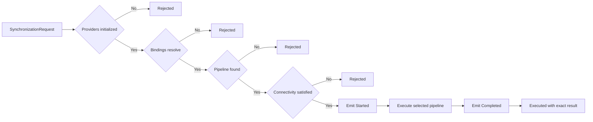

# Synchronization Execution (DL-020)

[API reference index](./README.md)

> **Status:** Available execution foundation with concrete push, pull, and
> bidirectional pipelines. The complete six-strategy V1 engine remains open.

`SynchronizationExecutionCoordinator` connects provider lifecycle
initialization, provider resolution, and direction-based pipeline selection
into a deterministic pre-execution sequence. It delegates synchronization work
to the matching `SynchronizationPipeline` and returns the result unchanged.



Direction selects the current push, pull, or bidirectional execution
primitive. It does not select a complete offline-first, remote-first,
cache-first, network-only, hybrid, or adaptive strategy.

---

## Contracts

### `SynchronizationExecutionContext`

Immutable container passed to a `SynchronizationPipeline` by the coordinator.

```kotlin
public class SynchronizationExecutionContext(
    public val request: SynchronizationRequest,
    public val providers: ResolvedSynchronizationProviders,
    public val runtimeDependencies: RuntimeDependencies,
    public val lifecycleEventEmitter: SynchronizationLifecycleEventEmitter? = null,
)
```

**Construction restrictions:**
- Performs no clock read.
- Generates no identifier.
- Invokes no provider lifecycle operation or provider operation.
- Executes no synchronization work.
- Exposes no mutable collection.

**Security:** `toString()` does not invoke any provider implementation's
`toString()`. It does not expose provider internal state, payload bytes,
checkpoint tokens, credentials, encryption keys, personal data, or stack
traces. The diagnostic representation includes the request session ID,
workflow ID, direction, and provider IDs only.

---

### `SynchronizationPipeline`

Contract for a single synchronization direction pipeline.

```kotlin
public interface SynchronizationPipeline {
    public val direction: SynchronizationDirection

    public suspend fun execute(
        context: SynchronizationExecutionContext,
    ): SynchronizationResult
}
```

- `direction` is the explicit selection key used by `SynchronizationPipelineRegistry`.
- `execute` receives an immutable `SynchronizationExecutionContext` and returns
  an existing `SynchronizationResult` variant.
- Coroutine cancellation propagates normally; implementations must not catch
  `CancellationException`.

The current runtime provides outbound push, inbound pull, and bidirectional
pipeline implementations. Custom pipelines may also be registered by
direction. These pipelines remain lower-level execution primitives rather than
the complete V1 strategy engine.

---

### `SynchronizationPipelineRegistry`

Immutable registry of `SynchronizationPipeline` instances keyed by
`SynchronizationDirection`.

```kotlin
public class SynchronizationPipelineRegistry(
    pipelines: Collection<SynchronizationPipeline>,
) {
    public fun lookup(direction: SynchronizationDirection): SynchronizationPipeline?
    public val pipelines: List<SynchronizationPipeline>
}
```

**Requirements:**
- Accepts application-supplied pipeline instances.
- Defensively copies the caller-provided collection.
- Preserves supplied order for diagnostics.
- Rejects duplicate `SynchronizationDirection` registrations with
  `IllegalArgumentException`.
- Exposes no mutable collection.
- Performs no pipeline execution, provider operation, or lifecycle operation
  during construction.
- Uses no reflection, no `ServiceLoader`, no global registry.

**Selection key:** The explicit `SynchronizationPipeline.direction` property.
Pipelines are never selected by class name, hash order, `toString()`,
`SynchronizationDirection` ordinal, or service discovery.

---

### `SynchronizationExecutionRejectionReason`

Closed set of reasons why the coordinator rejected execution before invoking a
pipeline.

| Value                    | Meaning                                                                  |
|--------------------------|--------------------------------------------------------------------------|
| `PROVIDERS_NOT_INITIALIZED` | `ProviderLifecycleCoordinator` is not in the `INITIALIZED` state.    |
| `PROVIDER_RESOLUTION_FAILED` | `SynchronizationProviderResolver` returned one or more failures.    |
| `PIPELINE_NOT_FOUND`     | No pipeline is registered for the request direction.                     |
| `CONNECTIVITY_PROVIDER_NOT_CONFIGURED` | Connectivity is required but the active bindings resolve no connectivity provider. |
| `CONNECTIVITY_REQUIREMENT_NOT_MET` | The current snapshot does not satisfy the configured requirement. |
| `CONNECTIVITY_CHECK_FAILED` | The connectivity provider returned a canonical error. |

Coroutine cancellation is not a rejection reason and is never converted to one.
Enum ordinals must not be persisted.

---

### `SynchronizationExecutionResult`

Sealed result of an execution attempt.

```kotlin
public sealed interface SynchronizationExecutionResult {

    public data class Executed(
        public val result: SynchronizationResult,
    ) : SynchronizationExecutionResult

    public class Rejected(
        public val reason: SynchronizationExecutionRejectionReason,
        providerBindingFailures: List<ProviderBindingFailure> = emptyList(),
        public val connectivityCheckError: DataLoomError? = null,
    ) : SynchronizationExecutionResult {
        public val providerBindingFailures: List<ProviderBindingFailure>
    }
}
```

**`Executed`:**
- Contains the exact `SynchronizationResult` returned by the pipeline.
- The coordinator does not transform or reinterpret the result.

**`Rejected`:**
- `PROVIDER_RESOLUTION_FAILED` requires a non-empty `providerBindingFailures`
  list.
- All other reasons require an empty `providerBindingFailures` list.
- `CONNECTIVITY_CHECK_FAILED` requires a non-null `connectivityCheckError`.
- All other reasons require a null `connectivityCheckError`.
- Violations throw `IllegalArgumentException`.
- The failure collection is defensively copied.
- Exposes no provider instance, no `Throwable`, and no stack trace.

---

### `SynchronizationExecutionCoordinator`

Orchestrates the deterministic pre-execution sequence.

```kotlin
public class SynchronizationExecutionCoordinator(
    private val lifecycleCoordinator: ProviderLifecycleCoordinator,
    private val providerResolver: SynchronizationProviderResolver,
    private val pipelineRegistry: SynchronizationPipelineRegistry,
    private val runtimeDependencies: RuntimeDependencies,
    private val lifecycleEventEmitter: SynchronizationLifecycleEventEmitter? = null,
    private val connectivityConfiguration: SynchronizationConnectivityConfiguration =
        SynchronizationConnectivityConfiguration.NONE,
    private val connectivityPreflight: SynchronizationConnectivityPreflight =
        SynchronizationConnectivityPreflight(),
) {
    public suspend fun execute(
        request: SynchronizationRequest,
        bindings: SynchronizationProviderBindings,
    ): SynchronizationExecutionResult
}
```

**Execution order (deterministic):**
1. Check `lifecycleCoordinator.state`.
2. If not `INITIALIZED` → `Rejected(PROVIDERS_NOT_INITIALIZED)`.
3. `providerResolver.resolve(bindings)`.
4. If `Failure` → `Rejected(PROVIDER_RESOLUTION_FAILED, failures)`.
5. `pipelineRegistry.lookup(request.direction)`.
6. If `null` → `Rejected(PIPELINE_NOT_FOUND)`.
7. Evaluate the configured connectivity requirement.
8. Return the matching connectivity rejection when it cannot proceed.
9. Construct `SynchronizationExecutionContext`.
10. Emit `Started` when an emitter is configured.
11. Invoke the selected pipeline exactly once.
12. Emit `Completed` when an emitter is configured.
13. Return `Executed(pipelineResult)`.

---

## Execution result versus synchronization result

`SynchronizationExecutionResult` describes the outcome of the coordinator's
pre-execution sequence:

- **`Executed`** — a pipeline ran; contains the `SynchronizationResult` from
  the pipeline.
- **`Rejected`** — a pre-condition was not satisfied; no pipeline ran.

`SynchronizationResult` (from `dataloom-api`) describes the terminal outcome
of the synchronization pipeline itself: `Succeeded`, `PartiallySucceeded`,
`Failed`, `Cancelled`, or `Skipped`. Any variant may appear inside `Executed`.

---

## Rejection paths

### PROVIDERS_NOT_INITIALIZED

```text
Application → SynchronizationExecutionCoordinator.execute()
    → ProviderLifecycleCoordinator.state = NOT_INITIALIZED / SHUT_DOWN / FAILED / ...
    → Rejected(PROVIDERS_NOT_INITIALIZED)
```

### PROVIDER_RESOLUTION_FAILED

```text
Application → SynchronizationExecutionCoordinator.execute()
    → ProviderLifecycleCoordinator.state = INITIALIZED ✓
    → SynchronizationProviderResolver.resolve(bindings) = Failure
    → Rejected(PROVIDER_RESOLUTION_FAILED, [ProviderBindingFailure, ...])
```

### PIPELINE_NOT_FOUND

```text
Application → SynchronizationExecutionCoordinator.execute()
    → ProviderLifecycleCoordinator.state = INITIALIZED ✓
    → SynchronizationProviderResolver.resolve(bindings) = Success ✓
    → SynchronizationPipelineRegistry.lookup(direction) = null
    → Rejected(PIPELINE_NOT_FOUND)
```

---

## Cancellation propagation

`CancellationException` from a pipeline propagates to the caller. The
coordinator does not catch or convert cancellation. It is never converted to
a `Rejected` result or a `SynchronizationResult.Cancelled`.

---

## Exception boundary

Unexpected exceptions from a pipeline propagate to the caller. The coordinator
does not catch arbitrary programming errors, assertion failures, or unexpected
runtime exceptions and does not convert them to
`SynchronizationResult.Failed`.

DL-020 does not define a global exception-mapping strategy.

---

## RuntimeDependencies injection

`RuntimeDependencies` is injected at coordinator construction time and passed
unchanged into each `SynchronizationExecutionContext`. The coordinator does not
read the clock or generate identifiers directly.

---

## Scope restrictions

The coordinator does not:

- Initialize or shut down providers.
- Call provider health automatically.
- Call storage, transport, scheduler, or queue providers directly.
- Call connectivity providers outside the configured preflight boundary.
- Read the clock directly.
- Generate identifiers directly.
- Construct or dispatch events except through the optional injected lifecycle
  emitter.
- Write checkpoints.
- Acknowledge changes.
- Process queues.
- Execute retry logic.
- Detect or resolve conflicts.
- Maintain mutable per-execution state.
- Expose a `CoroutineScope` or choose a dispatcher.
- Use global state, reflection, or service discovery.
- Use a DI framework.

---

## Current pipelines and V1 strategy boundary

The runtime includes concrete outbound push, inbound pull, and bidirectional
pipelines and registers defaults through `DataLoomBuilder`. Pipeline direction
and full/delta mode do not define source authority, cache fallback,
connectivity admission, consistency, or adaptive policy.

The mandatory V1 strategy/effective-plan architecture for offline-first,
remote-first, cache-first, network-only, hybrid, and adaptive execution is not
implemented by this coordinator.

---

## KMP compatibility

All production types in `dataloom-runtime` commonMain use Kotlin
standard-library and DataLoom API and core types only. No Android API, JVM-only
API, Apple-specific API, or third-party library type is required.

---

## Security restrictions

- `toString()` implementations do not expose provider object references,
  credentials, authorization headers, payload bytes, checkpoint tokens,
  encryption keys, personal data, or stack traces.
- `SynchronizationExecutionResult.Rejected` exposes only structural rejection
  reason, `ProviderId`, `ProviderType`, and `ProviderBindingFailureReason`.
  It exposes no provider instance.

---

## Example

```kotlin
// Pre-condition: providers must be initialized.
val lifecycleResult = lifecycleCoordinator.initialize()
check(lifecycleResult is ProviderLifecycleResult.InitializeSuccess)

val request = SynchronizationRequest(
    workflowId = WorkflowId("workflow-001"),
    sessionId = SynchronizationSessionId("session-001"),
    direction = SynchronizationDirection.PUSH,
    mode = SynchronizationMode.DELTA,
    context = executionContext,
)

val bindings = SynchronizationProviderBindings(
    storageProviderId = ProviderId("storage.primary"),
    transportProviderId = ProviderId("transport.prod"),
)

when (val outcome = executionCoordinator.execute(request, bindings)) {
    is SynchronizationExecutionResult.Executed -> {
        when (val result = outcome.result) {
            is SynchronizationResult.Succeeded -> { /* success */ }
            is SynchronizationResult.Failed -> { /* handle error */ }
            // ... other variants
        }
    }
    is SynchronizationExecutionResult.Rejected -> {
        when (outcome.reason) {
            PROVIDERS_NOT_INITIALIZED -> { /* call lifecycleCoordinator.initialize() first */ }
            PROVIDER_RESOLUTION_FAILED -> { /* check outcome.providerBindingFailures */ }
            PIPELINE_NOT_FOUND -> { /* register a pipeline for request.direction */ }
            CONNECTIVITY_PROVIDER_NOT_CONFIGURED -> { /* correct provider bindings */ }
            CONNECTIVITY_REQUIREMENT_NOT_MET -> { /* defer or report unavailable connectivity */ }
            CONNECTIVITY_CHECK_FAILED -> { /* inspect outcome.connectivityCheckError */ }
        }
    }
}
```
