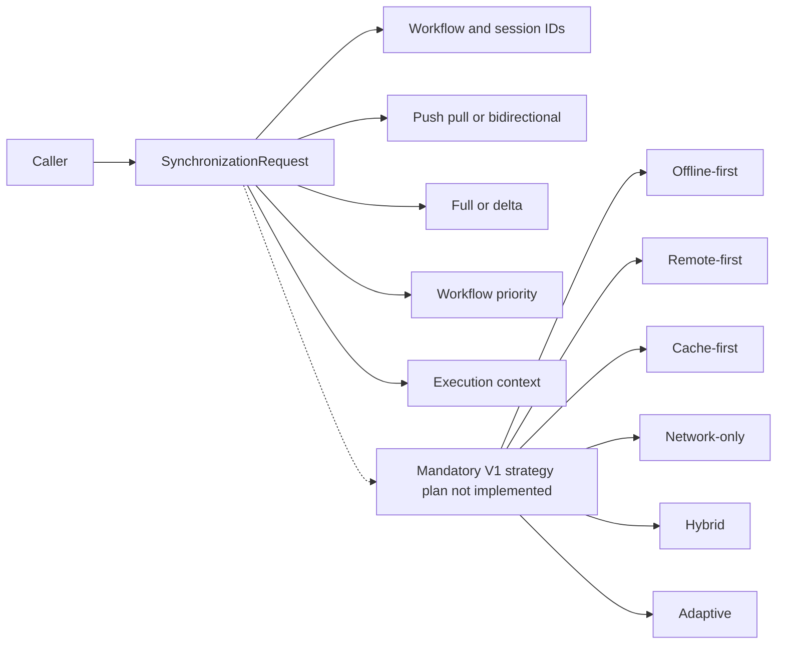

# DataLoom Synchronization Request (DL-005)

[API reference index](./README.md)

> **Status:** Available request contract. It does not yet carry the versioned
> plan required for all six mandatory V1 synchronization strategies.

`SynchronizationRequest` is an immutable public contract in `dataloom-api`
that describes synchronization intent.

Creating a request does not execute or enqueue synchronization.



## Properties

- `workflowId: WorkflowId`
- `sessionId: SynchronizationSessionId`
- `direction: SynchronizationDirection`
- `mode: SynchronizationMode`
- `priority: WorkflowPriority` (defaults to `NORMAL`)
- `context: ExecutionContext`

## Workflow and session identifiers

`workflowId` identifies the logical workflow, and `sessionId` identifies the
associated synchronization session.

## Direction and mode

- Direction: `PUSH`, `PULL`, or `BIDIRECTIONAL`
- Mode: `FULL` or `DELTA`

These values describe intent only.

They do not describe offline-first, remote-first, cache-first, network-only,
hybrid, or adaptive behavior. `FULL`/`DELTA` selects synchronization scope,
not source priority, consistency, fallback, or durability policy. The current
request has no synchronization-strategy field; the versioned V1 strategy and
effective-plan contract is tracked in GitHub issue #102 and
[ADR-0002](../adr/ADR-0002-v1-artifact-and-foundation-architecture.md).

## Priority

Priority defaults to `WorkflowPriority.NORMAL`. Scheduler interpretation is
not currently defined by a complete V1 strategy/effective-plan contract.

## Execution context

`context` carries correlation, tenant, user, version, locale, and metadata
details through `ExecutionContext`.

## Immutability and non-runtime behavior

`SynchronizationRequest` is a pure data contract:

- It does not start synchronization.
- It does not enqueue itself.
- It does not perform persistence, transport, authentication, or connectivity
  checks.

## Placeholder example

```kotlin
val request = SynchronizationRequest(
    workflowId = WorkflowId("workflow-001"),
    sessionId = SynchronizationSessionId("session-001"),
    direction = SynchronizationDirection.BIDIRECTIONAL,
    mode = SynchronizationMode.DELTA,
    priority = WorkflowPriority.NORMAL,
    context = ExecutionContext(
        executionId = ExecutionId("execution-001"),
        correlationId = CorrelationId("corr-001"),
    ),
)
```
