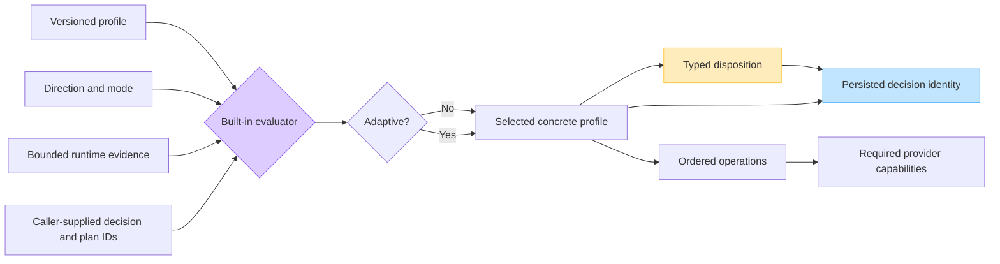
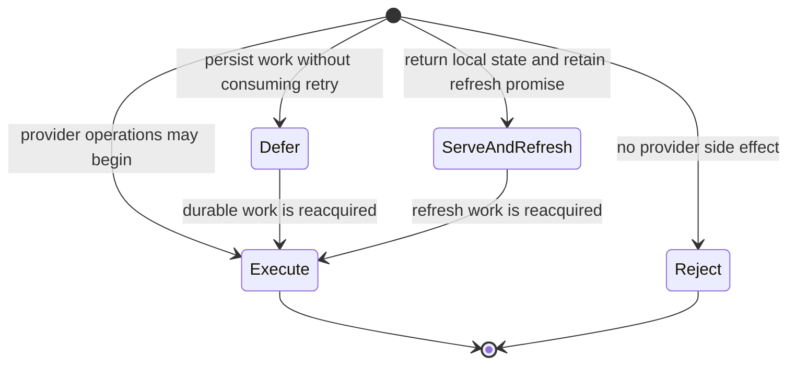
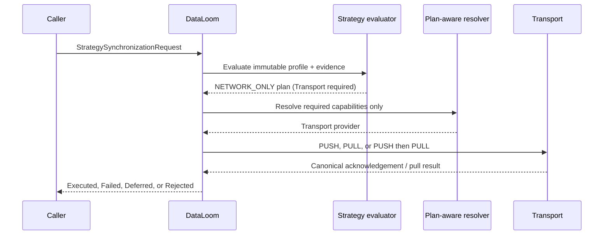

# Synchronization Strategy API

[API index](./README.md) ·
[Strategy guide](../strategies/README.md) ·
[ADR-0002](../adr/ADR-0002-v1-artifact-and-foundation-architecture.md)

DataLoom evaluates synchronization strategy before provider operations. The
evaluation is deterministic: the same immutable profile, direction, mode,
evidence, and identifiers produce the same decision and plan.

## Contract flow



Evaluation performs no provider call, I/O, clock read, identifier generation,
random selection, or mutation. Provider health, connectivity, cache state, and
pending-local-work observations are captured before evaluation and supplied as
`StrategyRuntimeEvidence`.

## Profiles

Every profile has:

- a stable `StrategyProfileId`;
- a positive `StrategyConfigurationVersion`; and
- one `BuiltInSynchronizationStrategy`.

| Profile | Configuration frozen by the contract |
|---|---|
| `OfflineFirstStrategyProfile` | Durable queue requirement and online reconciliation |
| `RemoteFirstStrategyProfile` | Typed fallback allowlist, remote-result persistence, unknown-connectivity policy |
| `CacheFirstStrategyProfile` | Stale policy, fresh-hit refresh, durable refresh |
| `NetworkOnlyStrategyProfile` | Unknown-connectivity handling with queue-backed deferral prohibited |
| `HybridStrategyProfile` | Different primary/fallback sources, persistence, reconciliation, unknown-connectivity policy |
| `AdaptiveStrategyProfile` | Unique finite concrete candidates and optional explicit safe default |

Adaptive candidates cannot contain another adaptive profile. This bounds the
decision graph and prevents recursive or platform-dependent selection.

## Evaluation input

```kotlin
val evaluation = BuiltInSynchronizationStrategyEvaluator().evaluate(
    StrategyEvaluationRequest(
        decisionId = StrategyDecisionId("decision-42"),
        planId = StrategyPlanId("plan-42"),
        profile = CacheFirstStrategyProfile(
            id = StrategyProfileId("timeline-cache"),
            configurationVersion = StrategyConfigurationVersion(3),
            staleCachePolicy = StaleCachePolicy.SERVE_STALE_AND_REFRESH,
            requireDurableRefresh = true,
        ),
        direction = SynchronizationDirection.PULL,
        mode = SynchronizationMode.DELTA,
        evidence = StrategyRuntimeEvidence(
            connectivity = StrategyConnectivity.AVAILABLE,
            cacheState = StrategyCacheState.STALE,
            storageHealth = StrategyProviderHealth.HEALTHY,
            transportHealth = StrategyProviderHealth.HEALTHY,
            queueHealth = StrategyProviderHealth.HEALTHY,
            isBackgroundExecutionAvailable = true,
        ),
    ),
)
```

The caller supplies decision and plan IDs. The evaluator never generates them,
which keeps evaluation replayable and testable.

## Typed output

`StrategyEvaluationResult` contains:

- the exact `StrategyDecisionId`;
- one immutable `StrategyExecutionPlan`; and
- stable, non-sensitive reason codes.

The plan records requested and effective strategy separately. They differ only
when adaptive policy selects a concrete profile.



`DEFER` is a constraint decision, not a failed retry. The retry attempt must not
be incremented when a plan is deferred for connectivity or background
availability.

## Capability derivation

Provider requirements are derived from ordered plan operations:

| Operation | Required capability |
|---|---|
| `READ_LOCAL`, `ACCEPT_LOCAL`, `SERVE_LOCAL`, `PERSIST_REMOTE` | Storage |
| `PUSH_REMOTE`, `PULL_REMOTE` | Transport |
| `ENQUEUE_DURABLE_WORK` | Queue |
| `SCHEDULE_REFRESH` | Queue and scheduler |
| `RECONCILE` | Storage, transport, and conflict state |

Network-only plans are validated at construction. They cannot contain local,
queue, persistence, refresh, or reconciliation operations, and cannot require
storage or queue capabilities.

## Fallback safety

Remote-first fallback is allowlisted by `StrategyRemoteOutcome`. These outcomes
can never be configured as fallback triggers:

- cancellation;
- authentication failure;
- authorization failure;
- validation failure;
- integrity failure; and
- conflict.

Fallback is not inferred from arbitrary exceptions, missing providers,
registration order, or platform name.

## Durable replay

When a plan creates durable work, persist `PersistedStrategyDecision` beside
the encoded work:

```text
decision ID
plan ID
requested strategy
effective profile ID and concrete strategy
configuration version
disposition
```

Retry, lease recovery, process restart, and platform rescheduling must reuse
that identity. Re-evaluation requires a separate authorized transition; a
provider failure or connectivity change cannot silently select another
strategy.

## Current integration boundary

The profile contracts, deterministic planner, plan-aware provider resolution,
and direct network-only execution are implemented in common Kotlin and shared
by native Android, KMP Android, and KMP iOS.

`StrategyProviderBindings` makes every provider role optional. After policy
evaluation, `StrategyProviderResolver` resolves only the capabilities in the
immutable plan. An unused storage, queue, connectivity, or scheduler binding is
not looked up and cannot block a network-only call.



Direct network-only calls use `StrategyOperationInput.DirectTransport`.
Outbound changes are caller-owned for `PUSH` and `BIDIRECTIONAL`; pull filters,
limits, and checkpoints remain caller/remote-owned. The runtime performs no
storage, queue, scheduler, or connectivity-provider operation on this path.

For a bidirectional call, push completes before pull starts. If pull then
fails, `StrategySynchronizationExecutionResult.Failed` records
`PUSH_REMOTE` in `completedOperations` and returns the exact push
acknowledgement in `partialOutput`. Callers can therefore avoid blindly
repeating a completed remote effect.

The legacy `DataLoom.synchronize(SynchronizationRequest)` pipeline remains
available and continues to use `SynchronizationProviderBindings`. Remote-first,
cache-first, offline-first, hybrid, and adaptive runtime execution, durable
decision encoding, and complete strategy event/result enrichment remain
separate integration gates; unsupported effective plans are rejected rather
than silently executed through the legacy pipeline.
