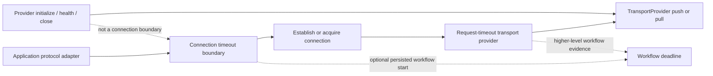

# Transport protocol timeout boundaries

> **Status:** Partial V1 runtime support. Independent connection and request
> boundaries are available. Idle-progress enforcement and protocol-specific
> hard-interruption integrations remain incomplete.

DataLoom does not treat every transport delay as the same timeout. Provider
lifecycle, remote connection establishment, request/response exchange, transfer
idle time, and complete workflow deadlines are distinct ownership boundaries.

## Available boundaries

| Boundary | Public runtime | Owned operation | Timeout result |
|---|---|---|---|
| Provider | `TransportProviderTimeoutRuntime` | Complete provider invocation, including lifecycle | `TRANSPORT_PROVIDER_TIMEOUT` |
| Connection | `TransportConnectionTimeoutRuntime` | Explicit application/protocol connection operation | `TRANSPORT_CONNECTION_TIMEOUT` |
| Request | `TransportRequestTimeoutRuntime` | `TransportProvider.pushChanges` / `pullChanges` | `TRANSPORT_REQUEST_TIMEOUT` |
| Idle | Not yet implemented | No observable transfer progress | Not yet shipped |
| Workflow | Coordinated when original `workflowStartedAt` evidence is supplied | Complete synchronization workflow | `TRANSPORT_WORKFLOW_DEADLINE_EXCEEDED` |

No boundary silently substitutes for another.

## Connection timeout

`TransportConnectionTimeoutRuntime` creates an operation boundary rather than a
`TransportProvider` decorator. This is intentional: provider initialization does
not prove that an HTTP, WebSocket, database, or other remote connection is being
established.

An application protocol adapter wraps only its exact suspending connection
operation:

```kotlin
val connectionBoundary = TransportConnectionTimeoutRuntime.create(
    clock = clock,
    connectionTimeout = SchedulingDelay(5_000L),
    workflowTimeout = SchedulingDelay(30_000L),
)

val result = connectionBoundary.execute(
    workflowStartedAt = persistedWorkflowStartedAt,
) {
    protocolAdapter.establishConnection()
}
```

The operation returns a canonical `ProviderOperationResult<T>`. Completed success
or failure results are preserved exactly.

A connection timeout is `Recoverability.RECOVERABLE` because this boundary owns
only establishment or acquisition of a connection. It does not own a
synchronization request/response exchange. A caller must still apply its retry
policy, attempt budget, circuit state, and connectivity constraints before
retrying.

## Request timeout

`TransportRequestTimeoutRuntime` decorates a `TransportProvider` and applies the
request boundary only to `pushChanges` and `pullChanges`:

```kotlin
val requestTimedTransport = TransportRequestTimeoutRuntime.create(
    transportProvider = transportProvider,
    clock = clock,
    requestTimeout = SchedulingDelay(10_000L),
)
```

`initialize`, `health`, and `close` remain unchanged. A request timeout uses
`Recoverability.UNKNOWN`: cooperative cancellation does not prove that a remote
participant failed to process the request, so automatic replay requires explicit
idempotency or reconciliation evidence.

## Boundary flow



## Workflow precedence

A connection boundary may receive the original persisted `workflowStartedAt` and
a configured workflow timeout.

- An already expired workflow fails before invoking the connection operation.
- A clock observation earlier than the workflow start fails closed.
- When the remaining workflow window is shorter than the connection timeout, the
  workflow limit wins.
- A timeout selected as `RetryTimeoutKind.WORKFLOW` is reported as
  `TRANSPORT_WORKFLOW_DEADLINE_EXCEEDED`, never relabeled as a connection
  timeout.
- Omitting `workflowStartedAt` means the connection boundary enforces only its
  connection limit; it does not invent a workflow start time.

## Cancellation and interruption

The production common runtime uses `CoroutineRetryTimeoutExecutor` and structured
cooperative cancellation. Caller cancellation and unexpected exceptions
propagate unchanged. A blocking operation that never reaches a suspension or
other cancellation checkpoint cannot be hard-interrupted by common code and
requires an explicit platform/protocol integration.

## Construction guarantees

Creating either production timeout runtime performs no provider or protocol
operation, clock read, timeout execution, I/O, identifier generation, dispatcher
selection, or coroutine launch.

## Safety rules

1. Do not wrap `TransportProvider.initialize()` and call it a connection timeout.
2. Do not automatically replay a timed-out request.
3. Do not infer a workflow start time at a nested protocol boundary.
4. Do not reuse provider, request, or workflow configuration as an idle timeout.
5. Do not swallow caller cancellation or unexpected programming exceptions.
6. Do not expose protocol-specific request, response, socket, or connection types
   through the shared DataLoom public API.

## Remaining V1 work

- idle-progress timeout contracts and protocol integrations;
- protocol/platform hard-interruption adapters where cooperative cancellation is
  insufficient;
- durable workflow-start propagation through all queue, retry, restart, and
  relaunch paths;
- contention, process-loss, connectivity-change, and failure-injection evidence;
- complete native Android, KMP Android, and KMP iOS reference-flow qualification.
