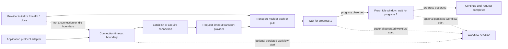

# Transport protocol timeout boundaries

> **Status:** Partial V1 runtime support. Independent provider, connection,
> request, idle-progress, and workflow-coordination boundaries are available.
> Protocol-specific hard-interruption integrations and complete platform
> reference-flow qualification remain incomplete.

DataLoom does not treat every transport delay as the same timeout. Provider
lifecycle, remote connection establishment, request/response exchange, transfer
idle time, and complete workflow deadlines are distinct ownership boundaries.

## Available boundaries

| Boundary | Public runtime | Owned operation | Timeout result |
|---|---|---|---|
| Provider | `TransportProviderTimeoutRuntime` | Complete provider invocation, including lifecycle | `TRANSPORT_PROVIDER_TIMEOUT` |
| Connection | `TransportConnectionTimeoutRuntime` | Explicit application/protocol connection operation | `TRANSPORT_CONNECTION_TIMEOUT` |
| Request | `TransportRequestTimeoutRuntime` | `TransportProvider.pushChanges` / `pullChanges` | `TRANSPORT_REQUEST_TIMEOUT` |
| Idle | `TransportIdleTimeoutRuntime` | One explicit wait for the next observable progress signal | `TRANSPORT_IDLE_TIMEOUT` |
| Workflow | Coordinated when original `workflowStartedAt` evidence is supplied | Complete synchronization workflow | `TRANSPORT_WORKFLOW_DEADLINE_EXCEEDED` |

No boundary silently substitutes for another.

## Connection timeout

`TransportConnectionTimeoutRuntime` creates an operation boundary rather than a
`TransportProvider` decorator. This is intentional: provider initialization does
not prove that an HTTP, WebSocket, database, or other remote connection is being
established.

An application protocol adapter wraps only its exact suspending connection
operation:

```kotlin
val connectionBoundary = TransportConnectionTimeoutRuntime.create(
    clock = clock,
    connectionTimeout = SchedulingDelay(5_000L),
    workflowTimeout = SchedulingDelay(30_000L),
)

val result = connectionBoundary.execute(
    workflowStartedAt = persistedWorkflowStartedAt,
) {
    protocolAdapter.establishConnection()
}
```

The operation returns a canonical `ProviderOperationResult<T>`. Completed success
or failure results are preserved exactly.

A connection timeout is `Recoverability.RECOVERABLE` because this boundary owns
only establishment or acquisition of a connection. It does not own a
synchronization request/response exchange. A caller must still apply its retry
policy, attempt budget, circuit state, and connectivity constraints before
retrying.

## Request timeout

`TransportRequestTimeoutRuntime` decorates a `TransportProvider` and applies the
request boundary only to `pushChanges` and `pullChanges`:

```kotlin
val requestTimedTransport = TransportRequestTimeoutRuntime.create(
    transportProvider = transportProvider,
    clock = clock,
    requestTimeout = SchedulingDelay(10_000L),
)
```

`initialize`, `health`, and `close` remain unchanged. A request timeout uses
`Recoverability.UNKNOWN`: cooperative cancellation does not prove that a remote
participant failed to process the request, so automatic replay requires explicit
idempotency or reconciliation evidence.

## Idle-progress timeout

`TransportIdleTimeoutRuntime` does not wrap a whole request. It creates a boundary
for one explicit suspending wait for the next adapter-defined progress signal:

```kotlin
val idleBoundary = TransportIdleTimeoutRuntime.create(
    clock = clock,
    idleTimeout = SchedulingDelay(15_000L),
    workflowTimeout = SchedulingDelay(30_000L),
)

while (!transfer.isComplete) {
    val progress = idleBoundary.awaitProgress(
        workflowStartedAt = persistedWorkflowStartedAt,
    ) {
        protocolAdapter.awaitNextChunkOrHeartbeat()
    }
    transfer.accept(progress)
}
```

A progress signal may be a received or transmitted chunk, frame,
acknowledgement, heartbeat, or another bounded event defined by the protocol
adapter. DataLoom does not expose those protocol-specific types through its
shared API.

Each completed `awaitProgress` call ends one idle window. The next call begins a
fresh window. Therefore a long transfer remains valid while progress continues,
even when total request duration is greater than the idle limit.

An idle timeout uses `Recoverability.UNKNOWN`: cancellation does not prove the
final remote transfer state or whether the peer will subsequently complete the
request. Automatic replay requires explicit idempotency or reconciliation
evidence.

Do not wrap an entire request in `awaitProgress`. Doing so would be a request
timeout mislabeled as an idle timeout.

## Boundary flow



## Workflow precedence

Connection and idle boundaries may receive the original persisted
`workflowStartedAt` and a configured workflow timeout.

- An already expired workflow fails before invoking the nested operation.
- A clock observation earlier than the workflow start fails closed.
- When the remaining workflow window is shorter than the connection or idle
  timeout, the workflow limit wins.
- A timeout selected as `RetryTimeoutKind.WORKFLOW` is reported as
  `TRANSPORT_WORKFLOW_DEADLINE_EXCEEDED`, never relabeled as a connection or idle
  timeout.
- Omitting `workflowStartedAt` means the nested boundary enforces only its own
  limit; it does not invent a workflow start time.

## Cancellation and interruption

The production common runtime uses `CoroutineRetryTimeoutExecutor` and structured
cooperative cancellation. Caller cancellation and unexpected exceptions
propagate unchanged. A blocking operation that never reaches a suspension or
other cancellation checkpoint cannot be hard-interrupted by common code and
requires an explicit platform/protocol integration.

## Construction guarantees

Creating any production transport timeout runtime performs no provider or
protocol operation, clock read, timeout execution, I/O, identifier generation,
dispatcher selection, or coroutine launch.

## Safety rules

1. Do not wrap `TransportProvider.initialize()` and call it a connection timeout.
2. Do not wrap a whole request and call it an idle timeout.
3. Do not automatically replay a timed-out request or idle-stalled transfer.
4. Do not infer a workflow start time at a nested protocol boundary.
5. Do not reuse provider, connection, request, or workflow configuration as an
   idle timeout.
6. Do not swallow caller cancellation or unexpected programming exceptions.
7. Do not expose protocol-specific request, response, socket, connection, chunk,
   frame, or heartbeat types through the shared DataLoom public API.

## Remaining V1 work

- protocol/platform hard-interruption adapters where cooperative cancellation is
  insufficient;
- durable workflow-start/deadline propagation through every remaining queue,
  retry, restart, and relaunch path;
- contention, process-loss, connectivity-change, long-running transfer, and
  failure-injection evidence;
- complete native Android, KMP Android, and KMP iOS reference-flow qualification.
