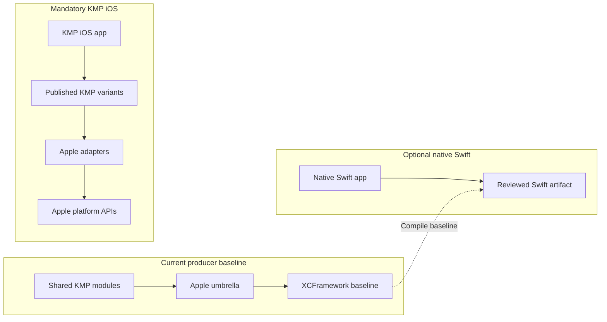

# Apple platform guide

> **Audience:** KMP iOS consumers, Apple integrators, and DataLoom maintainers
> **Purpose:** Separate the current Apple producer baseline from mandatory V1
> KMP iOS support and optional native Swift distribution
> **Status:** Apple targets, shared tests, XCFramework assembly, and Swift
> compile smoke exist; production KMP iOS support does not

[Project overview](../../README.md) ·
[Platform strategy](../architecture/platform-strategy.md) ·
[Local build guide](../development/building.md)

DL-036 established Apple compilation and packaging mechanics. It did not add
Apple connectivity, background scheduling, persistence, lifecycle ownership,
or a production iOS consumer.

Native Android, KMP Android, and KMP iOS are mandatory V1 consumer paths.
Native Swift is optional and must be qualified separately if distributed. The
six V1 synchronization profiles—offline-first, remote-first, cache-first,
network-only, hybrid, and adaptive—remain target behavior rather than a claim
about the current Apple baseline. See
[ADR-0002](../adr/ADR-0002-v1-artifact-and-foundation-architecture.md).

## Guide map

| Guide | Use it for |
|---|---|
| [Apple targets](apple-targets.md) | Declared architectures, source sets, and host gating |
| [Apple testing](apple-testing.md) | Current simulator coverage and missing platform qualification |
| [XCFramework integration](xcframework-integration.md) | Assembly and compile-only Xcode integration |
| [Swift interoperability](swift-interop.md) | Current Objective-C/Swift bridge and known API defects |
| [Swift smoke fixture](../../apple-smoke/README.md) | Reproduce the selected-symbol compile check |

## Consumer-path topology

KMP iOS applications consume KMP variants and future `dataloom-ios` adapters;
they do not use the XCFramework as their KMP dependency mechanism.

## What exists now

- `iosArm64`, `iosSimulatorArm64`, and `iosX64` targets in the relevant shared
  modules on macOS hosts.
- Shared `iosMain` and `iosTest` hierarchy.
- Fake-backed `iosSimulatorArm64` tests for shared Kotlin code.
- A static `DataLoom` XCFramework assembled by `dataloom-apple`.
- A Swift fixture that compiles selected currently exported symbols.
- `dataloom-testing` excluded from the XCFramework.

## Mandatory V1 KMP iOS gaps

- Apple connectivity and background-scheduling providers.
- Apple runtime/lifecycle ownership and process-relaunch restoration.
- Durable queue, retry/circuit, conflict, outbox, asset-session, audit, and
  administration state.
- Keychain/data-protection integration and secure key references.
- Bounded file and asset handling, cleanup, integrity, and resume.
- Published KMP iOS variants, `dataloom-ios`, and an executable external
  consumer.
- Foreground, offline, cancellation, background, relaunch, migration, and
  degraded-capability tests.
- Behavioral parity for every required strategy across native Android, KMP
  Android, and KMP iOS.

## Optional native Swift decisions

The following do not block KMP iOS unless the project chooses to ship a native
Swift distribution:

- CocoaPods publication.
- Remote Swift Package Manager publication.
- App Store signing and packaging.
- A reviewed Swift concurrency adapter or experimental Swift export.

## Current support matrix

| Consumer or target | Current evidence | V1 meaning |
|---|---|---|
| `iosArm64` | Producer compilation and XCFramework device slice | Device runtime qualification missing |
| `iosSimulatorArm64` | Shared fake-backed tests and simulator slice | Real adapter and executable-consumer tests missing |
| `iosX64` | Producer compilation and merged simulator slice | Runtime qualification missing |
| KMP iOS consumer | No external executable fixture | Mandatory V1 gate |
| KMP Android consumer | No explicit Android KMP target/fixture | Mandatory V1 gate |
| Native Swift consumer | Selected-symbol compile smoke | Optional distribution, not production support |
