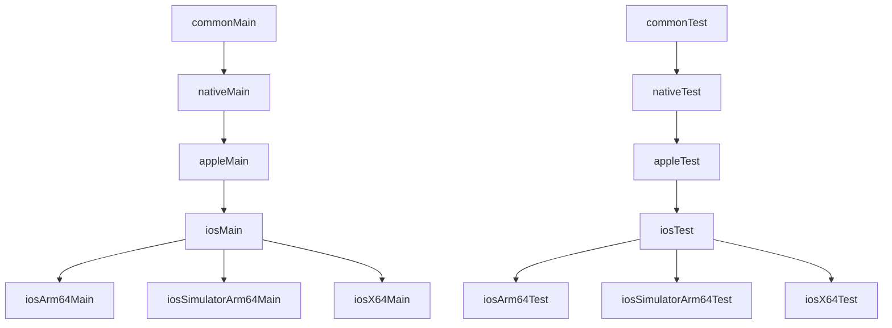

# Apple compilation targets

> **Audience:** KMP maintainers and contributors changing the Apple build graph
> **Purpose:** Record declared targets, source-set hierarchy, and host
> restrictions
> **Status:** Producer compilation baseline; not a production iOS support claim

[← Apple guide](README.md) ·
[Apple testing](apple-testing.md) ·
[XCFramework integration](xcframework-integration.md)

## Declared targets

Every relevant KMP module declares these targets on a macOS host:

| Target | Architecture | Build purpose |
|---|---|---|
| `iosArm64` | ARM64 | Physical iPhone and iPad framework slice |
| `iosSimulatorArm64` | ARM64 | Apple-silicon iOS Simulator |
| `iosX64` | x86_64 | Intel iOS Simulator and merged simulator compatibility |

Explicit target functions are used; deprecated presets and the old `ios()`
shortcut are not.

These are producer targets. Their presence does not prove Apple lifecycle,
connectivity, persistence, background execution, device behavior, packaging,
or end-to-end consumer support.

## Source-set hierarchy

Kotlin 2.4.10 applies the default hierarchy template to the declared targets:



Put platform-neutral production code in `commonMain`. Use `iosMain` only for
behavior shared by all declared iOS targets, and use a target-specific source
set only when architecture-specific behavior is unavoidable.

## Modules

| Module | Apple role |
|---|---|
| `dataloom-model` | Dependency-root models and clock primitives |
| `dataloom-api` | Current public contracts; not yet V1-frozen |
| `dataloom-core` | Platform-independent foundations |
| `dataloom-runtime` | Runtime facade and orchestration foundations |
| `dataloom-testing` | Shared test utilities; excluded from XCFramework |
| `dataloom-apple` | Static XCFramework umbrella/export module |

## Host gating

The shared convention plugin declares Apple targets only on macOS. The root
settings also include `dataloom-apple` only on macOS.

This gate exists because Kotlin/Native linking, iOS Simulator execution,
`lipo`, and XCFramework assembly need Xcode and Apple SDKs. Linux and Windows
therefore see the JVM targets only.

The configuration lives in:

```text
build-logic/src/main/kotlin/io.dataloom.kotlin.multiplatform-library.gradle.kts
```

## Why `iosX64` is present

The current Kotlin 2.4.10 and macOS validation environment compile `iosX64`.
It contributes the x86_64 architecture to the combined simulator framework
slice. Removing it changes the approved compatibility matrix and requires an
ADR plus replacement evidence.

## Common-code boundary

Shared code must not read the system clock, generate random identifiers, or
import Android/JVM/Apple APIs directly. Current abstractions such as
`DataLoomClock` and `IdentifierGenerator` keep those dependencies explicit.
Passing compilation is necessary evidence, but it does not replace real Apple
adapter and consumer tests.

## Related documentation

- [Apple testing](apple-testing.md)
- [XCFramework integration](xcframework-integration.md)
- [Module architecture](../architecture/modules.md)
