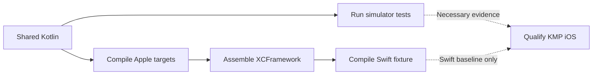

# Apple testing

> **Audience:** Contributors validating shared Kotlin code on Apple targets
> **Purpose:** Define the current macOS test flow and distinguish it from V1
> platform qualification
> **Status:** Shared fake-backed simulator coverage exists; real Apple adapter
> and executable-consumer coverage does not

[← Apple guide](README.md) ·
[Apple targets](apple-targets.md) ·
[Swift smoke fixture](../../apple-smoke/README.md)

## What the current lane proves

Shared `commonTest` suites run on the Apple-silicon iOS Simulator. This proves
that the covered Kotlin logic compiles and behaves consistently on
Kotlin/Native under fake-backed tests.

It does not prove real iOS lifecycle, networking, persistence, files,
Keychain, background tasks, termination/relaunch, assets, or a production
consumer.

## Build and test flow



## Run shared simulator tests

Run from the repository root on macOS:

```bash
./gradlew \
    :dataloom-model:iosSimulatorArm64Test \
    :dataloom-api:iosSimulatorArm64Test \
    :dataloom-core:iosSimulatorArm64Test \
    :dataloom-runtime:iosSimulatorArm64Test \
    :dataloom-testing:iosSimulatorArm64Test
```

The tasks do not exist on Linux or Windows because Apple targets are not
declared there.

## Current coverage

| Area | Current shared evidence |
|---|---|
| Model, API, core, runtime, testing modules | Their `commonTest` suites run on `iosSimulatorArm64` |
| Facade construction | `DataLoomRuntimeModuleTest` and related tests |
| Provider lifecycle | `ProviderLifecycleCoordinatorTest` |
| Inbound, outbound, and bidirectional orchestration | Shared pipeline tests |
| Retry foundations | Evaluator and orchestrator tests |
| Queue processing and submission | Durable processor and submission tests |
| Conflict foundations | Detector/resolver orchestration tests |
| Events | Dispatcher and runtime-emitter tests |
| Connectivity preflight | Shared fake-provider tests |

The exact test inventory evolves with source. This table describes categories,
not a frozen list of test class names.

## Determinism requirements

Apple shared tests must remain:

- deterministic, with injected clocks and identifier generators;
- isolated from mutable global state;
- independent of production services and credentials;
- explicit about caller-serialized mutable test utilities;
- free of real network, database, Keychain, filesystem, and background-task
  side effects unless placed in a dedicated platform integration fixture.

Use `FixedDataLoomClock`, `MutableDataLoomClock`,
`SequenceIdentifierGenerator`, and the other
[`dataloom-testing` utilities](../testing/testing-toolkit.md).

## Additional producer checks

The repository's
[Apple Platform Validation workflow](../../.github/workflows/apple-validation.yml)
also compiles all three targets, validates Kotlin/KLib ABI, assembles the
XCFramework, compiles the Swift smoke fixture, and runs the shared regression
suite. This documentation does not trigger that workflow.

For local XCFramework and Swift commands, see
[XCFramework integration](xcframework-integration.md) and the
[smoke fixture](../../apple-smoke/README.md).

## V1 qualification still required

| Required area | Evidence still missing |
|---|---|
| KMP iOS consumer | External executable application using published-style variants |
| Apple providers | Real connectivity, scheduling, persistence, security, and lifecycle tests |
| Recovery | Interruption, process termination, lease expiry, relaunch, and migration |
| Assets | Bounded streaming, cleanup, integrity, resume, and storage-pressure behavior |
| Strategy profiles | Offline-first, remote-first, cache-first, network-only, hybrid, and adaptive parity |
| Platform matrix | Approved device/simulator and degraded-capability coverage |

Optional native Swift runtime testing is a separate distribution gate. It does
not replace mandatory KMP iOS qualification.
