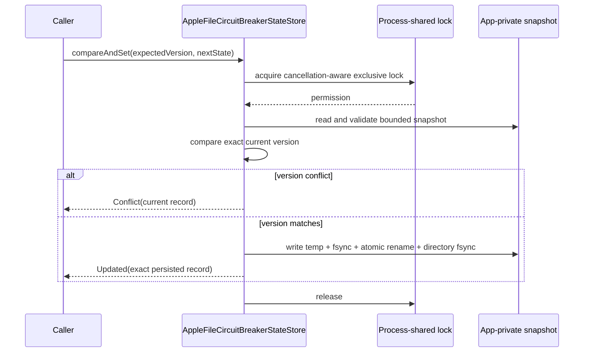

# Apple circuit-breaker state store

> **Status:** Production KMP Apple circuit-state persistence is available as a
> bounded file-backed compare-and-set store. This does not complete Apple queue,
> retry-budget, outbox, conflict, audit, or administration persistence.

`AppleFileCircuitBreakerStateStore` is the Apple implementation of
`CircuitBreakerStateStore`. It is available from the `iosArm64`,
`iosSimulatorArm64`, and `iosX64` variants of `dataloom-runtime` and is exported
through the current `DataLoom` XCFramework.

## Create the store

Supply an absolute, application-private directory, normally a dedicated child of
Application Support:

```kotlin
val circuitStore = AppleFileCircuitBreakerStateStore(
    directoryPath = applicationSupportDirectory + "/DataLoom/Circuit",
)
```

The constructor performs no file access. The directory and lock file are created
lazily on the first `load` or `compareAndSet` operation.

The default snapshot name is:

```text
dataloom-circuit-state-v1.tsv
```

A custom file name may be supplied when an application intentionally separates
independent DataLoom environments. The file name must be one path component.

## Durability and CAS model

Every operation acquires one process-shared advisory lock for the configured
snapshot. Lock acquisition uses non-blocking attempts with coroutine cancellation
checks. A successful update writes a complete temporary snapshot, calls `fsync`,
atomically renames the temporary file over the previous snapshot, and then
fsyncs the parent directory so the renamed directory entry is durable.



A null expected version means that no record may already exist. Record versions
start at zero and increment by one. `Long.MAX_VALUE` is rejected before file
access with `CIRCUIT_STATE_VERSION_EXHAUSTED`.

## Stored data

The snapshot contains only the bounded circuit fields required by the public
state model:

- exact circuit scope kind and identifiers;
- phase;
- failure count and failure-window timestamp;
- open deadline;
- probe generation, active-probe marker, and probe lease deadline;
- update timestamp; and
- record version.

Identifiers are UTF-8 hex encoded before entering the tab-separated snapshot.
The store does not persist payloads, credentials, headers, exception messages,
provider values, checkpoints, or arbitrary metadata.

## Integrity and resource limits

The complete snapshot is capped at 4 MiB. Oversized state fails closed as
`CIRCUIT_APPLE_STATE_LIMIT_EXCEEDED`. Invalid headers, invalid UTF-8, duplicate
scopes, malformed numbers, impossible scope shapes, and invalid circuit-state
invariants fail as `CIRCUIT_APPLE_STATE_CORRUPT`.

Neither error includes snapshot content or an underlying exception.

| Condition | Error code | Category | Recoverability |
|---|---|---|---|
| File/directory/lock/read/write failure | `CIRCUIT_APPLE_FILE_IO_FAILURE` | `STORAGE` | `RECOVERABLE` |
| Corrupt persisted state | `CIRCUIT_APPLE_STATE_CORRUPT` | `STATE` | `NON_RECOVERABLE` |
| Snapshot exceeds 4 MiB | `CIRCUIT_APPLE_STATE_LIMIT_EXCEEDED` | `STATE` | `NON_RECOVERABLE` |
| Record version exhausted | `CIRCUIT_STATE_VERSION_EXHAUSTED` | `STATE` | `NON_RECOVERABLE` |

## Cancellation and synchronous I/O

Waiting for the process-shared lock is cancellation-aware. Once the lock is
owned, POSIX reads, writes, `fsync`, and `rename` are synchronous. The 4 MiB cap
bounds the non-suspending section, but common Kotlin cancellation cannot hard-
interrupt a syscall already executing.

Applications should call the store from an execution context suitable for file
I/O. A future Apple runtime integration may own dispatcher selection; this store
does not launch coroutines or select a global dispatcher itself.

## Directory and protection requirements

The directory path must:

- be absolute;
- be inside an application-private container;
- not contain `.` or `..` traversal segments; and
- not be the filesystem root.

New directories are created with owner-only permissions. The store does not
choose an iOS Data Protection class, app-group container, backup-exclusion flag,
or Keychain policy. The host application remains responsible for selecting an
appropriate container and applying its platform security policy.

Using the same snapshot from separate processes requires every participant to
use this store and the same directory/file name. Uncoordinated external writers
are unsupported.

## Supported and remaining evidence

Implemented evidence:

- exact create/update/conflict compare-and-set behavior;
- persistence across new store instances;
- two-instance first-writer contention;
- all public circuit scope shapes, including Unicode identifiers;
- half-open probe generation and lease restoration;
- corruption fail-closed behavior;
- cancellation propagation;
- iOS Simulator tests;
- external `iosArm64`, `iosSimulatorArm64`, and `iosX64` compilation;
- Kotlin/Native ABI and XCFramework/Swift export validation.

Still required for full KMP iOS V1 acceptance:

- durable Apple queue and retry-budget ownership;
- process-relaunch executable app evidence, not only a new store instance in one
  test process;
- app-group and Data Protection integration guidance/evidence;
- high-contention and forced-process-death fault injection;
- migration behavior if the file format changes;
- integration with authorized circuit administration and operational telemetry;
- complete KMP iOS synchronization reference flows.
