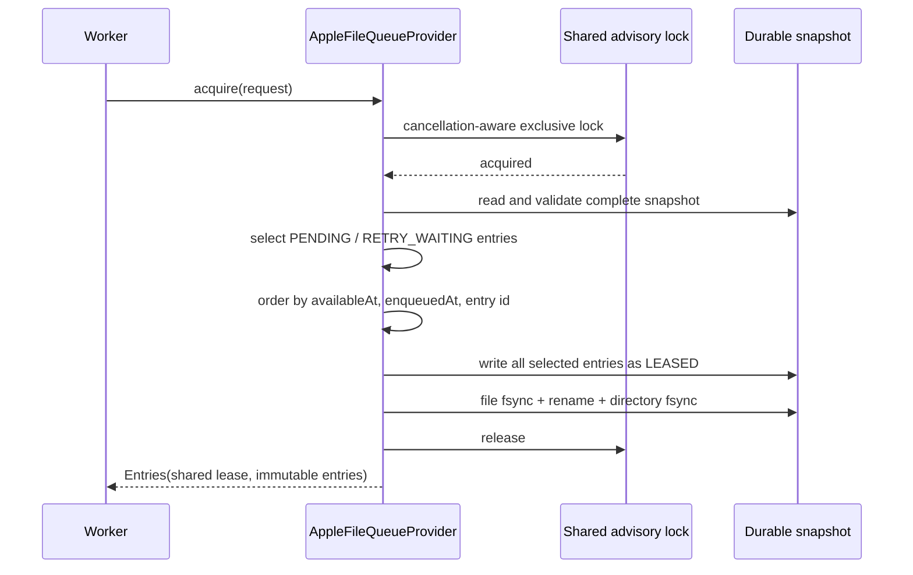

# Apple durable queue provider

> **Status:** Production KMP Apple queue persistence is available as a bounded,
> file-backed `QueueProvider`. This completes the platform persistence boundary
> for queue entries, retry attempts, retry budgets, availability, leases, and
> immutable workflow deadlines. It does not complete Apple background
> scheduling, executable process-relaunch qualification, administration stores,
> or full KMP iOS synchronization flows.

`AppleFileQueueProvider` is the Apple implementation of `QueueProvider`. It is
available from the `iosArm64`, `iosSimulatorArm64`, and `iosX64` variants of
`dataloom-runtime` and is exported through the current `DataLoom` XCFramework.

## Create the provider

Supply a dedicated application-private directory, normally under Application
Support:

```kotlin
val queueProvider = AppleFileQueueProvider(
    directoryPath = applicationSupportDirectory + "/DataLoom/Queue",
)
```

The constructor validates strings only. It does not create a directory, open a
file, acquire a lock, launch a coroutine, or read a clock. Files are created
lazily by the first operation.

The default snapshot name is:

```text
dataloom-queue-state-v1.tsv
```

A custom file name must be one safe path component.

## Atomic queue model

Every provider operation acquires one process-shared advisory lock for the
configured snapshot. Acquisition reads eligible entries, selects a bounded batch,
applies one shared lease, writes the complete replacement snapshot, and returns
the leased entries while still inside that critical section.



This avoids a read-then-lease race. Separate provider instances and cooperating
application processes using the same directory and file name serialize through
the same lock.

## State transitions

| Operation | Guard | Durable result |
|---|---|---|
| `enqueue` | Entry id must be absent | Stores a new `PENDING` entry and clears supplied `lastError` |
| `acquire` | Entry is eligible at `acquiredAt` | Atomically stores `LEASED`, one shared lease, and clears `lastError` |
| `complete` | Exact active lease | Stores `COMPLETED`, clears lease and error |
| `reschedule` | Exact active lease | Stores `RETRY_WAITING`, attempt, budget, availability, and sanitized error |
| `defer` | Exact active lease | Clears lease/error, preserves retry history and budget, returns to `PENDING` or `RETRY_WAITING` |
| `fail` | Exact active lease | Stores `FAILED` or `DEAD_LETTER`, clears lease, retains sanitized error |
| `cancel` | Entry is `PENDING` or `RETRY_WAITING` | Stores `CANCELLED` |
| `recoverExpiredLeases` | Persisted lease expiry is earlier than current time | Clears lease/error and restores `PENDING` or `RETRY_WAITING` without changing retry history |

A stale or mismatched lease returns `QUEUE_STALE_LEASE`. Terminal or leased work
cannot be cancelled through the ordinary cancellation operation.

## Persisted evidence

The complete queue entry is reconstructed after restart, including:

- queue entry, workflow, session, execution, correlation, trace, request,
  tenant, user, locale, runtime, and configuration identifiers;
- synchronization direction, mode, and priority;
- execution-context and queue-entry metadata;
- lifecycle state, enqueue time, and next availability;
- retry attempt, retry-window start, most recent evaluation, and cumulative
  accepted delay;
- immutable workflow start and absolute deadline;
- active lease id, consumer, acquisition time, and expiry;
- canonical error code, category, severity, recoverability, and sanitized
  message.

String values are UTF-8 hexadecimal encoded. Metadata keys are deterministically
ordered and encoded separately from values. No JSON library or Foundation type
is exposed through the public contract.

The provider does not persist raw exception text, stack traces, credentials,
tokens, encryption keys, provider instances, or arbitrary payload bodies.
Applications must follow the same metadata safety rules as the shared API.

## Durability and resource bounds

Mutations use the following sequence:

1. acquire the shared lock;
2. read and strictly validate the current snapshot;
3. construct the complete next snapshot;
4. write an owner-only temporary file;
5. `fsync` and close that file exactly once;
6. atomically rename it over the prior snapshot; and
7. `fsync` the parent directory before reporting success.

The snapshot is bounded to 32 MiB and 10,000 entries. These are implementation
safety limits, not public tuning parameters. An exceeded limit fails closed
instead of partially writing or silently dropping work.

A failure after rename but before directory synchronization is returned as an
explicit storage failure. The provider does not claim rollback or transparently
repeat an ambiguous mutation.

## Integrity validation

The format has a versioned header and exactly 35 fields per entry. On every read,
the provider validates:

- header and field count;
- strict UTF-8 and hexadecimal encoding;
- enum names and numeric values;
- complete-or-null retry budget, workflow deadline, lease, and error groups;
- unique queue entry ids;
- `QueueEntry`, `QueueLease`, `RetryBudgetState`, and `WorkflowTimeoutState`
  constructor invariants; and
- complete snapshot and entry-count limits.

Malformed or impossible state is not reset automatically. It returns a bounded,
redacted non-recoverable error.

| Condition | Error code | Category | Recoverability |
|---|---|---|---|
| Duplicate entry | `QUEUE_DUPLICATE_ENTRY` | `QUEUE` | `NON_RECOVERABLE` |
| Stale or mismatched lease | `QUEUE_STALE_LEASE` | `QUEUE` | `NON_RECOVERABLE` |
| Cancellation rejected | `QUEUE_CANCELLATION_REJECTED` | `QUEUE` | `NON_RECOVERABLE` |
| Directory, lock, read, write, fsync, close, or rename failure | `QUEUE_APPLE_FILE_IO_FAILURE` | `STORAGE` | `RECOVERABLE` |
| Corrupt or invariant-invalid state | `QUEUE_APPLE_STATE_CORRUPT` | `STATE` | `NON_RECOVERABLE` |
| Snapshot exceeds 32 MiB | `QUEUE_APPLE_STATE_LIMIT_EXCEEDED` | `STATE` | `NON_RECOVERABLE` |
| Snapshot exceeds 10,000 entries | `QUEUE_APPLE_ENTRY_LIMIT_EXCEEDED` | `QUEUE` | `NON_RECOVERABLE` |

Errors never contain file contents, filesystem paths, raw POSIX messages, or an
underlying exception.

## Cancellation and platform policy

Waiting for the advisory lock is coroutine-cancellation-aware. Once a POSIX
read, write, `fsync`, or rename syscall starts, common Kotlin cancellation cannot
hard-interrupt that syscall. The file and entry limits bound the synchronous
section.

The host remains responsible for:

- choosing an application-private or correctly configured app-group container;
- applying the required Apple Data Protection class;
- setting backup-exclusion policy when appropriate; and
- selecting an execution context suitable for file I/O.

## Qualification and remaining work

Focused evidence covers restart through a new provider instance, exact batch
ordering and limits, cross-instance acquisition contention, stale leases,
reschedule/defer budget preservation, immutable workflow deadlines, expired
lease recovery, all terminal transitions, corruption, cancellation, and unsafe
path rejection. External consumers compile for every supported Apple target.

Still required for full KMP iOS V1 acceptance:

- executable application relaunch and forced-process-death tests;
- app-group multi-process and higher-contention fault injection;
- Apple background scheduling and connectivity providers;
- Data Protection and backup-exclusion integration evidence;
- durable retry-administration state and queue-specific administrative executor;
- format migration for a future snapshot revision; and
- complete native Android, KMP Android, and KMP iOS strategy reference flows.
