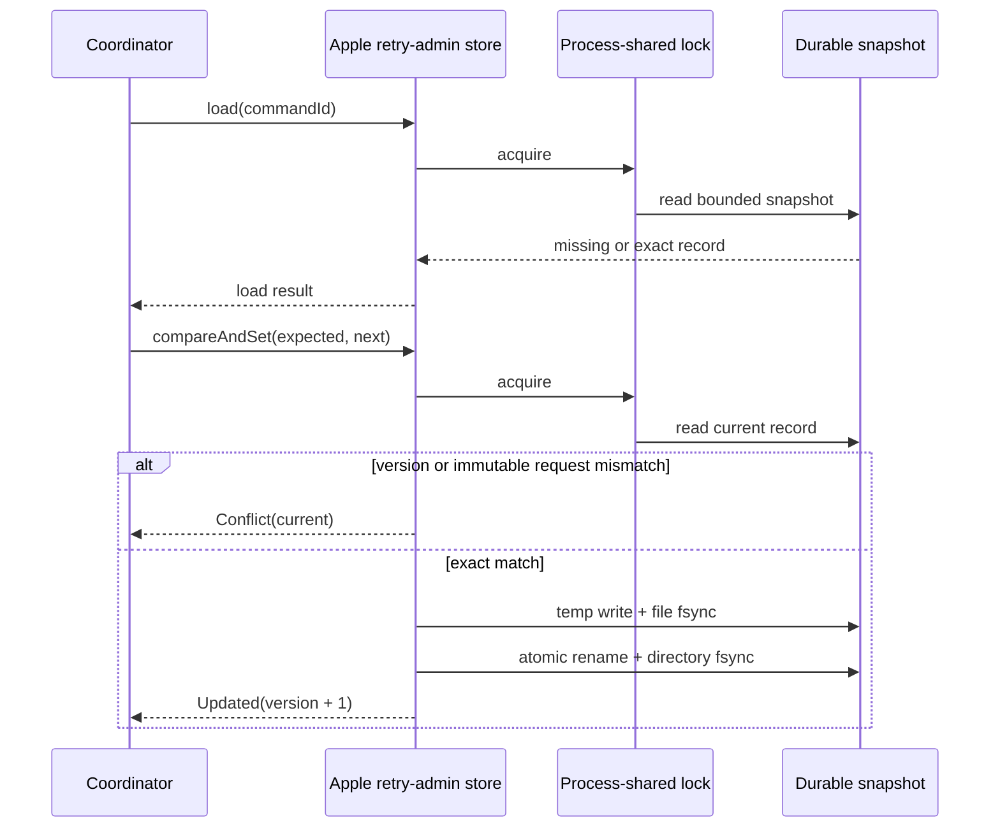

# Apple retry-administration state store

**Status:** Available foundation. Queue-specific administrative retry execution remains separate work.

`AppleFileRetryAdministrationStateStore` is the production KMP Apple implementation of `RetryAdministrationStateStore`. It persists the authorization and terminal recording state used by `RetryAdministrationCoordinator` across runtime reconstruction and process restart.

## Construction

```kotlin
val stateStore = AppleFileRetryAdministrationStateStore(
    directoryPath = applicationSupportDirectory,
)
```

The directory must be an absolute application-private path. Construction validates the path but performs no I/O. The host remains responsible for choosing the Application Support or app-group location and for configuring Data Protection and backup policy.

## Persisted evidence

The version-1 snapshot retains:

- immutable command id, queue-entry id, principal, request time, action, and bounded reason;
- the original redacted failure code, category, severity, and recoverability;
- authorization id and effective recoverability;
- durable command status and update time;
- bounded rejection reason code; and
- redacted execution-failure classification when execution failed.

Payloads, credentials, headers, stack traces, raw exception text, provider instances, filesystem paths, and arbitrary metadata are not persisted.

## Compare-and-set semantics

Each command id has one versioned record. Creation requires `expectedVersion = null` and produces version `0`. Updates require the exact current version and increment it by one.

A caller cannot use a matching version to replace the immutable request for an existing command id. Such an attempt returns `Conflict` with the exact current record. Version exhaustion fails before filesystem access.



## Durability and integrity

Every operation is serialized by a cancellation-aware advisory file lock. Successful writes use an owner-only temporary file, complete file `fsync`, atomic rename, and parent-directory `fsync`.

The snapshot is bounded to 16 MiB and 10,000 records. Invalid UTF-8, unknown enum values, partial nullable groups, duplicate command ids, impossible model invariants, excessive size, and excessive record count fail closed with sanitized canonical errors.

## Remaining administration work

This store does not implement `RetryAdministrationExecutor`. A queue-specific executor must atomically validate the live terminal queue entry, verify its canonical failure snapshot, apply the requeue exactly once by command id, and retain an idempotency receipt across process loss. That work requires a reviewed queue persistence migration rather than an unsafe cross-file best-effort mutation.
