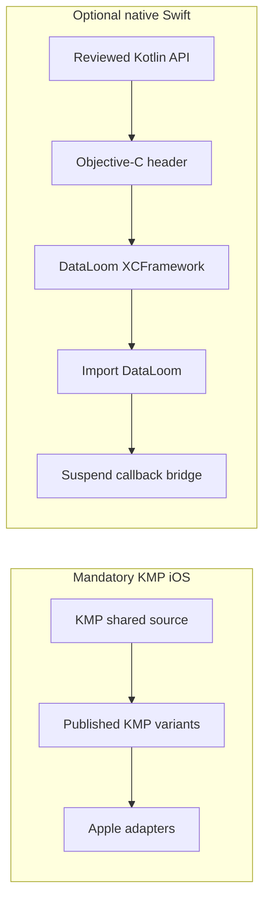

# Swift interoperability

> **Audience:** Maintainers reviewing the optional native Swift surface
> **Purpose:** Explain the current Kotlin/Native bridge, selected exported
> symbols, and blockers to supported Swift distribution
> **Status:** Compile-only conventional Objective-C/Swift interoperability;
> production native Swift support is not claimed

[← Apple guide](README.md) ·
[XCFramework integration](xcframework-integration.md) ·
[Swift smoke fixture](../../apple-smoke/README.md)

Native Swift integration is optional and distinct from mandatory KMP iOS
support. A KMP iOS application consumes KMP variants and Apple adapters; a
native Swift application would consume a separately reviewed XCFramework or
Swift package.

## Interoperability paths



Experimental Swift export is not enabled. The current fixture uses
conventional Kotlin/Native Objective-C/Swift bridging.

## Import

After adding the locally assembled XCFramework:

```swift
import DataLoom
```

The current framework contains no production Apple connectivity, scheduler,
queue, storage, or lifecycle adapters.

## Selected symbols checked by the smoke fixture

This is not a generated-header inventory. It records the symbols referenced by
`apple-smoke/Sources/DataLoomSwiftSmoke/DataLoomSwiftSmoke.swift`.

| Area | Selected Swift-visible symbols |
|---|---|
| Facade construction | `DataLoomBuilder` |
| Worker/submission capabilities | `DataLoomQueueWorker`, `DataLoomQueueSubmission` |
| Requests and results | `SynchronizationRequest`, `SynchronizationExecutionResult` |
| Direction and mode | `SynchronizationDirection`, `SynchronizationMode` |
| Provider/lifecycle types | `SynchronizationProviderBindings`, `ProviderLifecycleResult` |
| Models | `DataLoomError`, `DataLoomInstant` |
| Runtime dependencies | `RuntimeDependencies`, `RuntimeIdentifierGenerators` |
| Provider protocols | `ConnectivityProvider`, `StorageProvider`, `TransportProvider`, `QueueProvider`, `SchedulerProvider` |
| Observation | `SynchronizationObserver` |

`SynchronizationProviderBindings` and `ProviderLifecycleResult` come from the
public `dataloom-provider-api` boundary. `RuntimeDependencies` and
`RuntimeIdentifierGenerators` come from `dataloom-api`. The Apple umbrella
does not export `dataloom-core` or `dataloom-testing`; CI audits generated
headers so those internal namespaces cannot silently return.

## Suspend functions

The current conventional bridge exposes Kotlin suspend functions through
completion callbacks rather than native Swift `async`/`await`. Conceptually:

```swift
// Illustrative bridge shape; generated names remain subject to header review.
dataLoom.synchronize(request: request) { result, error in
    // Inspect the structured result and bridge error.
}
```

A supported native Swift distribution needs a reviewed concurrency and
cancellation adapter plus generated-header/API compatibility checks. Do not
assume callback naming or `async`/`await` availability without that evidence.

## Error and cancellation target

The following is required target behavior, not behavior exercised by DL-036:

| Scenario | Required supported-Swift outcome |
|---|---|
| Provider lifecycle cancellation | Explicit cancellation result or mapped cancellation |
| Synchronization cancellation | Structured cancellation without false success |
| Queue-worker/submission cancellation | Boundary-appropriate structured outcome |
| Unexpected Kotlin exception | Reviewed error mapping; never uncontrolled process termination |

The exported builder can currently throw Kotlin exceptions and has no reviewed
Swift-facing result/`@Throws` adapter. Native Swift support remains blocked
until every throwing path has explicit, tested behavior.

## Known limitations

- No native Swift `async`/`await` adapter.
- No remote Swift package or CocoaPods podspec.
- No production Apple platform providers.
- No persistent Apple queue.
- Sealed classes do not receive Swift enum ergonomics automatically.
- Kotlin `Long` maps to `Int64`; `ByteArray` maps to `KotlinByteArray`.
- Generated headers have automated internal-namespace and cross-slice
  consistency gates, but still require product-level Swift API review.
- The current smoke does not run synchronization or validate process relaunch.

## Security requirements

Any supported Swift distribution must prove that generated APIs, descriptions,
logs, support bundles, and error bridges do not expose payloads, queue data,
metadata values, credentials, checkpoint tokens, keys, personal data, provider
state, or stack traces.

`dataloom-core` and `dataloom-testing` are excluded from the current
XCFramework, but that alone is not an API or security audit.

## Related documentation

- [XCFramework integration](xcframework-integration.md)
- [Swift smoke fixture](../../apple-smoke/README.md)
- [Apple testing](apple-testing.md)
