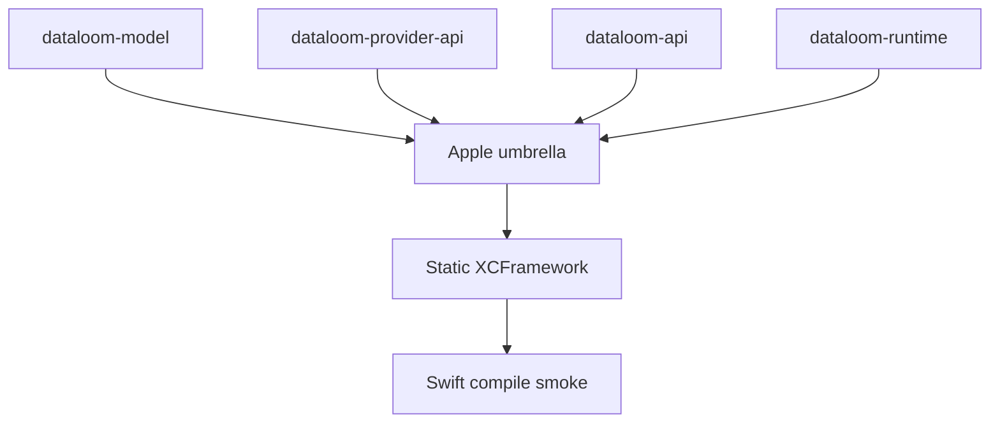

# XCFramework integration

> **Audience:** Maintainers assembling the optional native Apple artifact and
> developers reproducing the Swift compile smoke
> **Purpose:** Document the current static XCFramework boundary and exact local
> assembly steps
> **Status:** Producer and compile-smoke artifact only; not a production
> distribution

[← Apple guide](README.md) ·
[Swift interoperability](swift-interop.md) ·
[Swift smoke fixture](../../apple-smoke/README.md)

KMP iOS applications consume KMP-published variants and future
`dataloom-ios` adapters. The XCFramework described here is a separate,
optional native Swift/Objective-C path.

## Artifact properties

| Property | Current value |
|---|---|
| Framework/module name | `DataLoom` |
| Bundle identifier | `io.dataloom.sdk` |
| Linkage | Static |
| Producer module | `dataloom-apple` |
| Slices | `iosArm64`, `iosSimulatorArm64`, `iosX64` |

## Export topology



`dataloom-testing` is intentionally absent from this graph because it is not
exported.

## Current exports

| Module | Reason it is present | Boundary status |
|---|---|---|
| `dataloom-model` | Canonical dependency-root types | Current public foundation |
| `dataloom-provider-api` | Provider lifecycle, descriptor, and binding contracts | Current public SPI foundation |
| `dataloom-api` | Contracts, identifiers, models, and synchronization interfaces | Current public foundation |
| `dataloom-runtime` | Facade and orchestration foundations | Current export under review |

`dataloom-core` and `dataloom-testing` are intentionally absent. The
XCFramework contains no Apple platform provider implementation and no global
singleton.

## Why static linkage

`isStatic = true` keeps each framework slice self-contained and avoids
embedding a separate dynamic DataLoom library. Applications linking multiple
Kotlin/Native frameworks still need explicit duplicate-runtime and static-link
compatibility analysis.

## Assemble locally

Run from the repository root on macOS:

```bash
./gradlew :dataloom-apple:assembleDataLoomReleaseXCFramework
```

Release output:

```text
dataloom-apple/build/XCFrameworks/release/DataLoom.xcframework/
```

For a debug artifact:

```bash
./gradlew :dataloom-apple:assembleDataLoomDebugXCFramework
```

Debug output:

```text
dataloom-apple/build/XCFrameworks/debug/DataLoom.xcframework/
```

## Expected structure

```text
DataLoom.xcframework/
├── Info.plist
├── ios-arm64/
│   └── DataLoom.framework/
└── ios-arm64_x86_64-simulator/
    └── DataLoom.framework/
```

The simulator framework combines `iosSimulatorArm64` and `iosX64`.

## Compile-only Xcode integration

1. Assemble the XCFramework.
2. Add `DataLoom.xcframework` to the Xcode project.
3. Link it as **Do Not Embed** because it is static.
4. Add `import DataLoom` to Swift sources.
5. Compile against the intended device and simulator destinations.

These steps prove linking and symbol visibility only. They do not establish
runtime initialization, provider behavior, background execution, persistence,
relaunch recovery, signing, or App Store readiness.

## Generated artifacts

Do not commit generated frameworks or archives. The repository ignores:

```text
*.xcframework/
*.xcarchive/
dataloom-apple/build/XCFrameworks/
apple-smoke/DataLoom.xcframework/
```

## Not yet available

- Production `dataloom-ios` platform adapters.
- Published KMP iOS variants and an external executable KMP consumer.
- A reviewed Swift-facing API beyond the current compile-smoke selection.
- Reviewed generated-header compatibility after the automated internal-type
  and slice-consistency gates.
- Executable Swift runtime, cancellation, relaunch, and background tests.
- Remote SwiftPM or CocoaPods distribution.
- Apple signing, provisioning, or release publication.

Optional Swift distribution cannot substitute for the mandatory KMP iOS
consumer path.
