# DataLoom architecture

This section explains how DataLoom separates public contracts, shared runtime
orchestration, platform adapters, durable state, and application-owned domain
logic.

Start with the [system overview](./system-overview.md), then follow the path
that matches the question you are answering.

> [!NOTE]
> Pages about DL-001 through DL-036 primarily document the current
> foundation. The six-strategy engine and full V1 systems are target
> architecture unless a page explicitly provides implementation evidence.

## Architecture map

```mermaid
flowchart TD
    overview[System overview]
    foundation[Modules and platforms]
    providers[Provider assembly]
    execution[Synchronization execution]
    resilience[Durability and resilience]
    operations[Events and operations]

    overview --> foundation
    overview --> providers
    overview --> execution
    overview --> resilience
    overview --> operations

    foundation --> modules[Module boundaries]
    foundation --> platform[Platform strategy]
    foundation --> dependencies[Runtime dependencies]

    providers --> lifecycle[Lifecycle]
    providers --> resolution[Resolution]
    providers --> assembly[Runtime assembly]

    execution --> push[Outbound push]
    execution --> pull[Inbound pull]
    execution --> both[Bidirectional]

    resilience --> queue[Durable queue]
    resilience --> retry[Retry]
    resilience --> conflict[Conflict]

    operations --> observation[Observation]
    operations --> events[Event flows]
    operations --> background[Background execution]

    style overview fill:#DCCCFF,stroke:#874FFF
    style execution fill:#C2E5FF,stroke:#3DADFF
    style resilience fill:#FFECBD,stroke:#FFC943
```

## Foundations

| Page | Question answered |
|---|---|
| [System overview](./system-overview.md) | What does DataLoom own now and at V1? |
| [Module architecture](./modules.md) | Which module owns each type and which dependencies are legal? |
| [Artifact graph/BOM gap analysis](./artifact-graph-bom-gap-analysis.md) | Precisely which ADR-0002 published/source modules exist, are publish-wired, or are missing — and why no bounded publication slice exists yet? |
| [Platform strategy](./platform-strategy.md) | How do native Android, KMP Android, KMP iOS, and Swift distribution differ? |
| [Runtime dependencies](./runtime-dependencies.md) | How are clocks, identifiers, and runtime dependencies injected? |
| [Storage boundaries](./storage-boundaries.md) | What does persistent application storage provide? |
| [Transport boundaries](./transport-boundaries.md) | What does a remote transport provider own? |

## Provider assembly

| Page | Question answered |
|---|---|
| [Provider lifecycle](./provider-lifecycle.md) | How are providers initialized, rolled back, and shut down? |
| [Provider resolution](./provider-resolution.md) | How are explicit bindings validated and resolved? |
| [Runtime assembly](./runtime-assembly.md) | How does the builder assemble the facade and orchestration graph? |
| [Background execution](./background-execution-boundaries.md) | Where do scheduling and connectivity platform APIs stop? |

## Synchronization execution

| Page | Question answered |
|---|---|
| [Execution coordinator](./execution-coordinator.md) | How is a request admitted and routed to a pipeline? |
| [Outbound push](./outbound-push-flow.md) | In which order are local changes sent and acknowledged? |
| [Inbound pull](./inbound-pull-flow.md) | In which order are remote changes applied and checkpointed? |
| [Bidirectional](./bidirectional-flow.md) | How are inbound and outbound phases ordered and combined? |
| [Connectivity preflight](./connectivity-preflight-offline-deferral.md) | How does current connectivity gating and queue deferral behave? |

The current coordinator selects by direction. V1 must evaluate a
[synchronization strategy](../strategies/README.md) into a concrete plan before
resolving only the capabilities that plan requires.

## Durability, retry, and conflict

| Page | Question answered |
|---|---|
| [Queue boundaries](./queue-boundaries.md) | Which durable queue guarantees belong to providers and runtime? |
| [Durable queue processing](./durable-queue-processing-flow.md) | How are entries acquired, executed, and transitioned? |
| [Queued retry flow](./queued-synchronization-retry-flow.md) | How is a failed queued execution evaluated today? |
| [Queue worker recovery](./queue-worker-wakeup-recovery-flow.md) | How are leases recovered and future wake-ups planned? |
| [Queue encoding](./application-owned-queue-encoding.md) | How are opaque application work items encoded and resolved? |
| [Retry boundaries](./retry-boundaries.md) | Which retry decisions belong to policy, runtime, scheduler, and queue? |
| [Retry rescheduling](./retry-rescheduling-flow.md) | How are custom decisions aggregated and scheduled? |
| [Conflict boundaries](./conflict-boundaries.md) | Which conflict decisions are generic and which require domain input? |
| [Conflict flow](./conflict-detection-resolution-flow.md) | How does the current custom detector/resolver orchestration run? |

## Events and operational behavior

| Page | Question answered |
|---|---|
| [Observation boundaries](./observation-boundaries.md) | What can observers see and what must remain private? |
| [Observer delivery](./observer-delivery-flow.md) | How are observer failures isolated? |
| [Runtime event integration](./runtime-event-integration-flow.md) | Where are lifecycle events emitted? |
| [Progress, retry, and conflict events](./progress-retry-conflict-event-flow.md) | What is the current event order around operations? |

Current event dispatch is an in-process foundation. V1 still requires durable
operational events, metrics, traces, health, redaction, and operational read
models.

## Accepted target architecture

- [ADR-0001: Android-first and KMP core](../adr/ADR-0001-android-first-kmp-core.md)
- [ADR-0002: V1 artifact and foundation architecture](../adr/ADR-0002-v1-artifact-and-foundation-architecture.md)
- [V1 production-readiness audit](../audits/DL-AUDIT-004-v1-production-readiness.md)

When an implementation page and an ADR differ, the implementation page
describes current code while the accepted ADR describes the required migration
target.
