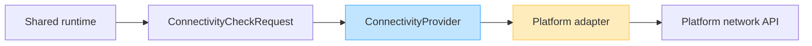

# Background Execution Boundaries (DL-012)

This document describes how the DataLoom shared runtime coordinates
background execution and connectivity evaluation through platform-independent
provider contracts, and how platform-specific implementations fit into that
boundary.

---

## Overview

DataLoom must coordinate background synchronization without depending directly
on any platform scheduler or connectivity API. The shared API surface is
defined in `dataloom-api` using provider interfaces that platform modules
implement.

---

## Scheduler Architecture


### Shared runtime responsibilities

- Construct a `ScheduleRequest` describing the synchronization intent, delay,
  constraints, and existing-schedule policy.
- Pass the request to a `SchedulerProvider` implementation.
- Receive a `ScheduleReceipt` confirming the provider accepted the request.
- Map provider failures to canonical `DataLoomError` values.

### `SchedulerProvider` responsibilities

- Accept or reject a `ScheduleRequest` using platform-specific APIs.
- Apply `ExistingSchedulePolicy` semantics.
- Map unsupported `ScheduleConstraints` to canonical errors.
- Return a `ScheduleReceipt` on success.
- Map platform failures to canonical `DataLoomError` values.
- Never expose platform scheduler types through the public API.

### WorkManager responsibilities

The current `dataloom-scheduler-workmanager` artifact implements the Android
WorkManager provider boundary. Its V1 aggregation, publication, and full
restart qualification remain open. It maps:

| `ScheduleConstraints` property              | WorkManager equivalent       |
|---------------------------------------------|------------------------------|
| `ConnectivityRequirement.AVAILABLE`         | connected network constraint |
| `ConnectivityRequirement.UNMETERED`         | unmetered network constraint |
| `requiresCharging = true`                   | charging constraint          |

It will not expose `WorkManager`, `Worker`, `WorkRequest`, or `Constraints`
types through the `SchedulerProvider` interface.

### Mandatory V1 Apple scheduling limitations

Apple background execution is subject to system-enforced constraints that may
prevent guaranteed execution timing. The mandatory V1 Apple-specific adapter must
document platform-specific limitations and map unsupported constraints to
canonical errors rather than silently ignoring them.

---

## Connectivity Architecture



### Shared runtime responsibilities

- Construct a `ConnectivityCheckRequest` with the relevant `ExecutionContext`.
- Pass the request to a `ConnectivityProvider` implementation.
- Receive a `ConnectivitySnapshot` describing the current device connectivity.
- Use the snapshot to evaluate whether connectivity satisfies a
  `ConnectivityRequirement`.
- Map provider failures to canonical `DataLoomError` values.

### `ConnectivityProvider` responsibilities

- Query the platform connectivity API internally.
- Translate the platform result into a `ConnectivitySnapshot`.
- Expose only `ConnectivityStatus` and nullable `isMetered`.
- Never expose `ConnectivityManager`, `Network`, `NetworkCapabilities`,
  `NWPathMonitor`, or other platform-specific types through the public API.
- Never expose IP addresses, interface names, SSIDs, carrier names, VPN
  details, or platform network handles.
- Map platform failures to canonical `DataLoomError` values.

### Android ConnectivityManager boundary

```text
ConnectivityManager
      ↓
AndroidConnectivityProvider (internal)
      ↓
ConnectivitySnapshot
      ↓
DataLoom Runtime
```

The Android provider may inspect `NetworkCapabilities` and
`ConnectivityManager` internally to determine `ConnectivityStatus` and
`isMetered`. It must expose only the canonical DataLoom model.

### Mandatory V1 Apple connectivity limitations

The mandatory V1 Apple-specific adapter must use `NWPathMonitor` or equivalent
APIs internally. Platform-specific types must remain internal to the adapter.

---

## Why the common API exposes no platform scheduler or connectivity types

The shared DataLoom contracts in `dataloom-api` must remain:

- Kotlin Multiplatform compatible
- Free of Android, JVM-only, and Apple-specific imports
- Free of third-party library types
- Stable across platform-module versions

Exposing `WorkManager`, `ConnectivityManager`, `NWPathMonitor`, or similar
types through the shared API would:

- Prevent the contracts from compiling in non-Android or non-JVM targets
- Force all consumers to depend on platform-specific libraries
- Introduce tight coupling between the shared runtime and platform
  implementation details
- Break API stability whenever a platform API changes

Provider interfaces isolate this coupling so the shared runtime and host
application can remain technology-neutral.

---

## Connectivity requirement evaluation

DL-031 implements these rules in `SynchronizationConnectivityPreflight`.

### `NONE`

Always satisfied without requiring a connectivity query.

### `AVAILABLE`

Satisfied only when the current `ConnectivitySnapshot` reports
`ConnectivityStatus.AVAILABLE`.

`LIMITED` does not currently satisfy `AVAILABLE`. Any richer policy must be
explicitly configured, tested, and represented without silently upgrading a
limited connection.

### `UNMETERED`

Satisfied when:

```
status == AVAILABLE
and
isMetered == false
```

A `null` metering state must not be treated as unmetered.

`AVAILABLE` alone does not satisfy `UNMETERED` when `isMetered` is `null`.

---

## Outside the DL-012 baseline

DL-012 did not implement the following features. Their V1 inclusion is governed
by the approved full-V1 scope and ADR-0002; this heading does not defer them to
V2 automatically.

### Scheduling

- Periodic scheduling
- Cron-style scheduling
- Absolute timestamps
- Exact alarms
- Expedited execution
- Foreground execution
- Long-running workers
- Device-idle requirements
- Battery-low requirements
- Storage-low requirements
- Chained scheduling
- Schedule inspection
- Scheduled-work status observation
- Automatic rescheduling
- Platform reboot handling
- Runtime workflow cancellation
- Scheduler capability negotiation

### Connectivity

- `Flow<ConnectivitySnapshot>` streaming observation
- Callback-based observation
- Connectivity event streams
- Backend reachability checks
- Network quality measurement
- Bandwidth estimation
- Roaming status
- VPN detection
- Wi-Fi-only requirements
- Transport-type exposure
- Captive-portal handling policy
- Network switching events
- Connectivity-triggered runtime execution
