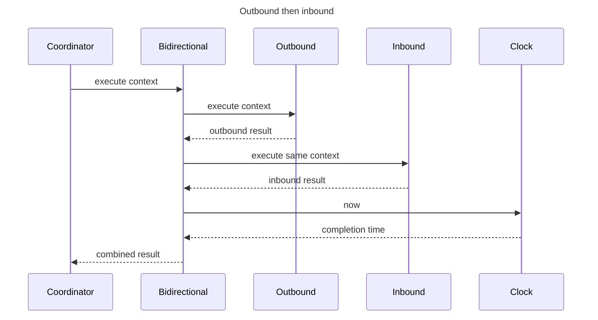

# Bidirectional Synchronization Flow (DL-023)

`BidirectionalSynchronizationPipeline` composes the existing
`OutboundPushSynchronizationPipeline` and `InboundPullSynchronizationPipeline`
into a single, sequential bidirectional synchronization execution.

DL-023 introduces pipeline composition only. It delegates all provider
operations to the two child pipelines. Retry orchestration, queue processing,
scheduling, connectivity checks, conflict resolution, event dispatch, and
observer registration are out of scope and deferred to other issues.

---

## Composition purpose

The bidirectional pipeline allows a host application to register a single
`SynchronizationDirection.BIDIRECTIONAL` entry with the
`SynchronizationPipelineRegistry`. The coordinator selects this pipeline when
the `SynchronizationRequest.direction` is `BIDIRECTIONAL`, and both outbound
and inbound work are performed in one coordinated execution.

---

## Child pipelines

| Role              | Required direction             | Type                               |
|-------------------|--------------------------------|------------------------------------|
| Outbound pipeline | `SynchronizationDirection.PUSH` | `OutboundPushSynchronizationPipeline` (or compatible) |
| Inbound pipeline  | `SynchronizationDirection.PULL` | `InboundPullSynchronizationPipeline` (or compatible)  |

Delegate directions are validated at construction time. A delegate with an
incorrect direction is rejected immediately with `IllegalArgumentException`.
Construction does not invoke either child pipeline.

---

## Execution order configuration

`BidirectionalPipelineConfiguration.executionOrder` controls which direction
runs first.

| Order                   | First pipeline  | Second pipeline |
|-------------------------|-----------------|-----------------|
| `OUTBOUND_THEN_INBOUND` (default) | Outbound | Inbound |
| `INBOUND_THEN_OUTBOUND` | Inbound         | Outbound        |

### Default: `OUTBOUND_THEN_INBOUND`

Pushing local changes before pulling remote changes reduces the chance that
an immediately following inbound pull overwrites or conflicts with unsent
local work. This is the default order.

### `INBOUND_THEN_OUTBOUND`

Applications that require server-authoritative synchronization or that need
the latest remote state before sending local changes may configure
`INBOUND_THEN_OUTBOUND` explicitly.

This is an ordering primitive, not proof of a complete remote-first strategy.
It does not define remote authority, freshness, typed fallback, persistence,
queueing, or cache coherence; ADR-0002/#102 owns those V1 semantics.

---

## Sequential execution

The two child pipelines always execute strictly sequentially. The second
pipeline starts only after the first has returned a terminal
`SynchronizationResult`. Parallel execution is never performed.

The exact same `SynchronizationExecutionContext` is passed to both child
pipelines without modification. The `SynchronizationRequest`, resolved
providers, and `RuntimeDependencies` are not replaced, re-resolved, or
modified.

---

## Sequence diagrams

### `OUTBOUND_THEN_INBOUND` — happy path



### `INBOUND_THEN_OUTBOUND` — happy path

```text
BidirectionalSynchronizationPipeline.execute(context)
    → InboundPullSynchronizationPipeline.execute(context)
        → ...inbound operations...
        → SynchronizationResult.Succeeded(inboundSummary)
    → (inbound Succeeded → continue)
    → OutboundPushSynchronizationPipeline.execute(context)
        → ...outbound operations...
        → SynchronizationResult.Succeeded(outboundSummary)
    → combine(inboundSucceeded, outboundSucceeded)
    → completedAt = clock.now()
    → SynchronizationResult.Succeeded(combinedSummary, completedAt)
```

### `OUTBOUND_THEN_INBOUND` — first pipeline fails (stop path)

```text
BidirectionalSynchronizationPipeline.execute(context)
    → OutboundPushSynchronizationPipeline.execute(context)
        → ... provider operations fail ...
        → SynchronizationResult.Failed(outboundError, outboundSummary)
    → (outbound Failed → stop)
    → (inbound pipeline NOT executed)
    → completedAt = clock.now()
    → SynchronizationResult.Failed(outboundError, outboundSummary, completedAt)
```

### `OUTBOUND_THEN_INBOUND` — second pipeline fails (continue then fail)

```text
BidirectionalSynchronizationPipeline.execute(context)
    → OutboundPushSynchronizationPipeline.execute(context)
        → SynchronizationResult.Succeeded(outboundSummary)
    → (outbound Succeeded → continue)
    → InboundPullSynchronizationPipeline.execute(context)
        → ... provider operations fail ...
        → SynchronizationResult.Failed(inboundError, inboundSummary)
    → combine(outboundSucceeded, inboundFailed)
    → completedAt = clock.now()
    → SynchronizationResult.Failed(inboundError, combinedSummary, completedAt)
```

### Explicit `Cancelled` result path

```text
BidirectionalSynchronizationPipeline.execute(context)
    → OutboundPushSynchronizationPipeline.execute(context)
        → SynchronizationResult.Cancelled(outboundSummary)
    → (outbound Cancelled → stop)
    → (inbound pipeline NOT executed)
    → completedAt = clock.now()
    → SynchronizationResult.Cancelled(outboundSummary, completedAt)
```

### `CancellationException` propagation path

```text
BidirectionalSynchronizationPipeline.execute(context)
    → OutboundPushSynchronizationPipeline.execute(context)
        → throws CancellationException
    → CancellationException propagates out of BidirectionalSynchronizationPipeline
    → (inbound pipeline NOT executed)
    → (exception is NOT converted into any SynchronizationResult)
```

---

## Continuation and stop rules

| First pipeline result      | Second pipeline runs? |
|----------------------------|-----------------------|
| `Succeeded`                | Yes                   |
| `PartiallySucceeded`       | Yes                   |
| `Skipped(NO_CHANGES)`      | Yes                   |
| `Failed`                   | No                    |
| `Cancelled`                | No                    |
| `Skipped(non-NO_CHANGES)`  | No                    |

`PartiallySucceeded` does not stop the second direction because useful work
may still be completed by the other pipeline.

---

## Result-combination matrix

| First result           | Second result          | Combined result        |
|------------------------|------------------------|------------------------|
| Skipped(NO_CHANGES)    | Skipped(NO_CHANGES)    | Skipped(NO_CHANGES)    |
| Skipped(NO_CHANGES)    | Succeeded              | Succeeded              |
| Succeeded              | Skipped(NO_CHANGES)    | Succeeded              |
| Succeeded              | Succeeded              | Succeeded              |
| Succeeded              | PartiallySucceeded     | PartiallySucceeded     |
| PartiallySucceeded     | Succeeded              | PartiallySucceeded     |
| Skipped(NO_CHANGES)    | PartiallySucceeded     | PartiallySucceeded     |
| PartiallySucceeded     | PartiallySucceeded     | PartiallySucceeded     |
| Failed                 | (not executed)         | Failed (first error)   |
| Cancelled              | (not executed)         | Cancelled              |
| Skipped(non-NO_CHANGES) | (not executed)        | Skipped (same reason)  |
| (any continuing)       | Failed                 | Failed (second error)  |
| (any continuing)       | Cancelled              | Cancelled              |

---

## Summary combination

Every counter in both child summaries is summed using overflow-safe addition:

| Counter                         | Combined value                    |
|---------------------------------|-----------------------------------|
| `outboundEventsRead`            | first + second                    |
| `outboundEventsAccepted`        | first + second                    |
| `outboundEventsMarkedForRetry`  | first + second                    |
| `outboundEventsRejected`        | first + second                    |
| `inboundEventsReceived`         | first + second                    |
| `inboundEventsApplied`          | first + second                    |
| `conflictsDetected`             | first + second                    |
| `retryAttempts`                 | first + second                    |

If any counter addition would overflow `Long.MAX_VALUE` or `Int.MAX_VALUE`,
a canonical `SynchronizationResult.Failed` with an `INTERNAL` category error
is returned instead of wrapping the counter.

---

## Partial-error ordering

When both pipelines produce `PartiallySucceeded`, errors are combined in
execution order:

- `OUTBOUND_THEN_INBOUND`: outbound errors, then inbound errors.
- `INBOUND_THEN_OUTBOUND`: inbound errors, then outbound errors.

Error order is preserved within each pipeline's error collection. Duplicate
errors are not removed automatically. The combined collection is defensively
copied and exposed as a read-only `List<DataLoomError>`.

---

## Failure preservation

When a child pipeline returns `Failed`:

- The exact canonical `DataLoomError` instance is preserved.
- No retry, queue scheduling, or restart is performed.
- The composed result contains a newly combined summary and a terminal
  timestamp from the injected clock.

---

## Explicit `Cancelled` result versus `CancellationException`

These are distinct situations:

| Situation                              | Behavior                                         |
|----------------------------------------|--------------------------------------------------|
| Child returns `SynchronizationResult.Cancelled` | Combined normally, returns `Cancelled` result |
| Child throws `CancellationException`   | Exception propagates; no result is produced      |

`CancellationException` is never converted into a `SynchronizationResult`.

---

## Clock usage

`RuntimeDependencies.clock` is read exactly once per `execute` call, to
produce the composed terminal result's `completedAt` timestamp. Child
completion timestamps are never reused as the composed timestamp.

---

## Direct provider-call restriction

`BidirectionalSynchronizationPipeline` does not directly call any:
- `StorageProvider`
- `TransportProvider`
- `SchedulerProvider`
- `ConnectivityProvider`
- `QueueProvider`
- `RetryPolicy`
- `ConflictDetector` or `ConflictResolver`
- `ProviderLifecycleCoordinator`
- `ProviderRegistry`
- `SynchronizationProviderResolver`
- `SynchronizationObserver`

All provider calls are delegated exclusively to the two child pipelines.

---

## Retry boundary

`BidirectionalSynchronizationPipeline` does not:
- invoke any retry policy
- calculate retry delay
- enqueue or reschedule queue entries
- call `SchedulerProvider`
- check connectivity
- automatically rerun a failed child pipeline

Child results are combined only.

---

## Queue and scheduler boundary

Queue processing, background scheduling, and job persistence are not
performed by this pipeline. Those concerns are deferred to other issues.

---

## Event boundary

`BidirectionalSynchronizationPipeline` does not synthesize a second wrapper
event lifecycle. When it is executed through
`SynchronizationExecutionCoordinator` with a lifecycle emitter configured, the
coordinator emits one `Started` event before bidirectional execution and one
`Completed` event after the combined result.

The same execution context is passed to both child pipelines. The built-in
outbound and inbound children therefore emit their phase changes and accepted
batch-boundary progress events through the configured runtime emitter.

The bidirectional pipeline itself does not emit retry, conflict, or
queue-specific events. `Flow`, `StateFlow`, `SharedFlow`, `Channel`, durable
event persistence, and replay are not implemented by this pipeline.

---

## Conflict boundary

Conflict detection and resolution are not performed by this pipeline.
Conflict handling is deferred to other issues.

---

## Concurrency limitations

The two child pipelines execute strictly sequentially. Parallel execution is
never performed. No `CoroutineScope`, dispatcher, or platform thread pool is
owned or created.

---

## Performance constraints

- At most two child pipelines are executed per `execute` call.
- No `ChangeSet` payloads are retained by this pipeline.
- No dispatcher or platform thread pool is used.
- No unbounded collection is allocated.
- `Thread.sleep` and blocking locks are never used.
- `GlobalScope` is never used.

---

## Security restrictions

Diagnostic representations include only execution order, direction names,
result variant names, and summary counts. The following are never exposed:
- Provider objects or internal state
- `DataLoomPayload` bytes
- Checkpoint token values
- Credentials or authorization headers
- Encryption keys
- Personal data
- Stack traces

---

## Kotlin Multiplatform compatibility

Uses Kotlin standard-library and DataLoom API, core, and runtime types only.
Safe for use in Kotlin Multiplatform common code. No Android APIs, JVM-only
APIs, reflection, `ServiceLoader`, or DI framework is used.

---

## Module placement

| Type                                   | Module            | Package                                           |
|----------------------------------------|-------------------|---------------------------------------------------|
| `BidirectionalExecutionOrder`          | dataloom-runtime  | `io.dataloom.runtime.execution.bidirectional`     |
| `BidirectionalPipelineConfiguration`   | dataloom-runtime  | `io.dataloom.runtime.execution.bidirectional`     |
| `BidirectionalSynchronizationPipeline` | dataloom-runtime  | `io.dataloom.runtime.execution.bidirectional`     |
