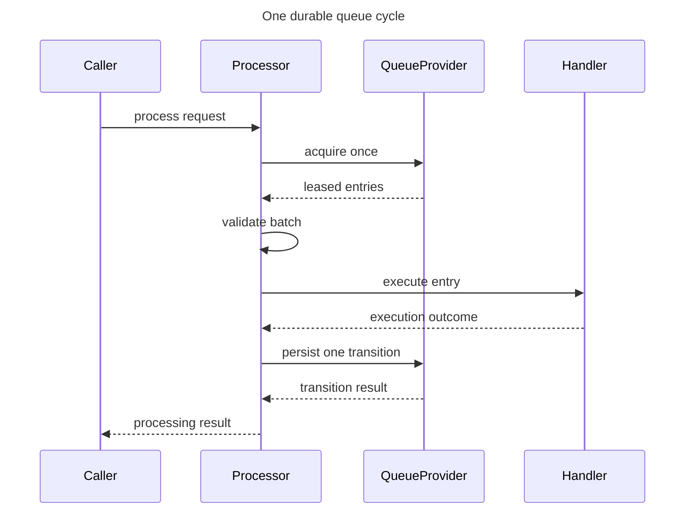

# Durable Queue Processing Flow (DL-026)

## Purpose

This document defines the bounded runtime flow for one durable queue processing
cycle in `DurableQueueExecutionProcessor`.

This flow sits between queue acquisition and higher-level synchronization/retry
orchestration.

---

## Processing sequence

---

## Validation gate (before execution)

Before any handler call, the acquired batch is validated:

- duplicate entry IDs are rejected
- consumer-identity mismatch is rejected when represented by contract

Validation failure returns `QueueProcessingResult.QueueContractViolation` and
performs no queue transition.

---

## Transition mapping

| Execution outcome | Queue transition |
|---|---|
| `Completed` | `QueueProvider.complete` |
| `Reschedule` | `QueueProvider.reschedule` |
| `Failed` | `QueueProvider.fail` |
| `Cancelled` | `QueueProvider.cancel` |

Each entry produces exactly one transition request.

The processor stops after the first transition failure. Its summary must stay
truthful about entries already executed and transitioned.

---

## Failure behavior

- Acquisition failure returns `QueueProviderFailure(stage=ACQUISITION)`.
- Transition failure returns `QueueProviderFailure` with:
  - exact provider `DataLoomError`
  - exact transition stage
  - affected `QueueEntryId`
  - lease identity and truthful partial summary
- On transition failure, later entries are not executed.
- Failed transitions are not retried by this processor.

---

## Cancellation behavior

- Thrown `CancellationException` from acquisition, handler, or transition
  propagates unchanged.
- Explicit `Cancelled` outcome is distinct and triggers queue cancellation
  transition.

---

## Lease expiration and recovery boundary

DL-026 does not implement lease expiration recovery inside
`DurableQueueExecutionProcessor`.

If execution completes but transition persistence fails, an entry may remain in
leased state until lease expiry. Recovery is outside this flow and belongs to
`QueueProvider.recoverExpiredLeases` orchestration.

---

## Out-of-scope boundaries

This flow does not introduce:

- synchronization coordination/pipelines
- retry orchestration or policy evaluation
- scheduler/connectivity coordination
- storage, transport, conflict, lifecycle, observer, or event integration
- Room/SQLDelight/WorkManager/provider-specific implementations
