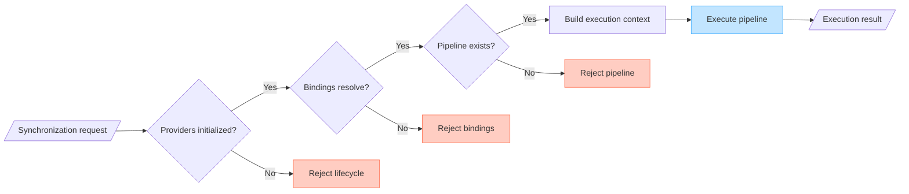

# Execution Coordinator (DL-020)

## Overview

`SynchronizationExecutionCoordinator` is the platform-independent foundation
for delegating synchronization pipeline execution. It connects the provider
lifecycle guard, provider resolution, and direction-based pipeline selection
into a deterministic preparation sequence, then delegates work to the matching
`SynchronizationPipeline`.

This document covers:

- Purpose and responsibilities
- Execution sequence
- Lifecycle precondition
- Provider-resolution step
- Direction-based pipeline selection
- Execution context
- Execution result versus synchronization result
- Rejection reasons
- Cancellation propagation
- Exception boundary
- RuntimeDependencies injection
- Provider lifecycle boundary
- Provider resolution boundary
- Event-dispatch boundary
- Retry and queue boundaries
- Thread-safety and concurrency limitations
- KMP restrictions
- Security and diagnostic restrictions
- Scope restrictions

---

## Sequence diagram



---

## Rejection paths

```text
[Lifecycle not INITIALIZED]
    → SynchronizationExecutionResult.Rejected(PROVIDERS_NOT_INITIALIZED)

[Provider resolution failure]
    → SynchronizationExecutionResult.Rejected(PROVIDER_RESOLUTION_FAILED, failures)

[No pipeline for direction]
    → SynchronizationExecutionResult.Rejected(PIPELINE_NOT_FOUND)
```

---

## Responsibilities

| Component                          | Responsibility                                                      |
|------------------------------------|---------------------------------------------------------------------|
| `ProviderLifecycleCoordinator`     | Initializes and shuts down all registered providers.               |
| `SynchronizationProviderResolver`  | Validates and resolves `SynchronizationProviderBindings`.          |
| `SynchronizationPipelineRegistry`  | Maps each `SynchronizationDirection` to one pipeline.             |
| `SynchronizationPipeline`          | Executes synchronization work for one direction.                   |
| `SynchronizationExecutionContext`  | Carries the request, providers, and runtime dependencies immutably.|
| `SynchronizationExecutionCoordinator` | Orchestrates steps 1–5 and returns the result unchanged.       |

---

## Execution sequence

The coordinator follows a strict deterministic order:

1. **Lifecycle check** — Read `ProviderLifecycleCoordinator.state`. If not
   `INITIALIZED`, return `Rejected(PROVIDERS_NOT_INITIALIZED)`.
2. **Provider resolution** — Call `SynchronizationProviderResolver.resolve(bindings)`.
   If `Failure`, return `Rejected(PROVIDER_RESOLUTION_FAILED, failures)`.
3. **Pipeline lookup** — Call `SynchronizationPipelineRegistry.lookup(request.direction)`.
   If `null`, return `Rejected(PIPELINE_NOT_FOUND)`.
4. **Context construction** — Construct `SynchronizationExecutionContext` with
   the request, resolved providers, and `RuntimeDependencies`.
5. **Pipeline execution** — Invoke the selected pipeline exactly once. Return
   `Executed(pipelineResult)`.

No step is skipped or reordered.

> [!NOTE]
> This is the current direction-based coordinator. V1 strategy evaluation and
> plan-derived capability resolution must run before this stage.

---

## Lifecycle precondition

Applications must call `ProviderLifecycleCoordinator.initialize()` and confirm
a `ProviderLifecycleResult.InitializeSuccess` before calling
`SynchronizationExecutionCoordinator.execute()`.

The coordinator checks `ProviderLifecycleCoordinatorState.INITIALIZED` exactly.
It does not:

- Infer initialization from provider health.
- Initialize providers automatically.
- Retry provider initialization.
- Restart failed providers.
- Treat `INITIALIZING` as initialized.
- Treat `FAILED` as initialized.
- Treat `SHUT_DOWN` as initialized.

Any non-`INITIALIZED` state produces `Rejected(PROVIDERS_NOT_INITIALIZED)`.

---

## Provider-resolution step

The coordinator delegates resolution entirely to `SynchronizationProviderResolver`.
It does not:

- Look up providers manually by type.
- Select the first provider of a type.
- Validate provider contracts again.
- Expose partially resolved providers.
- Replace binding failures with `DataLoomError`.
- Initialize providers during resolution.

Binding failures are preserved in their original deterministic order (Storage,
Transport, Scheduler, Connectivity, Queue).

---

## Direction-based pipeline selection

`SynchronizationPipelineRegistry.lookup(direction)` uses
`SynchronizationRequest.direction` as the selection key.
`SynchronizationMode` does not affect selection.

A registry with duplicate directions is rejected at construction time with
`IllegalArgumentException`. Direction lookup returns `null` for unregistered
directions, producing `Rejected(PIPELINE_NOT_FOUND)`.

---

## Execution context

`SynchronizationExecutionContext` is an immutable container constructed at
step 4. It carries:

- The exact `SynchronizationRequest`.
- The `ResolvedSynchronizationProviders` from the resolver.
- The `RuntimeDependencies` instance injected into the coordinator.

Construction performs no work: no clock read, no identifier generation, no
provider operation.

---

## Execution result versus synchronization result

`SynchronizationExecutionResult` describes the coordinator's pre-execution
sequence outcome:

- `Executed` — a pipeline ran; contains the `SynchronizationResult`.
- `Rejected` — a pre-condition failed; no pipeline ran.

`SynchronizationResult` (from `dataloom-api`) is the terminal pipeline outcome.
Any variant may appear inside `Executed`: `Succeeded`, `PartiallySucceeded`,
`Failed`, `Cancelled`, or `Skipped`. The coordinator returns it unchanged.

---

## Rejection reasons

| Reason                    | Condition                                                          |
|---------------------------|--------------------------------------------------------------------|
| `PROVIDERS_NOT_INITIALIZED` | `ProviderLifecycleCoordinator.state` ≠ `INITIALIZED`.          |
| `PROVIDER_RESOLUTION_FAILED` | `SynchronizationProviderResolver.resolve()` returned `Failure`.|
| `PIPELINE_NOT_FOUND`      | No pipeline is registered for `request.direction`.                |

---

## Cancellation propagation

`CancellationException` from a pipeline propagates to the caller. The
coordinator does not catch or convert cancellation. It is never transformed
into a `Rejected` result or a `SynchronizationResult.Cancelled`.

---

## Exception boundary

Unexpected programming errors, assertion failures, and unexpected runtime
exceptions from a pipeline propagate to the caller unchanged. The coordinator
does not catch and swallow them. No global exception-to-result mapping exists
in DL-020.

---

## RuntimeDependencies injection

`RuntimeDependencies` is injected at construction time and passed unchanged
into every `SynchronizationExecutionContext`. The coordinator does not read
the clock or generate identifiers directly.

---

## Provider lifecycle boundary

The coordinator does not:

- Call `DataLoomProvider.initialize`.
- Call `DataLoomProvider.close`.
- Call `DataLoomProvider.health`.

It only reads `ProviderLifecycleCoordinator.state`.

---

## Provider resolution boundary

The coordinator delegates all resolution logic to
`SynchronizationProviderResolver`. It does not reimplement or short-circuit
the resolver.

---

## Event-dispatch boundary

The original DL-020 slice implemented no event dispatch. The current
coordinator accepts an optional lifecycle emitter and emits accepted
Started/Completed events around pipeline execution; pipelines emit phase and
progress events. Rejected preparation paths emit no lifecycle event.

The coordinator still provides no replay, durable event history, `Flow`/
`SharedFlow` adapter, metrics exporter, or trace exporter.

---

## Retry and queue boundaries

The coordinator itself implements no retry, backoff, queue acquisition, queue
transition, or scheduler operation. Current direct and queue-backed retry
orchestration wraps coordinator results in separate runtime components.
Acknowledgement handling remains inside the outbound pipeline.

---

## Thread-safety and concurrency

Thread-safety and concurrent execution policy are deferred. Each `execute()`
call uses a fully local, immutable `SynchronizationExecutionContext`. The
coordinator contains no mutable per-execution state.

The coordinator does not implement:

- Single-flight execution.
- Per-request locking.
- Tenant locking.
- Concurrent execution limits.
- Global execution serialization.

Applications must provide external synchronization if concurrent execution
must be serialized.

---

## KMP restrictions

All production types live in `dataloom-runtime` commonMain and use Kotlin
standard-library and DataLoom API and core types only. No Android API, JVM-only
API, Apple-specific API, or third-party library type is required or exposed.

---

## Security and diagnostic restrictions

- `SynchronizationExecutionContext.toString()` does not invoke provider
  implementation `toString()` methods.
- Diagnostic representations expose only request IDs, direction, and provider
  IDs or types.
- `SynchronizationExecutionResult.Rejected` exposes only the structural
  rejection reason, `ProviderId`, `ProviderType`, and
  `ProviderBindingFailureReason`. It exposes no provider instance, no
  `Throwable`, and no stack trace.
- No credential, authorization header, payload byte, checkpoint token,
  encryption key, or personal data appears in any diagnostic representation.

---

## Current pipeline and orchestration boundary

DL-020 originally introduced `SynchronizationPipeline` and
`SynchronizationPipelineRegistry`. The current repository also includes
concrete outbound push, inbound pull, and bidirectional pipelines, and
`DataLoomBuilder` registers defaults for all three directions. See
[Outbound Push Flow](./outbound-push-flow.md),
[Inbound Pull Flow](./inbound-pull-flow.md), and
[Bidirectional Flow](./bidirectional-flow.md).

The coordinator delegates data transfer to the selected pipeline. It also
enforces the provider-lifecycle precondition, resolves providers, performs the
configured connectivity preflight, and can emit `Started` and `Completed`
events through the optional lifecycle emitter.

Queue processing and retry evaluation call into the coordinator from separate
runtime components; they are not performed by the coordinator itself.
Providers are still not initialized automatically, concurrent executions are
not serialized, and complete strategy-aware planning, conflict integration,
durable event delivery, and the other V1 guarantees remain open.

---

## Module placement

| Type                                  | Module            | Package                            |
|---------------------------------------|-------------------|------------------------------------|
| `SynchronizationExecutionContext`     | dataloom-runtime  | `io.dataloom.runtime.execution`    |
| `SynchronizationPipeline`            | dataloom-runtime  | `io.dataloom.runtime.execution`    |
| `SynchronizationPipelineRegistry`    | dataloom-runtime  | `io.dataloom.runtime.execution`    |
| `SynchronizationExecutionRejectionReason` | dataloom-runtime | `io.dataloom.runtime.execution` |
| `SynchronizationExecutionResult`     | dataloom-runtime  | `io.dataloom.runtime.execution`    |
| `SynchronizationExecutionCoordinator` | dataloom-runtime | `io.dataloom.runtime.execution`    |
