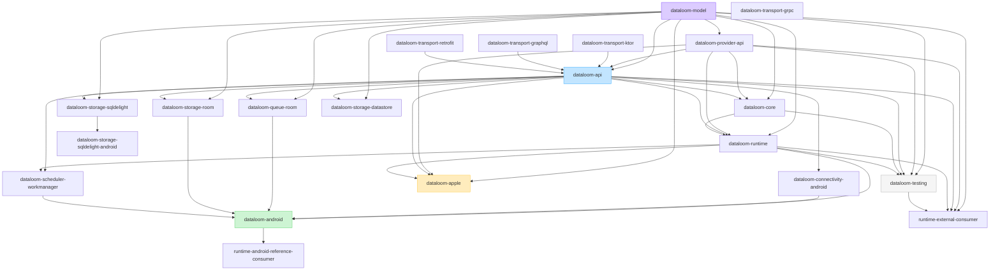

# DataLoom Module Architecture

This document describes the current DL-039 module-migration checkpoint and its
immediate dependency rules. It is a current-state view, not the V1 publication
claim. The approved V1 target graph,
published coordinates, internal engines, and migration sequence are defined by
[ADR-0002](../adr/ADR-0002-v1-artifact-and-foundation-architecture.md).

Product positioning:

> DataLoom is an Android-first, Jetpack-style, policy-driven adaptable
> synchronization SDK for native Android applications and Kotlin Multiplatform
> applications targeting Android and iOS.

The ADR-0002 V1 target spans offline-first, remote-first, cache-first,
network-only, hybrid, and adaptive synchronization profiles. Those profiles
define the target architecture; they are not all implemented or qualified in
the current repository.

---

## Module Overview

DataLoom is currently organized into six shared library modules, five optional
reference modules (`dataloom-transport-ktor`, `dataloom-transport-graphql`,
`dataloom-transport-grpc`, `dataloom-transport-retrofit`, and
`dataloom-storage-sqldelight`), seven Android integration modules (including
the `dataloom-android` aggregation artifact), two compile-only external
consumer fixtures, a macOS-only Apple distribution module, and one
build-infrastructure included build.



Arrows point from a dependency to its consumer. `dataloom-core` remains an
internal runtime implementation dependency and is not exported through the
Apple distribution boundary.

| Component | Type | Purpose |
|---|---|---|
| `dataloom-model` | Library module | Dependency-root canonical models; first slice contains clock primitives |
| `dataloom-provider-api` | Library module | Minimal provider lifecycle, descriptor, binding, and registry contracts |
| `dataloom-api` | Library module | Current public contracts, models, and error types |
| `dataloom-core` | Library module | Internal platform-independent foundation |
| `dataloom-runtime` | Library module | Synchronization runtime and engine coordination |
| `dataloom-testing` | Library module | Testing utilities, fakes, and controlled providers |
| `dataloom-transport-ktor` | Optional reference module | Ktor-backed reference `TransportProvider`; depends only on `dataloom-api` and Ktor client |
| `dataloom-transport-graphql` | Optional reference module | Apollo Kotlin–backed reference `TransportProvider`; depends only on `dataloom-api` and Apollo runtime |
| `dataloom-transport-grpc` | Optional reference module | grpc-kotlin–backed reference `TransportProvider`; JVM/Android only, no Kotlin/Native client |
| `dataloom-transport-retrofit` | Optional reference module | Retrofit-backed reference `TransportProvider`; JVM/Android only |
| `dataloom-storage-sqldelight` | Optional reference module | SQLDelight-backed reference `StorageProvider` (JVM + iOS) |
| `dataloom-connectivity-android` | Android library | Android `ConnectivityProvider` |
| `dataloom-scheduler-workmanager` | Android library | WorkManager scheduler and worker bridge |
| `dataloom-queue-room` | Android library | Room-backed durable `QueueProvider` |
| `dataloom-storage-room` | Android library | Room-backed reference `StorageProvider` |
| `dataloom-storage-datastore` | Android library | Preferences DataStore-backed reference `StorageProvider` for small key-value data |
| `dataloom-storage-sqldelight-android` | Android library | `AndroidSqliteDriver` wiring for `dataloom-storage-sqldelight` |
| `dataloom-android` | Android library | Real production aggregation of the four core Android providers plus wiring helpers ([details](../android/dataloom-android.md)) |
| `dataloom-apple` | KMP distribution module | Static `DataLoom` XCFramework assembly |
| `runtime-external-consumer` | Compile-only fixture | Proves the public runtime surface compiles without a `dataloom-core` dependency (JVM) |
| `runtime-android-reference-consumer` | Compile-only fixture | Proves `dataloom-android`'s wiring helpers compose with `DataLoomBuilder` ([details](../android/reference-consumer.md)) |
| `build-logic` | Build infrastructure | Gradle convention plugins (not a published library) |

The six shared modules and the KMP-capable optional reference modules use
Kotlin Multiplatform with JVM and host-gated Apple targets. Android-specific
functionality is isolated in dedicated Android libraries. None of these
projects is a published V1 artifact yet. The shared modules still expose only
a `jvm()` target consumed by Android bytecode, not an explicit `androidTarget()`
KMP variant — see
[kmp-android-target-blocker.md](../android/kmp-android-target-blocker.md) for
why that path is currently blocked, not merely unattempted.

---

## Module Responsibilities

### `dataloom-model`

Provides the dependency-root canonical model boundary. The first extraction
slice owns `DataLoomInstant` and `DataLoomClock` while preserving their
`io.dataloom.api.time` FQCNs and semantics.

Rules:

- Must not depend on another DataLoom project.
- Must remain platform-independent.
- Must not contain orchestration, providers, storage, or platform code.
- Additional moves must remain narrow and ABI-reviewed.

---

### `dataloom-provider-api`

Provides the smallest public SPI required by provider implementations without
pulling in the full SDK API or runtime.

Rules:

- May depend only on `dataloom-model`.
- Must remain platform-independent.
- Must not depend on `dataloom-api`, `dataloom-core`, or `dataloom-runtime`.
- Must not contain provider implementations or runtime orchestration.

---

### `dataloom-api`

Provides the current public contracts that host applications and production
modules depend on. These contracts are not frozen until the V1 compatibility
baseline is approved. Current content includes:

- Public API interfaces and models
- Canonical public error types
- Public configuration contracts
- Provider and plugin contracts

Rules:

- Must remain platform-independent.
- May depend on `dataloom-model` and `dataloom-provider-api`; must not depend
  on a DataLoom implementation module.
- Must not expose third-party dependency types through its API.
- Must not contain runtime implementations.
- Must not depend on Android APIs.

---

### `dataloom-core`

Provides internal, platform-independent foundations shared across runtime
components. Future content includes:

- Internal utilities used by `dataloom-runtime`
- Shared internal models and helpers

Rules:

- May depend on `dataloom-model`, `dataloom-provider-api`, and `dataloom-api`.
- Must not depend on `dataloom-runtime`.
- Must not depend on `dataloom-testing`.
- Internal implementation details must not be exposed as public API.
- Must not depend on Android APIs.

---

### `dataloom-runtime`

Provides the synchronization runtime. Future content includes:

- Synchronization lifecycle coordination
- Workflow orchestration
- Engine coordination

Rules:

- Public API may depend on `dataloom-model`, `dataloom-provider-api`, and
  `dataloom-api`; implementation may depend on `dataloom-core`.
- Must not depend on `dataloom-testing`.
- Must not expose internal implementation types publicly.
- Must not depend on Android APIs.

---

### `dataloom-testing`

Provides testing utilities for consumers of DataLoom. Future content includes:

- Fake provider implementations
- Controlled clocks and schedulers
- Test fixtures and builders
- Failure-injection utilities

Rules:

- May depend on `dataloom-model`, `dataloom-provider-api`, `dataloom-api`,
  `dataloom-core`, and `dataloom-runtime`.
- Must not be a dependency of any production module (`dataloom-runtime` or
  `dataloom-core` production source sets).
- Must not be included in runtime implementation dependencies.

---

### `build-logic`

A Gradle included build that provides reusable convention plugins for all
DataLoom library modules. It is build infrastructure and is not published as
a library.

Current convention plugins:

- `io.dataloom.kotlin.multiplatform-library` — configures Kotlin Multiplatform
  with a JVM target, Java toolchain 17, JVM bytecode target 17, common source
  sets, reproducible archive output, Kotlin ABI baselines, and public
  dependency-boundary checks.

Committed JVM and Kotlin/Native ABI baselines cover all six shared modules and
all three optional reference modules; the Apple umbrella has its own KLib
baseline. `dataloom-runtime` exposes no
`dataloom-core` or `dataloom-testing` type in either baseline, and a build task
rejects either namespace if it appears later. Apple validation also compiles
the external KMP consumer for all three iOS targets and audits generated
XCFramework headers for internal namespaces and cross-slice drift.

---

## Approved Dependency Direction

```
dataloom-model
  (no DataLoom dependencies)

dataloom-provider-api
└── depends on dataloom-model

dataloom-api
├── depends on dataloom-model
└── depends on dataloom-provider-api

dataloom-storage-sqldelight
├── depends on dataloom-model
└── depends on dataloom-api

dataloom-core
├── depends on dataloom-model
├── depends on dataloom-provider-api
└── depends on dataloom-api

dataloom-runtime
├── depends on dataloom-model
├── depends on dataloom-provider-api
├── depends on dataloom-api
└── depends on dataloom-core

dataloom-testing
├── depends on dataloom-model
├── depends on dataloom-provider-api
├── depends on dataloom-api
├── depends on dataloom-core
└── depends on dataloom-runtime

dataloom-transport-ktor
└── depends on dataloom-api

dataloom-transport-graphql
└── depends on dataloom-api

dataloom-transport-grpc
└── depends on dataloom-api

dataloom-transport-retrofit
└── depends on dataloom-api

dataloom-connectivity-android
└── depends on dataloom-api

dataloom-queue-room
├── depends on dataloom-model
└── depends on dataloom-api

dataloom-storage-room
├── depends on dataloom-model
└── depends on dataloom-api

dataloom-storage-datastore
├── depends on dataloom-model
└── depends on dataloom-api

dataloom-scheduler-workmanager
├── depends on dataloom-api
└── depends on dataloom-runtime

dataloom-android
├── depends on dataloom-runtime
├── depends on dataloom-connectivity-android
├── depends on dataloom-storage-room
├── depends on dataloom-queue-room
└── depends on dataloom-scheduler-workmanager

dataloom-apple
├── exports dataloom-model
├── exports dataloom-provider-api
├── exports dataloom-api
└── exports dataloom-runtime

runtime-external-consumer
├── depends on dataloom-model
├── depends on dataloom-provider-api
├── depends on dataloom-api
├── depends on dataloom-runtime
└── depends on dataloom-testing (compile-only fixture dependency)

runtime-android-reference-consumer
├── depends on dataloom-model
├── depends on dataloom-provider-api
├── depends on dataloom-api
└── depends on dataloom-android
```

---

## Prohibited Dependencies

The following dependencies are explicitly prohibited:

```
dataloom-model   → any DataLoom project
dataloom-provider-api → dataloom-api or any implementation module
dataloom-api     → any DataLoom implementation module
dataloom-core    → dataloom-runtime
dataloom-core    → dataloom-testing
dataloom-runtime → dataloom-testing
production code  → dataloom-testing
Android adapters → unrelated Android adapter modules
```

Circular project dependencies are prohibited.

---

## Platform Strategy Summary

- Android is the primary reference and adoption platform.
- Native Android, KMP Android, and KMP iOS are mandatory V1 consumer paths.
- Shared contracts and runtime foundations use Kotlin Multiplatform where
  technically appropriate.
- `commonMain` code and platform-neutral public contracts must not depend
  directly on Android or Apple APIs. Platform source sets and dedicated
  platform modules may use the APIs of the platform they integrate with.
- Platform-specific behavior belongs in dedicated platform modules or provider
  interfaces.
- Android-first controls implementation order, not V1 platform scope. The
  release remains blocked until both KMP Android and KMP iOS consumer paths
  are complete and qualified alongside native Android.
- The current shared convention has JVM and host-gated iOS targets, but no
  explicit KMP Android target. Native Android library support does not prove a
  KMP Android publication/consumer path; that target and its external consumer
  fixture are mandatory V1 work.
- New platform targets require an approved issue and compatibility testing.
- Support is not claimed until adapter and qualification tests exist.
- Prefer provider interfaces over `expect`/`actual` when interfaces provide a
  clearer extension boundary.

---

## Platform Independence Rules

- All common source sets (`commonMain`, `commonTest`) must remain
  platform-independent.
- Common source sets must not use Android APIs, JVM-specific APIs, or other
  platform-specific code.
- Platform-specific extensions belong in the appropriate platform source set
  (for example `androidMain`, `iosMain`, or `jvmMain`).
- V1 shared/public modules must provide compatible Android/JVM and
  `iosArm64`/`iosSimulatorArm64`/`iosX64` variants where their artifact
  responsibility requires them.
- Do not add JavaScript, Wasm, desktop application, or additional native
  targets without an approved issue.

---

## Current Android Integration Modules

| Module | Responsibilities | Boundaries |
|---|---|---|
| `dataloom-connectivity-android` | Bounded Android connectivity snapshot provider | No Room, SQLite, WorkManager, or other adapter dependency |
| `dataloom-scheduler-workmanager` | WorkManager scheduler, coroutine worker, and explicit worker factory | No Room or connectivity-adapter dependency |
| `dataloom-queue-room` | Room-backed durable queue, schema export, and migration tests | Room is not a shared runtime dependency |
| `dataloom-storage-room` | Room-backed reference `StorageProvider` | No queue, connectivity, or scheduler dependency |
| `dataloom-storage-datastore` | Preferences DataStore-backed reference `StorageProvider` | Small key-value data only; not for general sync data |
| `dataloom-storage-sqldelight-android` | `AndroidSqliteDriver` wiring for `dataloom-storage-sqldelight` | Query/schema logic owned by the shared JVM+iOS module |
| `dataloom-android` | Real production aggregation of the four core providers (connectivity, Room storage, Room queue, WorkManager) plus `installAndroidProviders`/`androidDataLoomProviders` wiring helpers | No transport, no DataStore/SQLDelight (opt-in individually), no queue-worker/queue-submission/provider-protection policy |

`dataloom-android` is the published-as-`dataloom-android` artifact ADR-0002's
source/engine graph already names — it aggregates the four *core* Android
providers and adds real wiring code, not an empty re-export. A same-shaped
sibling module for the shared KMP modules (`dataloom-model`/`api`/`core`/
`runtime`) was deliberately not built the same way: unlike
`dataloom-storage-sqldelight-android`'s real driver code, those modules have
no Android-specific implementation today, so a same-shaped sibling would be a
hollow wrapper with no capability delta over the existing `jvm()`-target
consumption path. See [dataloom-android.md](../android/dataloom-android.md)
for the full reasoning.

`dataloom-ios` (KMP iOS platform integrations) and `dataloom-jvm` (JVM/server
integrations) do not exist yet. `dataloom-apple` remains a thin
XCFramework/Swift distribution boundary. See ADR-0002; empty wrapper
artifacts do not satisfy this migration.

---

## Future Module Expansion

New modules may be introduced when explicitly approved through a GitHub issue.
Before adding a module:

1. Define its purpose and responsibility boundary.
2. Document allowed and prohibited dependencies.
3. Confirm it does not introduce circular dependencies.
4. Ensure it does not expose third-party library types through its public API.
5. Create the module using the approved `io.dataloom.kotlin.multiplatform-library`
   convention plugin or an appropriate successor.

Planned future modules are documented in
[Platform Strategy](./platform-strategy.md) and require dedicated approved
implementation issues.
