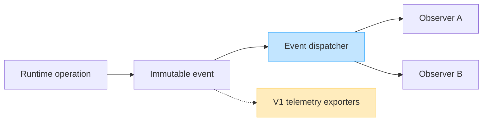

# Observation Boundaries (DL-016)

This document describes the architectural responsibility boundaries for the
synchronization observation system in DataLoom.

> [!IMPORTANT]
> Later runtime work added observer registration, ordered in-process dispatch,
> failure isolation, and lifecycle/progress/retry/conflict emissions. Replay,
> durable event history, backpressure/Flow delivery, metrics, tracing, health,
> and operational read models remain incomplete V1 requirements.

---

## Overview

DataLoom provides an application-level observation contract that allows host
applications to receive immutable notifications about synchronization
lifecycle activity without controlling it.



---

## Observation Semantics

| Boundary                  | Description                                                   |
|---------------------------|---------------------------------------------------------------|
| Events describe activity  | Events are immutable facts about what happened; they do not control the runtime |
| Callbacks are notifications| `onEvent()` is a notification, not a command                  |
| Event ordering            | Expected to follow runtime emission order                     |
| Delivery thread           | Current in-process dispatch runs on the caller's execution path |
| Replay                    | Not implemented                                                |
| Persistent event history  | Not implemented                                                |
| Multiple-observer registration | Implemented in the later runtime registry               |
| Observer failure isolation | Implemented for ordinary failures; cancellation propagates   |
| Backpressure              | Not implemented                                                |
| Lifecycle-aware collection | Not implemented                                               |
| Flow-based observation    | Not implemented                                                |

Do not claim guaranteed exactly-once event delivery, which is not defined
in DL-016.

---

## SynchronizationObserver Contract

```kotlin
public interface SynchronizationObserver {
    public val id: SynchronizationObserverId
    public fun onEvent(event: SynchronizationEvent)
}
```

### Implementation guidelines

- Return quickly from `onEvent()`.
- Do not block the calling thread.
- Do not throw from `onEvent()`; the runtime isolates ordinary observer
  failures so that one failing observer cannot fail synchronization or
  prevent delivery to other observers.
- Do not log payload content automatically from within `onEvent()`.
- Do not mutate DataLoom runtime state directly.
- Do not claim guaranteed exactly-once delivery.

### Thread safety

`onEvent()` runs on the dispatching caller's execution path. Implementations
must return quickly and remain thread-safe if applications execute multiple
synchronizations concurrently.

---

## Component Responsibilities

| Component                  | Responsibility                                                  |
|----------------------------|-----------------------------------------------------------------|
| `SynchronizationObserver`  | Application-level event observation contract                    |
| `MonitoringProvider`       | Future metrics and telemetry integration (deferred)             |
| `LoggingProvider`          | Future structured logging integration (deferred)               |
| DataLoom Runtime           | Produces and dispatches events; isolates ordinary observer failures |

These have different responsibilities and must not be conflated.

- `SynchronizationObserver` is for application-level observation.
- `MonitoringProvider` is a future metrics and telemetry integration.
- `LoggingProvider` is a future structured logging integration.

The runtime may adapt lifecycle events into metrics or logs later through
separate provider integrations.

---

## Workflow Lifecycle Boundary

```text
WorkflowLifecycleState
→ High-level workflow state: the lifecycle of the workflow as a whole
  (e.g., QUEUED, RUNNING, SUCCEEDED, FAILED)

SynchronizationPhase
→ Current operation within an executing workflow
  (e.g., PUSHING, PULLING, RESOLVING_CONFLICTS)

SynchronizationEvent
→ Immutable fact emitted about execution at a point in time

SynchronizationResult
→ Terminal outcome attached to the Completed event
```

The event model does **not** replace queue state or workflow lifecycle
state.

---

## Queue Boundary

```text
QueueProvider.acquire()
        ↓
Runtime starts workflow
        ↓
Synchronization events (Started, PhaseChanged, ProgressUpdated, …)
        ↓
SynchronizationResult
        ↓
QueueProvider.complete(), reschedule(), or fail()
```

Events and results do **not** mutate queue entries themselves. The queue
processor performs lease-guarded transitions after its handler produces an
outcome.

---

## Retry Boundary

```text
RetryPolicy produces RetryDecision
        ↓
Runtime schedules or persists retry work
        ↓
RetryScheduled event reports the resulting decision
```

- The `RetryScheduled` event does not evaluate policy.
- The `RetryScheduled` event does not call `SchedulerProvider`.
- The `RetryScheduled` event does not reschedule a queue entry.

---

## Conflict Boundary

```text
ConflictDetector identifies a conflict
        ↓
Runtime emits ConflictDetected event
        ↓
ConflictResolver produces a decision
        ↓
Runtime applies the decision
```

- Event observers do not resolve conflicts.
- Conflict payloads must not be logged automatically by observers.
- A separate conflict-resolution event may be introduced later when runtime
  semantics are implemented.

---

## Future Flow Observation

A dedicated runtime-observation issue will introduce a Flow-based API after
event delivery semantics are approved:

```kotlin
public fun observe(workflowId: WorkflowId): Flow<SynchronizationEvent>
```

Requirements for the future issue:

- Do not add `kotlinx-coroutines-core` in DL-016.
- Do not expose `Flow` in the current public API.
- Do not implement event replay.
- Do not implement hot or cold stream behavior.
- Do not define buffer or overflow behavior yet.

---

## Security and Privacy

- Event metadata must not contain credentials, encryption keys, or raw
  payload bytes.
- Observer implementations must follow DataLoom security restrictions.
- Sensitive payloads and metadata must not be exposed.
- `toString()` must not expose opaque payload content, credentials, or
  secrets.
