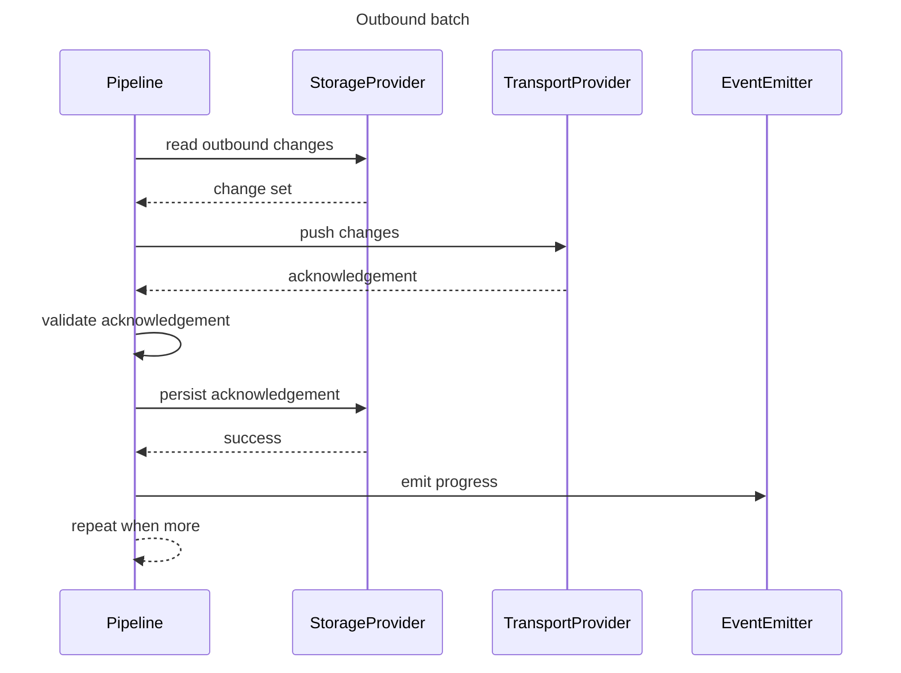

# Outbound Push Flow (DL-021)

This document describes the architectural flow and boundaries of
`OutboundPushSynchronizationPipeline`, the first concrete synchronization
pipeline implementation.

---

## Sequence



Each batch is processed strictly sequentially: read, push, validate,
acknowledge. The pipeline never performs parallel pushes and does not begin
reading the next batch until the current batch's acknowledgement has been
persisted (or the execution has stopped).

---

## Happy path

```text
SynchronizationExecutionCoordinator
    → SynchronizationExecutionContext(request, providers, runtimeDependencies)
    → OutboundPushSynchronizationPipeline.execute(context)
        → StorageProvider.readOutboundChanges(...) = Changes(changeSet, hasMore=true)
        → TransportProvider.pushChanges(...) = Success(acknowledgement)
        → validate(changeSet, acknowledgement) = valid
        → StorageProvider.acknowledgeOutboundChanges(...) = Success
        → StorageProvider.readOutboundChanges(...) = Changes(changeSet2, hasMore=false)
        → TransportProvider.pushChanges(...) = Success(acknowledgement2)
        → validate(changeSet2, acknowledgement2) = valid
        → StorageProvider.acknowledgeOutboundChanges(...) = Success
        → hasMore = false → stop
    → SynchronizationResult.Succeeded(summary, completedAt = clock.now())
```

---

## Failure paths

### No changes available

```text
StorageProvider.readOutboundChanges(...) = NoChanges
    → SynchronizationResult.Skipped(reason = NO_CHANGES, completedAt = clock.now())
```

No transport call and no acknowledgement call occur. This path is only taken
when it is the *first* read of the execution. A `NoChanges` result observed
after one or more batches were already processed instead completes the
execution as `Succeeded` or `PartiallySucceeded`.

### Duplicate batch detected

```text
StorageProvider.readOutboundChanges(...) = Changes(changeSet A, ...)   // processed
StorageProvider.readOutboundChanges(...) = Changes(changeSet A, ...)   // same ChangeSetId again
    → SynchronizationResult.Failed(error = DL-OUTBOUND-DUPLICATE-BATCH)
```

The second occurrence of `changeSet A` is never pushed. This protection is
local to a single `execute` call; no persistent deduplication store exists.

### Transport push failure

```text
TransportProvider.pushChanges(...) = Failure(canonicalError)
    → StorageProvider.acknowledgeOutboundChanges is NOT called
    → SynchronizationResult.Failed(error = canonicalError)
```

### Acknowledgement validation failure

```text
TransportProvider.pushChanges(...) = Success(acknowledgement)
validate(changeSet, acknowledgement) = invalid
    → StorageProvider.acknowledgeOutboundChanges is NOT called
    → SynchronizationResult.Failed(error = DL-OUTBOUND-ACK-*)
```

### Acknowledgement persistence failure

```text
TransportProvider.pushChanges(...) = Success(acknowledgement)
validate(changeSet, acknowledgement) = valid
StorageProvider.acknowledgeOutboundChanges(...) = Failure(canonicalError)
    → SynchronizationResult.Failed(error = canonicalError)
```

**Transport may have already accepted the batch even though local
acknowledgement persistence failed.** This is at-least-once delivery: a
retried execution may push the same `ChangeSetId` and change-event IDs again.
Backend APIs should be idempotent with respect to those identifiers.

### Batch limit reached

```text
batchesProcessed == maxBatchesPerExecution
last read result hasMore = true
    → no further storage read
    → SynchronizationResult.PartiallySucceeded(error = DL-OUTBOUND-BATCH-LIMIT-REACHED)
```

### Event-level non-acceptance

```text
StorageProvider.acknowledgeOutboundChanges(...) = Success
acknowledgement contains RETRY or REJECTED events
    → SynchronizationResult.PartiallySucceeded(errors = [...])
```

---

## Boundaries this pipeline does not cross

| Boundary | Status |
|---|---|
| Inbound pull / apply | Separate checked-in inbound pipeline; not invoked here |
| Bidirectional composition | Separate checked-in composition; this page covers the outbound child |
| Checkpoint read/write/advance | Not invoked; outbound push does not touch checkpoints |
| `RetryPolicy` execution | Not invoked |
| Queue acquire/complete/reschedule | Not invoked |
| `SchedulerProvider` | Not invoked |
| `ConnectivityProvider` | Not invoked |
| Conflict detection/resolution | Not invoked |
| Event dispatch / observer registry | Optional runtime emitter is used for lifecycle/progress events |
| Provider `initialize` / `health` / `close` | Not invoked (owned by the execution coordinator and lifecycle coordinator) |

---

## Delivery semantics

`OutboundPushSynchronizationPipeline` provides **at-least-once** delivery.
It does not claim exactly-once delivery: transport push and local
acknowledgement persistence are two separate steps, and a failure between
them can result in the same batch being pushed again in a later execution.
Backend transport implementations should treat `ChangeSetId` and change-event
IDs as stable idempotency keys.

---

## KMP compatibility

All types participating in this flow (`OutboundPushPipelineConfiguration`,
`OutboundPushSynchronizationPipeline`, and the DL-020/DL-019/DL-017 contracts
it depends on) are implemented using Kotlin standard-library and DataLoom
API, core, and runtime types only. No Android API, JVM-only API, or
third-party library type is required.

---

## Performance and security restrictions

- One batch is read, pushed, validated, and acknowledged at a time; no
  parallel batch push occurs.
- Completed batch payload references are released before the next batch is
  read; no pipeline-owned collection accumulates processed `ChangeSet`
  instances across an execution.
- No blocking thread operation, `Thread.sleep`, `GlobalScope`, or dispatcher
  selection is used.
- Diagnostics and errors never expose payload bytes, credentials,
  authorization headers, checkpoint tokens, encryption keys, personal data,
  stack traces, provider internal state, or complete provider `toString()`
  output.

See [Outbound Push Pipeline (DL-021)](../api/outbound-push-pipeline.md) for
the complete API-level contract documentation.
