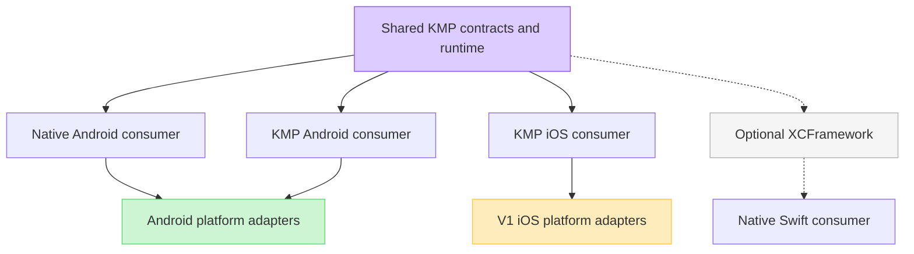

# DataLoom Platform Strategy (DL-006)

## Approved product statement

> DataLoom is an Android-first, Jetpack-style synchronization SDK whose primary
> purpose is one policy-driven engine with first-class offline-first,
> remote-first, cache-first, network-only, hybrid, and adaptive strategies for
> native Android and Kotlin Multiplatform Android and iOS consumers.

All six strategies are mandatory built-in V1 product capabilities. They are
not optional plugins, application-only policies, or V2 work. This is the
approved product purpose, not a claim that every strategy is implemented or
qualified in the current repository.

Android-first and Kotlin Multiplatform support are complementary:

- Android is the primary adoption and reference platform.
- Shared contracts and orchestration are delivered to both Android and iOS
  Kotlin Multiplatform targets in V1.

DataLoom is not Android-only, not KMP-first, and not an official AndroidX
library. Android-first controls implementation order; it does not reduce the
mandatory V1 platform matrix defined by
[ADR-0002](../adr/ADR-0002-v1-artifact-and-foundation-architecture.md).

Solid paths are mandatory V1 consumer paths. The dotted XCFramework/Swift path
is optional distribution and does not define whether KMP iOS is supported.

## Platform strategy rules

1. Android is the primary reference and adoption platform.
2. Android receives the first complete production-quality vertical slice.
3. Shared contracts and orchestration remain in Kotlin Multiplatform modules
   where technically appropriate.
4. Android APIs must not appear in `commonMain` or platform-neutral public
   contracts; Android implementation APIs belong only in dedicated Android
   targets/modules such as `androidMain`.
5. Platform behavior must be provided through dedicated platform modules or
   provider interfaces.
6. The Android reference slice is completed first, but V1 production release
   remains blocked until the KMP Android and KMP iOS consumer paths pass.
7. New platform targets require explicit issues and compatibility testing.
8. Platform support is not claimed until the relevant adapter and qualification
   tests exist.
9. Avoid `expect`/`actual` when a provider interface creates a clearer extension
   boundary.
10. Do not force platform-specific lifecycle or scheduling semantics into common
    APIs.
11. Android and iOS variants are resolved and packaged separately; an Android
    APK/AAB does not contain Apple binaries.
12. Compilation of a target is foundation evidence, not proof of lifecycle,
    persistence, security, background execution, distribution, or end-to-end
    product support.

## V1 consumer and conditional distribution paths

The first three rows are mandatory V1 consumer paths. Native Swift is an
optional distribution path and becomes a release gate only if it is enabled.

| Consumer | Required dependency path | V1 evidence |
|---|---|---|
| Native Android application | Public/runtime artifacts plus `dataloom-android` and optional Android providers | Published-style external consumer, AAR metadata, integration tests, restart/background tests, shrinker checks, and reference application |
| KMP application — Android | Shared public/runtime artifacts from `commonMain` plus Android integration from `androidMain` | Explicit Android KMP target/variant, external KMP consumer, Android end-to-end tests, and publication metadata |
| KMP application — iOS | Shared public/runtime artifacts from `commonMain` plus `dataloom-ios` from `iosMain` | `iosArm64`, `iosSimulatorArm64`, and `iosX64` variants, external KMP consumer, platform adapters, simulator/device qualification, and publication metadata |
| Native Swift application | Optional `DataLoom` XCFramework or Swift package over approved public artifacts | Header/API review, Swift consumer build, signing/distribution metadata, and runtime integration tests when this distribution is shipped |

The product version aligns the paths, but no application receives another
platform's binary. A KMP application shares common code and selects the
appropriate platform dependency in its Android and iOS source sets.

## Current baseline versus V1

| Path | Current evidence | Missing before support can be claimed |
|---|---|---|
| Native Android | Connectivity, Room queue, and WorkManager Android library modules compile and have focused tests | Published aggregate artifact, external consumer/reference app, full provider set, release qualification |
| KMP Android | A JVM artifact exists, but that does not prove a KMP Android variant or `androidMain` consumer path | Explicit KMP Android target and Gradle variant, Android source-set consumer fixture, publication and end-to-end evidence |
| KMP iOS | Shared modules compile for three iOS targets on macOS and shared simulator tests run | `dataloom-ios`, platform providers, external KMP iOS consumer/sample, persistence/background/security integration, end-to-end evidence |
| Native Swift | XCFramework assembly and a compile-only Swift smoke fixture exist; the current export graph excludes internal `dataloom-core` and `dataloom-testing` modules | Supported Swift facade review, platform implementations, packaging/signing, header compatibility, and runtime qualification |

The current `dataloom-apple` umbrella exports `dataloom-model`,
`dataloom-provider-api`, `dataloom-api`, and `dataloom-runtime`. The public
runtime JVM and KLib ABI baselines contain no `dataloom-core` or
`dataloom-testing` references. Apple CI additionally rejects those namespaces
in generated headers and requires identical public headers across device and
simulator XCFramework slices.

## Current pre-V1 shared modules

| Module | Current ownership |
|---|---|
| `dataloom-model` | Dependency-root canonical models, errors, metadata, identifiers, and time contracts |
| `dataloom-provider-api` | Minimal provider lifecycle, descriptor, binding, registry, and provider-reference contracts |
| `dataloom-api` | Public configuration, queue/storage/transport SPIs, retry/conflict contracts, events, execution contracts, and runtime dependency inputs |
| `dataloom-core` | Internal provider registry, binding/resolution, and lifecycle implementation |
| `dataloom-runtime` | Facade, synchronization pipelines, queue/worker coordination, connectivity preflight, retry/conflict orchestration, and observer dispatch |
| `dataloom-testing` | Fake providers, controlled clocks/identifiers, failure helpers, fixtures, and deterministic test support |
| `dataloom-transport-ktor` | Optional KMP reference `TransportProvider` backed by the Ktor HTTP client |

These are implementation facts, not the approved V1 artifact ownership model.
`dataloom-api` is not yet a frozen publication surface, no full plugin API
exists, and the complete V1 capability set is not yet implemented.
`dataloom-core` remains an internal runtime dependency and production modules
must not depend on `dataloom-testing`. Platform-specific execution remains
behind provider/platform boundaries.

The target source modules, stable coordinates, and migration direction are
defined only by ADR-0002.

## Android reference modules

| Boundary | Current/target status |
|---|---|
| `dataloom-connectivity-android` | Current narrow `ConnectivityManager` provider; depends on `dataloom-api` |
| `dataloom-scheduler-workmanager` | Current optional WorkManager scheduler/worker bridge; depends on API and runtime |
| `dataloom-queue-room` | Current optional Room queue provider; depends on `dataloom-model` and `dataloom-api` |
| `dataloom-android` | Target stable aggregate for approved Android lifecycle, connectivity, files, secure integration, diagnostics, and adapters |
| `sample-android` | Required reference consumer; not yet implemented |
| Reference transport provider | Required V1 integration choice; artifact/technology remains to be frozen |

The aggregate must retain narrow implementation boundaries. Room,
WorkManager, or a specific transport must not become an undeclared dependency
of every Android consumer.

## Mandatory KMP and iOS modules

### `dataloom-ios`

- iOS lifecycle and application-state integration
- Connectivity integration
- Background execution integration with explicit platform limitations
- Files, asset staging, and cleanup
- Secure credential/key references
- Platform persistence and recovery adapters
- Platform diagnostics and supported-provider aggregation

It is a KMP iOS platform artifact, not merely an XCFramework wrapper.

### `sample-kmp`

- Shared Android and iOS consumer
- Published-style dependency resolution
- Offline, retry, conflict, event, asset, plugin, and governance scenarios
- Android process-restart and iOS background/relaunch evidence
- Platform-parity assertions for externally observable behavior

### `dataloom-apple`

- Optional native Swift distribution assembly
- XCFramework/Swift-package metadata and smoke/runtime consumer evidence
- Exports only approved stable public artifacts

`dataloom-apple` owns no synchronization engine or platform provider.

Multiplatform transport and storage providers such as Ktor and SQLDelight may
be used where they meet the approved SPI, migration, security, and
qualification requirements. Their implementation choice does not remove the
mandatory `dataloom-ios` product boundary.

## Jetpack-style principles for DataLoom

In DataLoom, Jetpack-style means:

- Clear and focused public APIs
- Kotlin-first design
- Coroutines and Flow for asynchronous state where appropriate
- Lifecycle-aware Android integrations
- Sensible defaults
- Optional advanced configuration
- Stable Maven artifacts
- Semantic versioning
- Strong documentation
- Sample applications
- Dedicated testing utilities
- Predictable error behavior
- Modular integrations
- Backward compatibility
- Deprecation before removal

DataLoom is not an official AndroidX library and must not use the
`androidx.*` namespace. The approved package namespace remains `io.dataloom`.

## Provider strategy

Provider interfaces are the primary abstraction for:

- Storage
- Transport
- Scheduling
- Connectivity
- Authentication
- Serialization
- Encryption
- Compression
- Logging
- Monitoring

Use platform modules when integration depends directly on platform lifecycle or
operating-system APIs.

Avoid `expect`/`actual` for infrastructure integrations when provider
interfaces are more extensible and testable.

## Initial delivery sequence

Public artifact graph and JVM/Kotlin ABI baseline
        ↓
Shared configuration, policy, state, security, and event foundations
        ↓
V1 provider/plugin/platform contract baseline
        ↓
Adaptable synchronization strategy contracts and first vertical plan
        ↓
Android reference vertical slice and explicit KMP Android target
        ↓
KMP iOS platform adapter and parity slice
        ↓
Retry, conflict, observability, assets, plugins, and governance
across all mandatory consumer paths and targets
        ↓
Published-style native Android and KMP Android/iOS consumers
        ↓
One immutable cross-platform V1 release candidate

## Initial Android vertical slice (roadmap target)

Android repository creates a synchronization request
        ↓
DataLoom validates the request
        ↓
Work is stored in a durable queue
        ↓
WorkManager schedules execution
        ↓
TransportProvider exchanges data
        ↓
StorageProvider persists synchronized state
        ↓
Retry policy handles recoverable failures
        ↓
Flow exposes synchronization state
        ↓
Pending work survives process restart

This flow is the V1 delivery target and is not complete in the current
baseline.

## Follow-up implementation status

- Provider SPI contracts — current foundation implemented
- Shared runtime lifecycle — current foundation implemented
- Durable queue contracts and processing — current foundation implemented
- Add Android platform module ✅ (DL-037)
- Add WorkManager scheduler module ✅ (DL-037)
- Add Room-backed queue provider ✅ (DL-037)
- Select and qualify the reference transport provider; the transport technology
  is not frozen
- Create Android reference application
- Add explicit KMP Android target and consumer qualification
- Add `dataloom-ios` platform integrations and KMP iOS consumer qualification
- Keep Apple headers and runtime ABI free of internal `dataloom-core` and
  `dataloom-testing` types
- Add platform-parity contract and end-to-end suites

## Android modules (DL-037)

Three independently consumable Android modules were introduced in DL-037:

| Module | Purpose |
|---|---|
| `dataloom-connectivity-android` | `ConnectivityProvider` backed by `ConnectivityManager` |
| `dataloom-scheduler-workmanager` | `SchedulerProvider` backed by WorkManager, plus CoroutineWorker bridge |
| `dataloom-queue-room` | `QueueProvider` backed by Room and SQLite |

Each module is optional. An application using only Room does not require
WorkManager or the connectivity module.

See [docs/android/README.md](../android/README.md) for integration details.
