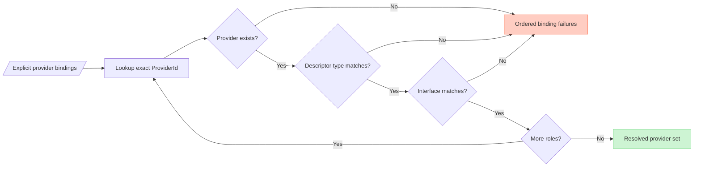

# Provider Resolution (DL-019)

## Overview

`SynchronizationProviderResolver` resolves explicit provider bindings declared
in `SynchronizationProviderBindings` against a `ProviderRegistry`. It
validates each binding structurally and returns a `ProviderResolutionResult`
containing either the fully resolved provider set or a deterministic ordered
list of binding failures.

---

## Responsibilities

| Component | Responsibility |
|---|---|
| `ProviderRegistry` | Stores provider references; immutable after construction. |
| `ProviderLifecycleCoordinator` | Initializes and shuts down providers in registration order. |
| `SynchronizationProviderResolver` | Resolves explicit `ProviderId` bindings to provider instances. |
| `SynchronizationExecutionCoordinator` | Ensures lifecycle initialization is complete before using resolved providers. |

---

## Resolution flow



---

## Explicit ProviderId selection

Every lookup is based on the exact `ProviderId` configured in
`SynchronizationProviderBindings`. No provider is ever selected:

- by `ProviderType` alone
- by registration order
- by lexicographic ID sort
- by enum ordinal
- by naming convention

When multiple providers share the same `ProviderType`, the explicit `ProviderId`
in the bindings determines which instance is returned.

### Example: multiple providers of the same type

```kotlin
val registry = ProviderRegistry(
    listOf(
        storagePrimary,    // ProviderId("storage-primary"), ProviderType.STORAGE
        storageSecondary,  // ProviderId("storage-secondary"), ProviderType.STORAGE
        transportProd,     // ProviderId("transport-prod"), ProviderType.TRANSPORT
        transportTest,     // ProviderId("transport-test"), ProviderType.TRANSPORT
    )
)

val resolver = SynchronizationProviderResolver(registry)

// Explicitly choose secondary storage and test transport.
// Registration order does not influence selection.
val bindings = SynchronizationProviderBindings(
    storageProviderId = ProviderId("storage-secondary"),
    transportProviderId = ProviderId("transport-test"),
)

val result = resolver.resolve(bindings)
// result.providers.storageProvider === storageSecondary
// result.providers.transportProvider === transportTest
```

---

## Role validation

For each configured binding, the resolver performs three checks in order:

### Step 1 — Existence check

The `ProviderId` is looked up in `ProviderRegistry.findById()`. If no provider
is found, `PROVIDER_NOT_FOUND` is recorded and validation for that role stops.

### Step 2 — Descriptor type check

`ProviderDescriptor.type` is compared against the expected `ProviderType` for
the role. If they do not match, `PROVIDER_TYPE_MISMATCH` is recorded and
validation for that role stops.

Type mismatch is evaluated before interface mismatch.

### Step 3 — Provider interface check

The provider object is checked for the required specialized interface using a
direct Kotlin `is` check. If the provider does not implement the required
interface, `PROVIDER_CONTRACT_MISMATCH` is recorded.

### Expected mappings

| Runtime role | Expected `ProviderType` | Required interface |
|---|---|---|
| Storage | `ProviderType.STORAGE` | `StorageProvider` |
| Transport | `ProviderType.TRANSPORT` | `TransportProvider` |
| Scheduler | `ProviderType.SCHEDULER` | `SchedulerProvider` |
| Connectivity | `ProviderType.CONNECTIVITY` | `ConnectivityProvider` |
| Queue | `ProviderType.QUEUE` | `QueueProvider` |

---

## Required and optional roles

| Role | Required | Behavior when not configured |
|---|---|---|
| Storage | Yes | Always validated |
| Transport | Yes | Always validated |
| Scheduler | No | `null`; not validated; no failure |
| Connectivity | No | `null`; not validated; no failure |
| Queue | No | `null`; not validated; no failure |

---

## Deterministic failure ordering

All configured roles are evaluated. Failures are aggregated and returned in
deterministic role order — not fail-fast:

1. Storage
2. Transport
3. Scheduler
4. Connectivity
5. Queue

Optional roles that are not configured produce no failure.

### Example: all roles missing

```kotlin
val resolver = SynchronizationProviderResolver(ProviderRegistry(emptyList()))

val bindings = SynchronizationProviderBindings(
    storageProviderId = ProviderId("storage-missing"),
    transportProviderId = ProviderId("transport-missing"),
    schedulerProviderId = ProviderId("scheduler-missing"),
    connectivityProviderId = ProviderId("connectivity-missing"),
    queueProviderId = ProviderId("queue-missing"),
)

val result = resolver.resolve(bindings)
// result is ProviderResolutionResult.Failure with 5 failures in role order:
// [STORAGE/NOT_FOUND, TRANSPORT/NOT_FOUND, SCHEDULER/NOT_FOUND,
//  CONNECTIVITY/NOT_FOUND, QUEUE/NOT_FOUND]
```

---

## No partial resolution

When any binding fails, `ProviderResolutionResult.Failure` is returned.
No partially resolved provider instances are exposed through the failure result.

---

## Registry lookup versus provider selection

`ProviderRegistry` provides lookup primitives (`findById`, `findByType`) but
does not implement provider-selection policy.

`SynchronizationProviderResolver` uses `findById` exclusively. It never uses
`findByType` as a selection mechanism.

---

## Lifecycle coordinator boundary

`SynchronizationProviderResolver` performs no provider lifecycle operation:

- It does not call `DataLoomProvider.initialize`.
- It does not call `DataLoomProvider.close`.
- It does not call `DataLoomProvider.health`.

Resolved providers are not guaranteed to be initialized.
`SynchronizationExecutionCoordinator` currently checks that
`ProviderLifecycleCoordinator` is in `INITIALIZED` state before provider
resolution and pipeline execution. Any other direct resolver consumer remains
responsible for the same lifecycle precondition.

---

## No synchronization orchestration

`SynchronizationProviderResolver` does not:
- execute synchronization
- process queues
- evaluate retry policy
- resolve conflicts
- dispatch events
- trigger scheduling
- observe connectivity

---

## Thread-safety expectations

`SynchronizationProviderResolver` is stateless after construction and safe to
call from any thread or coroutine context. It selects no dispatcher and exposes
no `CoroutineScope`.

---

## KMP constraints

All contracts are in `dataloom-core` `commonMain`. They use Kotlin
standard-library and DataLoom API types only. No Android APIs, JVM-only types,
Apple-specific types, or third-party libraries are required.

---

## Security restrictions

Do not expose through diagnostic representations:
- Provider internal state
- Credentials, tokens, or authorization headers
- Payload bytes, checkpoint tokens, or encryption keys
- Personal data
- Stack traces

Provider IDs and types are structural identifiers and may appear in diagnostic
output.

---

## No service discovery

`SynchronizationProviderResolver` does not use:
- `Class.forName`
- `KClass` reflection
- `ServiceLoader`
- Implementation class-name matching
- `ProviderType` enum ordinals as selection policy

---

## Scope restrictions

`SynchronizationProviderResolver` still resolves structural bindings only.
Related runtime concerns have the following current boundaries:

| Concern | Current boundary |
|---|---|
| Lifecycle state validation | Implemented by `SynchronizationExecutionCoordinator`, outside the resolver |
| Provider health checking | Not performed automatically during resolution or execution |
| Runtime provider mutation | Not implemented |
| Provider auto-discovery | Not implemented |
| Synchronization runtime | Implemented outside the resolver |
| Retry, queue, conflict, event, and scheduling orchestration | Partial foundations exist in dedicated runtime components; complete V1 behavior remains open |
