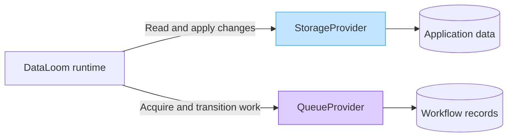
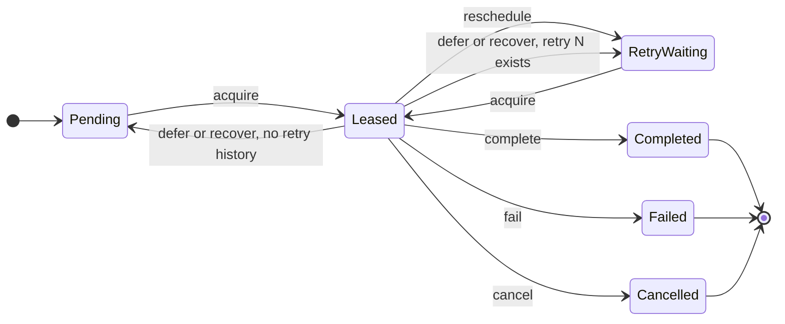

# DataLoom Queue Boundaries (DL-015)

This document describes the architectural boundaries of the DataLoom durable
synchronization queue and defines what belongs to the queue provider, the
runtime, and the host application.

---

## Queue Provider vs. Storage Provider

DataLoom uses two distinct provider types for persistence. They must not be
confused:

| Concern | Provider | Owned by |
|---|---|---|
| Application domain data (entities, changes) | `StorageProvider` | Host application |
| DataLoom workflow execution records | `QueueProvider` | DataLoom runtime |



A Room implementation may physically reside in the same database file, but
schemas and ownership boundaries must remain separate.

---

## Queue Provider Boundary

`QueueProvider` owns:

- Persisting `QueueEntry` records in durable storage.
- Atomically acquiring eligible entries and assigning exclusive leases.
- Completing, deferring, rescheduling, failing, and cancelling entries.
- Recovering entries whose leases have expired after process death.
- Validating active lease identifiers on all lease-protected operations.

`QueueProvider` must not:

- Execute synchronization work.
- Call `StorageProvider` or `TransportProvider`.
- Evaluate retry policy or choose retry delays.
- Choose failure dispositions.
- Resolve conflicts.
- Automatically remove terminal entries.
- Select threads or dispatchers.
- Expose platform-specific types through its public API.

The durable lifecycle is lease-guarded:



Deferral and lease recovery preserve retry history: null remains null and
attempt N remains N. Wider retry/circuit state and persistence qualification
remain V1 work.

---

## Runtime Boundary

The DataLoom runtime owns:

- Priority ordering and fairness among eligible entries.
- Workflow-specific concurrency limits.
- Tenant isolation.
- Batching and starvation prevention.
- Dependency ordering.
- Evaluating `RetryPolicy` and supplying `RetryAttempt` and `availableAt`
  to `QueueProvider.reschedule`.
- Classifying unmet execution constraints and supplying `availableAt` and a
  stable reason to `QueueProvider.defer` without creating an attempt.
- Choosing `QueueFailureDisposition` based on policy.
- Triggering `recoverExpiredLeases` after detecting potential process death.

---

## Atomic Acquisition Boundary

Acquiring eligible queue entries and assigning their lease must be **one
atomic provider operation**.

A provider must not:

1. Read eligible entries.
2. Return them.
3. Assign the lease later in a separate operation.

That pattern could allow multiple consumers to process the same entry
concurrently.

Eligible entries are conceptually:

```text
PENDING where availableAt <= acquiredAt
```

or:

```text
RETRY_WAITING where availableAt <= acquiredAt
```

Exact ordering, priority, and selection policy are owned by the future
DataLoom queue runtime.

---

## Retry Boundary

`QueueProvider` persists retry state but does not evaluate retry policy.

```text
QueueProvider.acquire()
      ↓
Runtime performs synchronization
      ↓
Failure
      ↓
RetryPolicy.evaluate()
      ↓
RetryDecision.Retry
      ↓
QueueProvider.reschedule()
```

or:

```text
RetryDecision.Stop
      ↓
QueueProvider.fail()
```

`QueueProvider.reschedule` receives a `RetryAttempt` and `availableAt`
supplied by the runtime. It must persist them without re-evaluating policy.

Constraint deferral follows a separate path:

```text
Execution constraint not met before pipeline execution
      ↓
QueueEntryExecutionOutcome.Deferred
      ↓
QueueProvider.defer()
      ↓
Preserve retryAttempt exactly
```

---

## Process-Death Recovery Boundary

Process death may leave entries permanently stuck in `LEASED` state if leases
are not recovered. Recovery is a `QueueProvider` responsibility triggered by
the runtime.

```text
Entry is LEASED
      ↓
Process terminates
      ↓
Lease expires
      ↓
recoverExpiredLeases(...)
      ↓
Entry becomes recoverable
```

Recovery requirements:

- Based on persisted lease information only.
- In-memory state must not be assumed to survive.
- Unexpired leases must not be recovered.
- Preserve `retryAttempt` exactly.
- Return to `PENDING` when the attempt is null and to `RETRY_WAITING` when
  attempt N exists.

---

## Application Storage Boundary

- Application UI must **not** query `QueueProvider` for business data.
- DataLoom queue records must **not** become application domain entities.
- A Room implementation may physically use the same database, but schemas and
  ownership boundaries must remain separate.
- Queue payloads and metadata may be sensitive and require secure storage
  according to application policy.

---

## Queue Ordering Boundary

`QueueProvider` may preserve a deterministic storage order, but must not
claim that this defines the final DataLoom scheduling policy.

The future queue runtime determines:

- Priority ordering.
- Fairness.
- Workflow-specific limits.
- Tenant isolation.
- Concurrency limits.
- Dependency ordering.
- Batching.
- Starvation prevention.

Enum ordinals in `QueueEntryState`, `QueueFailureDisposition`, and
`QueueEntryState` must not be persisted as ordering signals.

---

## Platform Integration Boundary

### Android

The current `dataloom-queue-room` module implements `QueueProvider` using
Room. The current `dataloom-scheduler-workmanager` module supplies the
WorkManager scheduler and worker bridge that can:

1. Acquire leased work via `QueueProvider.acquire`.
2. Execute synchronization through the shared runtime.
3. Complete, reschedule, or fail the entry.

These modules are current foundations; they do not establish a published
aggregate or complete V1 qualification.

WorkManager, Worker, AlarmManager, JobScheduler, or other platform-specific
types must not be exposed through the `QueueProvider` public API.

### KMP and iOS

The cross-platform persistence technology, including whether SQLDelight is
used, remains unresolved. Durable queue persistence and recovery for the
mandatory KMP iOS path must be implemented and qualified for V1.

---

## Related Documentation

- [Queue Models](../api/queue-model.md) — Queue model contracts.
- [Queue Provider](../api/queue-provider.md) — `QueueProvider` SPI.
- [Storage Provider](../api/storage-provider.md) — Application storage adapter.
- [Provider SPI](../api/provider-spi.md) — DataLoom provider framework.
