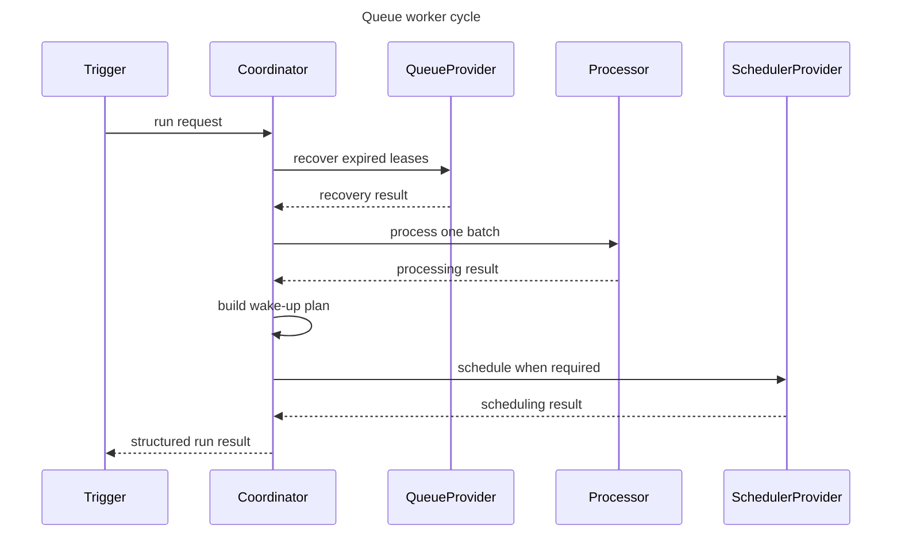

# Queue Worker Wake-Up and Recovery Flow (DL-032)

## Purpose

This document describes the bounded runtime flow for one complete
queue-worker coordination cycle in `QueueWorkerCoordinator`.

The coordinator sits between platform scheduling triggers and
`DurableQueueExecutionProcessor`. One `run()` call:

1. Optionally recovers expired leases.
2. Drives one bounded processing cycle.
3. Plans at most one scheduler wake-up.
4. Reports a structured terminal result.

---

## Sequence overview



Recovery and processing are bounded to one call. A future wake-up is scheduled
only when the processing summary provides continuation evidence.

> [!CAUTION]
> The current Room and in-memory expired-lease recovery paths clear persisted
> retry attempts. V1 must preserve a null or genuine attempt exactly so process
> death cannot reset a retry budget.

---

## Sequence 1: Recovery and processing with no work

```text
Caller
  → QueueWorkerCoordinator.run(request)
      │
      ├─ [if recovery enabled]
      │     → QueueProvider.recoverExpiredLeases(recoveryRequest)
      │           ← ProviderOperationResult.Success(recoveredEntries=N)
      │
      ├─ → DurableQueueExecutionProcessor.process(processingRequest)
      │         → QueueProvider.acquire(acquireRequest)
      │               ← ProviderOperationResult.Success(NoEntries)
      │         ← QueueProcessingResult.NoWork
      │
      ├─ Wake-up plan: NoWakeUp
      │     (no continuation evidence, scheduler not called)
      │
      └─ ← QueueWorkerRunResult.ProcessingCompleted(
               recoveryResult = ExpiredLeaseRecoveryResult(N),
               processingResult = NoWork,
               schedulingResult = NotRequired,
           )
```

---

## Sequence 2: Acquisition-limit continuation

Triggered when the acquired entry count equals `QueueAcquireRequest.maxEntries`.

```text
Caller
  → QueueWorkerCoordinator.run(request)
      │
      ├─ → DurableQueueExecutionProcessor.process(processingRequest)
      │         → QueueProvider.acquire(acquireRequest)     [maxEntries=5]
      │               ← ProviderOperationResult.Success(Entries[5 entries])
      │         [execute and persist all 5 entries]
      │         ← QueueProcessingResult.Processed(
      │                summary.acquired=5,
      │                acquisitionLimitReached=true,
      │                earliestRescheduledAt=null,
      │            )
      │
      ├─ Wake-up plan: Schedule(
      │     reason=ACQUISITION_LIMIT_REACHED,
      │     delay=configuration.continuationDelay,
      │     scheduleId=..., constraints=..., existingSchedulePolicy=...,
      │   )
      │
      ├─ → SchedulerProvider.schedule(ScheduleRequest)
      │         ← ProviderOperationResult.Success(ScheduleReceipt)
      │
      └─ ← QueueWorkerRunResult.ProcessingCompleted(
               processingResult = Processed(...),
               schedulingResult = Scheduled(receipt, plan),
           )
```

---

## Sequence 3: Rescheduled-entry wake-up

Triggered when one or more entries were successfully persisted into a
rescheduled state.

```text
Caller
  → QueueWorkerCoordinator.run(request)
      │
      ├─ → DurableQueueExecutionProcessor.process(processingRequest)
      │         → QueueProvider.acquire(acquireRequest)     [maxEntries=5]
      │               ← ProviderOperationResult.Success(Entries[2 entries])
      │         [handler returns Reschedule for both entries]
      │         → QueueProvider.reschedule(entry1)
      │               ← ProviderOperationResult.Success(Unit)
      │         → QueueProvider.reschedule(entry2)
      │               ← ProviderOperationResult.Success(Unit)
      │         ← QueueProcessingResult.Processed(
      │                summary.acquired=2, summary.rescheduled=2,
      │                acquisitionLimitReached=false,
      │                earliestRescheduledAt=<earliest availableAt>,
      │            )
      │
      ├─ → DataLoomClock.now()    [read exactly once]
      │         ← DataLoomInstant(nowMs)
      │
      ├─ delay = max(0, earliestRescheduledAt − nowMs)
      │
      ├─ Wake-up plan: Schedule(
      │     reason=RESCHEDULED_ENTRY_AVAILABLE,
      │     delay=SchedulingDelay(delayMs),
      │     scheduleId=..., constraints=..., existingSchedulePolicy=...,
      │   )
      │
      ├─ → SchedulerProvider.schedule(ScheduleRequest)
      │         ← ProviderOperationResult.Success(ScheduleReceipt)
      │
      └─ ← QueueWorkerRunResult.ProcessingCompleted(
               schedulingResult = Scheduled(receipt, plan),
           )
```

---

## Sequence 4: Scheduler failure after durable processing

Durable queue state is **not** rolled back. The coordinator returns
`ProcessingCompleted` with `SchedulerFailed` inside `schedulingResult`.

```text
Caller
  → QueueWorkerCoordinator.run(request)
      │
      ├─ → DurableQueueExecutionProcessor.process(processingRequest)
      │         [entries acquired, executed, and transitions persisted]
      │         ← QueueProcessingResult.Processed(acquisitionLimitReached=true)
      │
      ├─ Wake-up plan: Schedule(reason=ACQUISITION_LIMIT_REACHED, ...)
      │
      ├─ → SchedulerProvider.schedule(ScheduleRequest)
      │         ← ProviderOperationResult.Failure(DataLoomError)
      │
      └─ ← QueueWorkerRunResult.ProcessingCompleted(
               processingResult = Processed(...),    [durable state preserved]
               schedulingResult = SchedulerFailed(error, plan),
           )
         ─── queue state NOT rolled back ───
         ─── another host trigger may be required ───
```

---

## Sequence 5: Recovery failure

Recovery failure stops the cycle. No acquisition or scheduling follows.

```text
Caller
  → QueueWorkerCoordinator.run(request)
      │   [recoverExpiredLeasesBeforeProcessing=true]
      │
      ├─ → QueueProvider.recoverExpiredLeases(recoveryRequest)
      │         ← ProviderOperationResult.Failure(DataLoomError)
      │
      └─ ← QueueWorkerRunResult.RecoveryFailed(error)
         ─── no acquisition ───
         ─── no scheduling ───
```

---

## Sequence 6: Cancellation during scheduler invocation

Durable queue transitions that succeeded before cancellation are not rolled
back. Cancellation propagates normally.

```text
Caller
  → QueueWorkerCoordinator.run(request)
      │
      ├─ → DurableQueueExecutionProcessor.process(processingRequest)
      │         [entries acquired, executed, and transitions persisted]
      │         ← QueueProcessingResult.Processed(acquisitionLimitReached=true)
      │
      ├─ Wake-up plan: Schedule(...)
      │
      ├─ → SchedulerProvider.schedule(ScheduleRequest)
      │         ← throws CancellationException
      │
      └─ ← CancellationException propagates to caller
         ─── queue state NOT rolled back ───
         ─── no result variant is created ───
```

---

## Wake-up delay calculation

```
When only acquisitionLimitReached:
    delay = configuration.continuationDelay

When only earliestRescheduledAt:
    now   = DataLoomClock.now()     [read exactly once]
    delay = max(0, earliestRescheduledAt − now)

When both:
    continuationMs = configuration.continuationDelay.milliseconds
    now            = DataLoomClock.now()     [read exactly once]
    reschedMs      = max(0, earliestRescheduledAt − now)
    selectedDelay  = min(continuationMs, reschedMs)
    reason         = BOTH
```

The clock is **not** read when:
- no wake-up is required
- only `continuationDelay` is needed

Already-due timestamps produce `SchedulingDelay.ZERO`.

---

## Invariants

| Invariant | Guarantee |
|---|---|
| Recovery calls | At most one per `run()` |
| Acquisition calls | Exactly one per `run()` (via processor) |
| Scheduler calls | At most one per `run()` |
| Queue state rollback | Never |
| CancellationException | Always propagates; never becomes a result variant |
| Clock reads | At most one per `run()` |
| Processing cycles | Exactly one per `run()` |

---

## Continuation evidence source

`QueueProcessingResult.Processed` exposes:

| Field | Source |
|---|---|
| `acquisitionLimitReached` | `acquiredCount >= QueueAcquireRequest.maxEntries` |
| `earliestRescheduledAt` | Minimum `availableAt` from **successfully persisted** reschedule transitions only |

Failed reschedule transitions do not contribute a timestamp.

---

## Boundaries

The coordinator must not:

- Execute a second queue-processing cycle.
- Call synchronization coordinators or pipelines directly.
- Invoke `RetryPolicy` directly.
- Decode queue entry payloads.
- Create or mutate queue entries outside `QueueProvider` contracts.
- Observe connectivity continuously.
- Dispatch new synchronization event variants.
- Own a `CoroutineScope` or select a dispatcher.
- Use `System.currentTimeMillis`, `java.time`, or any platform clock.
- Implement WorkManager, `AlarmManager`, `JobScheduler`, or any platform
  scheduler.
- Implement global worker locks or distributed locks.

---

## Concurrency

- `QueueProvider` owns atomic acquisition.
- `SchedulerProvider` and `ExistingSchedulePolicy` own platform-level
  schedule deduplication.
- Callers are responsible for host-level worker concurrency.
- The coordinator does not guarantee single-instance worker execution.

---

## KMP compatibility

All contracts use Kotlin standard-library and DataLoom API types only.
No Android, JVM-only, or third-party types are exposed in public contracts.
